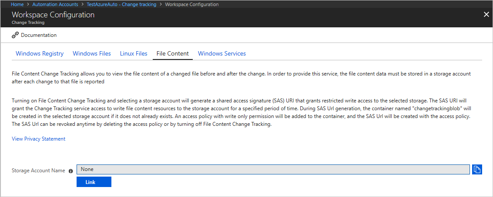
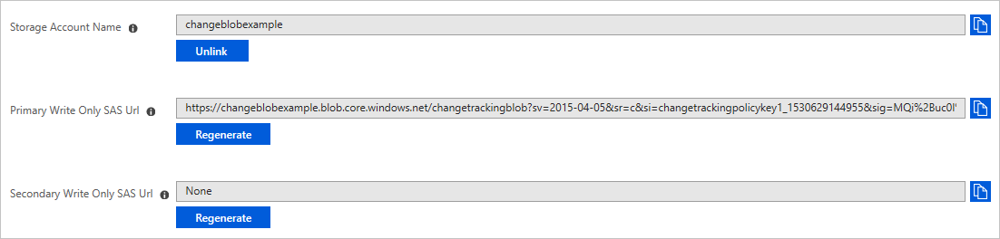
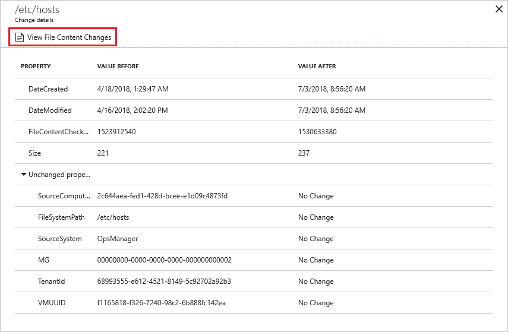

# Manage Change Tracking and Inventory

When you add a new file or registry key to track, Azure Automation enables it for [Change Tracking and Inventory](change-tracking.md). This article describes how to configure tracking, review tracking results, and handle alerts when changes are detected.

Before using the procedures in this article, ensure that you've enabled Change Tracking and Inventory on your VMs using one of these techniques:

* [Enable Change Tracking and Inventory from an Automation account](automation-enable-changes-from-auto-acct.md)
* [Enable Change Tracking and Inventory by browsing the Azure portal](automation-enable-changes-from-browse.md)
* [Enable Change Tracking and Inventory from a runbook](automation-enable-changes-from-runbook.md)
* [Enable Change Tracking and Inventory from an Azure VM](automation-enable-changes-from-vm.md)

## Limit the scope for the deployment

Change Tracking and Inventory uses a scope configuration within the workspace to target the computers to receive changes. For more information, see [Limit Change Tracking and Inventory deployment scope](automation-scope-configurations-change-tracking.md).

## Track files

You can use Change Tracking and Inventory to track changes to files and folders/directories. This section tells how to configure file tracking on Windows and on Linux.

### Configure file tracking on Windows

Use the following steps to configure file tracking on Windows computers:

1. In your Automation account, select **Change tracking** under **Configuration Management**. 
2. Click **Edit Settings** (the gear symbol).
3. On the Workspace Configuration page, select **Windows Files**, then click **+ Add** to add a new file to track.
4. On the Add Windows File for Change Tracking pane, enter the information for the file or folder to track and click **Save**. The following table defines the properties that you can use for the information.

    |Property  |Description  |
    |---------|---------|
    |Enabled     | True if the setting is applied, and False otherwise.        |
    |Item Name     | Friendly name of the file to be tracked.        |
    |Group     | A group name for logically grouping files.        |
    |Enter Path     | The path to check for the file, for example, **c:\temp\\\*.txt**. You can also use environment variables, such as `%winDir%\System32\\\*.*`.       |
    |Path Type     | The type of path. Possible values are File and Folder.        |    
    |Recursion     | True if recursion is used when looking for the item to be tracked, and False otherwise.        |    
    |Upload file content | True to upload file content on tracked changes, and False otherwise.|

5. Ensure that you specify True for **Upload file content**. This setting enables file content tracking for the indicated file path.

### Configure file tracking on Linux

Use the following steps to configure file tracking on Linux computers:

1. In your Automation account, select **Change tracking** under **Configuration Management**. 
2. Click **Edit Settings** (the gear symbol).
3. On the Workspace Configuration page, select **Linux Files**, then click **+ Add** to add a new file to track.
4. On the Add Linux File for Change Tracking pane, enter the information for the file or directory to track and click **Save**. The following table defines the properties that you can use for the information.

    |Property  |Description  |
    |---------|---------|
    |Enabled     | True if the setting is applied, and False otherwise.        |
    |Item Name     | Friendly name of the file to be tracked.        |
    |Group     | A group name for logically grouping files.        |
    |Enter Path     | The path to check for the file, for example, **/etc/*.conf**.       |
    |Path Type     | The type of path. Possible values are File and Directory.        |
    |Recursion     | True if recursion is used when looking for the item to be tracked, and False otherwise.        |
    |Use Sudo     | True to use sudo when checking for the item, and False otherwise.         |
    |Links     | Setting that determines how to deal with symbolic links when traversing directories. Possible values are:  Ignore - Ignores symbolic links and doesn't include the files/directories referenced. Follow - Follows the symbolic links during recursion and also includes the files/directories referenced. Manage - Follows the symbolic links and allows alteration of returned content. **Note:** The Manage option isn't recommended, as it doesn't support file content retrieval.    |
    |Upload file content | True to upload file content on tracked changes, and False otherwise. |

5. Ensure that you specify True for **Upload file content**. This setting enables file content tracking for the indicated file path.

   

## Track file contents

File content tracking allows you to view the contents of a file before and after a tracked change. The feature saves the file contents to a [storage account](https://docs.microsoft.com/azure/storage/common/storage-account-overview) after each change occurs. Here are some rules to follow for tracking file contents:

* A standard storage account using the Resource Manager deployment model is required for storing file content. 
* Don't use premium and classic deployment model storage accounts. See [About Azure Storage accounts](../storage/common/storage-create-storage-account.md).
* You can connect the storage account to only one Automation account.
* [Change Tracking and Inventory](change-tracking.md) must be enabled in your Automation account.

### Enable tracking for file content changes

Use the following steps to enable tracking for changes to file contents:

1. In the Azure portal, open your Automation account, and then select **Change tracking** under **Configuration Management**.
2. Click **Edit Settings** (the gear symbol).
3. Select **File Content** and click **Link**. This selection opens the Add Content Location for Change Tracking pane.

   

4. Select the subscription and storage account to use for storing the file contents. 

5. If you want to enable file content tracking for all existing tracked files, select **On** for **Upload file content for all settings**. You can change this setting for each file path later.

   

6. Change Tracking and Inventory shows storage account and Shared Access Signature (SAS) URIs when it enables file content change tracking. The signatures expire after 365 days, and you can recreate them by clicking **Regenerate**.

   

### View the contents of a tracked file

Once Change Tracking and Inventory detects a change for a tracked file, you can view the file contents on the Change Details pane.  

1. In the Azure portal, open your Automation account, and then select **Change tracking** under **Configuration Management**.

2. Choose a file in the list of changes and select **View File Content Changes** to see the contents of the file. The change details pane shows you the standard before and after file information for each property.

   

3. You're viewing the file contents in a side-by-side view. You can select **Inline** to see an inline view of the changes.

## Track registry keys

Use the following steps to configure registry key tracking on Windows computers:

1. In the Azure portal, open your Automation account, and then select **Change tracking** under **Configuration Management**. 
2. Click **Edit Settings** (the gear symbol).
3. On the Workspace Configuration page, select **Windows Registry**.
4. Click **+ Add** to add a new registry key to track.
5. On the Add Windows Registry for Change Tracking pane, enter the information for the key to track and then click **Save**. The following table defines the properties that you can use for the information.

    |Property  |Description  |
    |---------|---------|
    |Enabled     | True if a setting is applied, and False otherwise.        |
    |Item Name     | Friendly name of the registry key to track.        |
    |Group     | Group name for logically grouping registry keys.        |
    |Windows Registry Key   | Key name with path, for example, `HKEY_LOCAL_MACHINE\SOFTWARE\Microsoft\Windows\CurrentVersion\Explorer\User Shell Folders\Common Startup`.      |

## Search logs for change records

You can do various searches against the Azure Monitor logs for change records. With the Change tracking page open, click **Log Analytics** to open the Logs page. The following table provides sample log searches for change records.

|Query  |Description  |
|---------|---------|
|`ConfigurationData` &#124; `where ConfigDataType == "WindowsServices" and SvcStartupType == "Auto"` &#124; `where SvcState == "Stopped"` &#124; `summarize arg_max(TimeGenerated, *) by SoftwareName, Computer`         | Shows the most recent inventory records for Microsoft services that were set to Auto but were reported as being Stopped. Results are limited to the most recent record for the specified software name and computer.    |
|`ConfigurationChange` &#124; `where ConfigChangeType == "Software" and ChangeCategory == "Removed"` &#124; `order by TimeGenerated desc`|Shows change records for removed software.|

## Create alerts on changes

The following example shows that the file **c:\windows\system32\drivers\etc\hosts** has been modified on a machine. This file is important because Windows uses it to resolve host names to IP addresses. This operation takes precedence over DNS, and might result in connectivity issues. It can also lead to redirection of traffic to malicious or otherwise dangerous websites.

Let's use this example to discuss the steps for creating alerts on a change.

1. In your Automation account, select **Change tracking** under **Configuration Management**, then select **Log Analytics**. 
2. In the Logs search, look for content changes to the **hosts** file with the query `ConfigurationChange | where FieldsChanged contains "FileContentChecksum" and FileSystemPath contains "hosts"`. This query looks for content changes for files with fully qualified path names containing the word `hosts`. You can also ask for a specific file by changing the path portion to its fully qualified form, for example, using `FileSystemPath == "c:\windows\system32\drivers\etc\hosts"`.

3. After the query returns its results, click **New alert rule** in the log search to open the alert creation page. You can also navigate to this page through **Azure Monitor** in the Azure portal. 

4. Check your query again and modify the alert logic. In this case, you want the alert to be triggered if there's even one change detected across all the machines in the environment.

    

5. After the alert logic is set, assign action groups to perform actions in response to triggering of the alert. In this case, we're setting up emails to be sent and an IT Service Management (ITSM) ticket to be created. 

    

## Next steps

* For information about scope configurations, see [Limit Change Tracking and Inventory deployment scope](automation-scope-configurations-change-tracking.md).
* If you need to search logs stored in your Log Analytics workspace, see [Log searches in Azure Monitor logs](../log-analytics/log-analytics-log-searches.md).
* If finished with deployments, see [Unlink workspace from Automation account for Change Tracking and Inventory](automation-unlink-workspace-change-tracking.md).
* To delete your VMs from Change Tracking and Inventory, see [Remove VMs from Change Tracking and Inventory](automation-remove-vms-from-change-tracking.md).
* To troubleshoot feature errors, see [Troubleshoot Change Tracking and Inventory issues](troubleshoot/change-tracking.md).
