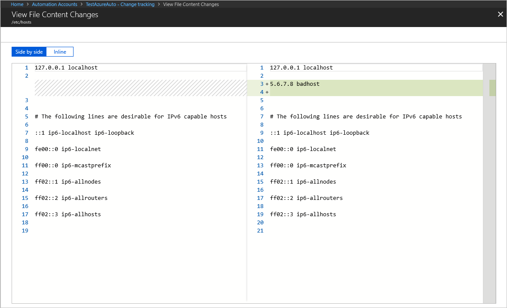

# Change Tracking and Inventory overview

This article introduces you to Change Tracking and Inventory in Azure Automation. This feature tracks changes in virtual machines and server infrastructure to help you pinpoint operational and environmental issues with software managed by the Distribution Package Manager. Items that are tracked by Change Tracking and Inventory include: 

- Windows software
- Linux software (packages)
- Windows and Linux files
- Windows registry keys
- Microsoft services
- Linux daemons

> [!NOTE]
> To track Azure Resource Manager property changes, see the Azure Resource Graph [change history](../governance/resource-graph/how-to/get-resource-changes.md).

Change Tracking and Inventory obtains its data from Azure Monitor. Virtual machines connected to Log Analytics workspaces use Log Analytics agents to collect data about changes to installed software, Microsoft services, Windows registry and files, and Linux daemons on monitored servers. When data is available, the agents send it to Azure Monitor for processing. Azure Monitor applies logic to the received data, records it, and makes it available. 

> [!NOTE]
> To use the Change Tracking and Inventory feature, you must locate all your VMs in the same subscription and region of the Automation account.

Change Tracking and Inventory currently doesn't support the following items:

- Recursion for Windows registry tracking
- Network filesystems
- Different installation methods
- ***.exe** files for Windows

Other limitations:

- The **Max File Size** column and values are unused in the current implementation.
- If you collect more than 2500 files in a 30-minute collection cycle, Change Tracking and Inventory performance might be degraded.
- When network traffic is high, change records can take up to six hours to display.
- If you modify a configuration while a computer is shut down, the computer might post changes belonging to the previous configuration.

Change Tracking and Inventory currently is experiencing the following issues:

- Hotfix updates aren't collected on Windows Server 2016 Core RS3 machines.

- Linux daemons might show a changed state even though no change has occurred. This issue arises because of the way the `SvcRunLevels` data in the Azure Monitor [ConfigurationChange](https://docs.microsoft.com/azure/azure-monitor/reference/tables/configurationchange) log is captured.

## Supported operating systems

Change Tracking and Inventory is supported on all operating systems that meet Log Analytics agent requirements. The official operating system versions are Windows Server 2008 SP1 or later and Windows 7 SP1 or later. The feature is also supported on a number of Linux operating systems. For operating systems supporting Log Analytics, see [Log Analytics agent overview](https://docs.microsoft.com/azure/azure-monitor/platform/log-analytics-agent).

To understand client requirements for TLS 1.2, see [TLS 1.2 enforcement for Azure Automation](automation-managing-data.md#tls-12-enforcement-for-azure-automation).

## Network requirements

Change Tracking and Inventory specifically requires the network addresses listed in the next table. Communications to these addresses use port 443.

|Azure Public  |Azure Government  |
|---------|---------|
|*.ods.opinsights.azure.com    | *.ods.opinsights.azure.us         |
|*.oms.opinsights.azure.com     | *.oms.opinsights.azure.us        |
|*.blob.core.windows.net | *.blob.core.usgovcloudapi.net|
|*.azure-automation.net | *.azure-automation.us|

## Change Tracking and Inventory user interface

Use Change Tracking and Inventory in the Azure portal to view the summary of changes for monitored computers. The feature is available by selecting one of the add VMs options for either **Change tracking** or **Inventory** under **Configuration Management** in your Automation account.  

Dropdowns are available at the top of the dashboard to limit the change tracking chart and detailed information based on change type and time ranges. You can also click and drag on the chart to select a custom time range. 

You can click on a change or event to bring up its details. The available change types are:

- Events
- Daemons
- Files
- Registry
- Software
- Microsoft services

You can add, modify, or remove each change. The example below shows a change in the startup type of a service from Manual to Auto.

## FIM support in Azure Security Center

Change Tracking and Inventory makes use of [Azure Security Center File Integrity Monitoring (FIM)](https://docs.microsoft.com/azure/security-center/security-center-file-integrity-monitoring). While FIM monitors files and registries only, the full Change Tracking and Inventory feature also includes tracking for:

- Software changes
- Microsoft services
- Linux daemons

> [!NOTE]
> Enabling the full Change Tracking and Inventory feature might cause additional charges. See [Automation Pricing](https://azure.microsoft.com/pricing/details/automation/). It's possible to delete FIM from the [list of installed monitoring solutions](../azure-monitor/insights/solutions.md#list-installed-monitoring-solutions) available in the Azure portal. See [Remove a monitoring solution](../azure-monitor/insights/solutions.md#remove-a-monitoring-solution).

## Tracking of file changes

For tracking changes in files on both Windows and Linux, Change Tracking and Inventory uses MD5 hashes of the files. The feature uses the hashes to detect if changes have been made since the last inventory.

## Tracking of file content changes

Change Tracking and Inventory allows you to view the contents of a Windows or Linux file. For each change to a file, Change Tracking and Inventory stores the contents of the file in an [Azure Storage account](../storage/common/storage-create-storage-account.md). When you're tracking a file, you can view its contents before or after a change. The file content can be viewed either inline or side by side. 

## Tracking of registry keys

Change Tracking and Inventory allows monitoring of changes to Windows registry keys. Monitoring allows you to pinpoint extensibility points where third-party code and malware can activate. The following table lists preconfigured (but not enabled) registry keys. To track these keys, you must enable each one.

> [!div class="mx-tdBreakAll"]
> |Registry Key | Purpose |
> | --- | --- |
> |`HKEY\LOCAL\MACHINE\Software\Microsoft\Windows\CurrentVersion\Group Policy\Scripts\Startup` | Monitors scripts that run at startup.
> |`HKEY\LOCAL\MACHINE\Software\Microsoft\Windows\CurrentVersion\Group Policy\Scripts\Shutdown` | Monitors scripts that run at shutdown.
> |`HKEY\LOCAL\MACHINE\SOFTWARE\Wow6432Node\Microsoft\Windows\CurrentVersion\Run` | Monitors keys that are loaded before the user signs in to the Windows account. The key is used for 32-bit applications running on 64-bit computers.
> |`HKEY\LOCAL\MACHINE\SOFTWARE\Microsoft\Active Setup\Installed Components` | Monitors changes to application settings.
> |`HKEY\LOCAL\MACHINE\Software\Classes\Directory\ShellEx\ContextMenuHandlers` | Monitors context menu handlers that hook directly into Windows Explorer and usually run in-process with **explorer.exe**.
> |`HKEY\LOCAL\MACHINE\Software\Classes\Directory\Shellex\CopyHookHandlers` | Monitors copy hook handlers that hook directly into Windows Explorer and usually run in-process with **explorer.exe**.
> |`HKEY\LOCAL\MACHINE\Software\Microsoft\Windows\CurrentVersion\Explorer\ShellIconOverlayIdentifiers` | Monitors for icon overlay handler registration.
> |`HKEY\LOCAL\MACHINE\Software\Wow6432Node\Microsoft\Windows\CurrentVersion\Explorer\ShellIconOverlayIdentifiers` | Monitors for icon overlay handler registration for 32-bit applications running on 64-bit computers.
> |`HKEY\LOCAL\MACHINE\Software\Microsoft\Windows\CurrentVersion\Explorer\Browser Helper Objects` | Monitors for new browser helper object plugins for Internet Explorer. Used to access the Document Object Model (DOM) of the current page and to control navigation.
> |`HKEY\LOCAL\MACHINE\Software\Wow6432Node\Microsoft\Windows\CurrentVersion\Explorer\Browser Helper Objects` | Monitors for new browser helper object plugins for Internet Explorer. Used to access the Document Object Model (DOM) of the current page and to control navigation for 32-bit applications running on 64-bit computers.
> |`HKEY\LOCAL\MACHINE\Software\Microsoft\Internet Explorer\Extensions` | Monitors for new Internet Explorer extensions, such as custom tool menus and custom toolbar buttons.
> |`HKEY\LOCAL\MACHINE\Software\Wow6432Node\Microsoft\Internet Explorer\Extensions` | Monitors for new Internet Explorer extensions, such as custom tool menus and custom toolbar buttons for 32-bit applications running on 64-bit computers.
> |`HKEY\LOCAL\MACHINE\Software\Microsoft\Windows NT\CurrentVersion\Drivers32` | Monitors 32-bit drivers associated with wavemapper, wave1 and wave2, msacm.imaadpcm, .msadpcm, .msgsm610, and vidc. Similar to the [drivers] section in the **system.ini** file.
> |`HKEY\LOCAL\MACHINE\Software\Wow6432Node\Microsoft\Windows NT\CurrentVersion\Drivers32` | Monitors 32-bit drivers associated with wavemapper, wave1 and wave2, msacm.imaadpcm, .msadpcm, .msgsm610, and vidc for 32-bit applications running on 64-bit computers. Similar to the [drivers] section in the **system.ini** file.
> |`HKEY\LOCAL\MACHINE\System\CurrentControlSet\Control\Session Manager\KnownDlls` | Monitors the list of known or commonly used system DLLs. Monitoring prevents people from exploiting weak application directory permissions by dropping in Trojan horse versions of system DLLs.
> |`HKEY\LOCAL\MACHINE\SOFTWARE\Microsoft\Windows NT\CurrentVersion\Winlogon\Notify` | Monitors the list of packages that can receive event notifications from **winlogon.exe**, the interactive logon support model for Windows.

## Recursion support

Change Tracking and Inventory supports recursion, which allows you to specify wildcards to simplify tracking across directories. Recursion also provides environment variables to allow you to track files across environments with multiple or dynamic drive names. The following list includes common information you should know when configuring recursion:

- Wildcards are required for tracking multiple files.

- You can use wildcards only in the last segment of a file path, for example, **c:\folder\\file*** or **/etc/*.conf**.

- If an environment variable has an invalid path, validation succeeds but the path fails during execution.

- You should avoid general path names when setting the path, as this type of setting can cause too many folders to be traversed.

## Change Tracking and Inventory data collection

The next table shows the data collection frequency for the types of changes supported by Change Tracking and Inventory. For every type, the data snapshot of the current state is also refreshed at least every 24 hours.

| **Change Type** | **Frequency** |
| --- | --- |
| Windows registry | 50 minutes |
| Windows file | 30 minutes |
| Linux file | 15 minutes |
| Microsoft services | 10 seconds to 30 minutes  Default: 30 minutes |
| Linux daemons | 5 minutes |
| Windows software | 30 minutes |
| Linux software | 5 minutes |

The following table shows the tracked item limits per machine for Change Tracking and Inventory.

| **Resource** | **Limit** |
|---|---|---|
|File|500|
|Registry|250|
|Windows software (not including hotfixes) |250|
|Linux packages|1250|
|Services|250|
|Daemons|250|

The average Log Analytics data usage for a machine using Change Tracking and Inventory is approximately 40 MB per month, depending on your environment. With the Usage and Estimated Costs feature of the Log Analytics workspace, you can view the data ingested by Change Tracking and Inventory in a usage chart. Use this data view to evaluate your data usage and determine how it affects your bill. See [Understand your usage and estimate costs](https://docs.microsoft.com/azure/azure-monitor/platform/manage-cost-storage#understand-your-usage-and-estimate-costs).

### Microsoft service data

The default collection frequency for Microsoft services is 30 minutes. You can configure the frequency using a slider on the **Microsoft services** tab under **Edit Settings**.

To optimize performance, the Log Analytics agent only tracks changes. Setting a high threshold might miss changes if the service reverts to its original state. Setting the frequency to a smaller value allows you to catch changes that might be missed otherwise.

> [!NOTE]
> While the agent can track changes down to a 10-second interval, the data still takes a few minutes to display in the Azure portal. Changes that occur during the time to display in the portal are still tracked and logged.

## Support for alerts on configuration state

A key capability of Change Tracking and Inventory is alerting on changes to the configuration state of your hybrid environment. Many useful actions are available to trigger in response to alerts, for example, actions on Azure functions, Automation runbooks, webhooks, and the like. Alerting on changes to the **c:\windows\system32\drivers\etc\hosts** file for a machine is one good application of alerts for Change Tracking and Inventory data. There are many more scenarios for alerting as well, including the query scenarios defined in the next table.

|Query  |Description  |
|---------|---------|
|ConfigurationChange  &#124; where ConfigChangeType == "Files" and FileSystemPath contains " c:\\windows\\system32\\drivers\\"|Useful for tracking changes to system-critical files.|
|ConfigurationChange  &#124; where FieldsChanged contains "FileContentChecksum" and FileSystemPath == "c:\\windows\\system32\\drivers\\etc\\hosts"|Useful for tracking modifications to key configuration files.|
|ConfigurationChange  &#124; where ConfigChangeType == "WindowsServices" and SvcName contains "w3svc" and SvcState == "Stopped"|Useful for tracking changes to system-critical services.|
|ConfigurationChange  &#124; where ConfigChangeType == "Daemons" and SvcName contains "ssh" and SvcState!= "Running"|Useful for tracking changes to system-critical services.|
|ConfigurationChange  &#124; where ConfigChangeType == "Software" and ChangeCategory == "Added"|Useful for environments that need locked-down software configurations.|
|ConfigurationData  &#124; where SoftwareName contains "Monitoring Agent" and CurrentVersion!= "8.0.11081.0"|Useful for seeing which machines have outdated or noncompliant software version installed. This query reports the last reported configuration state, but doesn't report changes.|
|ConfigurationChange  &#124; where RegistryKey == @"HKEY_LOCAL_MACHINE\\SOFTWARE\\Microsoft\\Windows\\CurrentVersion\\QualityCompat"| Useful for tracking changes to crucial antivirus keys.|
|ConfigurationChange  &#124; where RegistryKey contains @"HKEY_LOCAL_MACHINE\\SYSTEM\\CurrentControlSet\\Services\\SharedAccess\\Parameters\\FirewallPolicy"| Useful for tracking changes to firewall settings.|

## Next steps

- To enable the feature from an Automation account, see [Enable Change Tracking and Inventory from an Automation account](automation-enable-changes-from-auto-acct.md).

- To enable the feature by browsing the Azure portal, see [Enable Change Tracking and Inventory from the Azure portal](automation-onboard-solutions-from-browse.md).

- To enable the feature from a runbook, see [Enable Change Tracking and Inventory from a runbook](automation-enable-changes-from-runbook.md).

- To enable the feature from an Azure VM, see [Enable Change Tracking and Inventory from an Azure VM](automation-enable-changes-from-vm.md).