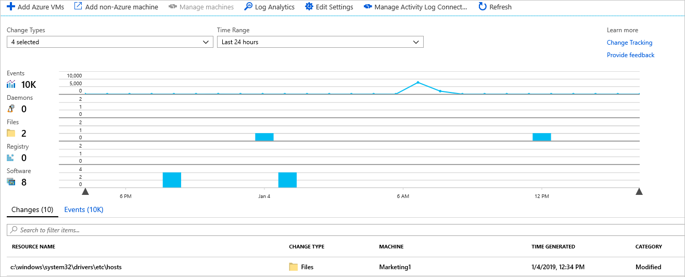
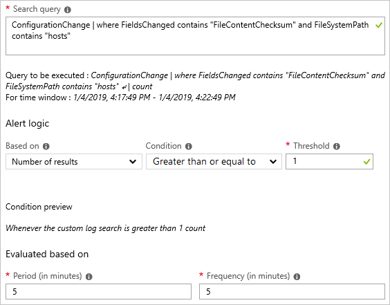
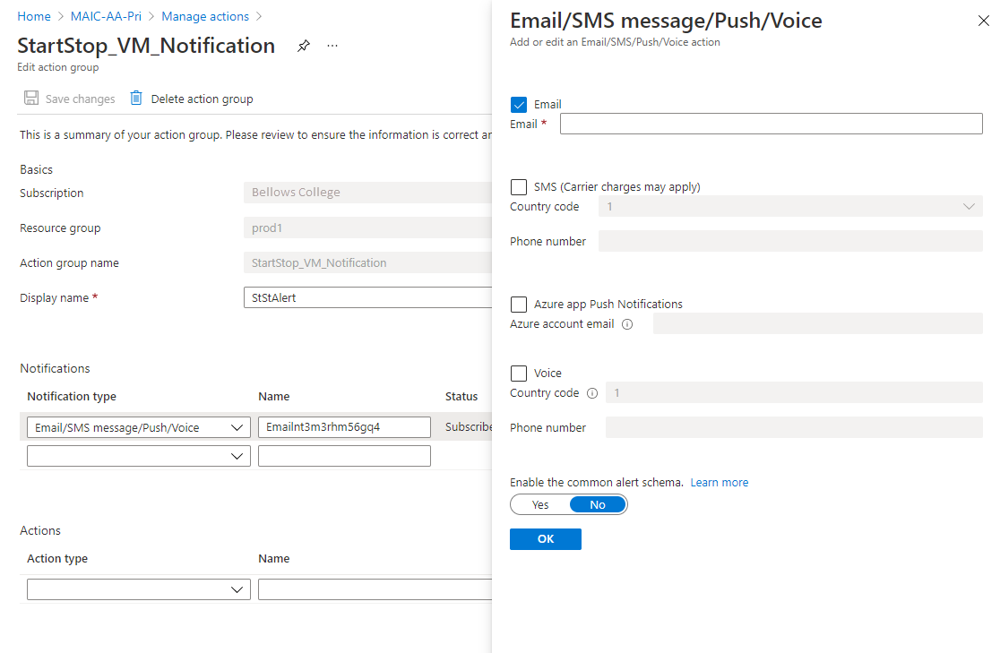

# How to create alerts for Change Tracking and Inventory

Alerts in Azure proactively notify you of results from runbook jobs, service health issues, or other scenarios related to your Automation account. Azure Automation does not include pre-configured alert rules, but you can create your own based on data that it generates. This article provides guidance on creating alert rules based on changes identified by Change Tracking and Inventory.

If you're not familiar with Azure Monitor alerts, see [Overview of alerts in Microsoft Azure](../../azure-monitor/alerts/alerts-overview.md) before you start. To learn more about alerts that use log queries, see [Log alerts in Azure Monitor](../../azure-monitor/alerts/alerts-unified-log.md).

## Create alert

The following example shows that the file **c:\windows\system32\drivers\etc\hosts** has been modified on a machine. This file is important because Windows uses it to resolve host names to IP addresses. This operation takes precedence over DNS, and might result in connectivity issues. It can also lead to redirection of traffic to malicious or otherwise dangerous websites.

Let's use this example to discuss the steps for creating alerts on a change.

1. On the **Change tracking** page from your Virtual Machine, select **Log Analytics**.

2. In the Logs search, look for content changes to the **hosts** file with the query `ConfigurationChange | where FieldsChanged contains "FileContentChecksum" and FileSystemPath contains "hosts"`. This query looks for content changes for files with fully qualified path names containing the word `hosts`. You can also ask for a specific file by changing the path portion to its fully qualified form, for example, using `FileSystemPath == "c:\windows\system32\drivers\etc\hosts"`.

3. After the query returns its results, select **New alert rule** in the log search to open the **Alert creation** page. You can also navigate to this page through **Azure Monitor** in the Azure portal.

4. Check your query again and modify the alert logic. In this case, you want the alert to be triggered if there's even one change detected across all the machines in the environment.

    

5. After the alert logic is set, assign action groups to perform actions in response to triggering of the alert. In this case, we're setting up emails to be sent and an IT Service Management (ITSM) ticket to be created.

Follow the steps below to set up alerts to let you know the status of an update deployment. If you are new to Azure alerts, see [Azure Alerts overview](../../azure-monitor/alerts/alerts-overview.md).

## Configure action groups for your alerts

Once you have your alerts configured, you can set up an action group, which is a group of actions to use across multiple alerts. The actions can include email notifications, runbooks, webhooks, and much more. To learn more about action groups, see [Create and manage action groups](../../azure-monitor/alerts/action-groups.md).

1. Select an alert and then select **Create New** under **Action Groups**.

2. Enter a full name and a short name for the action group. Update Management uses the short name when sending notifications using the specified group.

3. Under **Actions**, enter a name that specifies the action, for example, **Email Notification**.

4. For **Action Type**, select the appropriate type, for example, **Email/SMS message/Push/Voice**.

5. Select the pencil icon to edit the action details.

6. Fill in the pane for your action type. For example, if using **Email/SMS message/Push/Voice** to send an email, enter an action name, select the **Email** checkbox, enter a valid email address, and then select **OK**.

    

7. In the Add action group pane, select **OK**.

8. For an alert email, you can customize the email subject. Select **Customize actions** under **Create rule**, then select **Email subject**.

9. When you're finished, select **Create alert rule**.

## Next steps

* Learn more about [alerts in Azure Monitor](../../azure-monitor/alerts/alerts-overview.md).

* Learn about [log queries](../../azure-monitor/logs/log-query-overview.md) to retrieve and analyze data from a Log Analytics workspace.

* [Analyze usage in Log Analytics workspace](../../azure-monitor/logs/analyze-usage.md) describes how to analyze and alert on your data usage.
