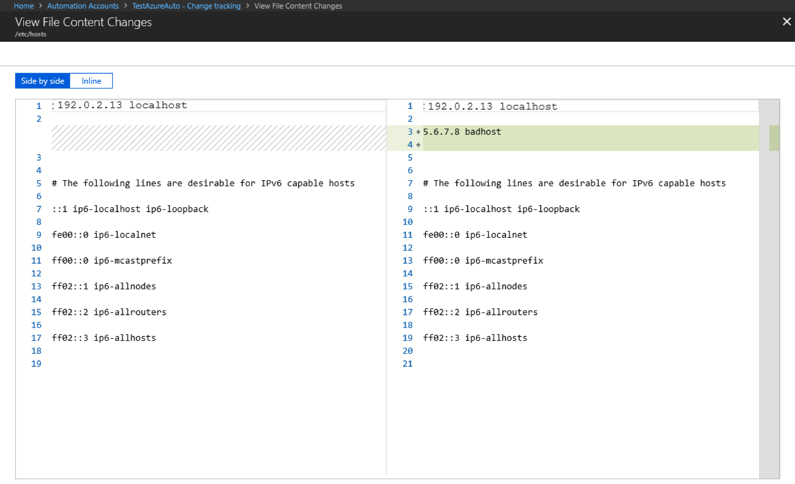
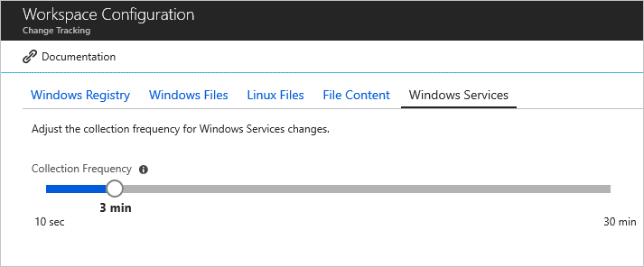

# Change Tracking and Inventory overview

This article introduces you to Change Tracking and Inventory in Azure Automation. This feature tracks changes in virtual machines hosted in Azure, on-premises, and other cloud environments to help you pinpoint operational and environmental issues with software managed by the Distribution Package Manager. Items that are tracked by Change Tracking and Inventory include:

- Windows software
- Linux software (packages)
- Windows and Linux files
- Windows registry keys
- Windows services
- Linux daemons

> [!NOTE]
> To track Azure Resource Manager property changes, see the Azure Resource Graph [change history](../../governance/resource-graph/how-to/get-resource-changes.md).

Change Tracking and Inventory makes use of [Microsoft Defender for Cloud File Integrity Monitoring (FIM)](../../security-center/security-center-file-integrity-monitoring.md) to examine operating system and application files, and Windows Registry. While FIM monitors those entities, Change Tracking and Inventory natively tracks:

- Software changes
- Windows services
- Linux daemons

Enabling all features included in Change Tracking and Inventory might cause additional charges. Before proceeding, review [Automation Pricing](https://azure.microsoft.com/pricing/details/automation/) and [Azure Monitor Pricing](https://azure.microsoft.com/pricing/details/monitor/).

Change Tracking and Inventory forwards data to Azure Monitor Logs, and this collected data is stored in a Log Analytics workspace. The File Integrity Monitoring (FIM) feature is available only when **Microsoft Defender for servers** is enabled. See Microsoft Defender for Cloud [Pricing](../../security-center/security-center-pricing.md) to learn more. FIM uploads data to the same Log Analytics workspace as the one created to store data from Change Tracking and Inventory. We recommend that you monitor your linked Log Analytics workspace to keep track of your exact usage. For more information about analyzing Azure Monitor Logs data usage, see [Analyze usage in Log Analytics workspace](../../azure-monitor/logs/analyze-usage.md).

Machines connected to the Log Analytics workspace use the [Log Analytics agent](../../azure-monitor/agents/log-analytics-agent.md) to collect data about changes to installed software, Windows services, Windows registry and files, and Linux daemons on monitored servers. When data is available, the agent sends it to Azure Monitor Logs for processing. Azure Monitor Logs applies logic to the received data, records it, and makes it available for analysis.

> [!NOTE]
> Change Tracking and Inventory requires linking a Log Analytics workspace to your Automation account. For a definitive list of supported regions, see [Azure Workspace mappings](../how-to/region-mappings.md). The region mappings don't affect the ability to manage VMs in a separate region from your Automation account.

As a service provider, you may have onboarded multiple customer tenants to [Azure Lighthouse](../../lighthouse/overview.md). Azure Lighthouse allows you to perform operations at scale across several Azure Active Directory (Azure AD) tenants at once, making management tasks like Change Tracking and Inventory more efficient across those tenants you're responsible for. Change Tracking and Inventory can manage machines in multiple subscriptions in the same tenant, or across tenants using [Azure delegated resource management](../../lighthouse/concepts/architecture.md).

## Current limitations

Change Tracking and Inventory doesn't support or has the following limitations:

- Recursion for Windows registry tracking
- Network file systems
- Different installation methods
- ***.exe** files stored on Windows
- The **Max File Size** column and values are unused in the current implementation.
- If you are tracking file changes, it is limited to a file size of 5 MB or less. 
- If the file size appears >1.25MB, then FileContentChecksum is incorrect due to memory constraints in the checksum calculation.
- If you try to collect more than 2500 files in a 30-minute collection cycle, Change Tracking and Inventory performance might be degraded.
- If network traffic is high, change records can take up to six hours to display.
- If you modify a configuration while a machine or server is shut down, it might post changes belonging to the previous configuration.
- Collecting Hotfix updates on Windows Server 2016 Core RS3 machines.
- Linux daemons might show a changed state even though no change has occurred. This issue arises because of the way the `SvcRunLevels` data in the Azure Monitor [ConfigurationChange](/azure/azure-monitor/reference/tables/configurationchange) table is written.

## Limits

For limits that apply to Change Tracking and Inventory, see [Azure Automation service limits](../../azure-resource-manager/management/azure-subscription-service-limits.md#change-tracking-and-inventory).

## Supported operating systems

Change Tracking and Inventory is supported on all operating systems that meet Log Analytics agent requirements. See [supported operating systems](../../azure-monitor/agents/agents-overview.md#supported-operating-systems) for a list of the Windows and Linux operating system versions that are currently supported by the Log Analytics agent.

To understand client requirements for TLS 1.2 or higher, see [TLS 1.2 or higher for Azure Automation](../automation-managing-data.md#tls-12-or-higher-for-azure-automation).

### Python requirement

Change Tracking and Inventory now support Python 2 and Python 3. If your machine uses a distro that doesn't include either of the versions, you must install them by default. The following sample commands will install Python 2 and Python 3 on different distros.

> [!NOTE]
> To use the OMS agent compatible with Python 3, ensure that you first uninstall Python 2; otherwise, the OMS agent will continue to run with python 2 by default.

#### [Python 2](#tab/python-2)                                                                                                                                                      
- Red Hat, CentOS, Oracle: 

```bash
   sudo yum install -y python2
```
- Ubuntu, Debian:
 
```bash
   sudo apt-get update
   sudo apt-get install -y python2
```
- SUSE:
 
```bash
   sudo zypper install -y python2
```

> [!NOTE]
> The Python 2 executable must be aliased to *python*.

#### [Python 3](#tab/python-3)

- Red Hat, CentOS, Oracle:

```bash
   sudo yum install -y python3
```
- Ubuntu, Debian: 

```bash
   sudo apt-get update
   sudo apt-get install -y python3
```
- SUSE: 
 
```bash
   sudo zypper install -y python3
```
--- 

## Network requirements

Check [Azure Automation Network Configuration](../automation-network-configuration.md#update-management-and-change-tracking-and-inventory) for detailed information on the ports, URLs, and other networking details required for Change Tracking and Inventory.

## Enable Change Tracking and Inventory

You can enable Change Tracking and Inventory in the following ways:

- From your [Automation account](enable-from-automation-account.md) for one or more Azure and non-Azure machines.

- Manually for non-Azure machines, including machines or servers registered with [Azure Arc-enabled servers](../../azure-arc/servers/overview.md). For hybrid machines, we recommend installing the Log Analytics agent for Windows by first connecting your machine to [Azure Arc-enabled servers](../../azure-arc/servers/overview.md), and then using Azure Policy to assign the [Deploy Log Analytics agent to *Linux* or *Windows* Azure Arc machines](../../governance/policy/samples/built-in-policies.md#monitoring) built-in policy. If you plan to also monitor the machines with Azure Monitor for VMs, instead use the [Enable Azure Monitor for VMs](../../governance/policy/samples/built-in-initiatives.md#monitoring) initiative.

- For a single Azure VM from the [Virtual machine page](enable-from-vm.md) in the Azure portal. This scenario is available for Linux and Windows VMs.

- For [multiple Azure VMs](enable-from-portal.md) by selecting them from the Virtual machines page in the Azure portal.

## Tracking file changes

For tracking changes in files on both Windows and Linux, Change Tracking and Inventory uses MD5 hashes of the files. The feature uses the hashes to detect if changes have been made since the last inventory. To track the Linux files, ensure that you have READ access for the OMS agent user.

## Tracking file content changes

Change Tracking and Inventory allows you to view the contents of a Windows or Linux file. For each change to a file, Change Tracking and Inventory stores the contents of the file in an [Azure Storage account](../../storage/common/storage-account-create.md). When you're tracking a file, you can view its contents before or after a change. The file content can be viewed either inline or side by side.



## Tracking of registry keys

Change Tracking and Inventory allows monitoring of changes to Windows registry keys. Monitoring allows you to pinpoint extensibility points where third-party code and malware can activate. The following table lists preconfigured (but not enabled) registry keys. To track these keys, you must enable each one.

> [!div class="mx-tdBreakAll"]
> |Registry Key | Purpose |
> | --- | --- |
> |`HKEY\LOCAL\MACHINE\Software\Microsoft\Windows\CurrentVersion\Group Policy\Scripts\Startup` | Monitors scripts that run at startup.
> |`HKEY\LOCAL\MACHINE\Software\Microsoft\Windows\CurrentVersion\Group Policy\Scripts\Shutdown` | Monitors scripts that run at shutdown.
> |`HKEY\LOCAL\MACHINE\SOFTWARE\Wow6432Node\Microsoft\Windows\CurrentVersion\Run` | Monitors keys that are loaded before the user signs in to the Windows account. The key is used for 32-bit applications running on 64-bit computers.
> |`HKEY\LOCAL\MACHINE\SOFTWARE\Microsoft\Active Setup\Installed Components` | Monitors changes to application settings.
> |`HKEY\LOCAL\MACHINE\Software\Classes\Directory\ShellEx\ContextMenuHandlers` | Monitors context menu handlers that hook directly into Windows Explorer and usually run in-process with **explorer.exe**.
> |`HKEY\LOCAL\MACHINE\Software\Classes\Directory\Shellex\CopyHookHandlers` | Monitors copy hook handlers that hook directly into Windows Explorer and usually run in-process with **explorer.exe**.
> |`HKEY\LOCAL\MACHINE\Software\Microsoft\Windows\CurrentVersion\Explorer\ShellIconOverlayIdentifiers` | Monitors for icon overlay handler registration.
> |`HKEY\LOCAL\MACHINE\Software\Wow6432Node\Microsoft\Windows\CurrentVersion\Explorer\ShellIconOverlayIdentifiers` | Monitors for icon overlay handler registration for 32-bit applications running on 64-bit computers.
> |`HKEY\LOCAL\MACHINE\Software\Microsoft\Windows\CurrentVersion\Explorer\Browser Helper Objects` | Monitors for new browser helper object plugins for Internet Explorer. Used to access the Document Object Model (DOM) of the current page and to control navigation.
> |`HKEY\LOCAL\MACHINE\Software\Wow6432Node\Microsoft\Windows\CurrentVersion\Explorer\Browser Helper Objects` | Monitors for new browser helper object plugins for Internet Explorer. Used to access the Document Object Model (DOM) of the current page and to control navigation for 32-bit applications running on 64-bit computers.
> |`HKEY\LOCAL\MACHINE\Software\Microsoft\Internet Explorer\Extensions` | Monitors for new Internet Explorer extensions, such as custom tool menus and custom toolbar buttons.
> |`HKEY\LOCAL\MACHINE\Software\Wow6432Node\Microsoft\Internet Explorer\Extensions` | Monitors for new Internet Explorer extensions, such as custom tool menus and custom toolbar buttons for 32-bit applications running on 64-bit computers.
> |`HKEY\LOCAL\MACHINE\Software\Microsoft\Windows NT\CurrentVersion\Drivers32` | Monitors 32-bit drivers associated with wavemapper, wave1 and wave2, msacm.imaadpcm, .msadpcm, .msgsm610, and vidc. Similar to the [drivers] section in the **system.ini** file.
> |`HKEY\LOCAL\MACHINE\Software\Wow6432Node\Microsoft\Windows NT\CurrentVersion\Drivers32` | Monitors 32-bit drivers associated with wavemapper, wave1 and wave2, msacm.imaadpcm, .msadpcm, .msgsm610, and vidc for 32-bit applications running on 64-bit computers. Similar to the [drivers] section in the **system.ini** file.
> |`HKEY\LOCAL\MACHINE\System\CurrentControlSet\Control\Session Manager\KnownDlls` | Monitors the list of known or commonly used system DLLs. Monitoring prevents people from exploiting weak application directory permissions by dropping in Trojan horse versions of system DLLs.
> |`HKEY\LOCAL\MACHINE\SOFTWARE\Microsoft\Windows NT\CurrentVersion\Winlogon\Notify` | Monitors the list of packages that can receive event notifications from **winlogon.exe**, the interactive logon support model for Windows.

## Recursion support

Change Tracking and Inventory supports recursion, which allows you to specify wildcards to simplify tracking across directories. Recursion also provides environment variables to allow you to track files across environments with multiple or dynamic drive names. The following list includes common information you should know when configuring recursion:

- Wildcards are required for tracking multiple files.

- You can use wildcards only in the last segment of a file path, for example, **c:\folder\\file*** or **/etc/*.conf**.

- If an environment variable has an invalid path, validation succeeds but the path fails during execution.

- You should avoid general path names when setting the path, as this type of setting can cause too many folders to be traversed.

## Change Tracking and Inventory data collection

The next table shows the data collection frequency for the types of changes supported by Change Tracking and Inventory. For every type, the data snapshot of the current state is also refreshed at least every 24 hours.

| **Change Type** | **Frequency** |
| --- | --- |
| Windows registry | 50 minutes |
| Windows file | 30 minutes |
| Linux file | 15 minutes |
| Windows services | 10 seconds to 30 minutes</br> Default: 30 minutes |
| Linux daemons | 5 minutes |
| Windows software | 30 minutes |
| Linux software | 5 minutes |

The following table shows the tracked item limits per machine for Change Tracking and Inventory.

| **Resource** | **Limit** |
|---|---|---|
|File|500|
|Registry|250|
|Windows software (not including hotfixes) |250|
|Linux packages|1250|
|Services|250|
|Daemons|250|

The average Log Analytics data usage for a machine using Change Tracking and Inventory is approximately 40 MB per month, depending on your environment. With the Usage and Estimated Costs feature of the Log Analytics workspace, you can view the data ingested by Change Tracking and Inventory in a usage chart. Use this data view to evaluate your data usage and determine how it affects your bill. See [Understand your usage and estimate costs](../../azure-monitor/usage-estimated-costs.md).

### Windows services data

The default collection frequency for Windows services is 30 minutes. You can configure the frequency using a slider on the **Windows services** tab under **Edit Settings**.



To optimize performance, the Log Analytics agent only tracks changes. Setting a high threshold might miss changes if the service returns to its original state. Setting the frequency to a smaller value allows you to catch changes that might be missed otherwise.

For critical services, we recommend marking the **Startup** state as **Automatic** (Delayed Start) so that, once the VM reboots, the services data collection will start after the MMA agent starts instead of starting quickly as soon as the VM is up.

> [!NOTE]
> While the agent can track changes down to a 10-second interval, the data still takes a few minutes to display in the Azure portal. Changes that occur during the time to display in the portal are still tracked and logged.

## Support for alerts on configuration state

A key capability of Change Tracking and Inventory is alerting on changes to the configuration state of your hybrid environment. Many useful actions are available to trigger in response to alerts. For example, actions on Azure functions, Automation runbooks, webhooks, and the like. Alerting on changes to the **c:\windows\system32\drivers\etc\hosts** file for a machine is one good application of alerts for Change Tracking and Inventory data. There are many more scenarios for alerting as well, including the query scenarios defined in the next table.

|Query  |Description  |
|---------|---------|
|ConfigurationChange <br>&#124; where ConfigChangeType == "Files" and FileSystemPath contains " c:\\windows\\system32\\drivers\\"|Useful for tracking changes to system-critical files.|
|ConfigurationChange <br>&#124; where FieldsChanged contains "FileContentChecksum" and FileSystemPath == "c:\\windows\\system32\\drivers\\etc\\hosts"|Useful for tracking modifications to key configuration files.|
|ConfigurationChange <br>&#124; where ConfigChangeType == "WindowsServices" and SvcName contains "w3svc" and SvcState == "Stopped"|Useful for tracking changes to system-critical services.|
|ConfigurationChange <br>&#124; where ConfigChangeType == "Daemons" and SvcName contains "ssh" and SvcState!= "Running"|Useful for tracking changes to system-critical services.|
|ConfigurationChange <br>&#124; where ConfigChangeType == "Software" and ChangeCategory == "Added"|Useful for environments that need locked-down software configurations.|
|ConfigurationData <br>&#124; where SoftwareName contains "Monitoring Agent" and CurrentVersion!= "8.0.11081.0"|Useful for seeing which machines have outdated or noncompliant software version installed. This query reports the last reported configuration state, but doesn't report changes.|
|ConfigurationChange <br>&#124; where RegistryKey == @"HKEY_LOCAL_MACHINE\\SOFTWARE\\Microsoft\\Windows\\CurrentVersion\\QualityCompat"| Useful for tracking changes to crucial antivirus keys.|
|ConfigurationChange <br>&#124; where RegistryKey contains @"HKEY_LOCAL_MACHINE\\SYSTEM\\CurrentControlSet\\Services\\SharedAccess\\Parameters\\FirewallPolicy"| Useful for tracking changes to firewall settings.|


## Update Log Analytics agent to latest version 

For Change Tracking & Inventory, machines use the [Log Analytics agent](../../azure-monitor/agents/log-analytics-agent.md) to collect data about changes to installed software, Windows services, Windows registry and files, and Linux daemons on monitored servers. Soon, Azure will no longer accept connections from older versions of the Windows Log Analytics (LA) agent, also known as the Windows Microsoft Monitoring Agent (MMA), that uses an older method for certificate handling. We recommend to upgrade your agent to the latest version as soon as possible. 

[Agents that are on version - 10.20.18053 (bundle) and 1.0.18053.0 (extension)](../../virtual-machines/extensions/oms-windows.md#agent-and-vm-extension-version) or newer aren't affected in response to this change. If you’re on an agent prior to that, your agent will be unable to connect, and the Change Tracking & Inventory pipeline & downstream activities can stop. You can check the current LA agent version in HeartBeat table within your LA Workspace. 

Ensure to upgrade to the latest version of the Windows Log Analytics agent (MMA) following these [guidelines](../../azure-monitor/agents/agent-manage.md). 

## Next steps

- To enable from an Automation account, see [Enable Change Tracking and Inventory from an Automation account](enable-from-automation-account.md).

- To enable from the Azure portal, see [Enable Change Tracking and Inventory from the Azure portal](enable-from-portal.md).

- To enable from a runbook, see [Enable Change Tracking and Inventory from a runbook](enable-from-runbook.md).

- To enable from an Azure VM, see [Enable Change Tracking and Inventory from an Azure VM](enable-from-vm.md).
