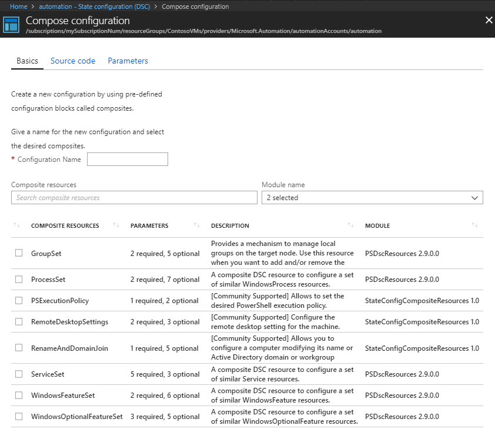
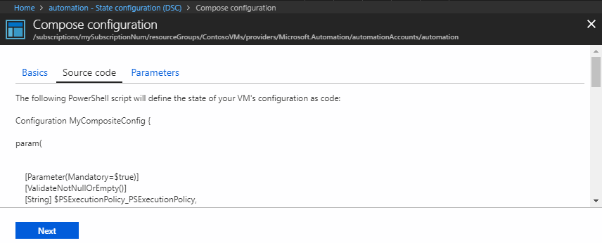
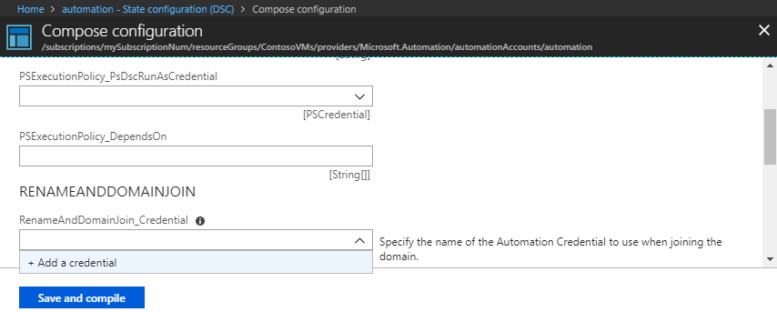

# Composing DSC Configurations in Azure Automation State Configuration (DSC) using Composite Resources

When a resource needs to be managed with more than a single desired state configuration (DSC)
configuration, the best path is to use [composite
resources](/powershell/dsc/authoringresourcecomposite). A composite resource is a nested and
parameterized configuration being used as a DSC resource within another configuration. This allows
the creation of complex configurations while allowing the underlying composite resources
(parameterized configurations) to be individually managed and built.

Azure Automation enables the [import and compilation of composite
resources](automation-dsc-compile.md#composite-resources). Once composite resources have been
imported into your Automation account, you are able to use the **Compose configuration** experience
in the **State Configuration (DSC)** page.

## Composing a configuration from composite resources

Before you can assign a configuration made from composite resources in the Azure portal, you must
compose it. This can be done using **Compose configuration** on the **State Configuration (DSC)**
page while on either the **Configurations** or **Compiled configurations** tabs.

1. Sign in to the [Azure portal](https://portal.azure.com).
1. On the left, click **All resources** and then the name of your Automation account.
1. On the **Automation account** page, select **State configuration (DSC)** under **Configuration Management**.
1. On the **State configuration (DSC)** page, click either the **Configurations** or **Compiled configurations** tab, then click **Compose configuration** in the menu at the top of the page.
1. On the **Basics** step, provide the new configuration name (required) and click anywhere on the row of each composite resource that you want to include in your new configuration, then click **Next** or click the **Source code** step. For the following steps, we selected **PSExecutionPolicy** and **RenameAndDomainJoin** composite resources.
   
1. The **Source code** step shows what the composed configuration of the selected composite resources looks like. You can see the merging of all parameters and how they are passed to the composite resource. When you are done reviewing the new source code, click **Next** or click the **Parameters** step.
   
1. On the **Parameters** step, the parameter that each composite resource has is exposed so that they can be provided. If a parameter has a description, it is displayed next to the parameter field. If a field is a **PSCredential** type parameter, the drop-down to configure provides a list of **Credential** objects in the current Automation account. A **+ Add a credential** option is also be available. Once all required parameters have been provided, click **Save and compile**.
   

Once the new configuration is saved, it is submitted for compilation. Status of the
compilation job can be viewed like any imported configuration. For more information, see [Viewing a
compilation job](automation-dsc-getting-started.md#viewing-a-compilation-job).

When compilation has completed successfully, the new configuration appears in the **Compiled
configurations** tab. Once it is visible in this tab, it can be assigned to a managed node using
the steps in [Reassigning a node to a different node
configuration](automation-dsc-getting-started.md#reassigning-a-node-to-a-different-node-configuration).

## Next steps

- To get started, see [Getting started with Azure Automation State Configuration](automation-dsc-getting-started.md)
- To learn how to onboard nodes, see [Onboarding machines for management by Azure Automation State Configuration](automation-dsc-onboarding.md)
- To learn about compiling DSC configurations so that you can assign them to target nodes, see [Compiling configurations in Azure Automation State Configuration](automation-dsc-compile.md)
- For PowerShell cmdlet reference, see [Azure Automation State Configuration cmdlets](/powershell/module/azurerm.automation/#automation)
- For pricing information, see [Azure Automation State Configuration pricing](https://azure.microsoft.com/pricing/details/automation/)
- To see an example of using Azure Automation State Configuration in a continuous deployment pipeline, see [Continuous Deployment Using Azure Automation State Configuration and Chocolatey](automation-dsc-cd-chocolatey.md)
