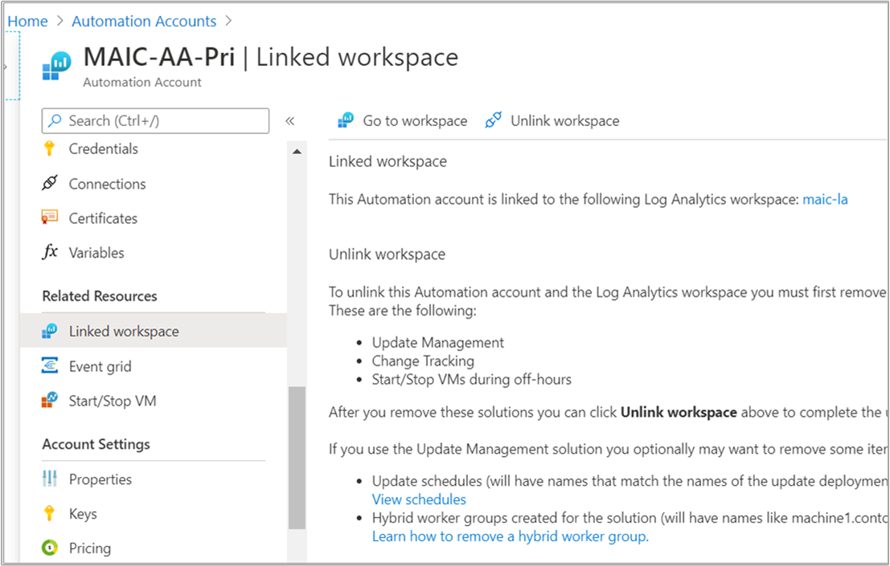

# How to delete your Azure Automation account

After you enable an Azure Automation account to help automate IT or business process, or enable its other features to support operations management of your Azure and non-Azure machines such as Update Management, you may decide to stop using the Automation account. If you have enabled features that depend on integration with an Azure Monitor Log Analytics workspace, there are more steps required to complete this action.

Removing your Automation account can be done using one of the following methods based on the supported deployment models:

* Delete the resource group containing the Automation account.
* Delete the resource group containing the Automation account and linked Azure Monitor Log Analytics workspace, if:

    * The account and workspace is dedicated to supporting Update Management, Change Tracking and Inventory, and/or Start/Stop VMs during off-hours.
    * The account is dedicated to process automation and integrated with a workspace to send runbook job status and job streams.

* Unlink the Log Analytics workspace from the Automation account and delete the Automation account.
* Delete the feature from your linked workspace, unlink the account from the workspace, and then delete the Automation account.

This article tells you how to completely remove your Automation account through the Azure portal, using Azure PowerShell, the Azure CLI, or the REST API.

> [!NOTE]
> Before proceeding, verify there aren't any [Resource Manager locks](../azure-resource-manager/management/lock-resources.md) applied at the subscription, resource group, or resource which prevents accidental deletion or modification of critical resources. If you have deployed the Start/Stop VMs during off-hours solution, it sets the lock level to **CanNotDelete** against several dependent resources in the Automation account (specifically its runbooks and variables). Any locks need to be removed before you can delete the Automation account.

## Delete the dedicated resource group

To delete your Automation account, and also the Log Analytics workspace if linked to the account, created in the same resource group dedicated to the account, follow the steps outlined in the [Azure Resource Manager resource group and resource deletion](../azure-resource-manager/management/delete-resource-group.md) article.

## Delete a standalone Automation account

If your Automation account is not linked to a Log Analytics workspace, perform the following steps to delete it.

# [Azure portal](#tab/azure-portal)

1. Sign in to Azure at [https://portal.azure.com](https://portal.azure.com).

2. In the Azure portal, navigate to **Automation Accounts**.

3. Open your Automation account and select **Delete** from the menu.

While the information is verified and the account is deleted, you can track the progress under **Notifications**, chosen from the menu.

# [PowerShell](#tab/azure-powershell)

This command removes the Automation account without prompting for validation.

```powershell
Remove-AzAutomationAccount -Name "automationAccountName" -Force -ResourceGroupName "resourceGroupName"
```

---

## Delete a standalone Automation account linked to workspace

If your Automation account is linked to a Log Analytics workspace to collect job streams and job logs, perform the following steps to delete the account.

There are two options for unlinking the Log Analytics workspace from your Automation account. You can perform this process from the Automation account or from the linked workspace.

To unlink from your Automation account, perform the following steps.

1. In the Azure portal, navigate to **Automation Accounts**.

2. Open your Automation account and select **Linked workspace** under **Related Resources** on the left.

3. On the **Unlink workspace** page, select **Unlink workspace**, and respond to prompts.

   

    While it attempts to unlink the Log Analytics workspace, you can track the progress under **Notifications** from the menu.

To unlink from the workspace, perform the following steps.

1. In the Azure portal, navigate to **Log Analytics workspaces**.

2. From the workspace, select **Automation Account** under **Related Resources**.

3. On the Automation Account page, select **Unlink account**, and respond to prompts.

While it attempts to unlink the Automation account, you can track the progress under **Notifications** from the menu.

After the Automation account is successfully unlinked from the workspace, perform the steps in the [standalone Automation account](#delete-a-standalone-automation-account) section to delete the account.

## Delete a shared capability Automation account

To delete your Automation account linked to a Log Analytics workspace in support of Update Management, Change Tracking and Inventory, and/or Start/Stop VMs during off-hours, perform the following steps.

### Step 1. Delete the solution from the linked workspace

# [Azure portal](#tab/azure-portal)

1. Sign in to Azure at [https://portal.azure.com](https://portal.azure.com).

2. Navigate to your Automation account, and select **Linked workspace** under **Related resources**.

3. Select **Go to workspace**.

4. Click **Solutions** under **General**.

5. On the Solutions page, select one of the following based on the feature(s) deployed in the account:

    * For Start/Stop VMs during off-hours, select **Start-Stop-VM[workspace name]**.
    * For Update Management, select **Updates(workspace name)**.
    * For Change Tracking and Inventory, select **ChangeTracking(workspace name)**.

6. On the **Solution** page, select **Delete** from the menu. If more than one of the above listed features are deployed to the Automation account and linked workspace, you need to select and delete each one before proceeding.

7. While the information is verified and the feature is deleted, you can track the progress under **Notifications**, chosen from the menu. You're returned to the Solutions page after the removal process.

# [PowerShell](#tab/azure-powershell)

To remove an installed solution using Azure PowerShell, use the [Remove-AzMonitorLogAnalyticsSolution](/powershell/module/az.monitoringsolutions/remove-azmonitorloganalyticssolution) cmdlet.

```powershell
Remove-AzMonitorLogAnalyticsSolution -ResourceGroupName "resourceGroupName" -Name "solutionName"
```

---

### Step 2. Unlink workspace from Automation account

There are two options for unlinking the Log Analytics workspace from your Automation account. You can perform this process from the Automation account or from the linked workspace.

To unlink from your Automation account, perform the following steps.

1. In the Azure portal, navigate to **Automation Accounts**.

2. Open your Automation account and select **Linked workspace** under **Related Resources** on the left.

3. On the **Unlink workspace** page, select **Unlink workspace**, and respond to prompts.

   

    While it attempts to unlink the Log Analytics workspace, you can track the progress under **Notifications** from the menu.

To unlink from the workspace, perform the following steps.

1. In the Azure portal, navigate to **Log Analytics workspaces**.

2. From the workspace, select **Automation Account** under **Related Resources**.

3. On the Automation Account page, select **Unlink account**, and respond to prompts.

While it attempts to unlink the Automation account, you can track the progress under **Notifications** from the menu.

### Step 3. Delete Automation account

After the Automation account is successfully unlinked from the workspace, perform the steps in the [standalone Automation account](#delete-a-standalone-automation-account) section to delete the account.

## Next steps

To create an Automation account from the Azure portal, see [Create a standalone Azure Automation account](automation-create-standalone-account.md). If you prefer to create your account using a template, see [Create an Automation account using an Azure Resource Manager template](quickstart-create-automation-account-template.md).