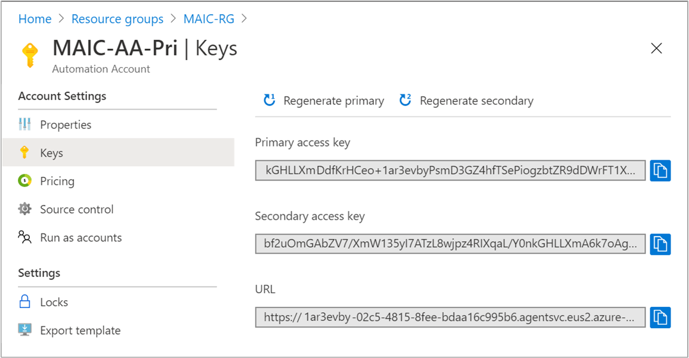

# DNS records for Azure regions used by Azure Automation

The [Azure Automation](../automation-intro.md) service uses a number of DNS records for features to connect to the service. If you have an Automation account that's defined for a specific region, you can restrict communication to that regional datacenter. You might need to know these records to allow the following Automation features to work when it is hosted behind a firewall:

* Hybrid Runbook Worker
* State Configuration
* Webhooks

>[!NOTE]
>Linux Hybrid Runbook Worker registration will fail with the new records unless it is version 1.6.10.2 or higher. You must upgrade to a newer version of the [Log Analytics agent for Linux](../../azure-monitor/agents/agent-linux.md) in order for the machine to receive an updated version of the worker role and use these new records. Existing machines will continue working without any issues.  

## DNS records per region

The following table provides the DNS record for each region.

>[!NOTE]
>While the list of Automation DNS records provided here have been retired, they still remain functional to allow time for you to migrate to the new records listed under [support for Private Link](#support-for-private-link) and prevent failures with your automation processes.

| **Region** | **DNS record** |
| --- | --- |
| Australia Central |ac-jobruntimedata-prod-su1.azure-automation.net ac-agentservice-prod-1.azure-automation.net |
| Australia East |ae-jobruntimedata-prod-su1.azure-automation.net ae-agentservice-prod-1.azure-automation.net |
| Australia South East |ase-jobruntimedata-prod-su1.azure-automation.net ase-agentservice-prod-1.azure-automation.net |
| Canada Central |cc-jobruntimedata-prod-su1.azure-automation.net cc-agentservice-prod-1.azure-automation.net |
| Central India |cid-jobruntimedata-prod-su1.azure-automation.net cid-agentservice-prod-1.azure-automation.net |
| East US 2 |eus2-jobruntimedata-prod-su1.azure-automation.net eus2-agentservice-prod-1.azure-automation.net |
| Japan East |jpe-jobruntimedata-prod-su1.azure-automation.net jpe-agentservice-prod-1.azure-automation.net |
| North Europe |ne-jobruntimedata-prod-su1.azure-automation.net ne-agentservice-prod-1.azure-automation.net |
| South Central US |scus-jobruntimedata-prod-su1.azure-automation.net scus-agentservice-prod-1.azure-automation.net |
| South East Asia |sea-jobruntimedata-prod-su1.azure-automation.net sea-agentservice-prod-1.azure-automation.net|
| Switzerland North |stzn-jobruntimedata-prod-su1.azure-automation.net stzn-agentservice-prod-su1.azure-automation.net|
| UK South | uks-jobruntimedata-prod-su1.azure-automation.net uks-agentservice-prod-1.azure-automation.net |
| US Gov Virginia | usge-jobruntimedata-prod-su1.azure-automation.us usge-agentservice-prod-1.azure-automation.us |
| West Central US | wcus-jobruntimedata-prod-su1.azure-automation.net wcus-agentservice-prod-1.azure-automation.net |
| West Europe |we-jobruntimedata-prod-su1.azure-automation.net we-agentservice-prod-1.azure-automation.net |
| West US 2 |wus2-jobruntimedata-prod-su1.azure-automation.net wus2-agentservice-prod-1.azure-automation.net |

### Support for Private Link

To support [Private Link](../../private-link/private-link-overview.md) in Azure Automation, the DNS records for every supported datacenter have been updated. Instead of region-specific URLs, the URLs are Automation account specific.

| **Region** | **DNS record** |
| --- | --- |
| South Africa North |`https://<accountId>.webhook.san.azure-automation.net` `https://<accountId>.agentsvc.san.azure-automation.net` `https://<accountId>.jrds.san.azure-automation.net` |
| East Asia |`https://<accountId>.webhook.ea.azure-automation.net` `https://<accountId>.agentsvc.ea.azure-automation.net` `https://<accountId>.jrds.ea.azure-automation.net` |
| South East Asia |`https://<accountId>.webhook.sea.azure-automation.net` `https://<accountId>.agentsvc.sea.azure-automation.net` `https://<accountId>.jrds.sea.azure-automation.net` |
| Australia Central |`https://<accountId>.webhook.ac.azure-automation.net` `https://<accountId>.agentsvc.ac.azure-automation.net` `https://<accountId>.jrds.ac.azure-automation.net` |
| Australia Central 2  |`https://<accountId>.webhook.cbr2.azure-automation.net` `https://<accountId>.agentsvc.cbr2.azure-automation.net` `https://<accountId>.jrds.cbr2.azure-automation.net` |
| Australia South East |`https://<accountId>.webhook.ase.azure-automation.net` `https://<accountId>.agentsvc.ase.azure-automation.net` `https://<accountId>.jrds.ase.azure-automation.net` |
| Australia East |`https://<accountId>.webhook.ae.azure-automation.net` `https://<accountId>.agentsvc.ae.azure-automation.net` `https://<accountId>.jrds.ae.azure-automation.net` |
| Brazil South |`https://<accountId>.webhook.brs.azure-automation.net` `https://<accountId>.agentsvc.brs.azure-automation.net` `https://<accountId>.jrds.brs.azure-automation.net` |
| Brazil Southeast |`https://<accountId>.webhook.brse.azure-automation.net` `https://<accountId>.agentsvc.brse.azure-automation.net` `https://<accountId>.jrds.brse.azure-automation.net` |
| Canada Central |`https://<accountId>.webhook.cc.azure-automation.net` `https://<accountId>.agentsvc.cc.azure-automation.net` `https://<accountId>.jrds.cc.azure-automation.net` |
| China East 2 |`https://<accountId>.webhook.sha2.azure-automation.cn` `https://<accountId>.agentsvc.sha2.azure-automation.cn` `https://<accountId>.jrds.sha2.azure-automation.cn` |
| China North |`https://<accountId>.webhook.bjb.azure-automation.cn` `https://<accountId>.agentsvc.bjb.azure-automation.cn` `https://<accountId>.jrds.bjb.azure-automation.cn` |
| China North 2 |`https://<accountId>.webhook.bjs2.azure-automation.cn` `https://<accountId>.agentsvc.bjs2.azure-automation.cn` `https://<accountId>.jrds.bjs2.azure-automation.cn` |
| West Europe |`https://<accountId>.webhook.we.azure-automation.net` `https://<accountId>.agentsvc.we.azure-automation.net` `https://<accountId>.jrds.we.azure-automation.net` |
| North Europe |`https://<accountId>.webhook.ne.azure-automation.net` `https://<accountId>.agentsvc.ne.azure-automation.net` `https://<accountId>.jrds.ne.azure-automation.net` |
| France Central |`https://<accountId>.webhook.fc.azure-automation.net` `https://<accountId>.agentsvc.fc.azure-automation.net` `https://<accountId>.jrds.fc.azure-automation.net` |
| France South |`https://<accountId>.webhook.mrs.azure-automation.net` `https://<accountId>.agentsvc.mrs.azure-automation.net` `https://<accountId>.jrds.mrs.azure-automation.net` |
| Germany West Central |`https://<accountId>.webhook.dewc.azure-automation.de` `https://<accountId>.agentsvc.dewc.azure-automation.de` `https://<accountId>.jrds.dewc.azure-automation.de` |
| Central India |`https://<accountId>.webhook.cid.azure-automation.net` `https://<accountId>.agentsvc.cid.azure-automation.net` `https://<accountId>.jrds.cid.azure-automation.net` |
| South India  |`https://<accountId>.webhook.ma.azure-automation.net` `https://<accountId>.agentsvc.ma.azure-automation.net` `https://<accountId>.jrds.ma.azure-automation.net` |
| Japan East |`https://<accountId>.webhook.jpe.azure-automation.net` `https://<accountId>.agentsvc.jpe.azure-automation.net` `https://<accountId>.jrds.jpe.azure-automation.net` |
| Japan West |`https://<accountId>.webhook.jpw.azure-automation.net` `https://<accountId>.agentsvc.jpw.azure-automation.net` `https://<accountId>.jrds.jpw.azure-automation.net` |
| Korea Central |`https://<accountId>.webhook.kc.azure-automation.net` `https://<accountId>.agentsvc.kc.azure-automation.net` `https://<accountId>.jrds.kc.azure-automation.net` |
| Korea South |`https://<accountId>.webhook.ps.azure-automation.net` `https://<accountId>.agentsvc.ps.azure-automation.net` `https://<accountId>.jrds.ps.azure-automation.net` |
| Norway East |`https://<accountId>.webhook.noe.azure-automation.net` `https://<accountId>.agentsvc.noe.azure-automation.net` `https://<accountId>.jrds.noe.azure-automation.net` |
| Norway West  |`https://<accountId>.webhook.now.azure-automation.net` `https://<accountId>.agentsvc.now.azure-automation.net` `https://<accountId>.jrds.now.azure-automation.net` |
| Switzerland West |`https://<accountId>.webhook.stzw.azure-automation.net` `https://<accountId>.agentsvc.stzw.azure-automation.net` `https://<accountId>.jrds.stzw.azure-automation.net` |
| UAE Central |`https://<accountId>.webhook.auh.azure-automation.net` `https://<accountId>.agentsvc.auh.azure-automation.net` `https://<accountId>.jrds.auh.azure-automation.net` |
| UAE North |`https://<accountId>.webhook.uaen.azure-automation.net` `https://<accountId>.agentsvc.uaen.azure-automation.net` `https://<accountId>.jrds.uaen.azure-automation.net` |
| UK West |`https://<accountId>.webhook.cw.azure-automation.net` `https://<accountId>.agentsvc.cw.azure-automation.net` `https://<accountId>.jrds.cw.azure-automation.net` |
| UK South |`https://<accountId>.webhook.uks.azure-automation.net` `https://<accountId>.agentsvc.uks.azure-automation.net` `https://<accountId>.jrds.uks.azure-automation.net` |
| Central US |`https://<accountId>.webhook.cus.azure-automation.net` `https://<accountId>.agentsvc.cus.azure-automation.net` `https://<accountId>.jrds.cus.azure-automation.net` |
| East US |`https://<accountId>.webhook.eus.azure-automation.net` `https://<accountId>.agentsvc.eus.azure-automation.net` `https://<accountId>.jrds.eus.azure-automation.net` |
| East US 2 |`https://<accountId>.webhook.eus2.azure-automation.net` `https://<accountId>.agentsvc.eus2.azure-automation.net` `https://<accountId>.jrds.eus2.azure-automation.net` |
| North Central US |`https://<accountId>.webhook.ncus.azure-automation.net` `https://<accountId>.agentsvc.ncus.azure-automation.net` `https://<accountId>.jrds.ncus.azure-automation.net` |
| South Central US |`https://<accountId>.webhook.scus.azure-automation.net` `https://<accountId>.agentsvc.scus.azure-automation.net` `https://<accountId>.jrds.scus.azure-automation.net` |
| West Central US |`https://<accountId>.webhook.wcus.azure-automation.net` `https://<accountId>.agentsvc.wcus.azure-automation.net` `https://<accountId>.jrds.wcus.azure-automation.net` |
| West US |`https://<accountId>.webhook.wus.azure-automation.net` `https://<accountId>.agentsvc.wus.azure-automation.net` `https://<accountId>.jrds.wus.azure-automation.net` |
| West US 2 |`https://<accountId>.webhook.wus2.azure-automation.net` `https://<accountId>.agentsvc.wus2.azure-automation.net` `https://<accountId>.jrds.wus2.azure-automation.net` |
| West US 3 |`https://<accountId>.webhook.usw3.azure-automation.net` `https://<accountId>.agentsvc.usw3.azure-automation.net` `https://<accountId>.jrds.usw3.azure-automation.net` |
| US Gov Virginia |`https://<accountId>.webhook.usge.azure-automation.us` `https://<accountId>.agentsvc.usge.azure-automation.us` `https://<accountId>.jrds.usge.azure-automation.us` |
| US Gov Texas |`https://<accountId>.webhook.ussc.azure-automation.us` `https://<accountId>.agentsvc.ussc.azure-automation.us` `https://<accountId>.jrds.ussc.azure-automation.us` |
| US Gov Arizona |`https://<accountId>.webhook.phx.azure-automation.us` `https://<accountId>.agentsvc.phx.azure-automation.us` `https://<accountId>.jrds.phx.azure-automation.us` |

Replace `<accountId>` in the DNS record with GUID representing your Automation Account ID from the value **URL**. You can get the ID required from **Keys** under **Account Settings** in the Azure portal.

Copy the value after *accounts/* from the **URL** field - `https://<GUID>.agentsvc.<region>.azure-automation.net/accounts/<GUID>`

> [!NOTE]
> All of the Webhook and agentservice DNS records have been updated to the new style DNS records to support Private Link. For JRDS DNS records, both old and new style DNS records are supported. If you are not using Private Link, you will see the old style DNS records, while those using Private Link will see new style of DNS records.

We recommend that you use the addresses listed when defining [exceptions](../automation-runbook-execution.md#exceptions). For a list of region IP addresses instead of region names, download the JSON file from the Microsoft Download Center for the following cloud environments:

* [Azure IP Ranges and Service Tags - Azure public](https://www.microsoft.com/download/details.aspx?id=56519)
* [Azure IP Ranges and Service Tags- Azure Government](https://www.microsoft.com/download/details.aspx?id=57063)
* [Azure IP Ranges and Service Tags - Azure Germany](https://www.microsoft.com/download/details.aspx?id=57064)
* [Azure IP Ranges and Service Tags - Microsoft Azure operated by 21Vianet](https://www.microsoft.com/download/details.aspx?id=57062)

The IP address file lists the IP address ranges that are used in the Microsoft Azure datacenters. It includes compute, SQL, and storage ranges, and reflects currently deployed ranges and any upcoming changes to the IP ranges. New ranges that appear in the file aren't used in the datacenters for at least one week.

It's a good idea to download the new IP address file every week. Then, update your site to correctly identify services running in Azure.

> [!NOTE]
> If you're using Azure ExpressRoute, remember that the IP address file is used to update the Border Gateway Protocol (BGP) advertisement of Azure space in the first week of each month.

## Next steps

* To learn how to troubleshoot your Hybrid Runbook Workers, see [Troubleshoot Hybrid Runbook Worker issues](../troubleshoot/hybrid-runbook-worker.md#general).

* To learn how to troubleshoot issues with State Configuration, see [Troubleshoot State Configuration issues](../troubleshoot/desired-state-configuration.md).