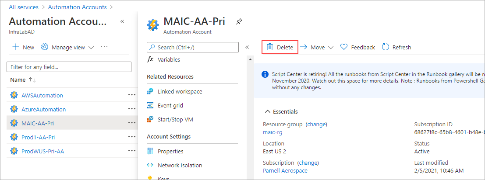

# Delete your Azure Automation account

 You can delete resources, including your Azure Automation account, through the Azure portal, PowerShell, the Azure CLI, or the REST API.

> [!WARNING]
> Before you delete an Automation account, keep in mind that you will lose access to all of the features that the account supports (see [Disable your features](#disable-your-features)). Also, if the account is linked to an Azure Monitor Log Analytics workspace, you'll no longer see the data that was being forwarded to the workspace for analysis and reporting.

If you want to delete your Azure Automation account, you'll need to prepare the account first. The high-level steps for deleting your Automation account are:

1. [Disable your features](#disable-your-features)
1. [Unlink your workspace](#unlink-your-workspace)
1. [Delete your Automation account](#delete-your-automation-account)

>[!NOTE]
>Azure Automation allows you to move some resources, including Automation accounts, to a new resource group or subscription. To learn more about the process, see [Move resources to a new resource group or subscription](../../azure-resource-manager/management/move-resource-group-and-subscription.md).

## Disable your features

To unlink your workspace from your Automation account, you must first remove these feature resources in your workspace:

- Change Tracking and Inventory
- Update Management
- Start/Stop VMs during off-hours

1. In the Azure portal, locate your resource group.
1. Find each feature, and select **Delete** on the **Delete Resources** page.

    

If you prefer, you can delete the resources by using the [Remove-AzResource](/powershell/module/Az.Resources/Remove-AzResource) cmdlet:

```azurepowershell-interactive
$workspaceName = <myWorkspaceName>
$resourceGroupName = <myResourceGroup>
Remove-AzResource -ResourceType 'Microsoft.OperationsManagement/solutions' -ResourceName "ChangeTracking($workspaceName)" -ResourceGroupName $resourceGroupName
Remove-AzResource -ResourceType 'Microsoft.OperationsManagement/solutions' -ResourceName "Updates($workspaceName)" -ResourceGroupName $resourceGroupName
Remove-AzResource -ResourceType 'Microsoft.OperationsManagement/solutions' -ResourceName "Start-Stop-VM($workspaceName)" -ResourceGroupName $resourceGroupName
```

### Remove alert rules for Start/Stop VMs during off-hours

For Start/Stop VMs during off-hours, you also need to remove the alert rules created by the feature.

1. In the Azure portal, go to your resource group and select **Monitoring** > **Alerts** > **Manage alert rules**.

   

1. On the Rules page, you should see a list of the alerts configured in that resource group. The feature creates these rules:

    * AutoStop_VM_Child
    * ScheduledStartStop_Parent
    * SequencedStartStop_Parent

1. Select the rules one at a time, and select **Delete** to remove them.

    

    > [!IMPORTANT]
    > If you don't see any alert rules on the Rules page, change the **Status** field to **Disabled** to show disabled alerts. 

1. When you remove the alert rules, you must remove the action group created for Start/Stop VMs during off-hours notifications. In the Azure portal, select **Monitor** > **Alerts** > **Manage action groups**.

1. Select **StartStop_VM_Notification**. 

1. On the action group page, select **Delete**.

    

If you prefer, you can delete your action group by using the [Remove-AzActionGroup](/powershell/module/az.monitor/remove-azactiongroup) cmdlet:

```azurepowershell-interactive
Remove-AzActionGroup -ResourceGroupName <myResourceGroup> -Name StartStop_VM_Notification
```

## Unlink your workspace

Once you've disabled all of the applicalble features, you can unlink your workspace:

1. In the Azure portal, select **Automation account** > **Related Resources** > **Linked workspace**.

1. Select **Unlink workspace** to unlink the workspace from your Automation account.

    

Powershell doesn't provide a cmdlet for unlinking workspaces.

## Delete your Automation account

Now that you've deleted or unlinked all of the account's resources, you can delete your Automation account. In the Azure portal, select **All services** > **Automation accounts** and click on the Delete button.



If you prefer, you can delete your Automation account by using the [Remove-AzAutomationAccount](/powershell/module/az.automation/remove-azautomationaccount) cmdlet:

```azurepowershell-interactive
Remove-AzAutomationAccount -Name "ContosoAutomationAccount" -Force -ResourceGroupName "ResourceGroup01"
```

## Next steps

*Not sure what should go here.*
