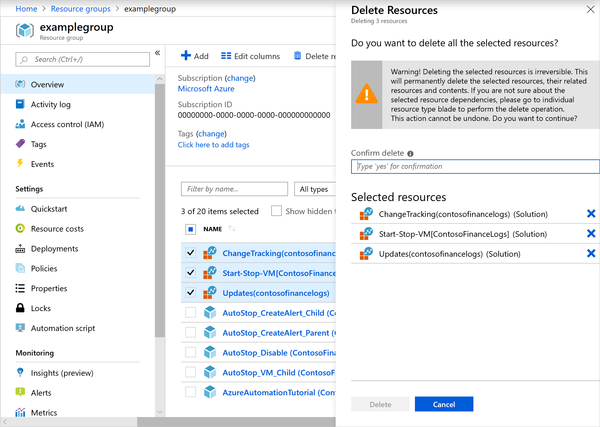
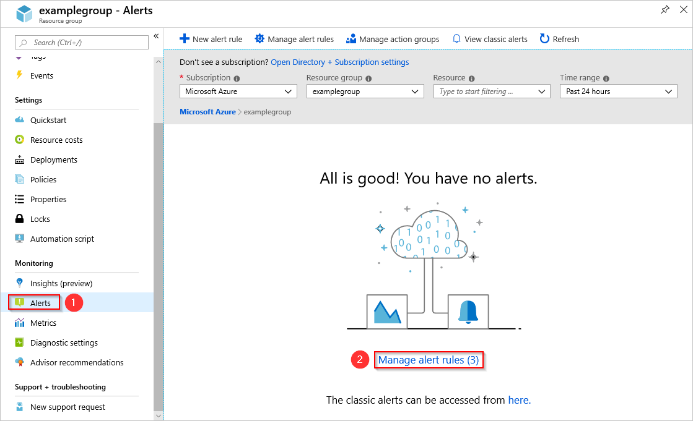
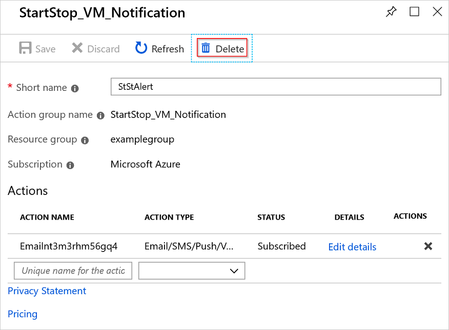
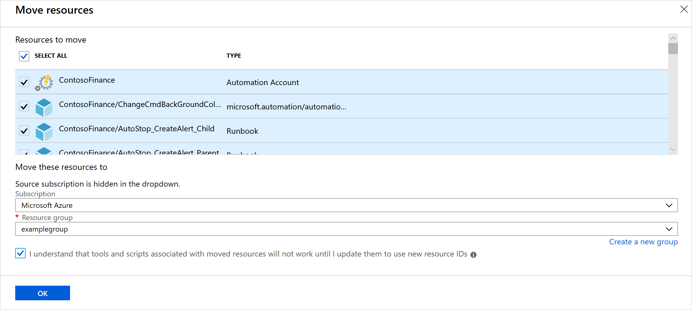
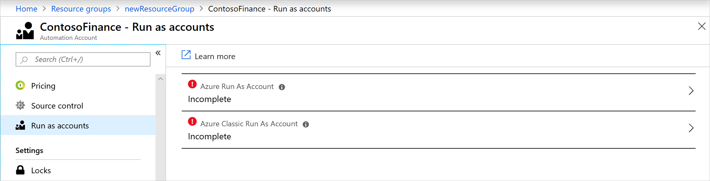
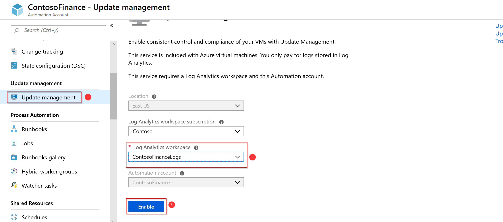

# Move your Azure Automation account to another subscription

Azure Automation allows you to move some resources to a new resource group or subscription. You can move resources through the Azure portal, PowerShell, the Azure CLI, or the REST API. To learn more about the process, see [Move resources to a new resource group or subscription](../../azure-resource-manager/management/move-resource-group-and-subscription.md).

The Automation account is one of the resources that you can move. In this article, you'll learn to move Automation accounts to another resource or subscription. The high-level steps for moving your Automation account are:

1. Disable your features.
2. Unlink your workspace.
3. Move the Automation account.
4. Delete and re-create the Run As accounts.
5. Re-enable your features.

## Remove features

To unlink your workspace from your Automation account, you must remove the feature resources in your workspace:

- Change Tracking and Inventory
- Update Management
- Start/Stop VMs during off-hours

1. In the Azure portal, locate your resource group.
2. Find each feature, and select **Delete** on the **Delete Resources** page.

    

If you prefer, you can delete the resources by using the [Remove-AzResource](/powershell/module/Az.Resources/Remove-AzResource) cmdlet:

```azurepowershell-interactive
$workspaceName = <myWorkspaceName>
$resourceGroupName = <myResourceGroup>
Remove-AzResource -ResourceType 'Microsoft.OperationsManagement/solutions' -ResourceName "ChangeTracking($workspaceName)" -ResourceGroupName $resourceGroupName
Remove-AzResource -ResourceType 'Microsoft.OperationsManagement/solutions' -ResourceName "Updates($workspaceName)" -ResourceGroupName $resourceGroupName
Remove-AzResource -ResourceType 'Microsoft.OperationsManagement/solutions' -ResourceName "Start-Stop-VM($workspaceName)" -ResourceGroupName $resourceGroupName
```

### Remove alert rules for Start/Stop VMs during off-hours

For Start/Stop VMs during off-hours, you also need to remove the alert rules created by the feature.

1. In the Azure portal, go to your resource group and select **Monitoring** > **Alerts** > **Manage alert rules**.

   

2. On the Rules page, you should see a list of the alerts configured in that resource group. The feature creates these rules:

    * AutoStop_VM_Child
    * ScheduledStartStop_Parent
    * SequencedStartStop_Parent

3. Select the rules one at a time, and select **Delete** to remove them.

    

    > [!NOTE]
    > If you don't see any alert rules on the Rules page, change the **Status** field to **Disabled** to show disabled alerts. 

4. When you remove the alert rules, you must remove the action group created for Start/Stop VMs during off-hours notifications. In the Azure portal, select **Monitor** > **Alerts** > **Manage action groups**.

5. Select **StartStop_VM_Notification**. 

6. On the action group page, select **Delete**.

    

If you prefer, you can delete your action group by using the [Remove-AzActionGroup](/powershell/module/az.monitor/remove-azactiongroup) cmdlet:

```azurepowershell-interactive
Remove-AzActionGroup -ResourceGroupName <myResourceGroup> -Name StartStop_VM_Notification
```

## Unlink your workspace

Now you can unlink your workspace:

1. In the Azure portal, select **Automation account** > **Related Resources** > **Linked workspace**. 

2. Select **Unlink workspace** to unlink the workspace from your Automation account.

    

## Move your Automation account

You can now move your Automation account and its runbooks. 

1. In the Azure portal, browse to the resource group of your Automation account. Select **Move** > **Move to another subscription**.

    

2. Select the resources in your resource group that you want to move. Ensure that you include your Automation account, runbooks, and Log Analytics workspace resources.

## Re-create Run As accounts

[Run As accounts](../automation-security-overview.md#run-as-accounts) create a service principal in Azure Active Directory to authenticate with Azure resources. When you change subscriptions, the Automation account no longer uses the existing Run As account. To re-create the Run As accounts:

1. Go to your Automation account in the new subscription, and select **Run as accounts** under **Account Settings**. You'll see that the Run As accounts show as incomplete now.

    

2. Delete the Run As accounts, one at a time, by selecting **Delete** on the **Properties** page. 

    > [!NOTE]
    > If you don't have permissions to create or view the Run As accounts, you see the following message: `You do not have permissions to create an Azure Run As account (service principal) and grant the Contributor role to the service principal.` For more information, see [Permissions required to configure Run As accounts](../automation-security-overview.md#permissions).

3. After you've deleted the Run As accounts, select **Create** under **Azure Run As account**. 

4. On the Add Azure Run As account page, select **Create** to create the Run As account and service principal. 

5. Repeat the steps above with the Azure Classic Run As account.

## Enable features

After you re-create the Run As accounts, you must re-enable the features that you removed before the move:

1. To turn on Change Tracking and Inventory, select **Change Tracking and Inventory** in your Automation account. Choose the Log Analytics workspace that you moved over, and select **Enable**.

2. Repeat step 1 for Update Management.

    

3. Machines that are enabled with your features are visible when you've connected the existing Log Analytics workspace. To turn on the Start/Stop VMs during off-hours feature, you must re-enable it. Under **Related Resources**, select **Start/Stop VMs** > **Learn more about and enable the solution** > **Create** to start the deployment.

4. On the Add Solution page, choose your Log Analytics workspace and Automation account.

    

5. Configure the feature as described in [Start/Stop VMs during off-hours overview](../automation-solution-vm-management.md).

## Verify the move

When the move is complete, verify that the capabilities listed below are enabled. 

|Capability|Tests|Troubleshooting|
|---|---|---|
|Runbooks|A runbook can successfully run and connect to Azure resources.|[Troubleshoot runbooks](../troubleshoot/runbooks.md)
|Source control|You can run a manual sync on your source control repository.|[Source control integration](../source-control-integration.md)|
|Change tracking and inventory|Verify that you see current inventory data from your machines.|[Troubleshoot change tracking](../troubleshoot/change-tracking.md)|
|Update management|Verify that you see your machines and that they're healthy.</br>Run a test software update deployment.|[Troubleshoot update management](../troubleshoot/update-management.md)|
|Shared resources|Verify that you see all your shared resources, such as [credentials](../shared-resources/credentials.md) and [variables](../shared-resources/variables.md).|

## Next steps

To learn about moving resources in Azure, see [Move resources in Azure](../../azure-resource-manager/management/move-support-resources.md).
