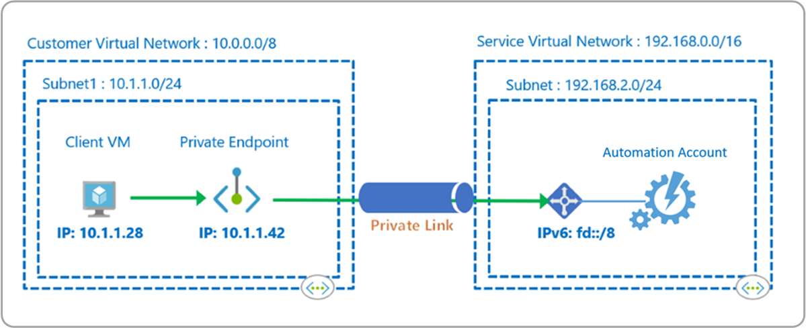
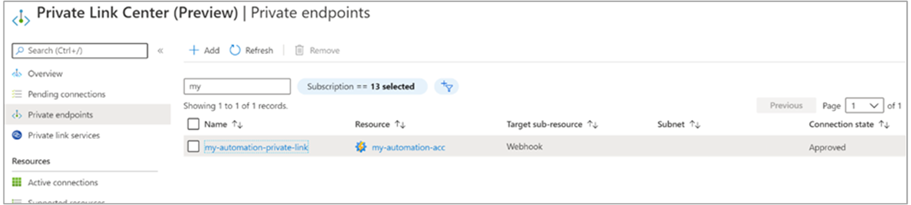
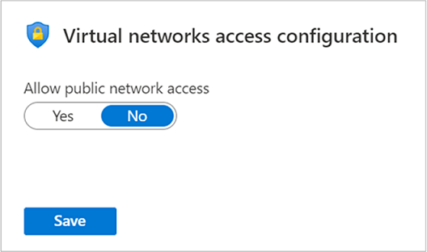

# Use Azure Private Link to securely connect networks to Azure Automation

Azure Private Endpoint is a network interface that connects you privately and securely to a service powered by Azure Private Link. Private Endpoint uses a private IP address from your VNet, effectively bringing the Automation service into your VNet. Network traffic between the machines on the VNet and the Automation account traverses over the VNet and a private link on the Microsoft backbone network, eliminating exposure from the public internet.

For example, you have a VNet where you have disabled outbound internet access. However, you want to access your Automation account privately and use Automation features like Webhooks, State Configuration, and runbook jobs on Hybrid Runbook Workers. Moreover, you want users to have access to the Automation account only through the VNET.  Deploying private endpoint achieves these goals.

This article covers when to use and how to set up a private endpoint with your Automation account.



>[!NOTE]
> Private Link support with Azure Automation is available only in Azure Commercial and Azure US Government clouds.

## Advantages

With Private Link you can:

- Connect privately to Azure Automation without opening up any public network access.
- Connect privately to Azure Monitor Log Analytics workspace without opening any public network access.

    >[!NOTE]
    >A separate private endpoint for your Log Analytics workspace is required if your Automation account is linked to a Log Analytics workspace to forward job data, and when you have enabled features such as Update Management, Change Tracking and Inventory, State Configuration, or Start/Stop VMs during off-hours. For more information about Private Link for Azure Monitor, see [Use Azure Private Link to securely connect networks to Azure Monitor](../../azure-monitor/logs/private-link-security.md).

- Ensure your Automation data is only accessed through authorized private networks.
- Prevent data exfiltration from your private networks by defining your Azure Automation resource that connects through your private endpoint.
- Securely connect your private on-premises network to Azure Automation using ExpressRoute and Private Link.
- Keep all traffic inside the Microsoft Azure backbone network.

For more information, see  [Key Benefits of Private Link](../../private-link/private-link-overview.md#key-benefits).

## Limitations

- In the current implementation of Private Link, Automation account cloud jobs cannot access Azure resources that are secured using private endpoint. For example, Azure Key Vault, Azure SQL, Azure Storage account, etc. To workaround this, use a [Hybrid Runbook Worker](../automation-hybrid-runbook-worker.md) instead.
- You need to use the latest version of the [Log Analytics agent](../../azure-monitor/agents/log-analytics-agent.md) for Windows or Linux.
- The [Log Analytics Gateway](../../azure-monitor/agents/gateway.md) does not support Private Link.

## How it works

Azure Automation Private Link connects one or more private endpoints (and therefore the virtual networks they are contained in) to your Automation Account resource. These endpoints are machines using webhooks to start a runbook, machines hosting the Hybrid Runbook Worker role, and Desired State Configuration (DSC) nodes.

After you create private endpoints for Automation, each of the public facing Automation URLs, is mapped to one private endpoint in your VNet. You or a machine can directly contact the Automation URLs.

### Webhook scenario

You can start runbooks by doing a POST on the webhook URL. For example, the URL looks like: `https://<automationAccountId>.webhooks.<region>.azure-automation.net/webhooks?token=gzGMz4SMpqNo8gidqPxAJ3E%3d`

### Hybrid Runbook Worker scenario

The user Hybrid Runbook Worker feature of Azure Automation enables you to run runbooks directly on the Azure or non-Azure machine, including servers registered with Azure Arc enabled servers. From the machine or server that's hosting the role, you can run runbooks directly on it and against resources in the environment to manage those local resources.

A JRDS endpoint is used by the hybrid worker to start/stop runbooks, download the runbooks to the worker, and to send the job log stream back to the Automation service. After enabling JRDS endpoint, the URL would look like this: `https://<automationaccountID>.jobruntimedata.<region>.azure-automation.net`. This would ensure runbook execution on the hybrid worker connected to Azure Virtual Network is able to execute jobs without the need to open an outbound connection to the Internet.  

> [!NOTE]
>With the current implementation of Private Links for Azure Automation, it only supports running jobs on the Hybrid Runbook Worker connected to an Azure virtual network and does not support cloud jobs.

## Hybrid Worker scenario for Update Management  

The system Hybrid Runbook Worker supports a set of hidden runbooks used by the Update Management feature that are designed to install user-specified updates on Windows and Linux machines. When Azure Automation Update Management is enabled, any machine connected to your Log Analytics workspace is automatically configured as a system Hybrid Runbook Worker.

To understand & configure Update Management review [About Update Management](../update-management/overview.md). The Update Management feature has a dependency on a Log Analytics workspace, and therefore requires linking the workspace with an Automation account. A Log Analytics workspace stores data collected by the solution, and host its log searches and views.

If you want your machines configured for Update management to connect to Automation & Log Analytics workspace in a secure manner over Private Link channel, you have to enable Private Link for the Log Analytics workspace linked to the Automation Account configured with Private Link.

You can control how a Log Analytics workspace can be reached from outside of the Private Link scopes by following the steps described in [Configure Log Analytics](../../azure-monitor/logs/private-link-security.md#configure-log-analytics). If you set **Allow public network access for ingestion** to **No**, then machines outside of the connected scopes cannot upload data to this workspace. If you set **Allow public network access for queries** to **No**, then machines outside of the scopes cannot access data in this workspace.

Use **DSCAndHybridWorker** target sub-resource to enable Private Link for user & system hybrid workers.

> [!NOTE]
> Machines hosted outside of Azure that are managed by Update Management and are connected to the Azure VNet over ExpressRoute private peering, VPN tunnels, and peered virtual networks using private endpoints support Private Link.

### State Configuration (agentsvc) scenario

State Configuration provides you with Azure configuration management service that allows you to write, manage, and compile PowerShell Desired State Configuration (DSC) configurations for nodes in any cloud or on-premises datacenter.

The agent on the machine registers with DSC service and then uses the service endpoint to pull DSC configuration. The agent service endpoint looks like: `https://<automationAccountId>.agentsvc.<region>.azure-automation.net`.

The URL for public & private endpoint would be the same, however, it would be mapped to a private IP address when Private link is enabled.

## Planning based on your network

Before setting up your Automation account resource, consider your network isolation requirements. Evaluate your virtual networks' access to public internet, and the access restrictions to your Automation account (including setting up a Private Link Group Scope to Azure Monitor Logs if integrated with your Automation account). Also include a review of the Automation service [DNS records](./automation-region-dns-records.md) as part of your plan to ensure the supported features work without issue.

### Connect to a private endpoint

Create a private endpoint to connect our network. You can create it in the [Azure portal Private Link center](https://portal.azure.com/#blade/Microsoft_Azure_Network/PrivateLinkCenterBlade/privateendpoints). Once your changes to publicNetworkAccess and Private Link are applied, it can take up to 35 minutes for them to take effect.

In this section, you'll create a private endpoint for your Automation account.

1. On the upper-left side of the screen, select **Create a resource > Networking > Private Link Center**.

2. In **Private Link Center - Overview**, on the option to **Build a private connection to a service**, select **Start**.

3. In **Create a virtual machine - Basics**, enter or select the following information:

    | Setting | Value |
    | ------- | ----- |
    | **PROJECT DETAILS** | |
    | Subscription | Select your subscription. |
    | Resource group | Select **myResourceGroup**. You created this in the previous section.  |
    | **INSTANCE DETAILS** |  |
    | Name | Enter your *PrivateEndpoint*. |
    | Region | Select **YourRegion**. |
    |||

4. Select **Next: Resource**.

5. In **Create a private endpoint - Resource**, enter or select the following information:

    | Setting | Value |
    | ------- | ----- |
    |Connection method  | Select connect to an Azure resource in my directory.|
    | Subscription| Select your subscription. |
    | Resource type | Select **Microsoft.Automation/automationAccounts**. |
    | Resource |Select *myAutomationAccount*|
    |Target subresource |Select *Webhook* or *DSCAndHybridWorker* depending on your scenario.|
    |||

6. Select **Next: Configuration**.

7. In **Create a private endpoint - Configuration**, enter or select the following information:

    | Setting | Value |
    | ------- | ----- |
    |**NETWORKING**| |
    | Virtual network| Select *MyVirtualNetwork*. |
    | Subnet | Select *mySubnet*. |
    |**PRIVATE DNS INTEGRATION**||
    |Integrate with private DNS zone |Select **Yes**. |
    |Private DNS Zone |Select *(New)privatelink.azure-automation.net* |
    |||

8. Select **Review + create**. You're taken to the **Review + create** page where Azure validates your configuration.

9. When you see the **Validation passed** message, select **Create**.

In the **Private Link Center**, select **Private endpoints** to view your private link resource.



Select the resource to see all the details. This creates a new private endpoint for your Automation account and assigns it a private IP from your virtual network. The **Connection status** shows as **approved**.

Similarly, a unique fully qualified domain name (FQDN) is created for the State Configuration (agentsvc) and for the Hybrid Runbook Worker job runtime (jrds). Each of them are assigned a separate IP from your VNet and the **Connection status** shows as **approved**.

If the service consumer has Azure RBAC permissions on the Automation resource, they can choose the automatic approval method. In this case, when the request reaches the Automation provider resource, no action is required from the service provider and the connection is automatically approved.

## Set public network access flags

You can configure an Automation account to deny all public configurations and allow only connections through private endpoints to further enhance the network security. If you want to restrict access to the Automation account from only within the VNet and not allow access from public internet, you can set `publicNetworkAccess` property to `$false`.

When the **Public Network Access** setting is set to `$false`, only connections via private endpoints are allowed and all connections via public endpoints are denied with an unauthorized error message and HTTP status of 401.

The following PowerShell script shows how to `Get` and `Set` the **Public Network Access** property at the Automation account level:

```powershell
$account = Get-AzResource -ResourceType Microsoft.Automation/automationAccounts -ResourceGroupName "<resourceGroupName>" -Name "<automationAccountName>" -ApiVersion "2020-01-13-preview"
$account.Properties | Add-Member -Name 'publicNetworkAccess' -Type NoteProperty -Value $false
$account | Set-AzResource -Force -ApiVersion "2020-01-13-preview"
```

You can also control the public network access property from the Azure portal. From your Automation Account, select **Network Isolation** from the left-hand pane under the **Account Settings** section. When the Public Network Access setting is set to **No**, only connections over private endpoints are allowed and all connections over public endpoints are denied.



## DNS configuration

When connecting to a private link resource using a fully qualified domain name (FQDN) as part of the connection string, it's important to correctly configure your DNS settings to resolve to the allocated private IP address. Existing Azure services might already have a DNS configuration to use when connecting over a public endpoint. Your DNS configuration should be reviewed and updated to connect using your private endpoint.

The network interface associated with the private endpoint contains the complete set of information required to configure your DNS, including FQDN and private IP addresses allocated for a given private link resource.

You can use the following options to configure your DNS settings for private endpoints:

* Use the host file (only recommended for testing). You can use the host file on a virtual machine to override using DNS for name resolution first. Your DNS entry should look like the following example: `privatelinkFQDN.jrds.sea.azure-automation.net`.

* Use a [private DNS zone](../../dns/private-dns-privatednszone.md). You can use private DNS zones to override the DNS resolution for a particular private endpoint. A private DNS zone can be linked to your virtual network to resolve specific domains. To enable the agent on your virtual machine to communicate over the private endpoint, create a Private DNS record as `privatelink.azure-automation.net`. Add a new DNS *A* record mapping to the IP of the private endpoint.

* Use your DNS forwarder (optional). You can use your DNS forwarder to override the DNS resolution for a particular private link resource. If your [DNS server](../../virtual-network/virtual-networks-name-resolution-for-vms-and-role-instances.md#name-resolution-that-uses-your-own-dns-server) is hosted on a virtual network, you can create a DNS forwarding rule to use a private DNS zone to simplify the configuration for all private link resources.

For more information, see [Azure Private Endpoint DNS configuration](../../private-link/private-endpoint-dns.md).

## Next steps

To learn more about Private Endpoint, see [What is Azure Private Endpoint?](../../private-link/private-endpoint-overview.md).
