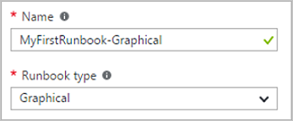
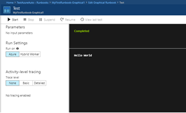
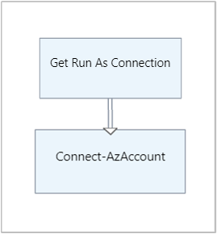
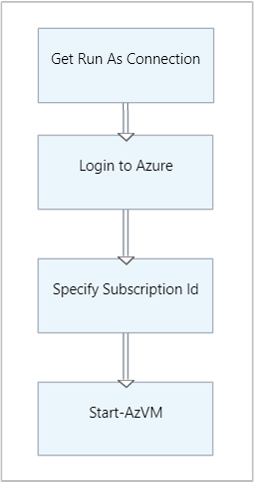
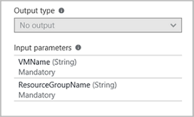
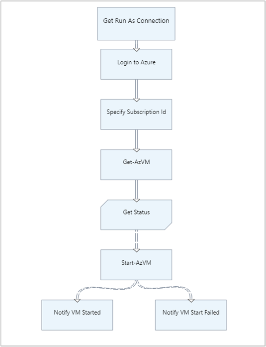

# Tutorial: Create a graphical runbook

This tutorial walks you through the creation of a [graphical runbook](../automation-runbook-types.md#graphical-runbooks) in Azure Automation. You can create and edit graphical and graphical PowerShell Workflow runbooks using the graphical editor in the Azure portal. 

In this tutorial, you learn how to:

> [!div class="checklist"]
> * Create a simple graphical runbook
> * Test and publish the runbook
> * Run and track the status of the runbook job
> * Update the runbook to start an Azure virtual machine, with runbook parameters and conditional links

## Prerequisites

To complete this tutorial, you need the following:

* Azure subscription. If you don't have one yet, you can [activate your MSDN subscriber benefits](https://azure.microsoft.com/pricing/member-offers/msdn-benefits-details/) or sign up for a [free account](https://azure.microsoft.com/free).
* [Automation account](../index.yml) to hold the runbook and authenticate to Azure resources. This account must have permission to start and stop the virtual machine.
* An Azure virtual machine. Since you stop and start this machine, it shouldn't be a production VM.
* If necessary, [import Azure modules](../shared-resources/modules.md) or [update modules](../automation-update-azure-modules.md) based on the cmdlets that you use.

## Step 1 - Create runbook

Start by creating a simple runbook that outputs the text `Hello World`.

1. In the Azure portal, open your Automation account.

    The Automation account page gives you a quick view of the resources in this account. You should already have some assets. Most of those assets are the modules automatically included in a new Automation account. You should also have the Credential asset associated with your subscription.

2. Select **Runbooks** under **Process Automation** to open the list of runbooks.

3. Create a new runbook by selecting **Create a runbook**.

4. Give the runbook the name **MyFirstRunbook-Graphical**.

5. In this case, you're going to create a [graphical runbook](../automation-graphical-authoring-intro.md). Select **Graphical** for **Runbook type**.

    

6. Click **Create** to create the runbook and open the graphical editor.

## Step 2 - Add activities

The Library control on the left side of the editor allows you to select activities to add to your runbook. You're going to add a `Write-Output` cmdlet to output text from the runbook.

1. In the Library control, click in the search field and type `write-output`. Search results are shown in the following image.

    

2. Scroll down to the bottom of the list. Right-click **Write-Output** and select **Add to canvas**. Alternatively, you can click the ellipsis (...) next to the cmdlet name and then select **Add to canvas**.

3. Click the **Write-Output** activity on the canvas. This action opens the Configuration control page, which allows you to configure the activity.

4. The **Label** field defaults to the name of the cmdlet, but you can change it to something more friendly. Change it to `Write Hello World to output`.

5. Click **Parameters** to provide values for the cmdlet's parameters.

   Some cmdlets have multiple parameter sets, and you need to select which one to use. In this case, `Write-Output` has only one parameter set.

6. Select the `InputObject` parameter. This is the parameter that you use to specify the text to send to the output stream.

7. The **Data source** dropdown menu provides sources that you can use to populate a parameter value. In this menu, select **PowerShell expression**.

   You can use output from such sources as another activity, an Automation asset, or a PowerShell expression. In this case, the output is just `Hello World`. You can use a PowerShell expression and specify a string.

8. In the **Expression** field, type `"Hello World"` and then click **OK** twice to return to the canvas.

9. Save the runbook by clicking **Save**.

## Step 3 - Test the runbook

Before you publish the runbook to make it available in production, you should test it to make sure that it works properly. Testing a runbook runs its Draft version and allows you to view its output interactively.

1. Select **Test pane** to open the Test pane.

2. Click **Start** to start the test. This should be the only enabled option.

3. Note that a [runbook job](../automation-runbook-execution.md) is created and its status is displayed in the pane.

   The job status starts as `Queued`, indicating that the job is waiting for a runbook worker in the cloud to become available. The status changes to `Starting` when a worker claims the job. Finally, the status becomes `Running` when the runbook actually starts to run.

4. When the runbook job completes, the Test pane displays its output. In this case, you see `Hello World`.

    

5. Close the Test pane to return to the canvas.

## Step 4 - Publish and start the runbook

The runbook that you have created is still in Draft mode. It needs to be published before you can run it in production. When you publish a runbook, you overwrite the existing Published version with the Draft version. In this case, you don't have a Published version yet because you just created the runbook.

1. Select **Publish** to publish the runbook and then **Yes** when prompted.

2. Scroll left to view the runbook on the Runbooks page, and note that the **Authoring Status** value is set to **Published**.

3. Scroll back to the right to view the page for **MyFirstRunbook-Graphical**.

   The options across the top allow you to start the runbook now, schedule a future start time, or create a [webhook](../automation-webhooks.md) so that the runbook can be started through an HTTP call.

4. Select **Start** and then **Yes** when prompted to start the runbook.

5. A Job pane is opened for the runbook job that has been created. Verify that the **Job status** field shows **Completed**.

6. Click **Output** to open the Output page, where you can see `Hello World` displayed.

7. Close the Output page.

8. Click **All Logs** to open the Streams pane for the runbook job. You should only see `Hello World` in the output stream.

    Note that the Streams pane can show other streams for a runbook job, such as Verbose and Error streams, if the runbook writes to them.

9. Close the Streams pane and the Job pane to return to the MyFirstRunbook-Graphical page.

10. To view all the jobs for the runbook, select **Jobs** under **Resources**. The Jobs page lists all the jobs created by your runbook. You should see only one job listed, since you have only run the job once.

11. Click the job name to open the same Job pane that you viewed when you started the runbook. Use this pane to view the details of any job created for the runbook.

## Step 5 - Create variable assets

You've tested and published your runbook, but so far it doesn't do anything useful to manage Azure resources. Before configuring the runbook to authenticate, you must create a variable to hold the subscription ID, set up an activity to authenticate, and then reference the variable. Including a reference to the subscription context allows you to easily work with multiple subscriptions.

1. Copy your subscription ID from the **Subscriptions** option on the Navigation pane.

2. In the Automation Accounts page, select **Variables** under **Shared Resources**.

3. Select **Add a variable**.

4. On the New variable page, make the following settings in the fields provided.

    * **Name** -- enter `AzureSubscriptionId`.
    * **Value** -- enter your subscription ID.
    * **Type** -- keep string selected.
    * **Encryption** -- use the default value.

5. Click **Create** to create the variable.

## Step 6 - Add authentication

Now that you have a variable to hold the subscription ID, you can configure the runbook to authenticate with the Run As credentials for your subscription. Do this by adding the Azure Run As connection as an asset. You also must add the [Connect-AzAccount](/powershell/module/az.accounts/Connect-AzAccount) cmdlet and the [Set-AzContext](/powershell/module/az.accounts/Set-AzContext) cmdlet to the canvas.

>[!NOTE]
>For PowerShell runbooks, `Add-AzAccount` and `Add-AzureRMAccount` are aliases for `Connect-AzAccount`. Note that these aliases are not available for your graphical runbooks. A graphical runbook can only use `Connect-AzAccount`itself.

1. Navigate to your runbook and select **Edit** on the MyFirstRunbook-Graphical page.

2. You don't need the `Write Hello World to output` entry any more. Just click the ellipsis and select **Delete**.

3. In the Library control, expand **ASSETS**, then **Connections**. Add `AzureRunAsConnection` to the canvas by selecting **Add to canvas**.

4. Rename `AzureRunAsConnection` to `Get Run As Connection`.

5. In the Library control, type `Connect-AzAccount` in the search field.

6. Add `Connect-AzAccount` to the canvas.

7. Hover over `Get Run As Connection` until a circle appears on the bottom of the shape. Click the circle and drag the arrow to `Connect-AzAccount` to form a link. The runbook starts with `Get Run As Connection` and then runs `Connect-AzAccount`.

    

8. On the canvas, select `Connect-AzAccount`. In the Configuration control pane, type **Login to Azure** in the **Label** field.

9. Click **Parameters**, and the Activity Parameter Configuration page appears.

10. The `Connect-AzAccount` cmdlet has multiple parameter sets, and you need to select one before providing parameter values. Click **Parameter Set** and then select **ServicePrincipalCertificateWithSubscriptionId**.

11. The parameters for this parameter set are displayed on the Activity Parameter Configuration page. Click **APPLICATIONID**.

    

12. On the Parameter Value page, make the following settings and then click **OK**.

   * **Data source** -- select **Activity output**.
   * Data source list -- select **Get Automation Connection**.
   * **Field path** -- type `ApplicationId`. You're specifying the name of the property for the field path because the activity outputs an object with multiple properties.

13. Click **CERTIFICATETHUMBPRINT**, and on the Parameter Value page, make the following settings and then click **OK**.

    * **Data source** -- select **Activity output**.
    * Data source list -- select **Get Automation Connection**.
    * **Field path** -- type `CertificateThumbprint`.

14. Click **SERVICEPRINCIPAL**, and on the Parameter Value page, select **ConstantValue** for the **Data source** field. Click the option **True**, and then click **OK**.

15. Click **TENANTID**, and make the following settings on the Parameter Value page. When finished, click **OK** twice.

    * **Data source** -- select **Activity output**.
    * Data source list -- select **Get Automation Connection**.
    * **Field path** -- type `TenantId`.

16. In the Library control, type `Set-AzContext` in the search field.

17. Add `Set-AzContext` to the canvas.

18. Select `Set-AzContext` on the canvas. In the Configuration control pane, enter `Specify Subscription Id` in the **Label** field.

19. Click **Parameters** and the Activity Parameter Configuration page appears.

20. The `Set-AzContext` cmdlet has multiple parameter sets, and you need to select one before providing parameter values. Click **Parameter Set** and then select **SubscriptionId**.

21. The parameters for this parameter set are displayed on the Activity Parameter Configuration page. Click **SubscriptionID**.

22. On the Parameter Value page, select **Variable Asset** for the **Data source** field and select **AzureSubscriptionId** from the source list. When finished, click **OK** twice.

23. Hover over `Login to Azure` until a circle appears on the bottom of the shape. Click the circle and drag the arrow to `Specify Subscription Id`. Your runbook should look like the following at this point.

    :::image type="content" source="../media/automation-tutorial-runbook-graphical/runbook-auth-config.png" alt-text="Screenshot of the runbook after dragging the arrow to 'Specify Subscription ID'.":::

## Step 7 - Add activity to start a virtual machine

Now you must add a `Start-AzVM` activity to start a virtual machine. You can pick any VM in your Azure subscription, and for now you are hardcoding its name into the [Start-AzVM](/powershell/module/az.compute/start-azvm) cmdlet.

1. In the Library control, type `Start-Az` in the search field.

2. Add `Start-AzVM` to the canvas and then click and drag it underneath `Specify Subscription Id`.

3. Hover over `Specify Subscription Id` until a circle appears on the bottom of the shape. Click the circle and drag the arrow to `Start-AzVM`.

4. Select `Start-AzVM`. Click **Parameters** and then **Parameter Set** to view the sets for the activity.

5. Select **ResourceGroupNameParameterSetName** for the parameter set. The fields **ResourceGroupName** and **Name** have exclamation marks next to them to indicate that they are required parameters. Note that both fields expect string values.

6. Select **Name**. Choose **PowerShell expression** for the **Data source** field. For the VM that you use to start this runbook, type in the machine name surrounded with double quotes. Click **OK**.

7. Select **ResourceGroupName**. Use the value **PowerShell expression** for the **Data source** field, and type in the name of the resource group surrounded with double quotes. Click **OK**.

8. Click **Test pane** so that you can test the runbook.

9. Click **Start** to begin the test. Once it completes, make sure that the VM has started. Your runbook should look like the following at this point.

    

## Step 8 - Add additional input parameters

Your runbook currently starts the VM in the resource group that you specified for the `Start-AzVM` cmdlet. The runbook will be more useful if you specify both name and resource group when the runbook is started. Let's add input parameters to the runbook to provide that functionality.

1. Open the graphical editor by clicking **Edit** on the MyFirstRunbook-Graphical page.

2. Select **Input and output** and then **Add input** to open the Runbook Input Parameter pane.

3. Make the following settings in the provided fields and then click **OK**.
   * **Name** -- specify `VMName`.
   * **Type** -- keep the string setting.
   * **Mandatory** -- change the value to **Yes**.

4. Create a second mandatory input parameter called `ResourceGroupName` and then click **OK** to close the Input and Output pane.

    

5. Select the `Start-AzVM` activity and then click **Parameters**.

6. Change the **Data source** field for **Name** to **Runbook input**. Then select **VMName**.

7. Change the **Data source** field for **ResourceGroupName** to **Runbook input** and then select **ResourceGroupName**.

    

8. Save the runbook and open the Test pane. You can now provide values for the two input variables that you use in the test.

9. Close the Test pane.

10. Click **Publish** to publish the new version of the runbook.

11. Stop the VM that you started previously.

12. Click **Start** to start the runbook. Type in the values for `VMName` and `ResourceGroupName` for the VM that you're going to start.

13. When the runbook completes, ensure that the VM has been started.

## Step 9 - Create a conditional link

You can now modify the runbook so that it only attempts to start the VM if it is not already started. Do this by adding a [Get-AzVM](/powershell/module/Az.Compute/Get-AzVM) cmdlet that retrieves the instance-level status of the VM. Then you can add a PowerShell Workflow code module called `Get Status` with a snippet of PowerShell code to determine if the VM state is running or stopped. A conditional link from the `Get Status` module only runs `Start-AzVM` if the current running state is stopped. At the end of this procedure, your runbook uses the `Write-Output` cmdlet to output a message to inform you if the VM was successfully started.

1. Open **MyFirstRunbook-Graphical** in the graphical editor.

2. Remove the link between `Specify Subscription Id` and `Start-AzVM` by clicking on it and then pressing **Delete**.

3. In the Library control, type `Get-Az` in the search field.

4. Add `Get-AzVM` to the canvas.

5. Select `Get-AzVM` and then click **Parameter Set** to view the sets for the cmdlet.

6. Select the **GetVirtualMachineInResourceGroupNameParamSet** parameter set. The **ResourceGroupName** and **Name** fields have exclamation marks next to them, indicating that they specify required parameters. Note that both fields expect string values.

7. Under **Data source** for **Name**, select **Runbook input**, then **VMName**. Click **OK**.

8. Under **Data source** for **ResourceGroupName**, select **Runbook input**, then **ResourceGroupName**. Click **OK**.

9. Under **Data source** for **Status**, select **Constant value**, then **True**. Click **OK**.

10. Create a link from `Specify Subscription Id` to `Get-AzVM`.

11. In the Library control, expand **Runbook Control** and add **Code** to the canvas.  

12. Create a link from `Get-AzVM` to `Code`.  

13. Click `Code` and, in the Configuration pane, change the label to **Get Status**.

14. Select `Code` and the Code Editor page appears.  

15. Paste the following code snippet into the editor page.

    ```powershell
    $Statuses = $ActivityOutput['Get-AzVM'].Statuses
    $StatusOut = ""
    foreach ($Status in $Statuses) {
      if($Status.Code -eq "Powerstate/running")
        {$StatusOut = "running"}
      elseif ($Status.Code -eq "Powerstate/deallocated")
        {$StatusOut = "stopped"}
    }
    $StatusOut
    ```

16. Create a link from `Get Status` to `Start-AzVM`.

      

17. Select the link and, in the Configuration pane, change **Apply condition** to **Yes**. Note that the link becomes a dashed line, indicating that the target activity only runs if the condition resolves to true.  

18. For **Condition expression**, type `$ActivityOutput['Get Status'] -eq "Stopped"`. `Start-AzVM` now only runs if the VM is stopped.

19. In the Library control, expand **Cmdlets** and then **Microsoft.PowerShell.Utility**.

20. Add `Write-Output` to the canvas twice.

21. For the first `Write-Output` control, click **Parameters** and change the **Label** value to **Notify VM Started**.

22. For **InputObject**, change **Data source** to **PowerShell expression**, and type in the expression `$VMName successfully started.`.

23. On the second `Write-Output` control, click **Parameters** and change the **Label** value to **Notify VM Start Failed**.

24. For **InputObject**, change **Data source** to **PowerShell expression**, and type in the expression `$VMName could not start`.

25. Create links from `Start-AzVM` to `Notify VM Started` and `Notify VM Start Failed`.

26. Select the link to `Notify VM Started` and change **Apply condition** to true.

27. For the **Condition expression**, type `$ActivityOutput['Start-AzVM'].IsSuccessStatusCode -eq $true`. This `Write-Output` control now only runs if the VM starts successfully.

28. Select the link to `Notify VM Start Failed` and change **Apply condition** to true.

29. For the **Condition expression** field, type `$ActivityOutput['Start-AzVM'].IsSuccessStatusCode -ne $true`. This `Write-Output` control now only runs if the VM is not successfully started. Your runbook should look like the following image.

    

30. Save the runbook and open the Test pane.

31. Start the runbook with the VM stopped, and the machine should start.

## Next steps

* To learn more about graphical authoring, see [Author a graphical runbook in Azure Automation](../automation-graphical-authoring-intro.md).
* To get started with PowerShell runbooks, see [Create a PowerShell runbook](automation-tutorial-runbook-textual-powershell.md).
* To get started with PowerShell Workflow runbooks, see [Create a PowerShell workflow runbook](automation-tutorial-runbook-textual.md).
* For a PowerShell cmdlet reference, see [Az.Automation](/powershell/module/az.automation).
