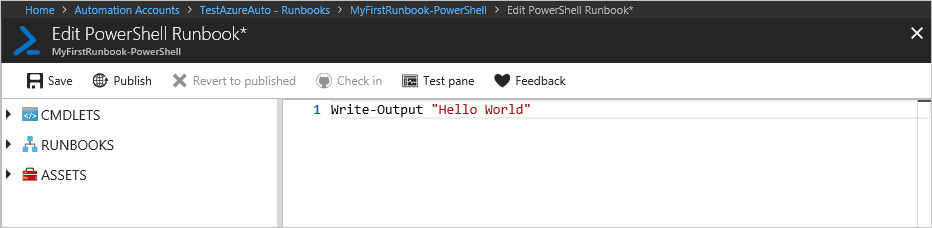
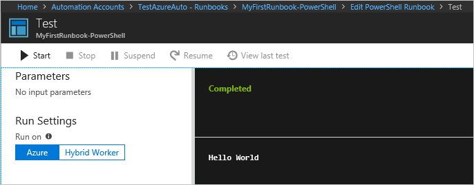
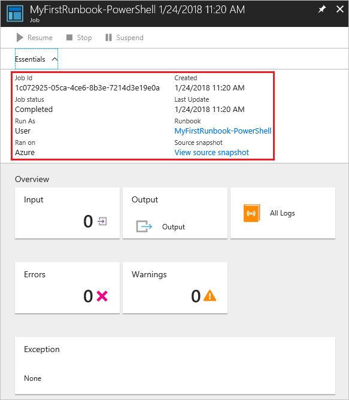
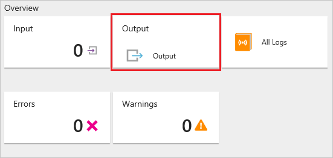
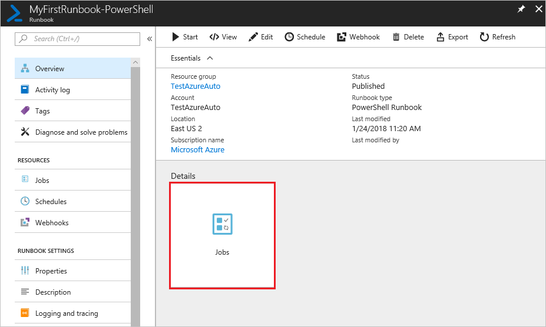
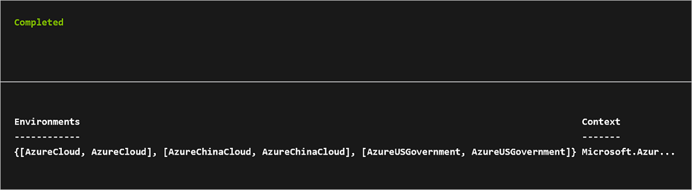

# Tutorial: Create a PowerShell runbook

This tutorial walks you through the creation of a [PowerShell runbook](../automation-runbook-types.md#powershell-runbooks) in Azure Automation. PowerShell runbooks are based on Windows PowerShell. You can directly edit the code of the runbook using the text editor in the Azure portal.

> [!div class="checklist"]
> * Create a simple PowerShell runbook
> * Test and publish the runbook
> * Run and track the status of the runbook job
> * Update the runbook to start an Azure virtual machine with runbook parameters

## Prerequisites

To complete this tutorial, you need the following:

* Azure subscription. If you don't have one yet, you can [activate your MSDN subscriber benefits](https://azure.microsoft.com/pricing/member-offers/msdn-benefits-details/) or sign up for a [free account](https://azure.microsoft.com/free/?WT.mc_id=A261C142F).
* [Automation account](../automation-quickstart-create-account.md) to hold the runbook and authenticate to Azure resources. This account must have permission to start and stop the virtual machine.
* An Azure virtual machine. Since you stop and start this machine, it shouldn't be a production VM.
* If necessary, [import Azure modules](../shared-resources/modules.md) or [update modules](../automation-update-azure-modules.md) based on the cmdlets that you use.

## Differences from PowerShell Workflow runbooks

PowerShell runbooks have the same lifecycle, capabilities, and management as PowerShell Workflow runbooks. However, there are some differences and limitations.

| Characteristic  | PowerShell Runbooks | PowerShell Workflow Runbooks |
| ------ | ----- | ----- |
| Speed | Run fast as they don't use a compilation step. | Run more slowly. |
| Checkpoints | Don't support checkpoints. A PowerShell runbook can only resume operation from the beginning. | Use checkpoints, which allow a workbook to resume operation from any point. |
| Command Execution | Support serial execution only. | Support both serial and parallel execution.|
| Runspace | A single runspace runs everything in a script. | A separate runspace can be used for an activity, a command, or a script block. |

In addition to these differences, PowerShell runbooks have some [syntactic differences](/previous-versions/technet-magazine/dn151046(v=msdn.10)) from PowerShell Workflow runbooks.

## Step 1 - Create runbook

Start by creating a simple runbook that outputs the text `Hello World`.

1. In the Azure portal, open your Automation account.

2. Select **Runbooks** under **Process Automation** to open the list of runbooks.

3. Create a new runbook by selecting **Create a runbook**.

4. Give the runbook the name **MyFirstRunbook-PowerShell**.

5. In this case, you're going to create a [PowerShell runbook](../automation-runbook-types.md#powershell-runbooks). Select **PowerShell** for **Runbook type**.

6. Click **Create** to create the runbook and open the textual editor.

## Step 2 - Add code to the runbook

You can either type code directly into the runbook, or you can select cmdlets, runbooks, and assets from the Library control and have them added to the runbook with any related parameters. For this tutorial, you're going to type code directly into the runbook.

1. Your runbook is currently empty. Type `Write-Output "Hello World"` in the body of the script.

   

2. Save the runbook by clicking **Save**.

## <a name="step-3---test-the-runbook"> </a> Step 3 - Test the runbook

Before you publish the runbook to make it available in production, you should test it to make sure that it works properly. Testing a runbook runs its Draft version and allows you to view its output interactively.

1. Click **Test pane** to open the Test pane.

2. Click **Start** to start the test. This should be the only enabled option.

3. Note that a [runbook job](../automation-runbook-execution.md) is created and its status is displayed in the pane.

   The job status starts as Queued, indicating that the job is waiting for a runbook worker in the cloud to become available. The status changes to Starting when a worker claims the job. Finally, the status becomes Running when the runbook actually starts to run.

4. When the runbook job completes, the Test pane displays its output. In this case, you see `Hello World`.

   

5. Close the Test pane to return to the canvas.

## Step 4 - Publish and start the runbook

The runbook that you have created is still in Draft mode. It needs to be published before you can run it in production. When you publish a runbook, you overwrite the existing Published version with the Draft version. In this case, you don't have a Published version yet because you just created the runbook.

1. Click **Publish** to publish the runbook and then **Yes** when prompted.

2. Scroll left to view the runbook on the Runbooks page, and note that the **Authoring Status** value is set to **Published**.

3. Scroll back to the right to view the page for **MyFirstRunbook-PowerShell**.
   
   The options across the top allow you to start the runbook now, schedule a future start time, or create a [webhook](../automation-webhooks.md) so that the runbook can be started through an HTTP call.

4. Select **Start** and then **Yes** when prompted to start the runbook. 

5. A Job pane is opened for the runbook job that has been created. Although you can close this pane, leave it open right now so that you can watch the job's progress. The job status is shown in **Job Summary**, and possible statuses are as described for testing the runbook.

   

6. Once the runbook status shows Completed, click **Output** to open the Output page, where you can see `Hello World` displayed.

   

7. Close the Output page.

8. Click **All Logs** to open the Streams pane for the runbook job. You should only see `Hello World` in the output stream.

    Note that the Streams pane can show other streams for a runbook job, such as Verbose and Error streams, if the runbook writes to them.

   

9. Close the Streams pane and the Job pane to return to the MyFirstRunbook-PowerShell page.

10. Under **Details**, click **Jobs** to open the Jobs page for this runbook. This page lists all the jobs created by your runbook. You should only see one job listed, since you have only run the job once.

   

11. Click the job name to open the same Job pane that you viewed when you started the runbook. Use this pane to view the details of any job created for the runbook.

## Step 5 - Add authentication to manage Azure resources

You've tested and published your runbook, but so far it doesn't do anything useful. You want to have it manage Azure resources. To do this, the runbook must be able to authenticate using the Run As account that was automatically created when you created your Automation account.

As shown in the example below, the Run As connection is made with the [Connect-AzAccount](/powershell/module/az.accounts/connect-azaccount) cmdlet. If you are managing resources across multiple subscriptions, you need to use the `AzContext` parameter with [Get-AzContext](/powershell/module/Az.Accounts/Get-AzContext).

> [!NOTE]
> For PowerShell runbooks, `Add-AzAccount` and `Add-AzureRMAccount` are aliases for `Connect-AzAccount`. You can use these cmdlets or you can [update your modules](../automation-update-azure-modules.md) in your Automation account to the latest versions. You might need to update your modules even if you have just created a new Automation account.

   ```powershell
   # Ensures you do not inherit an AzContext in your runbook
   Disable-AzContextAutosave -Scope Process

   $connection = Get-AutomationConnection -Name AzureRunAsConnection

   # Wrap authentication in retry logic for transient network failures
   $logonAttempt = 0
   while(!($connectionResult) -and ($logonAttempt -le 10))
   {
       $LogonAttempt++
       # Logging in to Azure...
       $connectionResult = Connect-AzAccount `
                               -ServicePrincipal `
                               -Tenant $connection.TenantID `
                               -ApplicationId $connection.ApplicationID `
                               -CertificateThumbprint $connection.CertificateThumbprint

       Start-Sleep -Seconds 30
   }

   $AzureContext = Get-AzSubscription -SubscriptionId $connection.SubscriptionID

   Get-AzVM -ResourceGroupName myResourceGroup -AzContext $AzureContext
   ```

1. Open the textual editor by clicking **Edit** on the MyFirstRunbook-PowerShell page.

2. You don't need the `Write-Output` line any longer. Just go ahead and delete it.

3. Type or copy and paste the following code, which handles the authentication with your Automation Run As account.

   ```powershell
   # Ensures you do not inherit an AzContext in your runbook
   Disable-AzContextAutosave -Scope Process

   $connection = Get-AutomationConnection -Name AzureRunAsConnection

   while(!($connectionResult) -and ($logonAttempt -le 10))
   {
       $LogonAttempt++
       # Logging in to Azure...
       $connectionResult = Connect-AzAccount `
                               -ServicePrincipal `
                               -Tenant $connection.TenantID `
                               -ApplicationId $connection.ApplicationID `
                               -CertificateThumbprint $connection.CertificateThumbprint

       Start-Sleep -Seconds 30
   }
   ```

4. Click **Test pane** so that you can test the runbook.

5. Click **Start** to start the test. Once it completes, you should see output similar to the following, displaying basic information from your account. This output confirms that the Run As Account is valid.

   

## Step 6 - Add code to start a virtual machine

Now that your runbook is authenticating to your Azure subscription, you can manage resources. Let's add a command to start a virtual machine. You can pick any virtual machine in your Azure subscription, and just hard-code that name in the runbook for now.

1. To your runbook script, add the [Start-AzVM](/powershell/module/Az.Compute/Start-AzVM) cmdlet to start the virtual machine. As shown below, the cmdlet starts a virtual machine with the name `VMName` and with a resource group named `ResourceGroupName`.

   ```powershell
   # Ensures you do not inherit an AzContext in your runbook
   Disable-AzContextAutosave -Scope Process

   $connection = Get-AutomationConnection -Name AzureRunAsConnection
   while(!($connectionResult) -and ($logonAttempt -le 10))
   {
       $LogonAttempt++
       # Logging in to Azure...
       $connectionResult = Connect-AzAccount `
                               -ServicePrincipal `
                               -Tenant $connection.TenantID `
                               -ApplicationId $connection.ApplicationID `
                               -CertificateThumbprint $connection.CertificateThumbprint

       Start-Sleep -Seconds 30
   }

   Start-AzVM -Name 'VMName' -ResourceGroupName 'ResourceGroupName'
   ```

2. Save the runbook and then click **Test pane** so that you can test it.

3. Click **Start** to begin the test. Once it completes, make sure that the virtual machine has started.

## Step 7 - Add an input parameter

Your runbook currently starts the virtual machine that you hard-coded in the runbook. The runbook is more useful if you specify the virtual machine when the runbook is started. Let's add input parameters to the runbook to provide that functionality.

1. In the textual editor, modify the `Start-AzVM` cmdlet to use variables for the parameters `VMName` and `ResourceGroupName`. 

   ```powershell
   Param(
    [string]$VMName,
    [string]$ResourceGroupName
   )
   # Ensures you do not inherit an AzContext in your runbook
   Disable-AzContextAutosave -Scope Process

   $connection = Get-AutomationConnection -Name AzureRunAsConnection
   while(!($connectionResult) -and ($logonAttempt -le 10))
   {
       $LogonAttempt++
       # Logging in to Azure...
       $connectionResult = Connect-AzAccount `
                               -ServicePrincipal `
                               -Tenant $connection.TenantID `
                               -ApplicationId $connection.ApplicationID `
                               -CertificateThumbprint $connection.CertificateThumbprint

       Start-Sleep -Seconds 30
   }

   Start-AzVM -Name $VMName -ResourceGroupName $ResourceGroupName
   ```

2. Save the runbook and open the Test pane. You can now provide values for the two input variables that you use in the test.

3. Close the Test pane.

4. Click **Publish** to publish the new version of the runbook.

5. Stop the virtual machine that you started previously.

6. Click **Start** to start the runbook. 

7. Type in the values for **VMNAME** and **RESOURCEGROUPNAME** for the virtual machine that you're going to start, and then click **OK**.

    

8. When the runbook completes, ensure that the virtual machine has been started.

## Next steps

* For more information on PowerShell, including language reference and learning modules, see the [PowerShell Docs](/powershell/scripting/overview).
* For a PowerShell cmdlet reference, see [Az.Automation](/powershell/module/az.automation).
* To get started with graphical runbooks, see [Create a graphical runbook](automation-tutorial-runbook-graphical.md).
* To get started with PowerShell Workflow runbooks, see [Create a PowerShell Workflow runbook](automation-tutorial-runbook-textual.md).
* To know more about runbook types and their advantages and limitations, see [Azure Automation runbook types](../automation-runbook-types.md).
* For more information on the PowerShell script support feature, see [Native PowerShell script support in Azure Automation](https://azure.microsoft.com/blog/announcing-powershell-script-support-azure-automation-2/).
