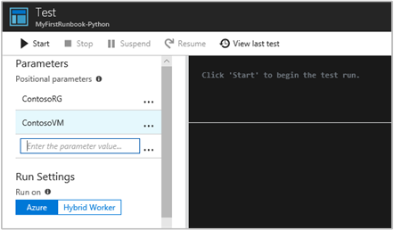

# Tutorial: Create a Python 3.8 runbook

This tutorial walks you through the creation of a [Python 3.8 runbook](../automation-runbook-types.md#python-runbooks) in Azure Automation. Python runbooks compile under Python 2.7 and 3.8 You can directly edit the code of the runbook using the text editor in the Azure portal.

> [!div class="checklist"]
> * Create a simple Python runbook
> * Test and publish the runbook
> * Run and track the status of the runbook job
> * Update the runbook to start an Azure virtual machine with runbook parameters

## Prerequisites

To complete this tutorial, you need:

- An Azure subscription. If you don't have one yet, you can [activate your MSDN subscriber benefits](https://azure.microsoft.com/pricing/member-offers/msdn-benefits-details/) or sign up for a [free account](https://azure.microsoft.com/free/?WT.mc_id=A261C142F).

- An [Automation account](../automation-security-overview.md) to hold the runbook and authenticate to Azure resources using Managed Identities. A managed identity is automatically created for you when you create the Automation account.
 
- An Azure virtual machine. During this tutorial, you'll start and stop this machine, so it shouldn't be a production VM.

## Create a new runbook

You start by creating a simple runbook that outputs the text *Hello World*.

1. In the Azure portal, open your Automation account.

    The Automation account page gives you a quick view of the resources in this account. You should already have some assets. Most of those assets are the modules that are automatically included in a new Automation account.

    You should also have a managed identity enabled that's mentioned in the [prerequisites](#prerequisites). You can verify that by viewing the **Identity** resource under **Account Settings**.

1. Select **Runbooks** under **Process Automation** to open the list of runbooks.

1. Select **Create a runbook** to create a new runbook.

1. Give the runbook the name **MyFirstRunbook-Python**.

1. Select **Python** for the **Runbook type**.

1. Select **Python 3.8** for the **Runtime version**.

1. Select **Create** to create the runbook and open the textual editor.

## Add code to the runbook

Now you add a simple command to print the text `Hello World`.

```python
print("Hello World!")
```

Select **Save** to save the runbook.

## Test the runbook

Before you publish the runbook to make it available in production, you want to test it to make sure that it works properly. When you test a runbook, you run its draft version and view its output interactively.

1. Select **Test pane** to open the **Test** pane.

1. Select **Start** to start the test. This option should be the only enabled option.

1. A [runbook job](../automation-runbook-execution.md) is created and its status displayed.
   The job status starts as **Queued**, indicating that it's waiting for a runbook worker in the cloud to become available. It changes to **Starting** when a worker claims the job, and then **Running** when the runbook actually starts running.

1. When the runbook job completes, its output is displayed. In this case, you should see `Hello World`.

1. Close the **Test** pane to return to the canvas.

## Publish and start the runbook

The runbook that you created is still in draft mode. You need to publish it before you can run it in production. When you publish a runbook, you overwrite the existing published version with the draft version. In this case, you don't have a published version yet because you just created the runbook.

1. Select **Publish** to publish the runbook and then **Yes** when prompted.

1. If you close the  **MyFirstRunbook_python** pane, you are back on the **Runbooks** page where you should see an **Authoring Status** of **Published**.

1. Select the **MyFirstRunbook-Python** name in the list, you'll go back into the **MyFirstRunbook-Python** pane.

   The options across the top allow you to start the runbook, view the runbook, edit the runbook, schedule it to start at some time in the future, and other actions.

1. Select **Start** and then select **OK** when the **Start Runbook** pane opens.

1. A **Job** pane is opened for the runbook job that you created. You can close this pane, but let's keep it open, so that you can watch the job's progress.

1. The job status is shown in **Status** field under **Essentials**. The values here match the status values when you tested the runbook.

1. Once the runbook status shows **Completed**, select the **Output** tab. In the **Output** tab, you can see `Hello World`.

1. Close the **Output** tab.

1. Select **All Logs** tab to view streams for the runbook job. You should only see `Hello World` in the output stream. However, this tab can show other streams for a runbook job, such as **Verbose** and **Error**, if the runbook writes to them.

1. Close the **Jobs** pane to return to the **MyFirstRunbook-Python** pane.

1. Select **Jobs** resource to open the **Jobs** resource page for this runbook. This page lists all jobs created by this runbook. You should only see one job listed since you only ran the job once.

1. You can select this job to open the same **Job** pane that you viewed when you started the runbook. This pane allows you to go back in time and view the details of any job that was created for a particular runbook.

## Add authentication to manage Azure resources

You've tested and published your runbook, but so far it doesn't do anything useful. You want to have it manage Azure resources. To manage resources, the script has to authenticate. 

The recommended way to authenticate is with **managed identity**. When you create an Azure Automation Account, a managed identity is automatically created for you.

To use these samples, [add the following packages](../python-3-packages.md) in the **Python Packages** resource of the Automation Account. You can add the WHL files for these packages with these links.

* [azure-core](https://pypi.org/project/azure-core/#files)
* [azure-identity](https://pypi.org/project/azure-identity/#files)
* [azure-mgmt-compute](https://pypi.org/project/azure-mgmt-compute/#files)
* [azure-mgmt-core](https://pypi.org/project/azure-mgmt-core/#files)
* [msal](https://pypi.org/project/msal/#files)
* [typing-extensions](https://pypi.org/project/typing-extensions/#files)

When you add these packages, select a runtime version that matches your runbook.

> [!NOTE]
> The following code was tested with runtime version 3.8.

### Managed identity

To use managed identity, ensure that it is enabled:

* To verify if the Managed identity is enabled for the Automation account go to your **Automation account** > **Account Settings** > **Identity** and set the **Status** to **On**.
* The managed identity has a role assigned to manage the resource. In this example of managing a virtual machine resource, add the "Virtual Machine Contributor" role on the resource group of that contains the Virtual Machine. For more information, see [Assign Azure roles using the Azure portal](../../role-based-access-control/role-assignments-portal.md)

With the manage identity role configured, you can start adding code.

1. Open the textual editor by selecting **Edit** on the **MyFirstRunbook-Python** pane.

2. Add the following code to authenticate to Azure:

```python
#!/usr/bin/env python3
from azure.identity import DefaultAzureCredential
from azure.mgmt.compute import ComputeManagementClient

SUBSCRIPTION_ID="YOUR_SUBSCRIPTION_ID"

azure_credential = DefaultAzureCredential()

import os
import requests
# printing environment variables
endpoint = os.getenv('IDENTITY_ENDPOINT')+"?resource=https://management.azure.com/"
identityHeader = os.getenv('IDENTITY_HEADER')
payload={}
headers = {
'X-IDENTITY-HEADER' : identityHeader,
'Metadata' : True
}
response = requests.get(endpoint, headers)
print(response.text)
```

## Add code to create Python Compute client and start the VM

To work with Azure VMs, create an instance of the [Azure Compute client for Python](/python/api/azure-mgmt-compute/azure.mgmt.compute.computemanagementclient).

```python
# Initialize client with the credential and subscription.
compute_client = ComputeManagementClient(
    azure_credential,
    SUBSCRIPTION_ID
)

print('\nStart VM')
async_vm_start = compute_client.virtual_machines.begin_start(
    "MyResourceGroup", "TestVM")
async_vm_start.wait()
print('\nFinished start.')
```

Where `MyResourceGroup` is the name of the resource group that contains the VM, and `TestVM` is the name of the VM that you want to start.

Test and run the runbook again to see that it starts the VM.

## Use input parameters

The runbook currently uses hard-coded values for the names of the resource group and the VM. Now let's add code that gets these values from input parameters.

You use the `sys.argv` variable to get the parameter values. Add the following code to the runbook immediately after the other `import` statements:

```python
import sys

resource_group_name = str(sys.argv[1])
vm_name = str(sys.argv[2])
```

This code imports the `sys` module, and creates two variables to hold the resource group and VM names. Notice that the element of the argument list, `sys.argv[0]`, is the name of the script, and isn't input by the user.

Now you can modify the last two lines of the runbook to use the input parameter values instead of using hard-coded values:

```python
async_vm_start = compute_client.virtual_machines.begin_start(
    resource_group_name, vm_name)
async_vm_start.wait()
```

When you start a Python runbook, either from the **Test** pane or as a published runbook, you can enter the values for parameters in the **Start Runbook** page under **Parameters**.

After you start entering a value in the first box, a second appears, and so on, so that you can enter as many parameter values as necessary.

The values are available to the script in the `sys.argv` array as in the code you just added.

Enter the name of your resource group as the value for the first parameter, and the name of the VM to start as the value of the second parameter.



Select **OK** to start the runbook. The runbook runs and starts the VM that you specified.

## Error handling in Python

You can also use the following conventions to retrieve various streams from your Python runbooks, including WARNING, ERROR, and DEBUG streams.

```python
print("Hello World output")
print("ERROR: - Hello world error")
print("WARNING: - Hello world warning")
print("DEBUG: - Hello world debug")
print("VERBOSE: - Hello world verbose")
```

The following example shows this convention used in a `try...except` block.

```python
try:
    raise Exception('one', 'two')
except Exception as detail:
    print ('ERROR: Handling run-time error:', detail)
```

## Next steps

- To learn more about runbook types, their advantages and limitations, see [Azure Automation runbook types](../automation-runbook-types.md).

- To learn about developing for Azure with Python, see [Azure for Python developers](/azure/python/).

- To view sample Python 3 runbooks, see the [Azure Automation GitHub](https://github.com/azureautomation/runbooks/tree/master/Utility/Python) repository.
