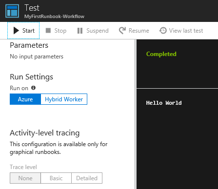
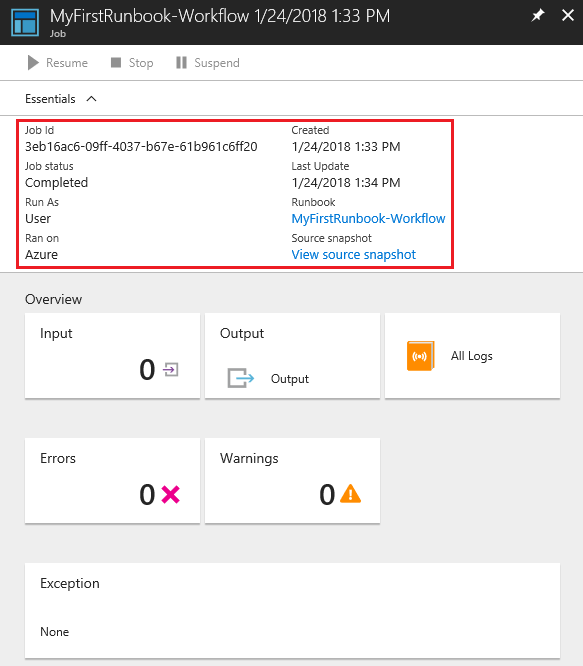
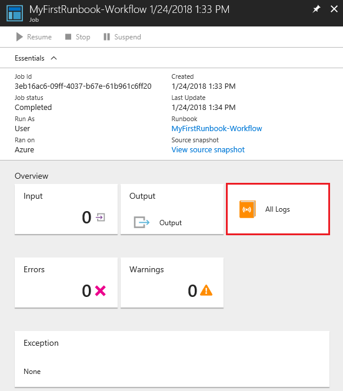
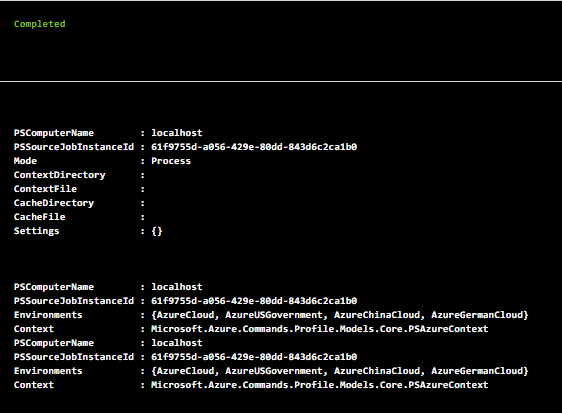
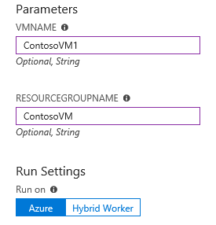

# Tutorial: Create a PowerShell Workflow runbook

This tutorial walks you through the creation of a [PowerShell Workflow runbook](../automation-runbook-types.md#powershell-workflow-runbooks) in Azure Automation. PowerShell Workflow runbooks are text runbooks based on Windows PowerShell Workflow. You can create and edit the code of the runbook using the text editor in the Azure portal. 

> [!div class="checklist"]
> * Create a simple PowerShell Workflow runbook
> * Test and publish the runbook
> * Run and track the status of the runbook job
> * Update the runbook to start an Azure virtual machine with runbook parameters

## Prerequisites

To complete this tutorial, you need:

* Azure subscription. If you don't have one yet, you can [activate your MSDN subscriber benefits](https://azure.microsoft.com/pricing/member-offers/msdn-benefits-details/) or sign up for a [free account](https://azure.microsoft.com/free/?WT.mc_id=A261C142F).
* [Automation account](../automation-offering-get-started.md) to hold the runbook and authenticate to Azure resources. This account must have permission to start and stop the virtual machine.
* An Azure virtual machine. Since you stop and start this machine, it shouldn't be a production VM.

## Step 1 - Create new runbook

Start by creating a simple runbook that outputs the text `Hello World`.

1. In the Azure portal, open your Automation account.

   The Automation account page gives you a quick view of the resources in this account. You should already have some assets. Most of those assets are the modules automatically included in a new Automation account. You should also have the Credential asset associated with your subscription.
 
2. Select **Runbooks** under **Process Automation** to open the list of runbooks.

3. Create a new runbook by selecting **Create a runbook**.

4. Give the runbook the name **MyFirstRunbook-Workflow**.

5. In this case, you're going to create a [PowerShell Workflow runbook](../automation-runbook-types.md#powershell-workflow-runbooks). Select **PowerShell Workflow** for **Runbook type**.

6. Click **Create** to create the runbook and open the textual editor.

## Step 2 - Add code to the runbook

You can either type code directly into the runbook, or you can select cmdlets, runbooks, and assets from the Library control and add them to the runbook with any related parameters. For this tutorial, you type code directly into the runbook.

1. Your runbook is currently empty with only the required `Workflow` keyword, the name of the runbook, and the braces that encase the entire workflow.

   ```powershell-interactive
   Workflow MyFirstRunbook-Workflow
   {
   }
   ```

2. Type `Write-Output "Hello World"` between the braces.

   ```powershell-interactive
   Workflow MyFirstRunbook-Workflow
   {
   Write-Output "Hello World"
   }
   ```

3. Save the runbook by clicking **Save**.

## Step 3 - Test the runbook

Before you publish the runbook to make it available in production, you should test it to make sure that it works properly. Testing a runbook runs its Draft version and allows you to view its output interactively.

1. Select **Test pane** to open the Test pane.

2. Click **Start** to start the test, with testing the only enabled option.

3. Note that a [runbook job](../automation-runbook-execution.md) is created and its status is displayed in the pane.

   The job status starts as Queued, indicating that the job is waiting for a runbook worker in the cloud to become available. The status changes to Starting when a worker claims the job. Finally, the status becomes Running when the runbook actually starts to run.

4. When the runbook job completes, the Test pane displays its output. In this case, you see `Hello World`.

   

5. Close the Test pane to return to the canvas.

## Step 4 - Publish and start the runbook

The runbook that you've created is still in Draft mode. You must publish it before you can run it in production. When you publish a runbook, you overwrite the existing Published version with the Draft version. In this case, you don't have a Published version yet because you just created the runbook.

1. Click **Publish** to publish the runbook and then **Yes** when prompted.

2. Scroll left to view the runbook in the **Runbooks** page and note that the **Authoring Status** field is set to **Published**.

3. Scroll back to the right to view the page for **MyFirstRunbook-Workflow**.

   The options across the top allow you to start the runbook now, schedule a future start time, or create a [webhook](../automation-webhooks.md) so that the runbook can be started through an HTTP call.

4. Select **Start** and then **Yes** when prompted to start the runbook.

   

5. A Job pane is opened for the runbook job that has been created. In this case, leave the pane open so you can watch the job's progress.

6. Note that the job status is shown in **Job Summary**. This status matches the statuses that you saw when testing the runbook.

   

7. Once the runbook status shows Completed, click **Output**. The Output page is opened, where you can see your `Hello World` message.

   

8. Close the Output page.

9. Click **All Logs** to open the Streams pane for the runbook job. You should only see `Hello World` in the output stream. Note that the Streams pane can show other streams for a runbook job, such as verbose and error streams, if the runbook writes to them.

   

10. Close the Streams pane and the Job pane to return to the MyFirstRunbook page.

11. Click **Jobs** under **Resources** to open the Jobs page for this runbook. This page lists all the jobs created by your runbook. You should only see one job listed, since you have run the job only once.

   

12. Click the job name to open the same Job pane that you viewed when you started the runbook. Use this pane to view the details of any job created for the runbook.

## Step 5 - Add authentication to manage Azure resources

You've tested and published your runbook, but so far it doesn't do anything useful. You want to have it manage Azure resources. It can't do that unless it authenticates using the credentials for the subscription. Authentication uses the [Connect-AzAccount](https://docs.microsoft.com/powershell/module/az.accounts/connect-azaccount?view=azps-3.7.0) cmdlet.

>[!NOTE]
>For PowerShell runbooks, `Add-AzAccount` and `Add-AzureRMAccount` are aliases for `Connect-AzAccount`. You can use these cmdlets or you can [update your modules](../automation-update-azure-modules.md) in your Automation account to the latest versions. You might need to update your modules even if you have just created a new Automation account.

1. Navigate to the MyFirstRunbook-Workflow page and open the textual editor by clicking **Edit**.

2. Delete the `Write-Output` line.

3. Position the cursor on a blank line between the braces.

4. Type or copy and paste the following code, which handles the authentication with your Automation Run As account.

   ```powershell-interactive
   # Ensures you do not inherit an AzContext in your runbook
   Disable-AzContextAutosave –Scope Process

   $Conn = Get-AutomationConnection -Name AzureRunAsConnection
   Connect-AzAccount -ServicePrincipal -Tenant $Conn.TenantID `
   -ApplicationId $Conn.ApplicationID -CertificateThumbprint $Conn.CertificateThumbprint

   $AzureContext = Select-AzSubscription -SubscriptionId $Conn.SubscriptionID
   ```

5. Click **Test pane** so that you can test the runbook.

6. Click **Start** to start the test. Once it completes, you should see output similar to the following, displaying basic information from your account. This action confirms that the credential is valid.

   

## Step 6 - Add code to start a virtual machine

Now that your runbook is authenticating to the Azure subscription, you can manage resources. Let's add a command to start a virtual machine. You can pick any VM in your Azure subscription, and for now you're hardcoding that name in the runbook. If you're managing resources across multiple subscriptions, you need to use the `AzContext` parameter with the [Get-AzContext](/powershell/module/az.accounts/get-azcontext) cmdlet.

1. Provide the name and resource group name of the VM to start by entering a call to the [Start-AzVM](https://docs.microsoft.com/powershell/module/Az.Compute/Start-AzVM?view=azps-3.5.0
) cmdlet as shown below. 

   ```powershell-interactive
   workflow MyFirstRunbook-Workflow
   {
   # Ensures that you do not inherit an AzContext in your runbook
   Disable-AzContextAutosave –Scope Process

   $Conn = Get-AutomationConnection -Name AzureRunAsConnection
   Connect-AzAccount -ServicePrincipal -Tenant $Conn.TenantID -ApplicationId $Conn.ApplicationID -CertificateThumbprint $Conn.CertificateThumbprint

   $AzureContext = Get-AzSubscription -SubscriptionId $Conn.SubscriptionID

   Start-AzVM -Name 'VMName' -ResourceGroupName 'ResourceGroupName' -AzContext $AzureContext
   }
   ```

2. Save the runbook and then click **Test pane** so that you can test it.

3. Click **Start** to start the test. Once it completes, check that the VM has been started.

## Step 7 - Add an input parameter to the runbook

Your runbook currently starts the VM that you have hardcoded in the runbook. It will be more useful if you can specify the VM when the runbook is started. Let's add input parameters to the runbook to provide that functionality.

1. Add variables for the `VMName` and `ResourceGroupName` parameters to the runbook, and use the variables with the `Start-AzVM` cmdlet as shown below.

   ```powershell-interactive
   workflow MyFirstRunbook-Workflow
   {
    Param(
     [string]$VMName,
     [string]$ResourceGroupName
    )
   # Ensures you do not inherit an AzContext in your runbook
   Disable-AzContextAutosave –Scope Process

   $Conn = Get-AutomationConnection -Name AzureRunAsConnection
   Connect-AzAccount -ServicePrincipal -Tenant $Conn.TenantID -ApplicationId $Conn.ApplicationID -CertificateThumbprint $Conn.CertificateThumbprint
   Start-AzVM -Name $VMName -ResourceGroupName $ResourceGroupName
   }
   ```

2. Save the runbook and open the Test pane. You can now provide values for the two input variables that are in the test.

3. Close the Test pane.

4. Click **Publish** to publish the new version of the runbook.

5. Stop the VM that you have started.

6. Click **Start** to start the runbook. 

7. Type in the values for **VMNAME** and **RESOURCEGROUPNAME** for the VM that you're going to start.

   

8. When the runbook completes, verify that the VM has started.

## Next steps

* For more information on PowerShell, including language reference and learning modules, refer to the [PowerShell Docs](https://docs.microsoft.com/powershell/scripting/overview).
* For a PowerShell cmdlet reference, see [Az.Automation](https://docs.microsoft.com/powershell/module/az.automation/?view=azps-3.7.0#automation
).
* To get started with graphical runbooks, see [Create a graphical runbook](automation-tutorial-runbook-graphical.md).
* To get started with PowerShell runbooks, see [Create a PowerShell runbook](automation-tutorial-runbook-textual-powershell.md).
* To learn more about runbook types and their advantages and limitations, see [Azure Automation runbook types](../automation-runbook-types.md).
* For more information on PowerShell script support features, see [Native PowerShell script support in Azure Automation](https://azure.microsoft.com/blog/announcing-powershell-script-support-azure-automation-2/).