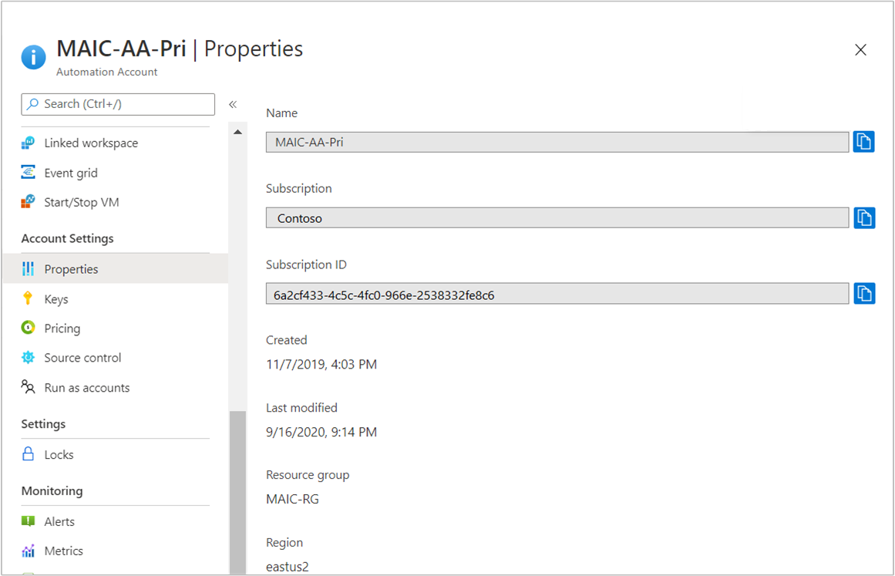
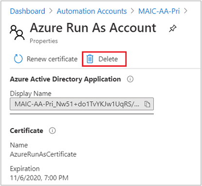
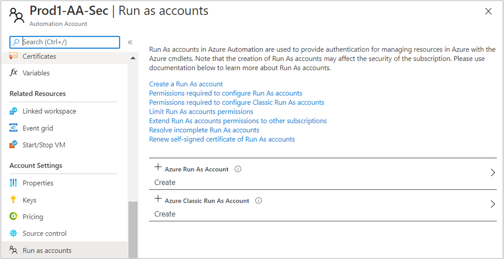
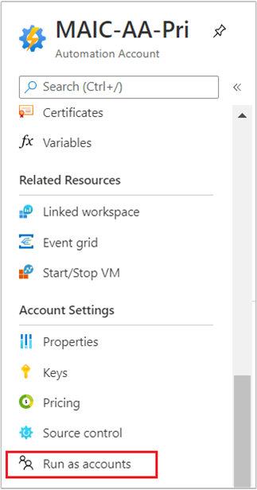
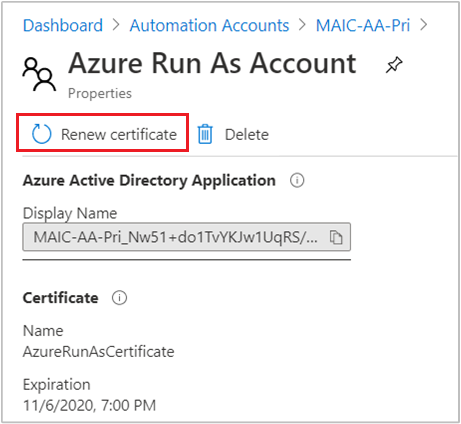
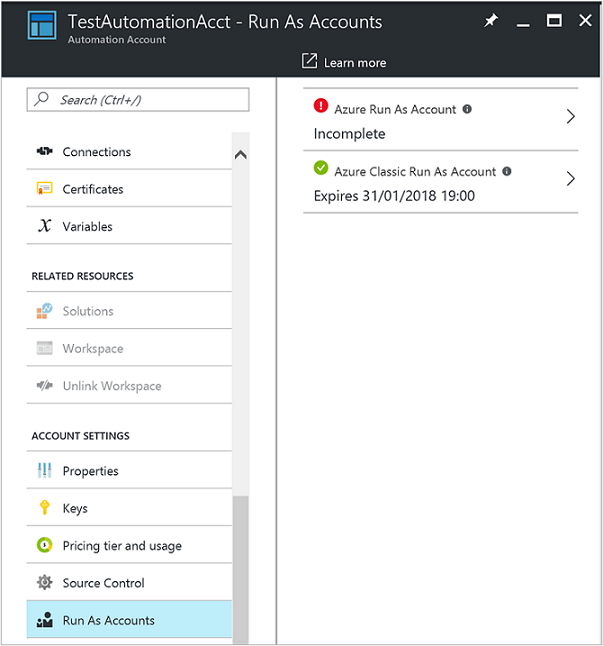

# Manage an Azure Automation Run As account

Run As accounts in Azure Automation provide authentication for managing resources in Azure using the Azure cmdlets. When you create a Run As account, it creates a new service principal user in Azure Active Directory (AD) and assigns the Contributor role to this user at the subscription level.

## Types of Run As accounts

Azure Automation uses two types of Run As accounts:

* Azure Run As account
* Azure Classic Run As account

>[!NOTE]
>Azure Cloud Solution Provider (CSP) subscriptions support only the Azure Resource Manager model. Non-Azure Resource Manager services are not available in the program. When you are using a CSP subscription, the Azure Classic Run As account is not created, but the Azure Run As account is created. To learn more about CSP subscriptions, see [Available services in CSP subscriptions](https://docs.microsoft.com/azure/cloud-solution-provider/overview/azure-csp-available-services).

The service principal for a Run as Account does not have permissions to read Azure AD by default. If you want to add permissions to read or manage Azure AD, you'll need to grant the permissions on the service principal under **API permissions**. To learn more, see [Add permissions to access web APIs](../active-directory/develop/quickstart-configure-app-access-web-apis.md#add-permissions-to-access-web-apis).

### Run As account

The Run As account manages [Resource Manager deployment model](../azure-resource-manager/management/deployment-models.md) resources. It does the following tasks.

* Creates an Azure AD application with a self-signed certificate, creates a service principal account for the application in Azure AD, and assigns the Contributor role for the account in your current subscription. You can change the certificate setting to Owner or any other role. For more information, see [Role-based access control in Azure Automation](automation-role-based-access-control.md).
  
* Creates an Automation certificate asset named `AzureRunAsCertificate` in the specified Automation account. The certificate asset holds the certificate private key that the Azure AD application uses.
  
* Creates an Automation connection asset named `AzureRunAsConnection` in the specified Automation account. The connection asset holds the application ID, tenant ID, subscription ID, and certificate thumbprint.

### Azure Classic Run As Account

The Azure Classic Run As account manages [Classic deployment model](../azure-resource-manager/management/deployment-models.md) resources. You must be a co-administrator on the subscription to create or renew this type of account.

The Azure Classic Run As account performs the following tasks.

  * Creates a management certificate in the subscription.

  * Creates an Automation certificate asset named `AzureClassicRunAsCertificate` in the specified Automation account. The certificate asset holds the certificate private key used by the management certificate.

  * Creates an Automation connection asset named `AzureClassicRunAsConnection` in the specified Automation account. The connection asset holds the subscription name, subscription ID, and certificate asset name.

>[!NOTE]
>Azure Classic Run As account is not created by default at the same time when you create an Automation account. This account is created individually following the steps described later in this article.

## <a name="permissions"></a>Obtain Run As account permissions

This section defines permissions for both regular Run As accounts and Classic Run As accounts.

### Get permissions to configure Run As accounts

To create or update a Run As account, you must have specific privileges and permissions. An Application administrator in Azure Active Directory and an Owner in a subscription can complete all the tasks. In a situation where you have separation of duties, the following table shows a listing of the tasks, the equivalent cmdlet, and permissions needed:

|Task|Cmdlet  |Minimum Permissions  |Where you set the permissions|
|---|---------|---------|---|
|Create Azure AD Application|[New-AzADApplication](https://docs.microsoft.com/powershell/module/az.resources/new-azadapplication)     | Application Developer role<sup>1</sup>        |[Azure AD](../active-directory/develop/howto-create-service-principal-portal.md#required-permissions)</br>Home > Azure AD > App Registrations |
|Add a credential to the application.|[New-AzADAppCredential](https://docs.microsoft.com/powershell/module/az.resources/new-azadappcredential)     | Application Administrator or Global Administrator<sup>1</sup>         |[Azure AD](../active-directory/develop/howto-create-service-principal-portal.md#required-permissions)</br>Home > Azure AD > App Registrations|
|Create and get an Azure AD service principal|[New-AzADServicePrincipal](https://docs.microsoft.com/powershell/module/az.resources/new-azadserviceprincipal)</br>[Get-AzADServicePrincipal](https://docs.microsoft.com/powershell/module/az.resources/get-azadserviceprincipal)     | Application Administrator or Global Administrator<sup>1</sup>        |[Azure AD](../active-directory/develop/howto-create-service-principal-portal.md#required-permissions)</br>Home > Azure AD > App Registrations|
|Assign or get the RBAC role for the specified principal|[New-AzRoleAssignment](https://docs.microsoft.com/powershell/module/az.resources/new-azroleassignment)</br>[Get-AzRoleAssignment](https://docs.microsoft.com/powershell/module/Az.Resources/Get-AzRoleAssignment)      | User Access Administrator or Owner, or have the following permissions:</br></br><code>Microsoft.Authorization/Operations/read</br>Microsoft.Authorization/permissions/read</br>Microsoft.Authorization/roleDefinitions/read</br>Microsoft.Authorization/roleAssignments/write</br>Microsoft.Authorization/roleAssignments/read</br>Microsoft.Authorization/roleAssignments/delete</code></br></br> | [Subscription](../role-based-access-control/role-assignments-portal.md)</br>Home > Subscriptions > \<subscription name\> - Access Control (IAM)|
|Create or remove an Automation certificate|[New-AzAutomationCertificate](https://docs.microsoft.com/powershell/module/Az.Automation/New-AzAutomationCertificate)</br>[Remove-AzAutomationCertificate](https://docs.microsoft.com/powershell/module/az.automation/remove-azautomationcertificate)     | Contributor on resource group         |Automation account resource group|
|Create or remove an Automation connection|[New-AzAutomationConnection](https://docs.microsoft.com/powershell/module/az.automation/new-azautomationconnection)</br>[Remove-AzAutomationConnection](https://docs.microsoft.com/powershell/module/az.automation/remove-azautomationconnection)|Contributor on resource group |Automation account resource group|

<sup>1</sup> Non-administrator users in your Azure AD tenant can [register AD applications](../active-directory/develop/howto-create-service-principal-portal.md#required-permissions) if the Azure AD tenant's **Users can register applications** option on the User settings page is set to **Yes**. If the application registration setting is **No**, the user performing this action must be as defined in this table.

If you aren't a member of the subscription's Active Directory instance before you're added to the Global Administrator role of the subscription, you're added as a guest. In this situation, you receive a `You do not have permissions to create…` warning on the Add Automation Account page. 

If you are a member of the subscription's Active Directory instance when the Global Administrator role is assigned, you can also receive a `You do not have permissions to create…` warning on the Add Automation Account page. In this case, you can request removal from the subscription's Active Directory instance and then request to be re-added, so that you become a full user in Active Directory.

To verify that the situation producing the error message has been remedied:

1. From the Azure Active Directory pane in the Azure portal, select **Users and groups**. 
2. Select **All users**.
3. Choose your name, then select **Profile**. 
4. Ensure that the value of the **User type** attribute under your user's profile is not set to **Guest**.

### <a name="permissions-classic"></a>Get permissions to configure Classic Run As accounts

To configure or renew Classic Run As accounts, you must have the Co-administrator role at the subscription level. To learn more about classic subscription permissions, see [Azure classic subscription administrators](../role-based-access-control/classic-administrators.md#add-a-co-administrator).

## Create a Run As account in Azure portal

Perform the following steps to update your Azure Automation account in the Azure portal. Create the Run As and Classic Run As accounts individually. If you don't need to manage classic resources, you can just create the Azure Run As account.

1. Log in to the Azure portal with an account that is a member of the Subscription Admins role and co-administrator of the subscription.
2. Search for and select **Automation Accounts**.
3. On the Automation Accounts page, select your Automation account from the list.
4. In the left pane, select **Run As Accounts** in the account settings section.
5. Depending on which account you require, select either **Azure Run As Account** or **Azure Classic Run As Account**. 
6. Depending on the account of interest, use the **Add Azure Run As** or **Add Azure Classic Run As Account** pane. After reviewing the overview information, click **Create**.
6. While Azure creates the Run As account, you can track the progress under **Notifications** from the menu. A banner is also displayed stating that the account is being created. The process can take a few minutes to complete.

## Create a Run As account using PowerShell

The following list provides the requirements to create a Run As account in PowerShell. These requirements apply to both types of Run As accounts.

* Windows 10 or Windows Server 2016 with Azure Resource Manager modules 3.4.1 and later. The PowerShell script doesn't support earlier versions of Windows.
* Azure PowerShell 1.0 and later. For information about the PowerShell 1.0 release, see [How to install and configure Azure PowerShell](/powershell/azureps-cmdlets-docs).
* An Automation account, which is referenced as the value for the `AutomationAccountName` and `ApplicationDisplayName` parameters.
* Permissions equivalent to the ones listed in [Required permissions to configure Run As accounts](#permissions).

To get the values for `SubscriptionId`, `ResourceGroupName`, and  , which is required parameters for the PowerShell script, complete the next steps.

1. In the Azure portal, select **Automation Accounts**.
1. On the Automation Accounts page, select your Automation account.
1. In the account settings section, select **Properties**.
1. Note the values for **NAME**, **SUBSCRIPTION ID**, and **RESOURCE GROUP** on the Properties page. These values correspond to the values for the `AutomationAccountName`, `SubscriptionId`, and `ResourceGroupName` PowerShell script parameters, respectively.

   

### PowerShell script to create a Run As account

This section provides a PowerShell script to create a Run As account. The script includes support for several configurations.

* Create a Run As account by using a self-signed certificate.
* Create a Run As account and a Classic Run As account by using a self-signed certificate.
* Create a Run As account and a Classic Run As account by using a certificate issued by your enterprise certification authority (CA).
* Create a Run As account and a Classic Run As account by using a self-signed certificate in the Azure Government cloud.

The script uses multiple Azure Resource Manager cmdlets to create resources. For the cmdlets and the permissions they require, see [Get permissions to configure Run As accounts](#get-permissions-to-configure-run-as-accounts).

Save the script on your computer using the filename **New-RunAsAccount.ps1**.

```powershell
#Requires -RunAsAdministrator
Param (
    [Parameter(Mandatory = $true)]
    [String] $ResourceGroup,

    [Parameter(Mandatory = $true)]
    [String] $AutomationAccountName,

    [Parameter(Mandatory = $true)]
    [String] $ApplicationDisplayName,

    [Parameter(Mandatory = $true)]
    [String] $SubscriptionId,

    [Parameter(Mandatory = $true)]
    [Boolean] $CreateClassicRunAsAccount,

    [Parameter(Mandatory = $true)]
    [String] $SelfSignedCertPlainPassword,

    [Parameter(Mandatory = $false)]
    [string] $EnterpriseCertPathForRunAsAccount,

    [Parameter(Mandatory = $false)]
    [String] $EnterpriseCertPlainPasswordForRunAsAccount,

    [Parameter(Mandatory = $false)]
    [String] $EnterpriseCertPathForClassicRunAsAccount,

    [Parameter(Mandatory = $false)]
    [String] $EnterpriseCertPlainPasswordForClassicRunAsAccount,

    [Parameter(Mandatory = $false)]
    [ValidateSet("AzureCloud", "AzureUSGovernment")]
    [string]$EnvironmentName = "AzureCloud",

    [Parameter(Mandatory = $false)]
    [int] $SelfSignedCertNoOfMonthsUntilExpired = 12
)

function CreateSelfSignedCertificate([string] $certificateName, [string] $selfSignedCertPlainPassword,
    [string] $certPath, [string] $certPathCer, [string] $selfSignedCertNoOfMonthsUntilExpired ) {
    $Cert = New-SelfSignedCertificate -DnsName $certificateName -CertStoreLocation cert:\LocalMachine\My `
        -KeyExportPolicy Exportable -Provider "Microsoft Enhanced RSA and AES Cryptographic Provider" `
        -NotAfter (Get-Date).AddMonths($selfSignedCertNoOfMonthsUntilExpired) -HashAlgorithm SHA256

    $CertPassword = ConvertTo-SecureString $selfSignedCertPlainPassword -AsPlainText -Force
    Export-PfxCertificate -Cert ("Cert:\localmachine\my\" + $Cert.Thumbprint) -FilePath $certPath -Password $CertPassword -Force | Write-Verbose
    Export-Certificate -Cert ("Cert:\localmachine\my\" + $Cert.Thumbprint) -FilePath $certPathCer -Type CERT | Write-Verbose
}

function CreateServicePrincipal([System.Security.Cryptography.X509Certificates.X509Certificate2] $PfxCert, [string] $applicationDisplayName) {
    $keyValue = [System.Convert]::ToBase64String($PfxCert.GetRawCertData())
    $keyId = (New-Guid).Guid

    # Create an Azure AD application, AD App Credential, AD ServicePrincipal

    # Requires Application Developer Role, but works with Application administrator or GLOBAL ADMIN
    $Application = New-AzADApplication -DisplayName $ApplicationDisplayName -HomePage ("http://" + $applicationDisplayName) -IdentifierUris ("http://" + $keyId)
    # Requires Application administrator or GLOBAL ADMIN
    $ApplicationCredential = New-AzADAppCredential -ApplicationId $Application.ApplicationId -CertValue $keyValue -StartDate $PfxCert.NotBefore -EndDate $PfxCert.NotAfter
    # Requires Application administrator or GLOBAL ADMIN
    $ServicePrincipal = New-AzADServicePrincipal -ApplicationId $Application.ApplicationId
    $GetServicePrincipal = Get-AzADServicePrincipal -ObjectId $ServicePrincipal.Id

    # Sleep here for a few seconds to allow the service principal application to become active (ordinarily takes a few seconds)
    Sleep -s 15
    # Requires User Access Administrator or Owner.
    $NewRole = New-AzRoleAssignment -RoleDefinitionName Contributor -ServicePrincipalName $Application.ApplicationId -ErrorAction SilentlyContinue
    $Retries = 0;
    While ($NewRole -eq $null -and $Retries -le 6) {
        Sleep -s 10
        New-AzRoleAssignment -RoleDefinitionName Contributor -ServicePrincipalName $Application.ApplicationId | Write-Verbose -ErrorAction SilentlyContinue
        $NewRole = Get-AzRoleAssignment -ServicePrincipalName $Application.ApplicationId -ErrorAction SilentlyContinue
        $Retries++;
    }
    return $Application.ApplicationId.ToString();
}

function CreateAutomationCertificateAsset ([string] $resourceGroup, [string] $automationAccountName, [string] $certifcateAssetName, [string] $certPath, [string] $certPlainPassword, [Boolean] $Exportable) {
    $CertPassword = ConvertTo-SecureString $certPlainPassword -AsPlainText -Force
    Remove-AzAutomationCertificate -ResourceGroupName $resourceGroup -AutomationAccountName $automationAccountName -Name $certifcateAssetName -ErrorAction SilentlyContinue
    New-AzAutomationCertificate -ResourceGroupName $resourceGroup -AutomationAccountName $automationAccountName -Path $certPath -Name $certifcateAssetName -Password $CertPassword -Exportable:$Exportable  | write-verbose
}

function CreateAutomationConnectionAsset ([string] $resourceGroup, [string] $automationAccountName, [string] $connectionAssetName, [string] $connectionTypeName, [System.Collections.Hashtable] $connectionFieldValues ) {
    Remove-AzAutomationConnection -ResourceGroupName $resourceGroup -AutomationAccountName $automationAccountName -Name $connectionAssetName -Force -ErrorAction SilentlyContinue
    New-AzAutomationConnection -ResourceGroupName $ResourceGroup -AutomationAccountName $automationAccountName -Name $connectionAssetName -ConnectionTypeName $connectionTypeName -ConnectionFieldValues $connectionFieldValues
}

Import-Module AzureRm.Profile
Import-Module AzureRm.Resources

$AureRmProfileVersion = (Get-Module AzureRm.Profile).Version
if (!(($AzureRmProfileVersion.Major -ge 3 -and $AzureRmProfileVersion.Minor -ge 4) -or ($AzureRmProfileVersion.Major -gt 3))) {
    Write-Error -Message "Please install the latest Azure PowerShell and retry. Relevant doc url : https://docs.microsoft.com/powershell/azureps-cmdlets-docs/ "
    return
}

# To use the new Az modules to create your Run As accounts, please uncomment the following lines and ensure you comment out the previous 8 lines that import the AzureRM modules to avoid any issues. To learn about about using Az modules in your Automation account see https://docs.microsoft.com/azure/automation/az-modules.

# Import-Module Az.Automation
# Enable-AzureRmAlias


Connect-AzAccount -Environment $EnvironmentName
$Subscription = Get-AzSubscription -SubscriptionId $SubscriptionId | Set-AzContext

# Create a Run As account by using a service principal
$CertifcateAssetName = "AzureRunAsCertificate"
$ConnectionAssetName = "AzureRunAsConnection"
$ConnectionTypeName = "AzureServicePrincipal"

if ($EnterpriseCertPathForRunAsAccount -and $EnterpriseCertPlainPasswordForRunAsAccount) {
    $PfxCertPathForRunAsAccount = $EnterpriseCertPathForRunAsAccount
    $PfxCertPlainPasswordForRunAsAccount = $EnterpriseCertPlainPasswordForRunAsAccount
}
else {
    $CertificateName = $AutomationAccountName + $CertifcateAssetName
    $PfxCertPathForRunAsAccount = Join-Path $env:TEMP ($CertificateName + ".pfx")
    $PfxCertPlainPasswordForRunAsAccount = $SelfSignedCertPlainPassword
    $CerCertPathForRunAsAccount = Join-Path $env:TEMP ($CertificateName + ".cer")
    CreateSelfSignedCertificate $CertificateName $PfxCertPlainPasswordForRunAsAccount $PfxCertPathForRunAsAccount $CerCertPathForRunAsAccount $SelfSignedCertNoOfMonthsUntilExpired
}

# Create a service principal
$PfxCert = New-Object -TypeName System.Security.Cryptography.X509Certificates.X509Certificate2 -ArgumentList @($PfxCertPathForRunAsAccount, $PfxCertPlainPasswordForRunAsAccount)
$ApplicationId = CreateServicePrincipal $PfxCert $ApplicationDisplayName

# Create the Automation certificate asset
CreateAutomationCertificateAsset $ResourceGroup $AutomationAccountName $CertifcateAssetName $PfxCertPathForRunAsAccount $PfxCertPlainPasswordForRunAsAccount $true

# Populate the ConnectionFieldValues
$SubscriptionInfo = Get-AzSubscription -SubscriptionId $SubscriptionId
$TenantID = $SubscriptionInfo | Select TenantId -First 1
$Thumbprint = $PfxCert.Thumbprint
$ConnectionFieldValues = @{"ApplicationId" = $ApplicationId; "TenantId" = $TenantID.TenantId; "CertificateThumbprint" = $Thumbprint; "SubscriptionId" = $SubscriptionId}

# Create an Automation connection asset named AzureRunAsConnection in the Automation account. This connection uses the service principal.
CreateAutomationConnectionAsset $ResourceGroup $AutomationAccountName $ConnectionAssetName $ConnectionTypeName $ConnectionFieldValues

if ($CreateClassicRunAsAccount) {
    # Create a Run As account by using a service principal
    $ClassicRunAsAccountCertifcateAssetName = "AzureClassicRunAsCertificate"
    $ClassicRunAsAccountConnectionAssetName = "AzureClassicRunAsConnection"
    $ClassicRunAsAccountConnectionTypeName = "AzureClassicCertificate "
    $UploadMessage = "Please upload the .cer format of #CERT# to the Management store by following the steps below." + [Environment]::NewLine +
    "Log in to the Microsoft Azure portal (https://portal.azure.com) and select Subscriptions -> Management Certificates." + [Environment]::NewLine +
    "Then click Upload and upload the .cer format of #CERT#"

    if ($EnterpriseCertPathForClassicRunAsAccount -and $EnterpriseCertPlainPasswordForClassicRunAsAccount ) {
        $PfxCertPathForClassicRunAsAccount = $EnterpriseCertPathForClassicRunAsAccount
        $PfxCertPlainPasswordForClassicRunAsAccount = $EnterpriseCertPlainPasswordForClassicRunAsAccount
        $UploadMessage = $UploadMessage.Replace("#CERT#", $PfxCertPathForClassicRunAsAccount)
    }
    else {
        $ClassicRunAsAccountCertificateName = $AutomationAccountName + $ClassicRunAsAccountCertifcateAssetName
        $PfxCertPathForClassicRunAsAccount = Join-Path $env:TEMP ($ClassicRunAsAccountCertificateName + ".pfx")
        $PfxCertPlainPasswordForClassicRunAsAccount = $SelfSignedCertPlainPassword
        $CerCertPathForClassicRunAsAccount = Join-Path $env:TEMP ($ClassicRunAsAccountCertificateName + ".cer")
        $UploadMessage = $UploadMessage.Replace("#CERT#", $CerCertPathForClassicRunAsAccount)
        CreateSelfSignedCertificate $ClassicRunAsAccountCertificateName $PfxCertPlainPasswordForClassicRunAsAccount $PfxCertPathForClassicRunAsAccount $CerCertPathForClassicRunAsAccount $SelfSignedCertNoOfMonthsUntilExpired
    }
    
    # Create the Automation certificate asset
    CreateAutomationCertificateAsset $ResourceGroup $AutomationAccountName $ClassicRunAsAccountCertifcateAssetName $PfxCertPathForClassicRunAsAccount $PfxCertPlainPasswordForClassicRunAsAccount $false

    # Populate the ConnectionFieldValues
    $SubscriptionName = $subscription.Name
    $ClassicRunAsAccountConnectionFieldValues = @{"SubscriptionName" = $SubscriptionName; "SubscriptionId" = $SubscriptionId; "CertificateAssetName" = $ClassicRunAsAccountCertifcateAssetName}

    # Create an Automation connection asset named AzureRunAsConnection in the Automation account. This connection uses the service principal.
    CreateAutomationConnectionAsset $ResourceGroup $AutomationAccountName $ClassicRunAsAccountConnectionAssetName $ClassicRunAsAccountConnectionTypeName   $ClassicRunAsAccountConnectionFieldValues

    Write-Host -ForegroundColor red       $UploadMessage
}
```

>[!NOTE]
>`Add-AzAccount` and `Add-AzureRMAccount` are aliases for [Connect-AzAccount](https://docs.microsoft.com/powershell/module/az.accounts/connect-azaccount?view=azps-3.5.0). You can use these cmdlets or you can [update your modules](automation-update-azure-modules.md) in your Automation account to the latest versions. You might need to update your modules even if you have just created a new Automation account.

### Execute the PowerShell script

1. On your computer, start **Windows PowerShell** from the **Start** screen with elevated user rights.
1. From the elevated command line shell, go to the folder that contains your script.
1. Execute the script by using the parameter values for the configuration that you require.
1. If creating a Classic Run As account, after the script is executed, upload the public certificate (**.cer** filename extension) to the management store for the subscription in which the Automation account has been created.

After the script has executed, you're prompted to authenticate with Azure. Sign in with an account that's a member of the subscription administrators role and co-administrator of the subscription.

#### Create a Run As account by using a self-signed certificate

```powershell
.\New-RunAsAccount.ps1 -ResourceGroup <ResourceGroupName> -AutomationAccountName <NameofAutomationAccount> -SubscriptionId <SubscriptionId> -ApplicationDisplayName <DisplayNameofAADApplication> -SelfSignedCertPlainPassword <StrongPassword> -CreateClassicRunAsAccount $false
```

#### Create a Run As account and a Classic Run As account by using a self-signed certificate

```powershell
.\New-RunAsAccount.ps1 -ResourceGroup <ResourceGroupName> -AutomationAccountName <NameofAutomationAccount> -SubscriptionId <SubscriptionId> -ApplicationDisplayName <DisplayNameofAADApplication> -SelfSignedCertPlainPassword <StrongPassword> -CreateClassicRunAsAccount $true
```

#### Create a Run As account and a Classic Run As account by using an enterprise certificate

```powershell
.\New-RunAsAccount.ps1 -ResourceGroup <ResourceGroupName> -AutomationAccountName <NameofAutomationAccount> -SubscriptionId <SubscriptionId> -ApplicationDisplayName <DisplayNameofAADApplication>  -SelfSignedCertPlainPassword <StrongPassword> -CreateClassicRunAsAccount $true -EnterpriseCertPathForRunAsAccount <EnterpriseCertPfxPathForRunAsAccount> -EnterpriseCertPlainPasswordForRunAsAccount <StrongPassword> -EnterpriseCertPathForClassicRunAsAccount <EnterpriseCertPfxPathForClassicRunAsAccount> -EnterpriseCertPlainPasswordForClassicRunAsAccount <StrongPassword>
```

If you've created a Classic Run As account with an enterprise public certificate (**.cer** file), use this certificate. See [Uploading a management API certificate to the Azure portal](../azure-api-management-certs.md).

#### Create a Run As account and a Classic Run As account by using a self-signed certificate in the Azure Government cloud

```powershell
.\New-RunAsAccount.ps1 -ResourceGroup <ResourceGroupName> -AutomationAccountName <NameofAutomationAccount> -SubscriptionId <SubscriptionId> -ApplicationDisplayName <DisplayNameofAADApplication> -SelfSignedCertPlainPassword <StrongPassword> -CreateClassicRunAsAccount $true  -EnvironmentName AzureUSGovernment
```

If you've created a Classic Run As account with a self-signed public certificate (**.cer** file), the script creates and saves it to the temporary files folder on your computer. It can be found in the user profile `%USERPROFILE%\AppData\Local\Temp`, which you used to execute the PowerShell session.

## Delete a Run As or Classic Run As account

This section describes how to delete a Run As or Classic Run As account. When you perform this action, the Automation account is retained. After you delete the account, you can re-create it in the Azure portal.

1. In the Azure portal, open the Automation account.

2. In the left pane, select **Run As Accounts** in the account settings section.

3. On the Run As Accounts properties page, select either the Run As account or Classic Run As account that you want to delete. 

4. On the Properties pane for the selected account, click **Delete**.

   

5. While the account is being deleted, you can track the progress under **Notifications** from the menu.

6. After the account has been deleted, you can re-create it on the Run As Accounts properties page by selecting the create option **Azure Run As Account**.

   

## <a name="cert-renewal"></a>Renew a self-signed certificate

The self-signed certificate that you have created for the Run As account expires one year from the date of creation. At some point before your Run As account expires, you must renew the certificate. You can renew it any time before it expires. 

When you renew the self-signed certificate, the current valid certificate is retained to ensure that any runbooks that are queued up or actively running, and that authenticate with the Run As account, aren't negatively affected. The certificate remains valid until its expiration date.

>[!NOTE]
>If you think that the Run As account has been compromised, you can delete and re-create the self-signed certificate.

>[!NOTE]
>If you have configured your Run As account to use a certificate issued by your enterprise certificate authority and you use the option to renew a self-signed certificate option, the enterprise certificate is replaced by a self-signed certificate.

Use the following steps to renew the self-signed certificate.

1. In the Azure portal, open the Automation account.

1. Select **Run As Accounts** in the account settings section.

    

1. On the Run As Accounts properties page, select either the Run As account or the Classic Run As account for which to renew the certificate.

1. On the properties pane for the selected account, click **Renew certificate**.

    

1. While the certificate is being renewed, you can track the progress under **Notifications** from the menu.

## <a name="auto-cert-renewal"></a>Set up automatic certificate renewal with an automation runbook

To renew certificates automatically, you can use an automation runbook. This script on [GitHub](https://github.com/ikanni/PowerShellScripts/blob/master/AzureAutomation/RunAsAccount/GrantPermissionToRunAsAccountAADApplication-ToRenewCertificateItself-CreateSchedule.ps1) enables this functionality in your
Automation account.

>[!NOTE]
>You must be a Global Administrator or Company Administrator in Azure AD to execute the script.

This script creates a weekly schedule to renew Run As account certificates. It adds an **Update-AutomationRunAsCredential** runbook to your Automation account. You can view the runbook code on GitHub, in the script [Update-AutomationRunAsCredential.ps1](https://github.com/azureautomation/runbooks/blob/master/Utility/ARM/Update-AutomationRunAsCredential.ps1). You can use the PowerShell code in the file to renew certificates manually, as needed.

Use the following steps to test the renewal process immediately.

1. Edit the **Update-AutomationRunAsCredential** runbook and place a comment character (#) on line 122, in front of the **Exit(1)** command.

   ```powershell
   #Exit(1)
   ```

2. Publish the runbook.
3. Start the runbook.
4. Verify successful renewal with the following code:

   ```powershell
   (Get-AzAutomationCertificate -AutomationAccountName TestAA
                                -Name AzureRunAsCertificate
                                -ResourceGroupName TestAutomation).ExpiryTime.DateTime
   ```
    Output:

   ```Output
   Thursday, November 7, 2019 7:00:00 PM
   ```

5. After the test, edit the runbook, and remove the comment character that you added in step 1.
6. Publish the runbook.

## Limit Run As account permissions

To control the targeting of Automation against resources in Azure, you can run the [Update-AutomationRunAsAccountRoleAssignments.ps1](https://aka.ms/AA5hug8) script. This script changes your existing Run As account service principal to create and use a custom role definition. The role has permissions for all resources except [Key Vault](https://docs.microsoft.com/azure/key-vault/).

>[!IMPORTANT]
>After you run the **Update-AutomationRunAsAccountRoleAssignments.ps1** script, runbooks that access Key Vault through the use of Run As accounts no longer work. Before running the script, you should review runbooks in your account for calls to Azure Key Vault. To enable access to Key Vault from Azure Automation runbooks, you must [add the Run As account to Key Vault's permissions](#add-permissions-to-key-vault).

If you need to restrict,  further what the Run As service principal can do, you can add other resource types to the `NotActions` element of the custom role definition. The following example restricts access to `Microsoft.Compute/*`. If you add this resource type to `NotActions` for the role definition, the role will not be able to access any Compute resource. To learn more about role definitions, see [Understand role definitions for Azure resources](../role-based-access-control/role-definitions.md).

```powershell
$roleDefinition = Get-AzRoleDefinition -Name 'Automation RunAs Contributor'
$roleDefinition.NotActions.Add("Microsoft.Compute/*")
$roleDefinition | Set-AzRoleDefinition
```

You can determine if the service principal used by your Run As account is in the Contributor role definition or a custom one. 

1. Go to your Automation account and select **Run As Accounts** in the account settings section.
2. Select **Azure Run As Account**. 
3. Select **Role** to locate the role definition that is being used.

[](media/manage-runas-account/verify-role-expanded.png#lightbox)

You can also determine the role definition used by the Run As accounts for multiple subscriptions or Automation accounts. Do this by using the [Check-AutomationRunAsAccountRoleAssignments.ps1](https://aka.ms/AA5hug5) script in the PowerShell Gallery.

### Add permissions to Key Vault

You can allow Azure Automation to verify if Key Vault and your Run As account service principal are using a custom role definition. You must:

* Grant permissions to Key Vault.
* Set the access policy.

You can use the [Extend-AutomationRunAsAccountRoleAssignmentToKeyVault.ps1](https://aka.ms/AA5hugb) script in the PowerShell Gallery to give your Run As account permissions to Key Vault. See [Grant applications access to a key vault](../key-vault/general/group-permissions-for-apps.md) for more details on setting permissions on Key Vault.

## Resolve misconfiguration issues for Run As accounts

Some configuration items necessary for a Run As or Classic Run As account might have been deleted or created improperly during initial setup. Possible instances of misconfiguration include:

* Certificate asset
* Connection asset
* Run As account removed from the Contributor role
* Service principal or application in Azure AD

For such misconfiguration instances, the Automation account detects the changes and displays a status of *Incomplete* on the Run As Accounts properties pane for the account.



When you select the Run As account, the account properties pane displays the following error message:

```text
The Run As account is incomplete. Either one of these was deleted or not created - Azure Active Directory Application, Service Principal, Role, Automation Certificate asset, Automation Connect asset - or the Thumbprint is not identical between Certificate and Connection. Please delete and then re-create the Run As Account.
```

You can quickly resolve these Run As account issues by deleting and re-creating the account.

## Next steps

* [Application Objects and Service Principal Objects](../active-directory/develop/app-objects-and-service-principals.md).
* [Certificates overview for Azure Cloud Services](../cloud-services/cloud-services-certs-create.md).
