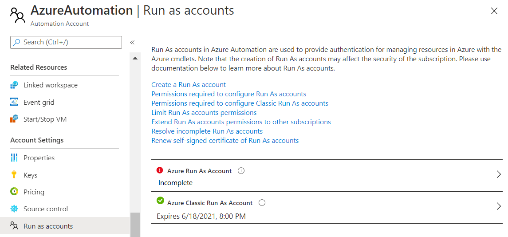

# Manage an Azure Automation Run As account

Run As accounts in Azure Automation provide authentication for managing resources on the Azure Resource Manager or Azure Classic deployment model using Automation runbooks and other Automation features. This article provides guidance on how to manage a Run As or Classic Run As account.

To learn more about Azure Automation account authentication and guidance related to process automation scenarios, see [Automation Account authentication overview](automation-security-overview.md).

## <a name="permissions"></a>Run As account permissions

This section defines permissions for both regular Run As accounts and Classic Run As accounts.

To create or update a Run As account, you must have specific privileges and permissions. An Application administrator in Azure Active Directory and an Owner in a subscription can complete all the tasks. In a situation where you have separation of duties, the following table shows a listing of the tasks, the equivalent cmdlet, and permissions needed:

|Task|Cmdlet  |Minimum Permissions  |Where you set the permissions|
|---|---------|---------|---|
|Create Azure AD Application|[New-AzADApplication](/powershell/module/az.resources/new-azadapplication)     | Application Developer role<sup>1</sup>        |[Azure AD](../active-directory/develop/howto-create-service-principal-portal.md#permissions-required-for-registering-an-app)</br>Home > Azure AD > App Registrations |
|Add a credential to the application.|[New-AzADAppCredential](/powershell/module/az.resources/new-azadappcredential)     | Application Administrator or Global Administrator<sup>1</sup>         |[Azure AD](../active-directory/develop/howto-create-service-principal-portal.md#permissions-required-for-registering-an-app)</br>Home > Azure AD > App Registrations|
|Create and get an Azure AD service principal|[New-AzADServicePrincipal](/powershell/module/az.resources/new-azadserviceprincipal)</br>[Get-AzADServicePrincipal](/powershell/module/az.resources/get-azadserviceprincipal)     | Application Administrator or Global Administrator<sup>1</sup>        |[Azure AD](../active-directory/develop/howto-create-service-principal-portal.md#permissions-required-for-registering-an-app)</br>Home > Azure AD > App Registrations|
|Assign or get the Azure role for the specified principal|[New-AzRoleAssignment](/powershell/module/az.resources/new-azroleassignment)</br>[Get-AzRoleAssignment](/powershell/module/Az.Resources/Get-AzRoleAssignment)      | User Access Administrator or Owner, or have the following permissions:</br></br><code>Microsoft.Authorization/Operations/read</br>Microsoft.Authorization/permissions/read</br>Microsoft.Authorization/roleDefinitions/read</br>Microsoft.Authorization/roleAssignments/write</br>Microsoft.Authorization/roleAssignments/read</br>Microsoft.Authorization/roleAssignments/delete</code></br></br> | [Subscription](../role-based-access-control/role-assignments-portal.md)</br>Home > Subscriptions > \<subscription name\> - Access Control (IAM)|
|Create or remove an Automation certificate|[New-AzAutomationCertificate](/powershell/module/Az.Automation/New-AzAutomationCertificate)</br>[Remove-AzAutomationCertificate](/powershell/module/az.automation/remove-azautomationcertificate)     | Contributor on resource group         |Automation account resource group|
|Create or remove an Automation connection|[New-AzAutomationConnection](/powershell/module/az.automation/new-azautomationconnection)</br>[Remove-AzAutomationConnection](/powershell/module/az.automation/remove-azautomationconnection)|Contributor on resource group |Automation account resource group|

<sup>1</sup> Non-administrator users in your Azure AD tenant can [register AD applications](../active-directory/develop/howto-create-service-principal-portal.md#permissions-required-for-registering-an-app) if the Azure AD tenant's **Users can register applications** option on the User settings page is set to **Yes**. If the application registration setting is **No**, the user performing this action must be as defined in this table.

If you aren't a member of the subscription's Active Directory instance before you're added to the Global Administrator role of the subscription, you're added as a guest. In this situation, you receive a `You do not have permissions to create…` warning on the **Add Automation Account** page.

If you are a member of the subscription's Active Directory instance where the Global Administrator role is assigned, you can also receive a `You do not have permissions to create…` warning on the **Add Automation Account** page. In this case, you can request removal from the subscription's Active Directory instance and then request to be re-added, so that you become a full user in Active Directory.

To verify that the situation producing the error message has been remedied:

1. From the Azure Active Directory pane in the Azure portal, select **Users and groups**.
2. Select **All users**.
3. Choose your name, then select **Profile**.
4. Ensure that the value of the **User type** attribute under your user's profile is not set to **Guest**.

### <a name="permissions-classic"></a>Permissions required to create or manage Classic Run As accounts

To configure or renew Classic Run As accounts, you must have the Co-administrator role at the subscription level. To learn more about classic subscription permissions, see [Azure classic subscription administrators](../role-based-access-control/classic-administrators.md#add-a-co-administrator).

## Create a Run As account in Azure portal

Perform the following steps to update your Azure Automation account in the Azure portal. Create the Run As and Classic Run As accounts individually. If you don't need to manage classic resources, you can just create the Azure Run As account.

1. Log in to the Azure portal with an account that is a member of the Subscription Admins role and co-administrator of the subscription.

2. Search for and select **Automation Accounts**.

3. On the Automation Accounts page, select your Automation account from the list.

4. In the left pane, select **Run As Accounts** in the **Account Settings** section.

    :::image type="content" source="media/manage-runas-account/automation-account-properties-pane.png" alt-text="Select the Run As Account option.":::

5. Depending on the account you require, use the **+ Azure Run As Account** or **+ Azure Classic Run As Account** pane. After reviewing the overview information, click **Create**.

    :::image type="content" source="media/manage-runas-account/automation-account-create-runas.png" alt-text="Select the option to create a Run As Account":::

6. While Azure creates the Run As account, you can track the progress under **Notifications** from the menu. A banner is also displayed stating that the account is being created. The process can take a few minutes to complete.

## Create a Run As account using PowerShell

The following list provides the requirements to create a Run As account in PowerShell using a provided script. These requirements apply to both types of Run As accounts.

* Windows 10 or Windows Server 2016 with Azure Resource Manager modules 3.4.1 and later. The PowerShell script doesn't support earlier versions of Windows.
* Azure PowerShell PowerShell 6.2.4 or later. For information, see [How to install and configure Azure PowerShell](/powershell/azure/install-az-ps).
* An Automation account, which is referenced as the value for the `AutomationAccountName` and `ApplicationDisplayName` parameters.
* Permissions equivalent to the ones listed in [Required permissions to configure Run As accounts](#permissions).

To get the values for `AutomationAccountName`, `SubscriptionId`, and `ResourceGroupName`, which are required parameters for the PowerShell script, complete the following steps.

1. In the Azure portal, select **Automation Accounts**.

1. On the Automation Accounts page, select your Automation account.

1. In the account settings section, select **Properties**.

1. Note the values for **Name**, **Subscription ID**, and **Resource Group** on the **Properties** page.

   

### PowerShell script to create a Run As account

The PowerShell script includes support for several configurations.

* Create a Run As account by using a self-signed certificate.
* Create a Run As account and a Classic Run As account by using a self-signed certificate.
* Create a Run As account and a Classic Run As account by using a certificate issued by your enterprise certification authority (CA).
* Create a Run As account and a Classic Run As account by using a self-signed certificate in the Azure Government cloud.

1. Download and save the script to a local folder using the following command.

    ```powershell
    wget https://raw.githubusercontent.com/azureautomation/runbooks/master/Utility/AzRunAs/Create-RunAsAccount.ps1 -outfile Create-RunAsAccount.ps1
    ```

2. Start PowerShell with elevated user rights and navigate to the folder that contains the script.

3. Run one of the the following commands to create a Run As and/or Classic Run As account based on your requirements.

    * Create a Run As account using a self-signed certificate.

        ```powershell
        .\Create-RunAsAccount.ps1 -ResourceGroup <ResourceGroupName> -AutomationAccountName <NameofAutomationAccount> -SubscriptionId <SubscriptionId> -ApplicationDisplayName <DisplayNameofAADApplication> -SelfSignedCertPlainPassword <StrongPassword> -CreateClassicRunAsAccount $false
        ```

    * Create a Run As account and a Classic Run As account by using a self-signed certificate.

        ```powershell
        .\Create-RunAsAccount.ps1 -ResourceGroup <ResourceGroupName> -AutomationAccountName <NameofAutomationAccount> -SubscriptionId <SubscriptionId> -ApplicationDisplayName <DisplayNameofAADApplication> -SelfSignedCertPlainPassword <StrongPassword> -CreateClassicRunAsAccount $true
        ```

    * Create a Run As account and a Classic Run As account by using an enterprise certificate.

        ```powershell
        .\Create-RunAsAccount.ps1 -ResourceGroup <ResourceGroupName> -AutomationAccountName <NameofAutomationAccount> -SubscriptionId <SubscriptionId> -ApplicationDisplayName <DisplayNameofAADApplication>  -SelfSignedCertPlainPassword <StrongPassword> -CreateClassicRunAsAccount $true -EnterpriseCertPathForRunAsAccount <EnterpriseCertPfxPathForRunAsAccount> -EnterpriseCertPlainPasswordForRunAsAccount <StrongPassword> -EnterpriseCertPathForClassicRunAsAccount <EnterpriseCertPfxPathForClassicRunAsAccount> -EnterpriseCertPlainPasswordForClassicRunAsAccount <StrongPassword>
        ```

        If you've created a Classic Run As account with an enterprise public certificate (.cer file), use this certificate. The script creates and saves it to the temporary files folder on your computer, under the user profile `%USERPROFILE%\AppData\Local\Temp` you used to execute the PowerShell session. See [Uploading a management API certificate to the Azure portal](../cloud-services/cloud-services-configure-ssl-certificate-portal.md).

    * Create a Run As account and a Classic Run As account by using a self-signed certificate in the Azure Government cloud

        ```powershell
        .\Create-RunAsAccount.ps1 -ResourceGroup <ResourceGroupName> -AutomationAccountName <NameofAutomationAccount> -SubscriptionId <SubscriptionId> -ApplicationDisplayName <DisplayNameofAADApplication> -SelfSignedCertPlainPassword <StrongPassword> -CreateClassicRunAsAccount $true -EnvironmentName AzureUSGovernment
        ```

4. After the script has executed, you're prompted to authenticate with Azure. Sign in with an account that's a member of the subscription administrators role. If you are creating a Classic Run As account, your account must be a co-administrator of the subscription.

## Delete a Run As or Classic Run As account

This section describes how to delete a Run As or Classic Run As account. When you perform this action, the Automation account is retained. After you delete the Run As account, you can re-create it in the Azure portal or with the provided PowerShell script.

1. In the Azure portal, open the Automation account.

2. In the left pane, select **Run As Accounts** in the account settings section.

3. On the Run As Accounts properties page, select either the Run As account or Classic Run As account that you want to delete.

4. On the Properties pane for the selected account, click **Delete**.

   

5. While the account is being deleted, you can track the progress under **Notifications** from the menu.

## <a name="cert-renewal"></a>Renew a self-signed certificate

The self-signed certificate that you have created for the Run As account expires one year from the date of creation. At some point before your Run As account expires, you must renew the certificate. You can renew it any time before it expires.

When you renew the self-signed certificate, the current valid certificate is retained to ensure that any runbooks that are queued up or actively running, and that authenticate with the Run As account, aren't negatively affected. The certificate remains valid until its expiration date.

>[!NOTE]
>If you think that the Run As account has been compromised, you can delete and re-create the self-signed certificate.

>[!NOTE]
>If you have configured your Run As account to use a certificate issued by your enterprise certificate authority and you use the option to renew a self-signed certificate option, the enterprise certificate is replaced by a self-signed certificate.

Use the following steps to renew the self-signed certificate.

1. In the Azure portal, open the Automation account.

1. Select **Run As Accounts** in the account settings section.

    

1. On the Run As Accounts properties page, select either the Run As account or the Classic Run As account for which to renew the certificate.

1. On the properties pane for the selected account, click **Renew certificate**.

    

1. While the certificate is being renewed, you can track the progress under **Notifications** from the menu.

## Limit Run As account permissions

To control the targeting of Automation against resources in Azure, you can run the [Update-AutomationRunAsAccountRoleAssignments.ps1](https://aka.ms/AA5hug8) script. This script changes your existing Run As account service principal to create and use a custom role definition. The role has permissions for all resources except [Key Vault](../key-vault/index.yml).

>[!IMPORTANT]
>After you run the **Update-AutomationRunAsAccountRoleAssignments.ps1** script, runbooks that access Key Vault through the use of Run As accounts no longer work. Before running the script, you should review runbooks in your account for calls to Azure Key Vault. To enable access to Key Vault from Azure Automation runbooks, you must [add the Run As account to Key Vault's permissions](#add-permissions-to-key-vault).

If you need to restrict,  further what the Run As service principal can do, you can add other resource types to the `NotActions` element of the custom role definition. The following example restricts access to `Microsoft.Compute/*`. If you add this resource type to `NotActions` for the role definition, the role will not be able to access any Compute resource. To learn more about role definitions, see [Understand role definitions for Azure resources](../role-based-access-control/role-definitions.md).

```powershell
$roleDefinition = Get-AzRoleDefinition -Name 'Automation RunAs Contributor'
$roleDefinition.NotActions.Add("Microsoft.Compute/*")
$roleDefinition | Set-AzRoleDefinition
```

You can determine if the service principal used by your Run As account is in the Contributor role definition or a custom one.

1. Go to your Automation account and select **Run As Accounts** in the account settings section.
2. Select **Azure Run As Account**.
3. Select **Role** to locate the role definition that is being used.

:::image type="content" source="media/manage-runas-account/verify-role.png" alt-text="Verify the Run As Account role." lightbox="media/manage-runas-account/verify-role-expanded.png":::

You can also determine the role definition used by the Run As accounts for multiple subscriptions or Automation accounts. Do this by using the [Check-AutomationRunAsAccountRoleAssignments.ps1](https://aka.ms/AA5hug5) script in the PowerShell Gallery.

### Add permissions to Key Vault

You can allow Azure Automation to verify if Key Vault and your Run As account service principal are using a custom role definition. You must:

* Grant permissions to Key Vault.
* Set the access policy.

You can use the [Extend-AutomationRunAsAccountRoleAssignmentToKeyVault.ps1](https://aka.ms/AA5hugb) script in the PowerShell Gallery to give your Run As account permissions to Key Vault. See [Assign a Key Vault access policy](../key-vault/general/assign-access-policy-powershell.md) for more details on setting permissions on Key Vault.

## Resolve misconfiguration issues for Run As accounts

Some configuration items necessary for a Run As or Classic Run As account might have been deleted or created improperly during initial setup. Possible instances of misconfiguration include:

* Certificate asset
* Connection asset
* Run As account removed from the Contributor role
* Service principal or application in Azure AD

For such misconfiguration instances, the Automation account detects the changes and displays a status of *Incomplete* on the Run As Accounts properties pane for the account.



When you select the Run As account, the account properties pane displays the following error message:

```text
The Run As account is incomplete. Either one of these was deleted or not created - Azure Active Directory Application, Service Principal, Role, Automation Certificate asset, Automation Connect asset - or the Thumbprint is not identical between Certificate and Connection. Please delete and then re-create the Run As Account.
```

You can quickly resolve these Run As account issues by deleting and re-creating the Run As account.

## Next steps

* [Application Objects and Service Principal Objects](../active-directory/develop/app-objects-and-service-principals.md).
* [Certificates overview for Azure Cloud Services](../cloud-services/cloud-services-certs-create.md).