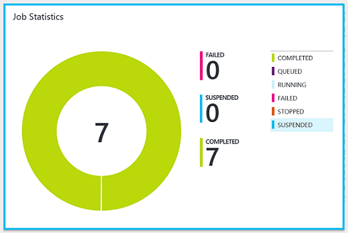
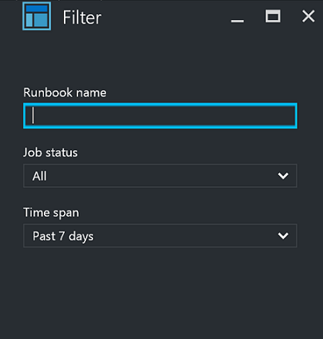

# Manage runbooks in Azure Automation

You can add a runbook to Azure Automation by either creating a new one or importing an existing one from a file or the [Runbook Gallery](automation-runbook-gallery.md). This article provides information for managing a runbook imported from a file. You can find all the details of accessing community runbooks and modules in [Runbook and module galleries for Azure Automation](automation-runbook-gallery.md).

## Create a runbook

Create a new runbook in Azure Automation using the Azure portal or Windows PowerShell. Once the runbook has been created, you can edit it using information in:

* [Edit textual runbook in Azure Automation](automation-edit-textual-runbook.md)
* [Learn key Windows PowerShell Workflow concepts for Automation runbooks](automation-powershell-workflow.md)
* [Manage Python 2 packages in Azure Automation](python-packages.md)
* [Manage Python 3 packages (preview) in Azure Automation](python-3-packages.md)

### Create a runbook in the Azure portal

1. In the Azure portal, open your Automation account.
2. From the hub, select **Runbooks** under **Process Automation** to open the list of runbooks.
3. Click **Create a runbook**.
4. Enter a name for the runbook and select its [type](automation-runbook-types.md). The runbook name must start with a letter and can contain letters, numbers, underscores, and dashes.
5. Click **Create** to create the runbook and open the editor.

### Create a runbook with PowerShell

Use the [New-AzAutomationRunbook](/powershell/module/az.automation/new-azautomationrunbook) cmdlet to create an empty runbook. Use the `Type` parameter to specify one of the runbook types defined for `New-AzAutomationRunbook`.

The following example shows how to create a new empty runbook.

```azurepowershell-interactive
$params = @{
    AutomationAccountName = 'MyAutomationAccount'
    Name                  = 'NewRunbook'
    ResourceGroupName     = 'MyResourceGroup'
    Type                  = 'PowerShell'
}
New-AzAutomationRunbook @params
```

## Import a runbook

You can import a PowerShell or PowerShell Workflow (**.ps1**) script, a graphical runbook (**.graphrunbook**), or a Python 2 or Python 3 script (**.py**) to make your own runbook. You must specify the [type of runbook](automation-runbook-types.md) that is created during import, taking into account the following considerations.

* You can import a **.ps1** file that doesn't contain a workflow into either a [PowerShell runbook](automation-runbook-types.md#powershell-runbooks) or a [PowerShell Workflow runbook](automation-runbook-types.md#powershell-workflow-runbooks). If you import it into a PowerShell Workflow runbook, it is converted to a workflow. In this case, comments are included in the runbook to describe the changes made.

* You can import only a **.ps1** file containing a PowerShell Workflow into a [PowerShell Workflow runbook](automation-runbook-types.md#powershell-workflow-runbooks). If the file contains multiple PowerShell workflows, the import fails. You must save each workflow to its own file and import each separately.

* Do not import a **.ps1** file containing a PowerShell Workflow into a [PowerShell runbook](automation-runbook-types.md#powershell-runbooks), as the PowerShell script engine can't recognize it.

* Only import a **.graphrunbook** file into a new [graphical runbook](automation-runbook-types.md#graphical-runbooks).

### Import a runbook from the Azure portal

You can use the following procedure to import a script file into Azure Automation.

> [!NOTE]
> You can only import a **.ps1** file into a PowerShell Workflow runbook using the portal.

1. In the Azure portal, open your Automation account.
2. Select **Runbooks** under **Process Automation** to open the list of runbooks.
3. Click **Import a runbook**.
4. Click **Runbook file** and select the file to import.
5. If the **Name** field is enabled, you have the option of changing the runbook name. The name must start with a letter and can contain letters, numbers, underscores, and dashes.
6. The [runbook type](automation-runbook-types.md) is automatically selected, but you can change the type after taking the applicable restrictions into account.
7. Click **Create**. The new runbook appears in the list of runbooks for the Automation account.
8. You must [publish the runbook](#publish-a-runbook) before you can run it.

> [!NOTE]
> After you import a graphical runbook, you can convert it to another type. However, you can't convert a graphical runbook to a textual runbook.

### Import a runbook with Windows PowerShell

Use the [Import-AzAutomationRunbook](/powershell/module/az.automation/import-azautomationrunbook) cmdlet to import a script file as a draft runbook. If the runbook already exists, the import fails unless you use the `Force` parameter with the cmdlet.

The following example shows how to import a script file into a runbook.

```azurepowershell-interactive
$params = @{
    AutomationAccountName = 'MyAutomationAccount'
    Name                  = 'Sample_TestRunbook'
    ResourceGroupName     = 'MyResourceGroup'
    Type                  = 'PowerShell'
    Path                  = 'C:\Runbooks\Sample_TestRunbook.ps1'
}
Import-AzAutomationRunbook @params
```

## Handle resources

If your runbook creates a [resource](automation-runbook-execution.md#resources), the script should check to see if the resource already exists before attempting to create it. Here's a basic example.

```powershell
$vmName = 'WindowsVM1'
$rgName = 'MyResourceGroup'
$myCred = Get-AutomationPSCredential 'MyCredential'

$vmExists = Get-AzResource -Name $vmName -ResourceGroupName $rgName
if (-not $vmExists) {
    Write-Output "VM $vmName does not exist, creating"
    New-AzVM -Name $vmName -ResourceGroupName $rgName -Credential $myCred
} else {
    Write-Output "VM $vmName already exists, skipping"
}
```

## Retrieve details from Activity log

You can retrieve runbook details, such as the person or account that started a runbook, from the [Activity log](automation-runbook-execution.md#activity-logging) for the Automation account. The following PowerShell example provides the last user to run the specified runbook.

```powershell-interactive
$SubID = '00000000-0000-0000-0000-000000000000'
$AutoRgName = 'MyResourceGroup'
$aaName = 'MyAutomationAccount'
$RunbookName = 'MyRunbook'
$StartTime = (Get-Date).AddDays(-1)

$params = @{
    ResourceGroupName = $AutoRgName
    StartTime         = $StartTime
}
$JobActivityLogs = (Get-AzLog @params).Where( { $_.Authorization.Action -eq 'Microsoft.Automation/automationAccounts/jobs/write' })

$JobInfo = @{}
foreach ($log in $JobActivityLogs) {
    # Get job resource
    $JobResource = Get-AzResource -ResourceId $log.ResourceId

    if ($null -eq $JobInfo[$log.SubmissionTimestamp] -and $JobResource.Properties.Runbook.Name -eq $RunbookName) {
        # Get runbook
        $jobParams = @{
            ResourceGroupName     = $AutoRgName
            AutomationAccountName = $aaName
            Id                    = $JobResource.Properties.JobId
        }
        $Runbook = Get-AzAutomationJob @jobParams | Where-Object RunbookName -EQ $RunbookName

        # Add job information to hashtable
        $JobInfo.Add($log.SubmissionTimestamp, @($Runbook.RunbookName,$Log.Caller, $JobResource.Properties.jobId))
    }
}
$JobInfo.GetEnumerator() | Sort-Object Key -Descending | Select-Object -First 1
```

## Track progress

It's a good practice to author your runbooks to be modular in nature, with logic that can be reused and restarted easily. Tracking progress in a runbook ensures that the runbook logic executes correctly if there are issues.

You can track the progress of a runbook by using an external source, such as a storage account, a database, or shared files. Create logic in your runbook to first check the state of the last action taken. Then, based on the results of the check, the logic can either skip or continue specific tasks in the runbook.

## Prevent concurrent jobs

Some runbooks behave strangely if they run across multiple jobs at the same time. In this case, it's important for a runbook to implement logic to determine if there is already a running job. Here's a basic example.

```powershell
# Authenticate to Azure
$connection = Get-AutomationConnection -Name AzureRunAsConnection
$cnParams = @{
    ServicePrincipal      = $true
    Tenant                = $connection.TenantId
    ApplicationId         = $connection.ApplicationId
    CertificateThumbprint = $connection.CertificateThumbprint
}
Connect-AzAccount @cnParams
$AzureContext = Get-AzSubscription -SubscriptionId $connection.SubscriptionID

# Check for already running or new runbooks
$runbookName = "<RunbookName>"
$rgName = "<ResourceGroupName>"
$aaName = "<AutomationAccountName>"
$jobs = Get-AzAutomationJob -ResourceGroupName $rgName -AutomationAccountName $aaName -RunbookName $runbookName -AzContext $AzureContext

# Check to see if it is already running
$runningCount = ($jobs.Where( { $_.Status -eq 'Running' })).count

if (($jobs.Status -contains 'Running' -and $runningCount -gt 1 ) -or ($jobs.Status -eq 'New')) {
    # Exit code
    Write-Output "Runbook [$runbookName] is already running"
    exit 1
} else {
    # Insert Your code here
}
```

## Handle transient errors in a time-dependent script

Your runbooks must be robust and capable of handling [errors](automation-runbook-execution.md#errors), including transient errors that can cause them to restart or fail. If a runbook fails, Azure Automation retries it.

If your runbook normally runs within a time constraint, have the script implement logic to check the execution time. This check ensures the running of operations such as startup, shutdown, or scale-out only during specific times.

> [!NOTE]
> The local time on the Azure sandbox process is set to UTC. Calculations for date and time in your runbooks must take this fact into consideration.

## Work with multiple subscriptions

Your runbook must be able to work with [subscriptions](automation-runbook-execution.md#subscriptions). For example, to handle multiple subscriptions, the runbook uses the [Disable-AzContextAutosave](/powershell/module/Az.Accounts/Disable-AzContextAutosave) cmdlet. This cmdlet ensures that the authentication context isn't retrieved from another runbook running in the same sandbox. The runbook also uses the `Get-AzContext` cmdlet to retrieve the context of the current session, and assign it to the variable `$AzureContext`.

```powershell
Disable-AzContextAutosave -Scope Process

$connection = Get-AutomationConnection -Name AzureRunAsConnection
$cnParams = @{
    ServicePrincipal      = $true
    Tenant                = $connection.TenantId
    ApplicationId         = $connection.ApplicationId
    CertificateThumbprint = $connection.CertificateThumbprint
}
Connect-AzAccount @cnParams

$ChildRunbookName = 'ChildRunbookDemo'
$aaName = 'MyAutomationAccount'
$rgName = 'MyResourceGroup'

$startParams = @{
    ResourceGroupName     = $rgName
    AutomationAccountName = $aaName
    Name                  = $ChildRunbookName
    DefaultProfile        = $AzureContext
}
Start-AzAutomationRunbook @startParams
```

## Work with a custom script

> [!NOTE]
> You can't normally run custom scripts and runbooks on the host with a Log Analytics agent installed.

To use a custom script:

1. Create an Automation account and obtain a [Contributor role](automation-role-based-access-control.md).
2. [Link the account to the Azure workspace](../security-center/security-center-enable-data-collection.md).
3. Enable [Hybrid Runbook Worker](automation-hybrid-runbook-worker.md), [Update Management](./update-management/overview.md), or another Automation feature. 
4. If on a Linux machine, you need high permissions. Log in to [turn off signature checks](automation-linux-hrw-install.md#turn-off-signature-validation).

## Test a runbook

When you test a runbook, the [Draft version](#publish-a-runbook) is executed and any actions that it performs are completed. No job history is created, but the [output](automation-runbook-output-and-messages.md#use-the-output-stream) and [warning and error](automation-runbook-output-and-messages.md#working-with-message-streams) streams are displayed in the Test output pane. Messages to the [verbose stream](automation-runbook-output-and-messages.md#write-output-to-verbose-stream) are displayed in the Output pane only if the [VerbosePreference](automation-runbook-output-and-messages.md#work-with-preference-variables) variable is set to `Continue`.

Even though the draft version is being run, the runbook still executes normally and performs any actions against resources in the environment. For this reason, you should only test runbooks on non-production resources.

The procedure to test each [type of runbook](automation-runbook-types.md) is the same. There's no difference in testing between the textual editor and the graphical editor in the Azure portal.

1. Open the Draft version of the runbook in either the [textual editor](automation-edit-textual-runbook.md) or the [graphical editor](automation-graphical-authoring-intro.md).
1. Click **Test** to open the Test page.
1. If the runbook has parameters, they're listed in the left pane, where you can provide values to be used for the test.
1. If you want to run the test on a [Hybrid Runbook Worker](automation-hybrid-runbook-worker.md), change **Run Settings** to **Hybrid Worker** and select the name of the target group.  Otherwise, keep the default **Azure** to run the test in the cloud.
1. Click **Start** to begin the test.
1. You can use the buttons under the Output pane to stop or suspend a [PowerShell Workflow](automation-runbook-types.md#powershell-workflow-runbooks) or [graphical](automation-runbook-types.md#graphical-runbooks) runbook while it's being tested. When you suspend the runbook, it completes the current activity before being suspended. Once the runbook is suspended, you can stop it or restart it.
1. Inspect the output from the runbook in the Output pane.

## Publish a runbook

When you create or import a new runbook, you must publish it before you can run it. Each runbook in Azure Automation has a Draft version and a Published version. Only the Published version is available to be run, and only the Draft version can be edited. The Published version is unaffected by any changes to the Draft version. When the Draft version should be made available, you publish it, overwriting the current Published version with the Draft version.

### Publish a runbook in the Azure portal

1. Open the runbook in the Azure portal.
2. Click **Edit**.
3. Click **Publish** and then **Yes** in response to the verification message.

### Publish a runbook using PowerShell

Use the [Publish-AzAutomationRunbook](/powershell/module/Az.Automation/Publish-AzAutomationRunbook) cmdlet to publish your runbook. 

```azurepowershell-interactive
$aaName = "MyAutomationAccount"
$RunbookName = "Sample_TestRunbook"
$rgName = "MyResourceGroup"

$publishParams = @{
    AutomationAccountName = $aaName
    ResourceGroupName     = $rgName
    Name                  = $RunbookName
}
Publish-AzAutomationRunbook @publishParams
```

## Schedule a runbook in the Azure portal

When your runbook has been published, you can schedule it for operation:

1. Open the runbook in the Azure portal.
2. Select **Schedules** under **Resources**.
3. Select **Add a schedule**.
4. In the Schedule Runbook pane, select **Link a schedule to your runbook**.
5. Choose **Create a new schedule** in the Schedule pane.
6. Enter a name, description, and other parameters in the New schedule pane.
7. Once the schedule is created, highlight it and click **OK**. It should now be linked to your runbook.
8. Look for an email in your mailbox to notify you of the runbook status.

## Obtain job statuses

### View statuses in the Azure portal

Details of job handling in Azure Automation are provided in [Jobs](automation-runbook-execution.md#jobs). When you are ready to see your runbook jobs, use Azure portal and access your Automation account. On the right, you can see a summary of all the runbook jobs in **Job Statistics**.



The summary displays a count and graphical representation of the job status for each job executed.

Clicking the tile presents the Jobs page, which includes a summarized list of all jobs executed. This page shows the status, runbook name, start time, and completion time for each job.

:::image type="content" source="./media/manage-runbooks/automation-account-jobs-status-blade.png" alt-text="Screenshot of the Jobs page.":::

You can filter the list of jobs by selecting **Filter jobs**. Filter on a specific runbook, job status, or a choice from the dropdown list, and provide the time range for the search.



Alternatively, you can view job summary details for a specific runbook by selecting that runbook from the Runbooks page in your Automation account and then selecting **Jobs**. This action presents the Jobs page. From here, you can click a job record to view its details and output.

:::image type="content" source="./media/manage-runbooks/automation-runbook-job-summary-blade.png" alt-text="Screenshot of the Jobs page with the Errors button highlighted.":::

### Retrieve job statuses using PowerShell

Use the [Get-AzAutomationJob](/powershell/module/Az.Automation/Get-AzAutomationJob) cmdlet to retrieve the jobs created for a runbook and the details of a particular job. If you start a runbook using `Start-AzAutomationRunbook`, it returns the resulting job. Use [Get-AzAutomationJobOutput](/powershell/module/Az.Automation/Get-AzAutomationJobOutput) to retrieve job output.

The following example gets the last job for a sample runbook and displays its status, the values provided for the runbook parameters, and the job output.

```azurepowershell-interactive
$getJobParams = @{
    AutomationAccountName = 'MyAutomationAccount'
    ResourceGroupName     = 'MyResourceGroup'
    Runbookname           = 'Test-Runbook'
}
$job = (Get-AzAutomationJob @getJobParams | Sort-Object LastModifiedDate -Desc)[0]
$job | Select-Object JobId, Status, JobParameters

$getOutputParams = @{
    AutomationAccountName = 'MyAutomationAccount'
    ResourceGroupName     = 'MyResourceGroup'
    Id                    = $job.JobId
    Stream                = 'Output'
}
Get-AzAutomationJobOutput @getOutputParams
```

The following example retrieves the output for a specific job and returns each record. If there's an [exception](automation-runbook-execution.md#exceptions) for one of the records, the script writes the exception instead of the value. This behavior is useful since exceptions can provide additional information that might not be logged normally during output.

```azurepowershell-interactive
$params = @{
    AutomationAccountName = 'MyAutomationAccount'
    ResourceGroupName     = 'MyResourceGroup'
    Stream                = 'Any'
}
$output = Get-AzAutomationJobOutput @params

foreach ($item in $output) {
    $jobOutParams = @{
        AutomationAccountName = 'MyAutomationAccount'
        ResourceGroupName     = 'MyResourceGroup'
        Id                    = $item.StreamRecordId
    }
    $fullRecord = Get-AzAutomationJobOutputRecord @jobOutParams

    if ($fullRecord.Type -eq 'Error') {
        $fullRecord.Value.Exception
    } else {
        $fullRecord.Value
    }
}
```

## Next steps

* To learn details of runbook management, see [Runbook execution in Azure Automation](automation-runbook-execution.md).
* To prepare a PowerShell runbook, see [Edit textual runbooks in Azure Automation](automation-edit-textual-runbook.md).
* To troubleshoot issues with runbook execution, see [Troubleshoot runbook issues](troubleshoot/runbooks.md).
