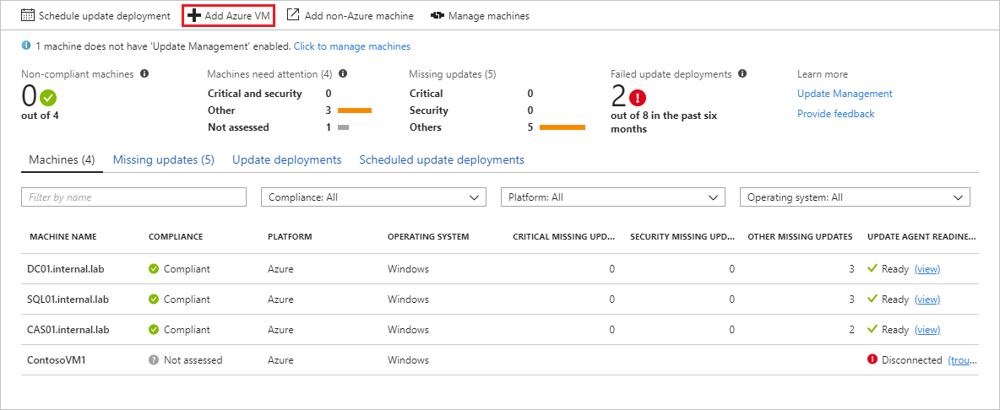
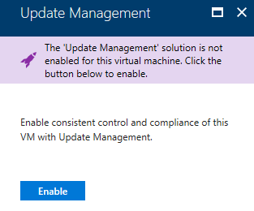
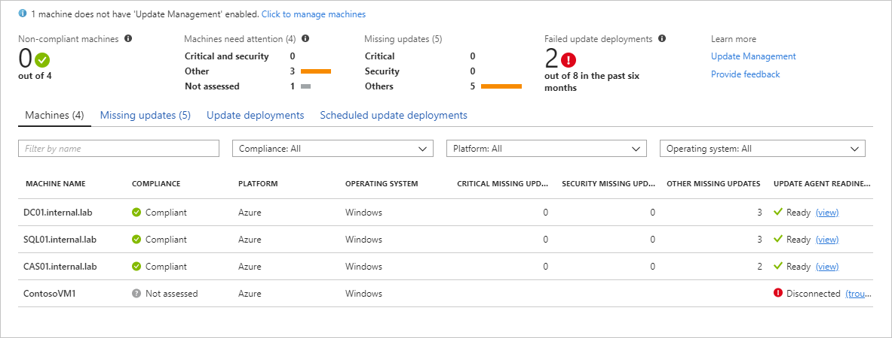
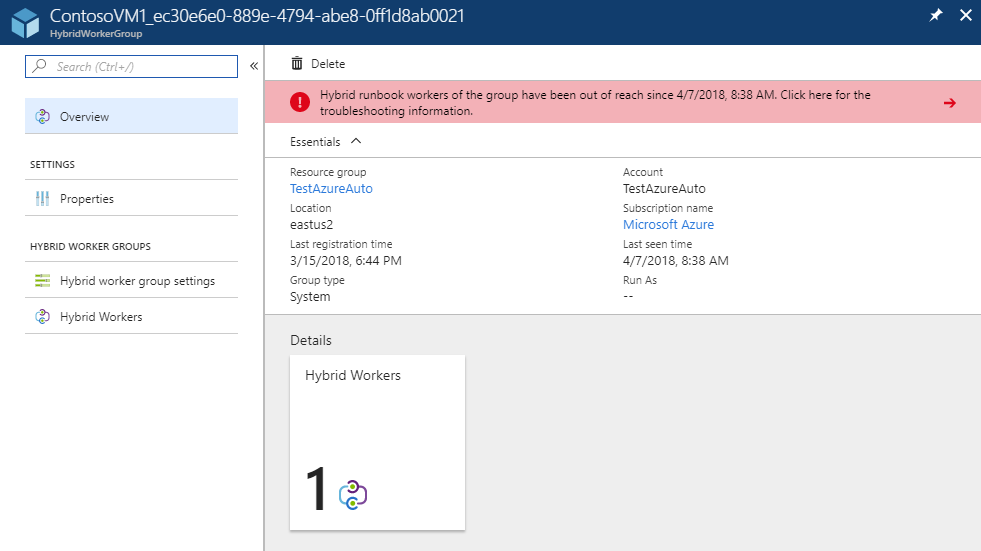
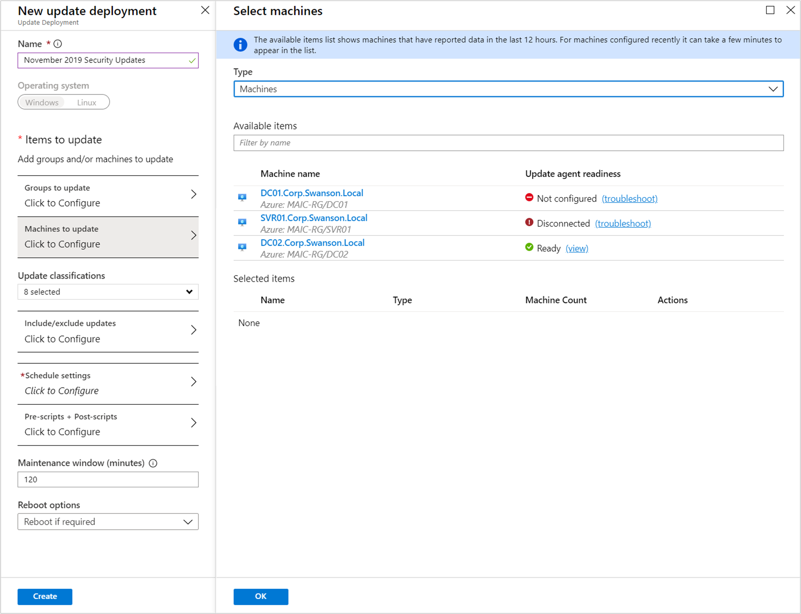
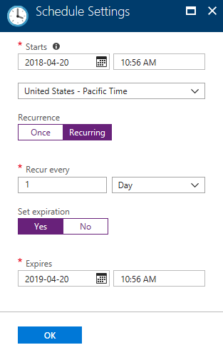
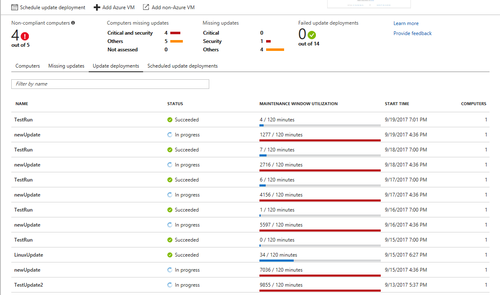

# Manage updates for multiple machines

You can use the Update Management solution to manage updates and patches for your Windows and Linux virtual machines. From your [Azure Automation](automation-offering-get-started.md) account, you can:

- Onboard virtual machines
- Assess the status of available updates
- Schedule installation of required updates
- Review deployment results to verify that updates were applied successfully to all virtual machines for which Update Management is enabled

## Prerequisites

To use Update Management, you need:

- An Azure Automation Run As account. To learn how to create one, see [Getting started with Azure Automation](automation-offering-get-started.md).
- A virtual machine or computer with one of the supported operating systems installed.

## Supported operating systems

Update Management is supported on the following operating systems:

|Operating system  |Notes  |
|---------|---------|
|Windows Server 2008, Windows Server 2008 R2 RTM    | Supports only update assessments.         |
|Windows Server 2008 R2 SP1 and later     |Windows PowerShell 4.0 or later is required. ([Download WMF 4.0](https://www.microsoft.com/download/details.aspx?id=40855))  Windows PowerShell 5.1 is recommended for increased reliability. ([Download WMF 5.1](https://www.microsoft.com/download/details.aspx?id=54616))         |
|CentOS 6 (x86/x64) and 7 (x64)      | Linux agents must have access to an update repository.        |
|Red Hat Enterprise 6 (x86/x64) and 7 (x64)     | Linux agents must have access to an update repository.        |
|SUSE Linux Enterprise Server 11 (x86/x64) and 12 (x64)     | Linux agents must have access to an update repository.        |
|Ubuntu 12.04 LTS, 14.04 LTS, and 16.04 LTS (x86/x64)      |Linux agents must have access to an update repository.         |

> [!NOTE]
> To prevent updates from being applied outside a maintenance window on Ubuntu, reconfigure the Unattended-Upgrade package to disable automatic updates. For more information, see the [Automatic Updates topic in the Ubuntu Server Guide](https://help.ubuntu.com/lts/serverguide/automatic-updates.html).

Linux agents must have access to an update repository.

This solution doesn't support an Log Analytics Agent for Linux that's configured to report to multiple Azure Log Analytics workspaces.

## Enable Update Management for Azure virtual machines

In the Azure portal, open your Automation account, and then select **Update management**.

Select **Add Azure VMs**.

Select a virtual machine to onboard. 

Under **Enable Update Management**, select **Enable** to onboard the virtual machine.

When onboarding is finished, Update Management is enabled for your virtual machine.

## Enable Update Management for non-Azure virtual machines and computers

To learn how to enable Update Management for non-Azure Windows virtual machines and computers, see [Connect Windows computers to the Log Analytics service in Azure](../log-analytics/log-analytics-windows-agent.md).

To learn how to enable Update Management for non-Azure Linux virtual machines and computers, see [Connect your Linux computers to Log Analytics](../log-analytics/log-analytics-agent-linux.md).

## View computers attached to your Automation account

After you enable Update Management for your machines, you can view machine information by selecting **Computers**. You can see information about *machine name*, *compliance status*, *environment*, *OS type*, *critical and security updates installed*, *other updates installed*, and *update agent readiness* for your computers.

  

Computers that have recently been enabled for Update Management might not have been assessed yet. The compliance state status for those computers is **Not assessed**. Here's a list of possible values for compliance state:

- **Compliant**: Computers that are not missing critical or security updates.

- **Non-compliant**: Computers that are missing at least one critical or security update.

- **Not assessed**: The update assessment data hasn't been received from the computer within the expected timeframe. For Linux computers, the expect timeframe is in the last 3 hours. For Windows computers, the expected timeframe is in the last 12 hours.

To view the status of the agent, select the link in the **UPDATE AGENT READINESS** column. Selecting this option opens the **Hybrid Worker** pane, and shows the status of the Hybrid Worker. The following image shows an example of an agent that hasn't been connected to Update Management for an extended period of time:

## View an update assessment

After Update Management is enabled, the **Update management** pane opens. You can see a list of missing updates on the **Missing updates** tab.

## Collect data

Agents that are installed on virtual machines and computers collect data about updates. The agents send the data to Azure Update Management.

### Supported agents

The following table describes the connected sources that this solution supports:

| Connected source | Supported | Description |
| --- | --- | --- |
| Windows agents |Yes |Update Management collects information about system updates from Windows agents and then initiates installation of required updates. |
| Linux agents |Yes |Update Management collects information about system updates from Linux agents and then initiates installation of required updates on supported distributions. |
| Operations Manager management group |Yes |Update Management collects information about system updates from agents in a connected management group. |
| Azure Storage account |No |Azure Storage doesn't include information about system updates. |

### Collection frequency

A scan runs twice a day for each managed Windows computer. Every 15 minutes, the Windows API is called to query for the last update time to determine whether the status has changed. If the status changed, a compliance scan starts. A scan runs every 3 hours for each managed Linux computer.

It can take between 30 minutes and 6 hours for the dashboard to display updated data from managed computers.

## Schedule an update deployment

To install updates, schedule a deployment that aligns with your release schedule and service window. You can choose which update types to include in the deployment. For example, you can include critical or security updates and exclude update rollups.

To schedule a new update deployment for one or more virtual machines, under **Update management**, select **Schedule update deployment**.

In the **New update deployment** pane, specify the following information:

- **Name**: Enter a unique name to identify the update deployment.
- **Operating system**: Select **Windows** or **Linux**.
- **Groups to update (preview)**: Define a query based on a combination of subscription, resource groups, locations, and tags to build a dynamic group of Azure VMs to include in your deployment. To learn more see, [Dynamic Groups](automation-update-management.md#using-dynamic-groups)
- **Machines to update**: Select a Saved Search, Imported group, or select Machines, to choose the machines that you want to update. If you choose **Machines**, the readiness of the machine is shown in the **UPDATE AGENT READINESS** column. You can see the health state of the machine before you schedule the update deployment. To learn about the different methods of creating computer groups in Log Analytics, see [Computer groups in Log Analytics](../log-analytics/log-analytics-computer-groups.md)

  

- **Update classification**: Select the types of software to include in the update deployment. For a description of the classification types, see [Update classifications](automation-update-management.md#update-classifications). The classification types are:
  - Critical updates
  - Security updates
  - Update rollups
  - Feature packs
  - Service packs
  - Definition updates
  - Tools
  - Updates

- **Updates to include/exclude** - This opens the **Include/Exclude** page. Updates to be included or excluded are on separate tabs. For additional information on how inclusion is handled, see [inclusion behavior](automation-update-management.md#inclusion-behavior)

- **Schedule settings**: You can accept the default date and time, which is 30 minutes after the current time. You can also specify a different time.

   You can also specify whether the deployment occurs once or on a recurring schedule. To set up a recurring schedule, under **Recurrence**, select **Recurring**.

   

- **Pre-scripts + Post-scripts**: Select the scripts to run before and after your deployment. To learn more, see [Manage Pre and Post scripts](pre-post-scripts.md).
- **Maintenance window (minutes)**: Specify the period of time that you want the update deployment to occur. This setting helps ensure that changes are performed within your defined service windows.

- **Reboot control** - This setting determines how reboots are handled for the update deployment.

   |Option|Description|
   |---|---|
   |Reboot if required| **(Default)** If required, a reboot is initiated if the maintenance window allows.|
   |Always reboot|A reboot is initiated regardless of whether one is required. |
   |Never reboot|Regardless of if a reboot is required, reboots are suppressed.|
   |Only reboot - will not install updates|This option ignores installing updates, and only initiates a reboot.|

When you're finished configuring the schedule, select the **Create** button to return to the status dashboard. The **Scheduled** table shows the deployment schedule that you created.

## View results of an update deployment

After the scheduled deployment starts, you can see the status for that deployment on the **Update deployments** tab under **Update management**.

If the deployment is currently running, its status is **In progress**. After the deployment finishes successfully, the status changes to **Succeeded**.

If one or more updates fail in the deployment, the status is **Partially failed**.

To see the dashboard for an update deployment, select the completed deployment.

The **Update results** pane shows the total number of updates and the deployment results for the virtual machine. The table on the right gives a detailed breakdown of each update and the installation results. Installation results can be one of the following values:

- **Not attempted**: The update was not installed because insufficient time was available based on the defined maintenance window.
- **Succeeded**: The update succeeded.
- **Failed**: The update failed.

To see all log entries that the deployment created, select **All logs**.

To see the job stream of the runbook that manages the update deployment on the target virtual machine, select the output tile.

To see detailed information about any errors from the deployment, select **Errors**.

## Next steps

- To learn more about Update Management, including logs, output, and errors, see [Update Management solution in Azure](../operations-management-suite/oms-solution-update-management.md).
