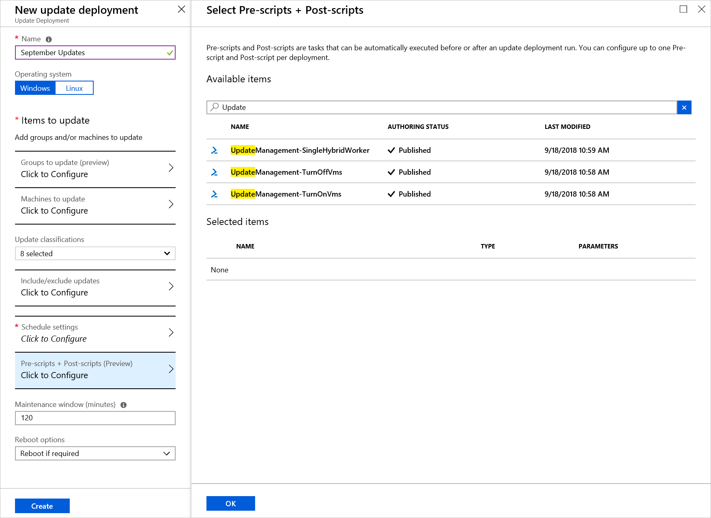
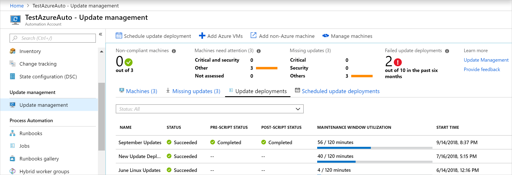

# Manage pre and post scripts

Pre and post scripts let you run PowerShell runbooks in your Automation Account before (pre-task) and after (post-task) an update deployment. Pre and post scripts run in the Azure context and not locally. Pre-scripts run at the beginning of the update deployment. Post scripts run at the end of the deployment and after any reboots that are configured.

## Runbook requirements

For a runbook to be used as a pre or post script, the runbook needs to be imported into your automation account and published. To learn more about this process, see [Publishing a runbook](manage-runbooks.md#publish-a-runbook).

## Using a pre/post script

To use a pre and or post script in an Update Deployment, start by creating an Update Deployment. Select **Pre-scripts + Post Scripts**. This action opens the **Select Pre-scripts + Post-scripts** page.  



Select the script you want to use, in this example, you used the **UpdateManagement-TurnOnVms** runbook. When you select the runbook the **Configure Script** page opens, choose **Pre-Script**. Click **OK** when done.

Repeat this process for the **UpdateManagement-TurnOffVms** script. But when choosing the **Script type**, choose **Post-Script**.

The **Selected items** section now shows both your scripts selected and on is a pre-script and the other is a post-script.


Finish configuring your Update Deployment.

When your Update Deployment is complete, you can go to **Update deployments** to view the results. As you can see, the status of the pre-script and post-script are provided.



By clicking into the update deployment run, you're provided additional details to the pre and post scripts. A link to the script source at the time of the run is provided.


## Passing parameters

When you configure pre and post scripts, you can pass in parameters just like scheduling a runbook. Parameters are defined at the time of update deployment creation. Pre and Post scripts support the following types:

* [char]
* [byte]
* [int]
* [long]
* [decimal]
* [single]
* [double]
* [DateTime]
* [string]

If you need another object type, you can cast it to another type with your own logic in the runbook.

In addition to your standard runbook parameters, an additional parameter is provided. This parameter is **SoftwareUpdateConfigurationRunContext**. This parameter is a JSON string, and if you define the parameter in your pre or post script, it's automatically passed in by the update deployment. The parameter contains information about the update deployment, which is a subset of information returned by the [SoftwareUpdateconfigurations API](/rest/api/automation/softwareupdateconfigurations/getbyname#updateconfiguration) The following table shows you the properties that are provided in the variable:

## Stopping a deployment

If you want to stop a deployment based on a Pre script, you must [throw](automation-runbook-execution.md#throw) an exception. If you don't throw an exception, the deployment and Post script will still run. The [example runbook](https://gallery.technet.microsoft.com/Update-Management-Run-6949cc44?redir=0) in the gallery shows how you can do this. The following is a snippet from that runbook.

```powershell
#In this case, we want to terminate the patch job if any run fails.
#This logic might not hold for all cases - you might want to allow success as long as at least 1 run succeeds
foreach($summary in $finalStatus)
{
    if ($summary.Type -eq "Error")
    {
        #We must throw in order to fail the patch deployment.  
        throw $summary.Summary
    }
}
```

### SoftwareUpdateConfigurationRunContext properties

|Property  |Description  |
|---------|---------|
|SoftwareUpdateConfigurationName     | The name of the Software Update Configuration        |
|SoftwareUpdateConfigurationRunId     | The unique id for the run.        |
|SoftwareUpdateConfigurationSettings     | A collection of properties related to the Software Update Configuration         |
|SoftwareUpdateConfigurationSettings.operatingSystem     | The operating systems targeted for the update deployment         |
|SoftwareUpdateConfigurationSettings.duration     | The maximum duration of the update deployment run as `PT[n]H[n]M[n]S` as per ISO8601, also called the "maintenance window"          |
|SoftwareUpdateConfigurationSettings.Windows     | A collection of properties related to Windows computers         |
|SoftwareUpdateConfigurationSettings.Windows.excludedKbNumbers     | A list of KBs that are excluded from the update deployment        |
|SoftwareUpdateConfigurationSettings.Windows.includedUpdateClassifications     | Update classifications selected for the update deployment        |
|SoftwareUpdateConfigurationSettings.Windows.rebootSetting     | Reboot settings for the update deployment        |
|azureVirtualMachines     | A list of resourceIds for the Azure VMs in the update deployment        |
|nonAzureComputerNames|A list of the Non-Azure computers FQDNs in the update deployment|

The following example is a JSON string passed in to the **SoftwareUpdateConfigurationRunContext** parameter:

```json
"SoftwareUpdateConfigurationRunContext":{
      "SoftwareUpdateConfigurationName":"sampleConfiguration",
      "SoftwareUpdateConfigurationRunId":"00000000-0000-0000-0000-000000000000",
      "SoftwareUpdateConfigurationSettings":{
         "operatingSystem":"Windows",
         "duration":"PT2H0M",
         "windows":{
            "excludedKbNumbers":[
               "168934",
               "168973"
            ],
            "includedUpdateClassifications":"Critical",
            "rebootSetting":"IfRequired"
         },
         "azureVirtualMachines":[
            "/subscriptions/00000000-0000-0000-0000-000000000000/resourceGroups/myresources/providers/Microsoft.Compute/virtualMachines/vm-01",
            "/subscriptions/00000000-0000-0000-0000-000000000000/resourceGroups/myresources/providers/Microsoft.Compute/virtualMachines/vm-02",
            "/subscriptions/00000000-0000-0000-0000-000000000000/resourceGroups/myresources/providers/Microsoft.Compute/virtualMachines/vm-03"
         ], 
         "nonAzureComputerNames":[
            "box1.contoso.com",
            "box2.contoso.com"
         ]
      }
   }
```

A full example with all properties can be found at: [Software Update Configurations - Get By Name](/rest/api/automation/softwareupdateconfigurations/getbyname#examples)

> [!NOTE]
> The `SoftwareUpdateConfigurationRunContext` object can contain duplicate entries for machines. This can cause Pre and Post scripts to run multiple times on the same machine. To workaround this behavior, use `Sort-Object -Unique` to select only unique VM names in your script.

## Samples

Samples for pre and post scripts can be found in the [Script Center Gallery](https://gallery.technet.microsoft.com/scriptcenter/site/search?f%5B0%5D.Type=RootCategory&f%5B0%5D.Value=WindowsAzure&f%5B0%5D.Text=Windows%20Azure&f%5B1%5D.Type=SubCategory&f%5B1%5D.Value=WindowsAzure_automation&f%5B1%5D.Text=Automation&f%5B2%5D.Type=SearchText&f%5B2%5D.Value=update%20management&f%5B3%5D.Type=Tag&f%5B3%5D.Value=Patching&f%5B3%5D.Text=Patching&f%5B4%5D.Type=ProgrammingLanguage&f%5B4%5D.Value=PowerShell&f%5B4%5D.Text=PowerShell), or imported through the Azure portal. To import them through the portal, in your Automation Account, under **Process Automation**, select **Runbooks Gallery**. Use **Update Management** for the filter.


Or you can search for them by their script name as seen in the following list:

* Update Management - Turn On VMs
* Update Management - Turn Off VMs
* Update Management - Run Script Locally
* Update Management - Template for Pre/Post Scripts
* Update Management - Run Script with Run Command

> [!IMPORTANT]
> After you import the runbooks, you must **Publish** them before they can be used. To do that find the runbook in your Automation Account, select **Edit**, and click **Publish**.

The samples are all based on the basic template that is defined in the following example. This template can be used to create your own runbook to use with pre and post scripts. The necessary logic for authenticating with Azure and handling the `SoftwareUpdateConfigurationRunContext` parameter are included.

```powershell
<# 
.SYNOPSIS 
 Barebones script for Update Management Pre/Post 
 
.DESCRIPTION 
  This script is intended to be run as a part of Update Management Pre/Post scripts.  
  It requires a RunAs account. 
 
.PARAMETER SoftwareUpdateConfigurationRunContext 
  This is a system variable which is automatically passed in by Update Management during a deployment. 
#> 
 
param( 
    [string]$SoftwareUpdateConfigurationRunContext 
) 
#region BoilerplateAuthentication 
#This requires a RunAs account 
$ServicePrincipalConnection = Get-AutomationConnection -Name 'AzureRunAsConnection' 
 
Add-AzureRmAccount ` 
    -ServicePrincipal ` 
    -TenantId $ServicePrincipalConnection.TenantId ` 
    -ApplicationId $ServicePrincipalConnection.ApplicationId ` 
    -CertificateThumbprint $ServicePrincipalConnection.CertificateThumbprint 
 
$AzureContext = Select-AzureRmSubscription -SubscriptionId $ServicePrincipalConnection.SubscriptionID 
#endregion BoilerplateAuthentication 
 
#If you wish to use the run context, it must be converted from JSON 
$context = ConvertFrom-Json  $SoftwareUpdateConfigurationRunContext 
#Access the properties of the SoftwareUpdateConfigurationRunContext 
$vmIds = $context.SoftwareUpdateConfigurationSettings.AzureVirtualMachines | Sort-Object -Unique
$runId = $context.SoftwareUpdateConfigurationRunId 
 
Write-Output $context 
 
#Example: How to create and write to a variable using the pre-script: 
<# 
#Create variable named after this run so it can be retrieved 
New-AzureRmAutomationVariable -ResourceGroupName $ResourceGroup –AutomationAccountName $AutomationAccount –Name $runId -Value "" –Encrypted $false 
#Set value of variable  
Set-AutomationVariable –Name $runId -Value $vmIds 
#> 
 
#Example: How to retrieve information from a variable set during the pre-script 
<# 
$variable = Get-AutomationVariable -Name $runId 
#>      
```

## Interacting with machines

Pre and post tasks run as a runbook in your Automation Account and not directly on the machines in your deployment. Pre and post tasks also run in the Azure context and don't have access to Non-Azure machines. The following sections show how you can interact with the machines directly whether they're an Azure VM or a Non-Azure machine:

### Interacting with Azure machines

Pre and post tasks are run as runbooks and don't natively run on your Azure VMs in your deployment. To interact with your Azure VMs, you must have the following items:

* A Run As account
* A runbook you want to run

To interact with Azure machines, you should use the [Invoke-AzureRmVMRunCommand](/powershell/module/azurerm.compute/invoke-azurermvmruncommand) cmdlet to interact with your Azure VMs. For an example of how to do this, see the runbook example [Update Management - Run Script with Run Command](https://gallery.technet.microsoft.com/Update-Management-Run-40f470dc).

### Interacting with Non-Azure machines

Pre and post tasks run in the Azure context and don't have access to Non-Azure machines. To interact with the Non-Azure machines, you must have the following items:

* A Run As account
* Hybrid Runbook Worker installed on the machine
* A runbook you want to run locally
* Parent runbook

To interact with Non-Azure machines, a parent runbook is run in the Azure context. This runbook calls a child runbook with the [Start-AzureRmAutomationRunbook](/powershell/module/azurerm.automation/start-azurermautomationrunbook) cmdlet. You must specify the `-RunOn` parameter and provide the name of the Hybrid Runbook Worker for the script to run on. For an example of how to do this, see the runbook example [Update Management - Run Script Locally](https://gallery.technet.microsoft.com/Update-Management-Run-6949cc44).

## Abort patch deployment

If your pre script returns an error, you may want to abort your deployment. To do this, you must [throw](/powershell/module/microsoft.powershell.core/about/about_throw) an error in your script for any logic that would constitute a failure.

```powershell
if (<My custom error logic>)
{
    #Throw an error to fail the patch deployment.  
    throw "There was an error, abort deployment"
}
```

## Known issues

* You can't pass a boolean, objects, or arrays to parameters when using pre and post scripts. The runbook will fail. For a complete list of supported types, see [parameters](#passing-parameters).

## Next steps

Continue to the tutorial to learn how to manage updates for your Windows virtual machines.

> [!div class="nextstepaction"]
> [Manage updates and patches for your Azure Windows VMs](automation-tutorial-update-management.md)

