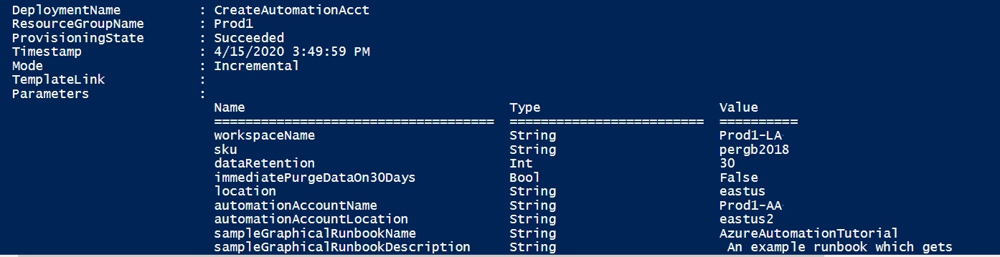

# Create an Azure Automation account using a Resource Manager template

Azure Automation delivers a cloud-based automation and configuration service that supports consistent management across your Azure and non-Azure environments. This article shows you how to deploy an Azure Resource Manager template (ARM template) that creates an Automation account. Using an ARM template takes fewer steps compared to other deployment methods. The JSON template specifies default values for parameters that would likely be used as a standard configuration in your environment. You can store the template in an Azure storage account for shared access in your organization. For more information about working with templates, see [Deploy resources with ARM templates and the Azure CLI](../azure-resource-manager/templates/deploy-cli.md).

[!INCLUDE [About Azure Resource Manager](../../includes/resource-manager-quickstart-introduction.md)]

The sample template does the following steps:

* Automates the creation of an Azure Monitor Log Analytics workspace.
* Automates the creation of an Azure Automation account.
* Links the Automation account to the Log Analytics workspace.
* Adds sample Automation runbooks to the account.

If you don't have an Azure subscription, create a [free account](https://azure.microsoft.com/free/?WT.mc_id=A261C142F) before you begin.

## Prerequisites

If you're new to Azure Automation and Azure Monitor, it's important that you understand the configuration details. The understanding can help you avoid errors when you try to create, configure, and use a Log Analytics workspace linked to your new Automation account.

* Review [additional details](../azure-monitor/logs/resource-manager-workspace.md#create-a-log-analytics-workspace) to fully understand workspace configuration options, such as access control mode, pricing tier, retention, and capacity reservation level.

* Review [workspace mappings](how-to/region-mappings.md) to specify the supported regions inline or in a parameter file. Only certain regions are supported for linking a Log Analytics workspace and an Automation account in your subscription.

* If you're new to Azure Monitor Logs and haven't deployed a workspace already, review the [workspace design guidance](../azure-monitor/logs/workspace-design.md). This document will help you learn about access control, and help you understand the recommended design implementation strategies for your organization.

## Review the template

The template used in this article is from [Azure Quickstart Templates](https://azure.microsoft.com/resources/templates/101-automation/).

:::code language="json" source="~/quickstart-templates/quickstarts/microsoft.automation/101-automation/azuredeploy.json":::

The Azure resources defined in the template:

* [**Microsoft.OperationalInsights/workspaces**](/azure/templates/microsoft.operationalinsights/workspaces): creates an Azure Log Analytics workspace.
* [**Microsoft.Automation/automationAccounts**](/azure/templates/microsoft.automation/automationaccounts): creates an Azure Automation account.
* [**Microsoft.Automation/automationAccounts/runbooks**](/azure/templates/microsoft.automation/automationaccounts/runbooks): creates an Azure Automation account runbook.

## Deploy the template

1. Select the **Deploy to Azure** button below to sign in to Azure and open the ARM template.

    

1. Enter or select the following values:

    |Property |Description |
    |---|---|
    |Subscription |From the drop-down list, select your Azure subscription.|
    |Resource group |From the drop-down list, select your existing resource group, or select **Create new**.|
    |Region |This value will autopopulate.|
    |Workspace name |Enter a name for your new Log Analytics Workspace.|
    |Sku | Defaults to the per GB pricing tier released in the April 2018 pricing model. If you want to create or configure a Log Analytics workspace in a subscription that has opted into the April 2018 pricing model, the only valid Log Analytics pricing tier is `PerGB2018`.|
    |Data retention |Defaults to 30 days.|
    |Location |The value will autopopulate with the location used for the resource group.|
    |Automation Account name | Enter a name for your new Automation account.|
    |Sample graphical runbook name | Leave as is.|
    |Sample graphical runbook description | Leave as is.|
    |Sample PowerShell runbook name | Leave as is.|
    |Sample PowerShell runbook description | Leave as is.|
    |Sample Python2Runbook name |Leave as is.|
    |Sample Python2Runbook description |Leave as is.|
    |_artifacts Location |Leave as is.* URI to artifacts location.|
    |_artifacts Location Sas Token | Leave blank. The sasToken required to access `_artifactsLocation`. When the template is deployed using the accompanying scripts, a `sasToken` will be automatically generated.|

    * When you attempt to run the ARM template from PowerShell, CLI, or the Templates feature in the portal, if the `_artifactsLocation` parameter isn't properly set, you'll receive an error message similar to the following:
    
    `"message": "Deployment template validation failed: 'The template resource '_artifactsLocation' at line '96' and column '31' is not valid: The language expression property 'templateLink' doesn't exist, available properties are 'template, templateHash, parameters, mode, debugSetting, provisioningState'.. Please see https://aka.ms/arm-template-expressions for usage details.'."`
    
    To prevent this error, when running from the Templates feature in the portal, specify the following value for the `_artifactsLocation` parameter - `https://raw.githubusercontent.com/Azure/azure-quickstart-templates/master/quickstarts/microsoft.automation/101-automation/azuredeploy.json`.
    
    When you run from PowerShell, include the parameter and its value `-TemplateUri https://raw.githubusercontent.com/Azure/azure-quickstart-templates/master/quickstarts/microsoft.automation/101-automation/azuredeploy.json`.
    
    When you run from Azure CLI, include the parameter and its value - `--template-uri https://raw.githubusercontent.com/Azure/azure-quickstart-templates/master/quickstarts/microsoft.automation/101-automation/azuredeploy.json`.
    
    For reference about PowerShell/CLI, see the following - [Create Azure Automation account (microsoft.com)](https://azure.microsoft.com/resources/templates/101-automation/) under the **Use the template** section.

1. Select **Review + Create** and then **Create**. The deployment can take a few minutes to finish. When completed, the output is similar to the following image:

    

## Review deployed resources

1. Once the deployment completes, you'll receive a **Deployment succeeded** notification with a **Go to resource** link. Your **Resource group** page will list your new resources. From the list, select your new Automation account.

1. From the left-side, under **Process Automation**, select **Runbooks**. The **Runbooks** page lists the three sample runbooks created with the Automation account.

    

1. From the left-side, under **Related Resources**, select **Linked workspace**. The **Linked workspace** page shows the Log Analytics workspace you specified earlier that is linked to your Automation account.

    

## Next steps

[Configure diagnostic settings](automation-manage-send-joblogs-log-analytics.md) for your Automation account to send runbook job status and job streams to the linked Log Analytics workspace.
