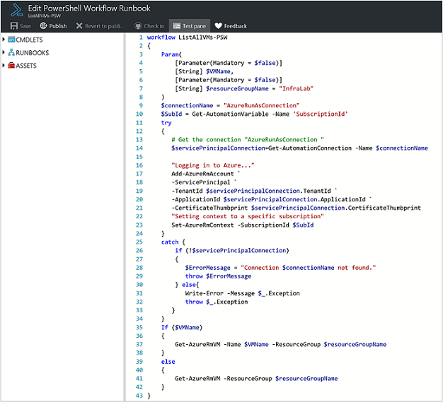
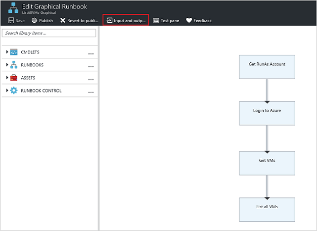
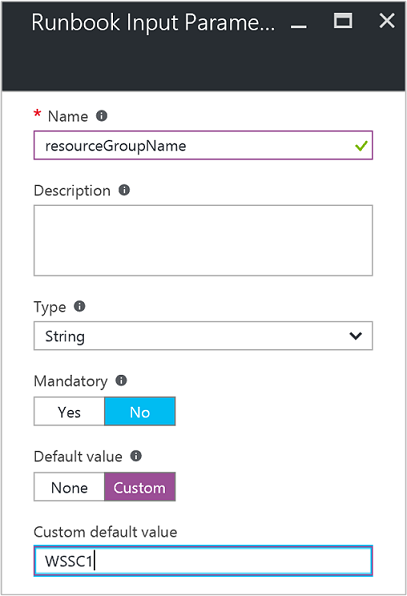
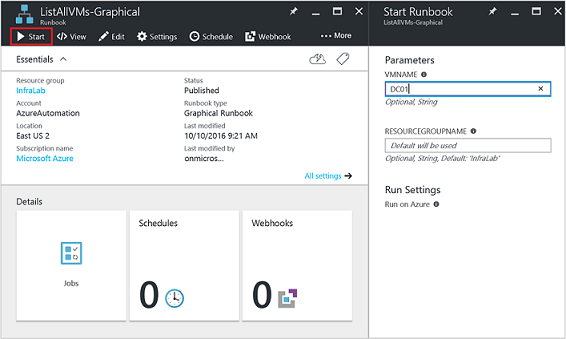
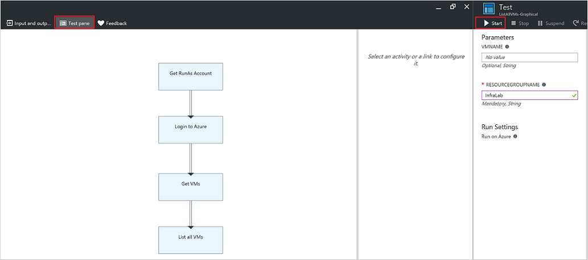
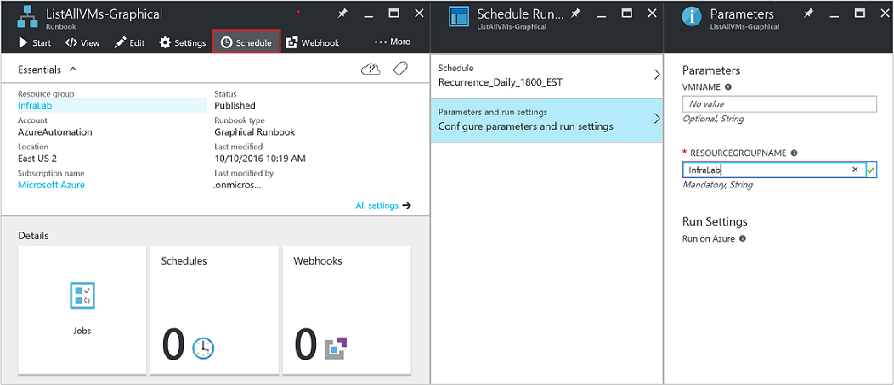
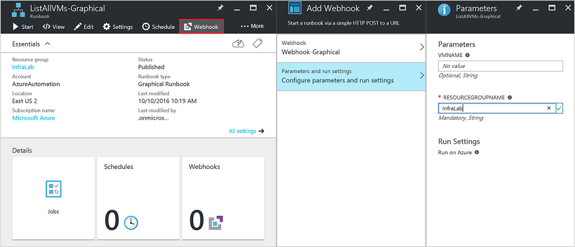
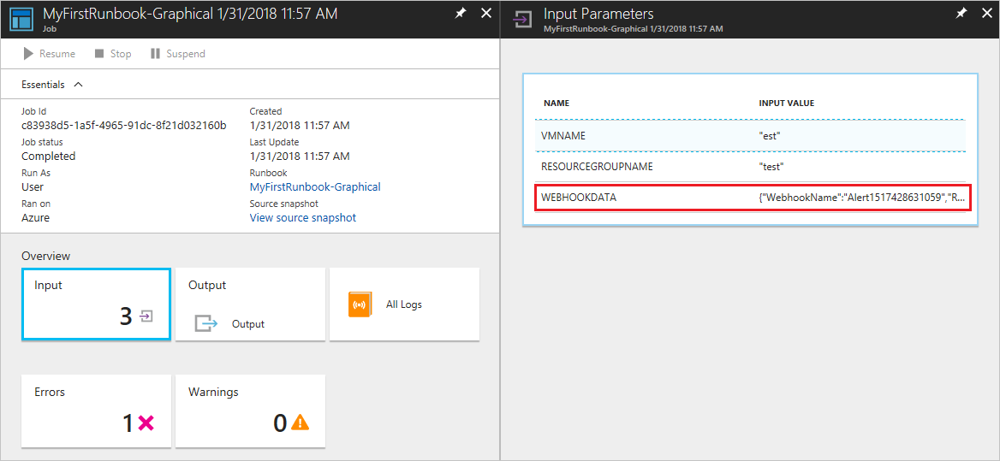

# Configure runbook input parameters in Automation

Runbook input parameters increase the flexibility of a runbook by allowing data to be passed to it when it's started. These parameters allow runbook actions to be targeted for specific scenarios and environments. This article describes the configuration and use of input parameters in your runbooks.

You can configure input parameters for PowerShell, PowerShell Workflow, graphical, and Python runbooks. A runbook can have multiple parameters with different data types or no parameters. Input parameters can be mandatory or optional, and you can use default values for optional parameters.

You assign values to the input parameters for a runbook when you start it. You can start a runbook from the Azure portal, a web service, or PowerShell. You can also start one as a child runbook that is called inline in another runbook.

## Input types

Azure Automation supports various input parameter values across the different runbook types. Supported input types for each type of runbook are listed in the following table.

| Runbook type        | Supported parameter inputs                                                                                                            |
|---------------------|---------------------------------------------------------------------------------------------------------------------------------------|
| PowerShell          | - String <br>- Security.SecureString <br>- INT32 <br>- Boolean <br>- DateTime <br>- Array <br>- Collections.Hashtable <br>- Management.Automation.SwitchParameter |
| PowerShell Workflow | - String <br>- Security.SecureString <br>- INT32 <br>- Boolean <br>- DateTime <br>- Array <br>- Collections.Hashtable <br>- Management.Automation.SwitchParameter |
| Graphical PowerShell| - String <br>- INT32 <br>- INT64 <br>- Boolean <br>- Decimal <br>- DateTime <br>- Object                                                                       |
| Python              | - String                                                                                                                                                                                        |                                                               |

## Configure input parameters in PowerShell runbooks

PowerShell and PowerShell Workflow runbooks in Azure Automation support input parameters that are defined through the following properties. 

| **Property** | **Description** |
|:--- |:--- |
| Type |Required. The data type is expected for the parameter value. Any .NET type is valid. |
| Name |Required. The name of the parameter. This name must be unique within the runbook, must start with a letter, and can contain only letters, numbers, or underscore characters. |
| Mandatory |Optional. The Boolean value specifies whether the parameter requires a value. If you set this to True, a value must be provided when the runbook is started. If you set this to False, a value is optional. If you don't specify a value for the `Mandatory` property, PowerShell considers the input parameter optional by default. |
| Default value |Optional. A value that is used for the parameter if no input value is passed in when the runbook starts. The runbook can set a default value for any parameter. |

Windows PowerShell supports more attributes of input parameters than those listed above, such as validation, aliases, and parameter sets. However, Azure Automation currently supports only the listed input parameter properties.

As an example, let's look at a parameter definition in a PowerShell Workflow runbook. This definition has the following general form, where multiple parameters are separated by commas.

```powershell
Param
(
  [Parameter (Mandatory= $true/$false)]
  [Type] $Name1 = <Default value>,

  [Parameter (Mandatory= $true/$false)]
  [Type] $Name2 = <Default value>
)
```

Now let's configure the input parameters for a PowerShell Workflow runbook that outputs details about virtual machines, either a single VM or all VMs within a resource group. This runbook has two parameters, as shown in the following screenshot: the name of the virtual machine (`VMName`) and the name of the resource group (`resourceGroupName`).



In this parameter definition, the input parameters are simple parameters of type string.

Note that PowerShell and PowerShell Workflow runbooks support all simple types and complex types, such as `Object` or `PSCredential` for input parameters. If your runbook has an object input parameter, you must use a PowerShell hashtable with name-value pairs to pass in a value. For example, you have the following parameter in a runbook.

```powershell
[Parameter (Mandatory = $true)]
[object] $FullName
```

In this case, you can pass the following value to the parameter.

```powershell
@{"FirstName"="Joe";"MiddleName"="Bob";"LastName"="Smith"}
```
For PowerShell 7.1 runbooks, provide array input parameters in below format:

| **Name** | **Value** |
| --- | --- |
| TESTPARAMETER | does,this,even,work |

> [!NOTE]
> When you do not pass a value to an optional String parameter with a null default value, the value of the parameter is an empty string instead of Null.

### Configure input parameters in graphical runbooks

To illustrate the configuration of input parameters for a graphical runbook, let's create a runbook that outputs details about virtual machines, either a single VM or all VMs within a resource group. For details, see [My first graphical runbook](./learn/powershell-runbook-managed-identity.md).

A graphical runbook uses these major runbook activities:

* Authenticate with Azure using managed identity configured for automation account. 
* Definition of a [Get-AzVM](/powershell/module/az.compute/get-azvm) cmdlet to get VM properties.
* Use of the [Write-Output](/powershell/module/microsoft.powershell.utility/write-output) activity to output the VM names. 

The `Get-AzVM` activity defines two inputs, the VM name and the resource group name. Since these names can be different each time the runbook starts, you must add input parameters to your runbook to accept these inputs. Refer to [Graphical authoring in Azure Automation](automation-graphical-authoring-intro.md).

Follow these steps to configure the input parameters.

1. Select the graphical runbook from the Runbooks page and then click **Edit**.
2. In the graphical editor, click the **Input and output** button then **Add input** to open the Runbook Input Parameter pane.

   

3. The Input and Output control displays a list of input parameters that are defined for the runbook. Here you can either add a new input parameter or edit the configuration of an existing input parameter. To add a new parameter for the runbook, click **Add input** to open the **Runbook input parameter** blade, where you can configure parameters using the properties defined in [Graphical authoring in Azure Automation](automation-graphical-authoring-intro.md).

    
4. Create two parameters with the following properties to be used by the `Get-AzVM` activity, and then click **OK**.

   * Parameter 1:
        * **Name** -- **VMName**
        * **Type** -- String
        * **Mandatory** -- **No**

   * Parameter 2:
        * **Name** -- **resourceGroupName**
        * **Type** -- String
        * **Mandatory** -- **No**
        * **Default value** -- **Custom**
        * Custom default value -- Name of the resource group that contains the VMs

5. View the parameters in the Input and Output control. 
6. Click **OK** again, and then click **Save**.
7. Click **Publish** to publish your runbook.

### Configure input parameters in Python runbooks

Unlike PowerShell, PowerShell Workflow, and graphical runbooks, Python runbooks do not take named parameters. The runbook editor parses all input parameters as an array of argument values. You can access the array by importing the `sys` module into your Python script, and then using the `sys.argv` array. It is important to note that the first element of the array, `sys.argv[0]`, is the name of the script. Therefore the first actual input parameter is `sys.argv[1]`.

For an example of how to use input parameters in a Python runbook, see
[My first Python runbook in Azure Automation](./learn/automation-tutorial-runbook-textual-python-3.md).

>[!NOTE]
>Arguments with spaces are currently not supported. As a workaround, you could use \\\t in addition to \\\n.

## Assign values to input parameters in runbooks

This section describes several ways to pass values to input parameters in runbooks. You can assign parameter values when you:

* [Start a runbook](#start-a-runbook-and-assign-parameters)
* [Test a runbook](#test-a-runbook-and-assign-parameters)
* [Link a schedule for the runbook](#link-a-schedule-to-a-runbook-and-assign-parameters)
* [Create a webhook for the runbook](#create-a-webhook-for-a-runbook-and-assign-parameters)

### Start a runbook and assign parameters

A runbook can be started in many ways: through the Azure portal, with a webhook, with PowerShell cmdlets, with the REST API, or with the SDK. 

#### Start a published runbook using the Azure portal and assign parameters

When you [start the runbook](start-runbooks.md#start-a-runbook-with-the-azure-portal) in the Azure portal, the **Start Runbook** blade opens and you can enter values for the parameters that you have created.



In the label beneath the input box, you can see the properties that have been set to define parameter attributes, for example, mandatory or optional, type, default value. The help balloon next to the parameter name also defines the key information needed to make decisions about parameter input values. 

> [!NOTE]
> String parameters support empty values of type String. Entering `[EmptyString]` in the input parameter box passes an empty string to the parameter. Also, string parameters don't support Null. If you don't pass any value to a string parameter, PowerShell interprets it as Null.

#### Start a published runbook using PowerShell cmdlets and assign parameters

* **Azure Resource Manager cmdlets:** You can start an Automation runbook that was created in a resource group by using [Start-AzAutomationRunbook](/powershell/module/Az.Automation/Start-AzAutomationRunbook).

   ```powershell
     $params = @{"VMName"="WSVMClassic";"resourceGroupeName"="WSVMClassicSG"}
  
     Start-AzAutomationRunbook -AutomationAccountName "TestAutomation" -Name "Get-AzureVMGraphical" –ResourceGroupName $resourceGroupName -Parameters $params
   ```

* **Azure classic deployment model cmdlets:** You can start an automation runbook that was created in a default resource group by using [Start-AzureAutomationRunbook](/powershell/module/servicemanagement/azure/start-azureautomationrunbook).
  
   ```powershell
     $params = @{"VMName"="WSVMClassic"; "ServiceName"="WSVMClassicSG"}
  
     Start-AzureAutomationRunbook -AutomationAccountName "TestAutomation" -Name "Get-AzureVMGraphical" -Parameters $params
   ```

> [!NOTE]
> When you start a runbook using PowerShell cmdlets, a default parameter, `MicrosoftApplicationManagementStartedBy`, is created with the value `PowerShell`. You can view this parameter on the Job details pane.  

#### Start a runbook using an SDK and assign parameters

* **Azure Resource Manager method:** You can start a runbook using the SDK of a programming language. Below is a C# code snippet for starting a runbook in your Automation account. You can view all the code at our [GitHub repository](https://github.com/Azure/azure-sdk-for-net/blob/master/sdk/automation/Microsoft.Azure.Management.Automation/tests/TestSupport/AutomationTestBase.cs).

  ```csharp
  public Job StartRunbook(string runbookName, IDictionary<string, string> parameters = null)
  {
    var response = AutomationClient.Jobs.Create(resourceGroupName, automationAccount, new JobCreateParameters
    {
      Properties = new JobCreateProperties
      {
        Runbook = new RunbookAssociationProperty
        {
          Name = runbookName
        },
        Parameters = parameters
      }
    });
    return response.Job;
  }
  ```

* **Azure classic deployment model method:** You can start a runbook by using the SDK of a programming language. Below is a C# code snippet for starting a runbook in your Automation account. You can view all the code at our [GitHub repository](https://github.com/Azure/azure-sdk-for-net/blob/master/sdk/automation/Microsoft.Azure.Management.Automation/tests/TestSupport/AutomationTestBase.cs).

  ```csharp
  public Job StartRunbook(string runbookName, IDictionary<string, string> parameters = null)
  {
    var response = AutomationClient.Jobs.Create(automationAccount, new JobCreateParameters
    {
      Properties = new JobCreateProperties
      {
        Runbook = new RunbookAssociationProperty
        {
          Name = runbookName
        },
        Parameters = parameters
      }
    });
    return response.Job;
  }
  ```

  To start this method, create a dictionary to store the runbook parameters `VMName` and  `resourceGroupName` and their values. Then start the runbook. Below is the C# code snippet for calling the method that's defined above.

  ```csharp
  IDictionary<string, string> RunbookParameters = new Dictionary<string, string>();
  
  // Add parameters to the dictionary.
  RunbookParameters.Add("VMName", "WSVMClassic");
  RunbookParameters.Add("resourceGroupName", "WSSC1");
  
  //Call the StartRunbook method with parameters
  StartRunbook("Get-AzureVMGraphical", RunbookParameters);
  ```

#### Start a runbook using the REST API and assign parameters

You can create and start a runbook job with the Azure Automation REST API by using the `PUT` method with the following request URI: 
`https://management.azure.com/subscriptions/{subscriptionId}/resourceGroups/{resourceGroupName}/providers/Microsoft.Automation/automationAccounts/{automationAccountName}/jobs/{jobName}?api-version=2017-05-15-preview`

In the request URI, replace the following parameters:

* `subscriptionId`: Your Azure subscription ID.  
* `resourceGroupName`: The name of the resource group for the Automation account.
* `automationAccountName`: The name of the Automation account that's hosted within the specified cloud service.  
* `jobName`: The GUID for the job. GUIDs in PowerShell can be created by using `[GUID]::NewGuid().ToString()*`.

To pass parameters to the runbook job, use the request body. It takes the following information, provided in JSON format:

* Runbook name: Required. The name of the runbook for the job to start.  
* Runbook parameters: Optional. A dictionary of the parameter list in (name, value) format, where name is of type String and value can be any valid JSON value.

If you want to start the **Get-AzureVMTextual** runbook created earlier with `VMName` and `resourceGroupName` as parameters, use the following JSON format for the request body.

```json
    {
      "properties":{
        "runbook":{
        "name":"Get-AzureVMTextual"},
      "parameters":{
         "VMName":"WindowsVM",
         "resourceGroupName":"ContosoSales"}
        }
    }
```

An HTTP status code 201 is returned if the job is successfully created. For more information on response headers and the response body, see [create a runbook job by using the REST API](/rest/api/automation/job/create).

### Test a runbook and assign parameters

When you [test the draft version of your runbook](./manage-runbooks.md) by using the test option, the Test page opens. Use this page to configure values for the parameters that you have created.



### Link a schedule to a runbook and assign parameters

You can [link a schedule](./shared-resources/schedules.md) to your runbook so that the runbook starts at a specific time. You assign input parameters when you create the schedule, and the runbook uses these values when it is started by the schedule. You can't save the schedule until all mandatory parameter values are provided.



### Create a webhook for a runbook and assign parameters

You can create a [webhook](automation-webhooks.md) for your runbook and configure runbook input parameters. You can't save the webhook until all mandatory parameter values are provided.



When you execute a runbook by using a webhook, the predefined input parameter `[WebhookData](automation-webhooks.md)` is sent, along with the input parameters that you define. 



## Pass a JSON object to a runbook

It can be useful to store data that you want to pass to a runbook in a JSON file. For example, you might create a JSON file that contains all parameters that you want to pass to a runbook. To do this, you must convert the JSON code to a string and then convert the string to a PowerShell object before passing it to the runbook.

This section uses an example in which a PowerShell script calls
[Start-AzAutomationRunbook](/powershell/module/az.automation/start-azautomationrunbook) to start a PowerShell runbook, passing the contents of the JSON file to the runbook. The PowerShell runbook starts an Azure VM by retrieving the parameters for the VM from the JSON object.

### Create the JSON file

Type the following code in a text file, and save it as **test.json** somewhere on your local computer.

```json
{
   "VmName" : "TestVM",
   "ResourceGroup" : "AzureAutomationTest"
}
```

### Create the runbook

Create a new PowerShell runbook named **Test-Json** in Azure Automation.

To accept the JSON data, the runbook must take an object as an input parameter. The runbook can then use the properties defined in the JSON file.

```powershell
Param(
     [parameter(Mandatory=$true)]
     [object]$json
)

# Ensures you do not inherit an AzContext in your runbook
Disable-AzContextAutosave -Scope Process

# Connect to Azure with system-assigned managed identity
$AzureContext = (Connect-AzAccount -Identity).context

# set and store context
$AzureContext = Set-AzContext -SubscriptionName $AzureContext.Subscription -DefaultProfile $AzureContext

# Convert object to actual JSON
$json = $json | ConvertFrom-Json

# Use the values from the JSON object as the parameters for your command
Start-AzVM -Name $json.VMName -ResourceGroupName $json.ResourceGroup -DefaultProfile $AzureContext
```

If you want the runbook to execute with the system-assigned managed identity, leave the code as-is. If you prefer to use a user-assigned managed identity, then:
1. From line 10, remove `$AzureContext = (Connect-AzAccount -Identity).context`,
1. Replace it with `$AzureContext = (Connect-AzAccount -Identity -AccountId <ClientId>).context`, and
1. Enter the Client ID.

Save and publish this runbook in your Automation account.

### Call the runbook from PowerShell

Now you can call the runbook from your local machine by using Azure PowerShell. 

1. Sign in to Azure as shown. Afterward, you're prompted to enter your Azure credentials.

   ```powershell
   Connect-AzAccount
   ```

    >[!NOTE]
    >For PowerShell runbooks, `Add-AzAccount` and `Add-AzureRMAccount` are aliases for `Connect-AzAccount`. Note that these aliases are not available for graphical runbooks. A graphical runbook can only use `Connect-AzAccount` itself.

1. Get the contents of the saved JSON file and convert it to a string. `JsonPath` indicates the path where you saved the JSON file.

   ```powershell
   $json =  (Get-content -path 'JsonPath\test.json' -Raw) | Out-string
   ```

1. Convert the string contents of `$json` to a PowerShell object.

   ```powershell
   $JsonParams = @{"json"=$json}
   ```

1. Create a hashtable for the parameters for `Start-AzAutomationRunbook`. 

   ```powershell
   $RBParams = @{
        AutomationAccountName = 'AATest'
        ResourceGroupName = 'RGTest'
        Name = 'Test-Json'
        Parameters = $JsonParams
   }
   ```

   Notice that you're setting the value of `Parameters` to the PowerShell object that contains the values from the JSON file.
1. Start the runbook.

   ```powershell
   $job = Start-AzAutomationRunbook @RBParams
   ```

## Next steps

* To prepare a textual runbook, see [Edit textual runbooks in Azure Automation](automation-edit-textual-runbook.md).
* To prepare a graphical runbook, see [Author graphical runbooks in Azure Automation](automation-graphical-authoring-intro.md).
