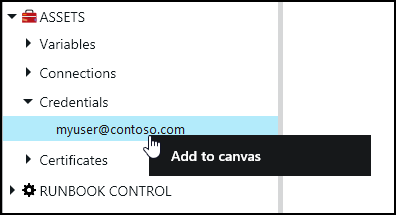
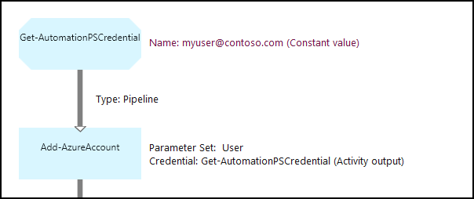

# Credential assets in Azure Automation

An Automation credential asset holds an object, which contains security credentials such as a username and password. Runbooks and DSC configurations may use cmdlets that accept a PSCredential object for authentication, or they may extract the username and password of the PSCredential object to provide to some application or service requiring authentication. The properties for a credential are stored securely in Azure Automation and can be accessed in the runbook or DSC configuration with the [Get-AutomationPSCredential](#activities) activity.

[!INCLUDE [gdpr-dsr-and-stp-note.md](../../../includes/gdpr-dsr-and-stp-note.md)]

> [!NOTE]
> Secure assets in Azure Automation include credentials, certificates, connections, and encrypted variables. These assets are encrypted and stored in Azure Automation using a unique key that is generated for each automation account. This key is stored in Key Vault. Before storing a secure asset, the key is loaded from Key Vault and then used to encrypt the asset.

## Azure Classic PowerShell cmdlets

The cmdlets in the following table are used to create and manage automation credential assets with Windows PowerShell.  They ship as part of the [Azure PowerShell module](/powershell/azure/overview), which is available for use in Automation runbooks and DSC configurations.

| Cmdlets | Description |
|:--- |:--- |
| [Get-AzureAutomationCredential](/powershell/module/servicemanagement/azure/get-azureautomationcredential) |Retrieves information about a credential asset. You can only retrieve the credential itself from **Get-AutomationPSCredential** activity. |
| [New-AzureAutomationCredential](/powershell/module/servicemanagement/azure/new-azureautomationcredential) |Creates a new Automation credential. |
| [Remove-AzureAutomationCredential](/powershell/module/servicemanagement/azure/new-azureautomationcredential) |Removes an Automation credential. |
| [Set-AzureAutomationCredential](/powershell/module/servicemanagement/azure/new-azureautomationcredential) |Sets the properties for an existing Automation credential. |

## AzureRM PowerShell cmdlets

For AzureRM, the cmdlets in the following table are used to create and manage automation credential assets with Windows PowerShell.  They ship as part of the [AzureRM.Automation module](/powershell/azure/overview), which is available for use in Automation runbooks and DSC configurations.

| Cmdlets | Description |
|:--- |:--- |
| [Get-AzureRmAutomationCredential](/powershell/module/azurerm.automation/get-azurermautomationcredential) |Retrieves information about a credential asset. This does not return a PSCredential object.  |
| [New-AzureRmAutomationCredential](/powershell/module/azurerm.automation/new-azurermautomationcredential) |Creates a new Automation credential. |
| [Remove-AzureRmAutomationCredential](/powershell/module/azurerm.automation/remove-azurermautomationcredential) |Removes an Automation credential. |
| [Set-AzureRmAutomationCredential](/powershell/module/azurerm.automation/set-azurermautomationcredential) |Sets the properties for an existing Automation credential. |

## Activities

The activities in the following table are used to access credentials in a runbook and DSC configurations.

| Activities | Description |
|:--- |:--- |
| Get-AutomationPSCredential |Gets a credential to use in a runbook or DSC configuration. Returns a [System.Management.Automation.PSCredential](/dotnet/api/system.management.automation.pscredential) object. |

> [!NOTE]
> You should avoid using variables in the –Name parameter of Get-AutomationPSCredential since this can complicate discovering dependencies between runbooks or DSC configurations, and credential assets at design time.

## Python2 functions

The function in the following table is used to access credentials in a Python2 runbook.

| Function | Description |
|:---|:---|
| automationassets.get_automation_credential | Retrieves information about a credential asset. |

> [!NOTE]
> You must import the "automationassets" module at the top of your Python runbook in order to access the asset functions.

## Creating a new credential asset

### To create a new credential asset with the Azure portal

1. From your automation account, select **Credentials** under **Shared Resources**.
1. Click **+ Add a credential**.
1. Complete the form and click **Create** to save the new credential.

> [!NOTE]
> User accounts that use multi-factor authentication are not supported for use in Azure Automation.

### To create a new credential asset with Windows PowerShell

The following sample commands show how to create a new automation credential. A PSCredential object is first created with the name and password and then used to create the credential asset. Alternatively, you could use the **Get-Credential** cmdlet to be prompted to type in a name and password.

```powershell
$user = "MyDomain\MyUser"
$pw = ConvertTo-SecureString "PassWord!" -AsPlainText -Force
$cred = New-Object –TypeName System.Management.Automation.PSCredential –ArgumentList $user, $pw
New-AzureAutomationCredential -AutomationAccountName "MyAutomationAccount" -Name "MyCredential" -Value $cred
```

## Using a PowerShell credential

You retrieve a credential asset in a runbook or DSC configuration with the **Get-AutomationPSCredential** activity. This returns a [PSCredential object](/dotnet/api/system.management.automation.pscredential) that you can use with an activity or cmdlet that requires a PSCredential parameter. You can also retrieve the properties of the credential object to use individually. The object has a property for the username and the secure password, or you can use the **GetNetworkCredential** method to return a [NetworkCredential](/dotnet/api/system.net.networkcredential) object that will provide an unsecured version of the password.

> [!NOTE]
> **Get-AzureRmAutomationCredential** does not return a **PSCredential** that can be used for authentication. It only provides information about the credential. If you need to use a credential in a runbook you must use the **Get-AutomationPSCredential** to retrieve the **PSCredential** object.

### Textual runbook sample

The following sample commands show how to use a PowerShell credential in a runbook. In this example, the credential is retrieved and its username and password assigned to variables.

```azurepowershell
$myCredential = Get-AutomationPSCredential -Name 'MyCredential'
$userName = $myCredential.UserName
$securePassword = $myCredential.Password
$password = $myCredential.GetNetworkCredential().Password
```

You can also use a credential to authenticate to Azure with [Connect-AzureRmAccount](/powershell/module/azurerm.profile/connect-azurermaccount). Under most circumstances, you should use a [Run As account](../manage-runas-account.md) and retrieve it with [Get-AutomationConnection](../automation-connections.md).

```azurepowershell
$myCred = Get-AutomationPSCredential -Name 'MyCredential'
$userName = $myCred.UserName
$securePassword = $myCred.Password
$password = $myCred.GetNetworkCredential().Password

$myPsCred = New-Object System.Management.Automation.PSCredential ($userName,$password)

Connect-AzureRmAccount -Credential $myPsCred
```

### Graphical runbook sample

You add a **Get-AutomationPSCredential** activity to a graphical runbook by right-clicking on the credential in the Library pane of the graphical editor and selecting **Add to canvas**.



The following image shows an example of using a credential in a graphical runbook.  In this case, it's being used to provide authentication for a runbook to Azure resources as described in [Authenticate Runbooks with Azure AD User account](../automation-create-aduser-account.md).  The first activity retrieves the credential that has access to the Azure subscription.  The **Add-AzureAccount** activity then uses this credential to provide authentication for any activities that come after it.  A [pipeline link](../automation-graphical-authoring-intro.md#links-and-workflow) is here since **Get-AutomationPSCredential** is expecting a single object.  



## Using a PowerShell credential in DSC

While DSC configurations in Azure Automation can reference credential assets using **Get-AutomationPSCredential**, credential assets can also be passed in via parameters, if wanted. For more information, see [Compiling configurations in Azure Automation DSC](../automation-dsc-compile.md#credential-assets).

## Using credentials in Python2

The following sample shows an example of accessing credentials in Python2 runbooks.

```python
import automationassets
from automationassets import AutomationAssetNotFound

# get a credential
cred = automationassets.get_automation_credential("credtest")
print cred["username"]
print cred["password"]
```

## Next steps

* To learn more about links in graphical authoring, see [Links in graphical authoring](../automation-graphical-authoring-intro.md#links-and-workflow)
* To understand the different authentication methods with Automation, see [Azure Automation Security](../automation-security-overview.md)
* To get started with Graphical runbooks, see [My first graphical runbook](../automation-first-runbook-graphical.md)
* To get started with PowerShell workflow runbooks, see [My first PowerShell workflow runbook](../automation-first-runbook-textual.md)
* To get started with Python2 runbooks, see [My first Python2 runbook](../automation-first-runbook-textual-python2.md) 
