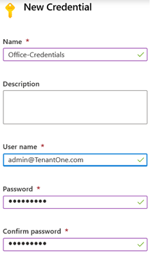

# Credential assets in Azure Automation

An Automation credential asset holds an object that contains security credentials, such as a user name and a password. Runbooks and DSC configurations use cmdlets that accept a [PSCredential](https://docs.microsoft.com/dotnet/api/system.management.automation.pscredential?view=pscore-6.2.0) object for authentication. Alternatively, they can extract the user name and password of the `PSCredential` object to provide to some application or service requiring authentication. 

Azure Automation securely stores the properties of a credential. Access to the properties through a runbook or DSC configuration uses the [Get-AutomationPSCredential](#activities-used-to-access-credentials) activity.

> [!NOTE]
> Secure assets in Azure Automation include credentials, certificates, connections, and encrypted variables. These assets are encrypted and stored in Azure Automation using a unique key that is generated for each Automation account. This key is stored in Key Vault. Before storing a secure asset, the key is loaded from Key Vault and then used to encrypt the asset.

[!INCLUDE [gdpr-dsr-and-stp-note.md](../../../includes/gdpr-dsr-and-stp-note.md)]

## Azure PowerShell Az cmdlets used for credential assets

As part of the Azure PowerShell Az module, the cmdlets in the following table are used to create and manage Automation credential assets with Windows PowerShell. They ship in the [Az.Automation module](/powershell/azure/new-azureps-module-az?view=azps-1.1.0), which is available for use in Automation runbooks and DSC configurations. See [Az module support in Azure Automation](https://docs.microsoft.com/azure/automation/az-modules).

| Cmdlet | Description |
|:--- |:--- |
| [Get-AzAutomationCredential](/powershell/module/az.automation/get-azautomationcredential?view=azps-3.3.0) |Retrieves information about a credential asset. This cmdlet doesn't return a `PSCredential` object.  |
| [New-AzAutomationCredential](/powershell/module/az.automation/new-azautomationcredential?view=azps-3.3.0) |Creates a new Automation credential. |
| [Remove-AzAutomationCredential](/powershell/module/az.automation/remove-azautomationcredential?view=azps-3.3.0) |Removes an Automation credential. |
| [Set-AzAutomationCredential](/powershell/module/az.automation/set-azautomationcredential?view=azps-3.3.0) |Sets the properties for an existing Automation credential. |

## Activities used to access credentials

The activities in the following table are used to access credentials in runbooks and DSC configurations.

| Activity | Description |
|:--- |:--- |
| `Get-AutomationPSCredential` |Gets a credential to use in a runbook or DSC configuration. The credential is in the form of a `PSCredential` object. |
| [Get-Credential](https://docs.microsoft.com/powershell/module/microsoft.powershell.security/get-credential?view=powershell-7) |Gets a credential with a prompt for user name and password. |
| [New-AzureAutomationCredential](https://docs.microsoft.com/powershell/module/servicemanagement/azure/new-azureautomationcredential?view=azuresmps-4.0.0) | Creates a credential asset. |

For local development using the Azure Automation Authoring Toolkit, the `Get-AutomationPSCredential`  cmdlet is part of assembly [AzureAutomationAuthoringToolkit](https://www.powershellgallery.com/packages/AzureAutomationAuthoringToolkit/0.2.3.9). For Azure working with the Automation context, the cmdlet is in `Orchestrator.AssetManagement.Cmdlets`. See [Manage modules in Azure Automation](modules.md).

To retrieve `PSCredential` objects in your code, you can install the [Microsoft Azure Automation ISE add-on for the PowerShell ISE](https://github.com/azureautomation/azure-automation-ise-addon).

```azurepowershell
Install-Module AzureAutomationAuthoringToolkit -Scope CurrentUser -Force
```

Your script can also import the required module where needed, as in the following example: 

```azurepowershell
Import-Module Orchestrator.AssetManagement.Cmdlets -ErrorAction SilentlyContinue
```

> [!NOTE]
> You should avoid using variables in the `Name` parameter of `Get-AutomationPSCredential`. Their use can complicate discovery of dependencies between runbooks or DSC configurations and credential assets at design time.

## Python2 functions that access credentials

The function in the following table is used to access credentials in a Python2 runbook.

| Function | Description |
|:---|:---|
| `automationassets.get_automation_credential` | Retrieves information about a credential asset. |

> [!NOTE]
> Import the `automationassets` module at the top of your Python runbook to access the asset functions.

## Creating a new credential asset

You can create a new credential asset using the Azure portal or using Windows PowerShell.

### Create a new credential asset with the Azure portal

1. From your Automation account, select **Credentials** under **Shared Resources**.
1. Select **Add a credential**.
2. In the New Credential pane, enter an appropriate credential name following your naming standards. 
3. Type your access ID in the **User name** field. 
4. For both password fields, enter your secret access key.

    

5. If the multi-factor authentication box is checked, uncheck it. 
6. Click **Create** to save the new credential asset.

> [!NOTE]
> Azure Automation does not support user accounts that use multi-factor authentication.

### Create a new credential asset with Windows PowerShell

The following example shows how to create a new Automation credential asset. A `PSCredential` object is first created with the name and password, and then used to create the credential asset. Instead, you can use the `Get-Credential` cmdlet to prompt the user to type in a name and password.

```powershell
$user = "MyDomain\MyUser"
$pw = ConvertTo-SecureString "PassWord!" -AsPlainText -Force
$cred = New-Object –TypeName System.Management.Automation.PSCredential –ArgumentList $user, $pw
New-AzureAutomationCredential -AutomationAccountName "MyAutomationAccount" -Name "MyCredential" -Value $cred
```

## Using a PowerShell credential

A runbook or DSC configuration retrieves a credential asset with the `Get-AutomationPSCredential` activity. This activity retrieves a `PSCredential` object that you can use with an activity or cmdlet that requires a credential. You can also retrieve the properties of the credential object to use individually. The object has properties for the user name and the secure password. Alternatively, you can use the [GetNetworkCredential](https://docs.microsoft.com/dotnet/api/system.management.automation.pscredential.getnetworkcredential?view=pscore-6.2.0) method to retrieve a [NetworkCredential](/dotnet/api/system.net.networkcredential) object that represents an unsecured version of the password.

> [!NOTE]
> `Get-AzAutomationCredential` does not retrieve a `PSCredential` object that can be used for authentication. It only provides information about the credential. If you need to use a credential in a runbook, you must retrieve it as a `PSCredential` object using `Get-AutomationPSCredential`.

### Textual runbook example

The following example shows how to use a PowerShell credential in a runbook. It retrieves the credential and assigns its user name and password to variables.


```azurepowershell
$myCredential = Get-AutomationPSCredential -Name 'MyCredential'
$userName = $myCredential.UserName
$securePassword = $myCredential.Password
$password = $myCredential.GetNetworkCredential().Password
```

You can also use a credential to authenticate to Azure with [Connect-AzAccount](/powershell/module/az.accounts/connect-azaccount?view=azps-3.3.0). Under most circumstances, you should use a [Run As account](../manage-runas-account.md) and retrieve the connection with [Get-AzAutomationConnection](../automation-connections.md).


```azurepowershell
$myCred = Get-AutomationPSCredential -Name 'MyCredential'
$userName = $myCred.UserName
$securePassword = $myCred.Password
$password = $myCred.GetNetworkCredential().Password

$myPsCred = New-Object System.Management.Automation.PSCredential ($userName,$password)

Connect-AzAccount -Credential $myPsCred
```

### Graphical runbook example

You can add a `Get-AutomationPSCredential` activity to a graphical runbook by right-clicking on the credential in the Library pane of the graphical editor and selecting **Add to canvas**.


The following image shows an example of using a credential in a graphical runbook. In this case, the credential provides authentication for a runbook to Azure resources, as described in [Use Azure AD in Azure Automation to authenticate to Azure](../automation-use-azure-ad.md). The first activity retrieves the credential that has access to the Azure subscription. The account connection activity then uses this credential to provide authentication for any activities that come after it. A [pipeline link](../automation-graphical-authoring-intro.md#links-and-workflow) is used here since `Get-AutomationPSCredential` is expecting a single object.  


## Using credentials in a DSC configuration

While DSC configurations in Azure Automation can work with credential assets using `Get-AutomationPSCredential`, they can also pass credential assets via parameters. For more information, see [Compiling configurations in Azure Automation DSC](../automation-dsc-compile.md#credential-assets).

## Using credentials in Python2

The following example shows an example of accessing credentials in Python2 runbooks.


```python
import automationassets
from automationassets import AutomationAssetNotFound

# get a credential
cred = automationassets.get_automation_credential("credtest")
print cred["username"]
print cred["password"]
```

## Next steps

* To learn more about links in graphical authoring, see [Links in graphical authoring](../automation-graphical-authoring-intro.md#links-and-workflow).
* To understand the different authentication methods for Automation, see [Azure Automation Security](../automation-security-overview.md).
* To get started with graphical runbooks, see [My first graphical runbook](../automation-first-runbook-graphical.md).
* To get started with PowerShell workflow runbooks, see [My first PowerShell workflow runbook](../automation-first-runbook-textual.md).
* To get started with Python2 runbooks, see [My first Python2 runbook](../automation-first-runbook-textual-python2.md). 
