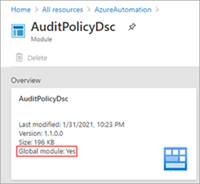
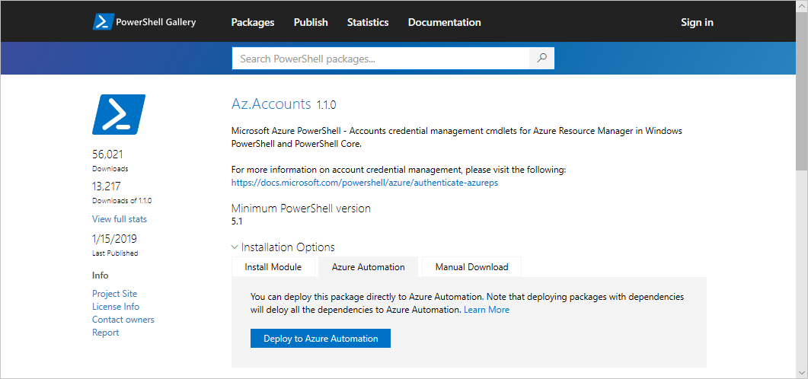
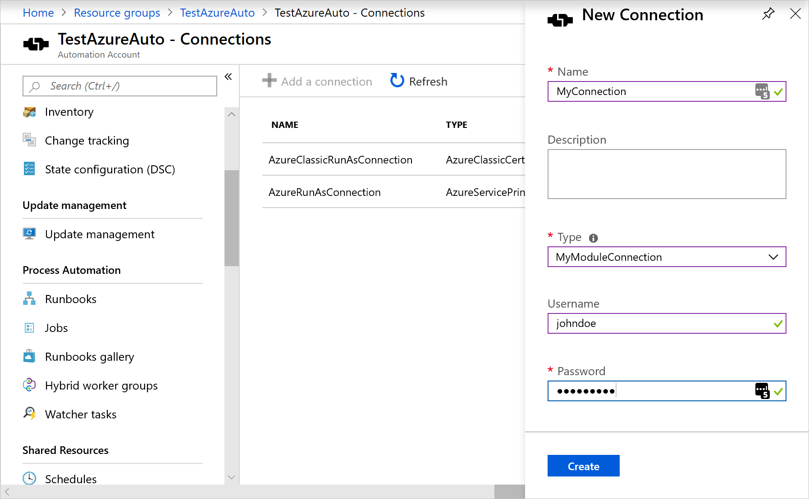
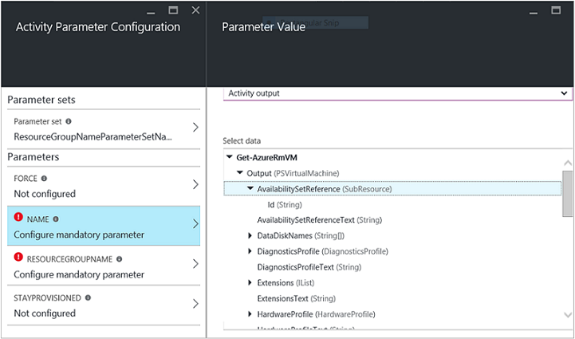
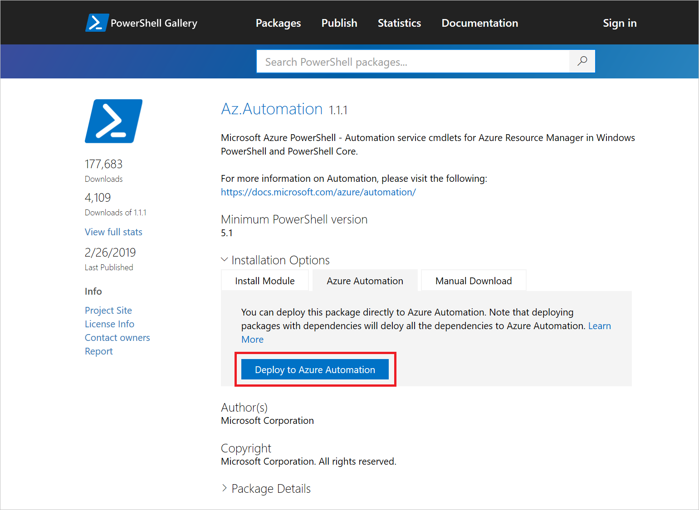
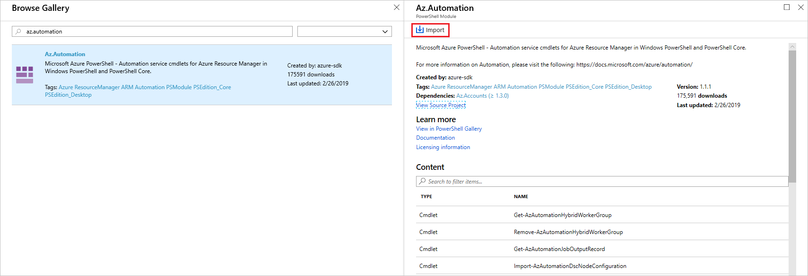

# Manage modules in Azure Automation

Azure Automation uses a number of PowerShell modules to enable cmdlets in runbooks and DSC resources in DSC configurations. Supported modules include:

* [Azure PowerShell Az.Automation](/powershell/azure/new-azureps-module-az).
* [Azure PowerShell AzureRM.Automation](/powershell/module/azurerm.automation/).
* Other PowerShell modules.
* Internal `Orchestrator.AssetManagement.Cmdlets` module.
* Python 2 modules.
* Custom modules that you create.

When you create an Automation account, Azure Automation imports some modules by default. See [Default modules](#default-modules).

## Sandboxes

When Automation executes runbook and DSC compilation jobs, it loads the modules into sandboxes where the runbooks can run and the DSC configurations can compile. Automation also automatically places any DSC resources in modules on the DSC pull server. Machines can pull the resources when they apply the DSC configurations.

>[!NOTE]
>Be sure to import only the modules that your runbooks and DSC configurations require. We don’t recommend importing the root Az module. It includes many other modules that you might not need, which can cause performance problems. Import individual modules, such as Az.Compute, instead.

Cloud sandbox supports a maximum of 48 system calls, and restricts all other calls for security reasons. Other functionality such as credential management and some networking is not supported in the cloud sandbox.

Due to the number of modules and cmdlets included, it's difficult to know beforehand which of the cmdlets will make unsupported calls. Generally, we have seen issues with cmdlets which require elevated access, require a credential as a parameter, or cmdlets related to networking. Any cmdlets that perform full stack network operations are not supported in the sandbox, including [Connect-AipService](/powershell/module/aipservice/connect-aipservice) from the AIPService PowerShell module and [Resolve-DnsName](/powershell/module/dnsclient/resolve-dnsname) from the DNSClient module.

These are known limitations with the sandbox. The recommended workaround is to deploy a [Hybrid Runbook Worker](../automation-hybrid-runbook-worker.md) or use [Azure Functions](../../azure-functions/functions-overview.md).

## Default modules

The following table lists modules that Azure Automation imports by default when you create your Automation account. Automation can import newer versions of these modules. However, you can't remove the original version from your Automation account, even if you delete a newer version. Note that these default modules include several AzureRM modules.

The default modules are also known as global modules. In the Azure portal,  the **Global module** property will be **true** when viewing a module that was imported when the account was created.



Automation doesn't import the root Az module automatically into any new or existing Automation accounts. For more about working with these modules, see [Migrating to Az modules](#migrate-to-az-modules).

> [!NOTE]
> We don't recommend altering modules and runbooks in Automation accounts used for deployment of the [Start/Stop VMs during off-hours](../automation-solution-vm-management.md) feature.

|Module name|Version|
|---|---|
| AuditPolicyDsc | 1.1.0.0 |
| Azure | 1.0.3 |
| Azure.Storage | 1.0.3 |
| AzureRM.Automation | 1.0.3 |
| AzureRM.Compute | 1.2.1 |
| AzureRM.Profile | 1.0.3 |
| AzureRM.Resources | 1.0.3 |
| AzureRM.Sql | 1.0.3 |
| AzureRM.Storage | 1.0.3 |
| ComputerManagementDsc | 5.0.0.0 |
| GPRegistryPolicyParser | 0.2 |
| Microsoft.PowerShell.Core | 0 |
| Microsoft.PowerShell.Diagnostics |  |
| Microsoft.PowerShell.Management |  |
| Microsoft.PowerShell.Security |  |
| Microsoft.PowerShell.Utility |  |
| Microsoft.WSMan.Management |  |
| Orchestrator.AssetManagement.Cmdlets | 1 |
| PSDscResources | 2.9.0.0 |
| SecurityPolicyDsc | 2.1.0.0 |
| StateConfigCompositeResources | 1 |
| xDSCDomainjoin | 1.1 |
| xPowerShellExecutionPolicy | 1.1.0.0 |
| xRemoteDesktopAdmin | 1.1.0.0 |

## Az modules

For Az.Automation, the majority of the cmdlets have the same names as those used for the AzureRM modules, except that the `AzureRM` prefix has been changed to `Az`. For a list of Az modules that don't follow this naming convention, see the [list of exceptions](/powershell/azure/migrate-from-azurerm-to-az#update-cmdlets-modules-and-parameters).

## Internal cmdlets

Azure Automation supports the internal `Orchestrator.AssetManagement.Cmdlets` module for the Log Analytics agent for Windows, installed by default. The following table defines the internal cmdlets. These cmdlets are designed to be used instead of Azure PowerShell cmdlets to interact with shared resources. They can retrieve secrets from encrypted variables, credentials, and encrypted connections.

>[!NOTE]
>The internal cmdlets are only available when you're executing runbooks in the Azure sandbox environment, or on a Windows Hybrid Runbook Worker. 

|Name|Description|
|---|---|
|Get-AutomationCertificate|`Get-AutomationCertificate [-Name] <string> [<CommonParameters>]`|
|Get-AutomationConnection|`Get-AutomationConnection [-Name] <string> [-DoNotDecrypt] [<CommonParameters>]` |
|Get-AutomationPSCredential|`Get-AutomationPSCredential [-Name] <string> [<CommonParameters>]` |
|Get-AutomationVariable|`Get-AutomationVariable [-Name] <string> [-DoNotDecrypt] [<CommonParameters>]`|
|Set-AutomationVariable|`Set-AutomationVariable [-Name] <string> -Value <Object> [<CommonParameters>]` |
|Start-AutomationRunbook|`Start-AutomationRunbook [-Name] <string> [-Parameters <IDictionary>] [-RunOn <string>] [-JobId <guid>] [<CommonParameters>]`|
|Wait-AutomationJob|`Wait-AutomationJob -Id <guid[]> [-TimeoutInMinutes <int>] [-DelayInSeconds <int>] [-OutputJobsTransitionedToRunning] [<CommonParameters>]`|

Note that the internal cmdlets differ in naming from the Az and AzureRM cmdlets. Internal cmdlet names don't contain words like `Azure` or `Az` in the noun, but do use the word `Automation`. We recommend their use over the use of Az or AzureRM cmdlets during runbook execution in an Azure sandbox or on a Windows Hybrid Runbook Worker. They require fewer parameters and run in the context of your job that's already running.

Use Az or AzureRM cmdlets for manipulating Automation resources outside the context of a runbook. 

## Python modules

You can create Python 2 runbooks in Azure Automation. For Python module information, see [Manage Python 2 packages in Azure Automation](../python-packages.md).

## Custom modules

Azure Automation supports custom PowerShell modules that you create to use with your runbooks and DSC configurations. One type of custom module is an integration module that optionally contains a file of metadata to define the custom functionality for the module cmdlets. An example of the use of an integration module is provided in [Add a connection type](../automation-connections.md#add-a-connection-type).

Azure Automation can import a custom module to make its cmdlets available. Behind the scenes, it stores the module and uses it in the Azure sandboxes, just like it does other modules.

## Migrate to Az modules

This section tells how to migrate to the Az modules in Automation. For more information, see [Migrate Azure PowerShell from AzureRM to Az](/powershell/azure/migrate-from-azurerm-to-az).

We don't recommend running AzureRM modules and Az modules in the same Automation account. When you're sure you want to migrate from AzureRM to Az, it's best to fully commit to a complete migration. Automation often reuses sandboxes within the Automation account to save on startup times. If you don't make a full module migration, you might start a job that uses only AzureRM modules, and then start another job that uses only Az modules. The sandbox soon crashes, and you receive an error stating that the modules aren’t compatible. This situation results in randomly occurring crashes for any particular runbook or configuration.

>[!NOTE]
>When you create a new Automation account, even after migration to Az modules, Automation installs the AzureRM modules by default. You can still update the tutorial runbooks with the AzureRM cmdlets. However, you shouldn't run these runbooks.

### Test your runbooks and DSC configurations prior to module migration

Be sure to test all runbooks and DSC configurations carefully, in a separate Automation account, before migrating to the Az modules. 

### Stop and unschedule all runbooks that use AzureRM modules

To ensure that you don't run any existing runbooks or DSC configurations that use AzureRM modules, you must stop and unschedule all affected runbooks and configurations. First, make sure that you review each runbook or DSC configuration and its schedules separately, to ensure that you can reschedule the item in the future if necessary.

When you're ready to remove your schedules, you can either use the Azure portal or the [Remove-AzureRmAutomationSchedule](/powershell/module/azurerm.automation/remove-azurermautomationschedule) cmdlet. See [Remove a schedule](schedules.md#remove-a-schedule).

### Remove AzureRM modules

It's possible to remove the AzureRM modules before you import the Az modules. However, if you do, you can interrupt source control synchronization and cause any scripts that are still scheduled to fail. If you decide to remove the modules, see [Uninstall AzureRM](/powershell/azure/migrate-from-azurerm-to-az#uninstall-azurerm).

### Import Az modules

Importing an Az module into your Automation account doesn't automatically import the module into the PowerShell session that runbooks use. Modules are imported into the PowerShell session in the following situations:

* When a runbook invokes a cmdlet from a module.
* When a runbook imports the module explicitly with the [Import-Module](/powershell/module/microsoft.powershell.core/import-module) cmdlet.
* When a runbook imports the module explicitly with the [using module](/powershell/module/microsoft.powershell.core/about/about_using#module-syntax) statement. The using statement is supported starting with Windows PowerShell 5.0 and supports classes and enum type import.
* When a runbook imports another dependent module.

You can import the Az modules into the Automation account from the Azure portal. Remember to import only the Az modules that you need, not every Az module that's available. Because [Az.Accounts](https://www.powershellgallery.com/packages/Az.Accounts/1.1.0) is a dependency for the other Az modules, be sure to import this module before any others.

1. From your Automation account, under **Shared Resources**, select **Modules**.
2. Select **Browse Gallery**.  
3. In the search bar, enter the module name (for example, `Az.Accounts`).
4. On the PowerShell Module page, select **Import** to import the module into your Automation account.

    

You can also do this import through the [PowerShell Gallery](https://www.powershellgallery.com), by searching for the module to import. When you find the module, select it, and choose the **Azure Automation** tab. Select **Deploy to Azure Automation**.



### Test your runbooks

After you've imported the Az modules into the Automation account, you can start editing your runbooks and DSC configurations to use the new modules. One way to test the modification of a runbook to use the new cmdlets is by using the `Enable-AzureRmAlias -Scope Process` command at the beginning of the runbook. By adding this command to your runbook, the script can run without changes.

## Author modules

We recommend that you follow the considerations in this section when you author a custom PowerShell module for use in Azure Automation. To prepare your module for import, you must create at least a .psd1, .psm1, or PowerShell module **.dll** file with the same name as the module folder. Then you zip up the module folder so that Azure Automation can import it as a single file. The **.zip** package should have the same name as the contained module folder.

To learn more about authoring a PowerShell module, see [How to Write a PowerShell Script Module](/powershell/scripting/developer/module/how-to-write-a-powershell-script-module).

### Version folder

PowerShell side-by-side module versioning allows you to use more than one version of a module within PowerShell. This can be useful if you have older scripts that have been tested and only work against a certain version of a PowerShell module, but other scripts require a newer version of the same PowerShell module.

To construct PowerShell modules so they contain multiple versions, create the module folder and then create a folder within this module folder for each version of the module you want to be usable. In the following example, a module called *TestModule* provides two versions, 1.0.0 and 2.0.0.

```dos
TestModule
   1.0.0
   2.0.0
```

Within each of the version folders, copy your PowerShell .psm1, .psd1, or PowerShell module **.dll** files that make up a module into the respective version folder. Zip up the module folder so that Azure Automation can import it as a single .zip file. While Automation only shows the highest version of the module imported, if the module package contains side-by-side versions of the module, they are all available for use in your runbooks or DSC configurations.  

While Automation supports modules containing side-by-side versions within the same package, it does not support using multiple versions of a module across module package imports. For example, you import **module A**, which contains versions 1 and 2 into your Automation account. Later you update **module A** to include versions 3 and 4, when you import into your Automation account, only versions 3 and 4 are usable within any runbooks or DSC configurations. If you require all versions - 1, 2, 3, and 4 to be available, the .zip file your import should contain versions 1, 2, 3, and 4.

If you’re going to use different versions of the same module between runbooks, you should always declare the version you want to use in your runbook using the `Import-Module` cmdlet and include the parameter `-RequiredVersion <version>`. Even if the version you want to use is the latest version. This is because runbook jobs may run in the same sandbox. If the sandbox has already explicitly loaded a module of a certain version number, because a previous job in that sandbox said to do so, future jobs in that sandbox won't automatically load the latest version of that module. This is because some version of it is already loaded in the sandbox.

For a DSC resource, use the following command to specify a particular version:

```powershell
Import-DscResource -ModuleName <ModuleName> -ModuleVersion <version>
```

### Help information

Include a synopsis, description, and help URI for every cmdlet in your module. In PowerShell, you can define help information for cmdlets by using the `Get-Help` cmdlet. The following example shows how to define a synopsis and help URI in a **.psm1** module file.

  ```powershell
  <#
       .SYNOPSIS
        Gets a Contoso User account
  #>
  function Get-ContosoUser {
  [CmdletBinding](DefaultParameterSetName='UseConnectionObject', `
  HelpUri='https://www.contoso.com/docs/information')]
  [OutputType([String])]
  param(
     [Parameter(ParameterSetName='UserAccount', Mandatory=true)]
     [ValidateNotNullOrEmpty()]
     [string]
     $UserName,

     [Parameter(ParameterSetName='UserAccount', Mandatory=true)]
     [ValidateNotNullOrEmpty()]
     [string]
     $Password,

     [Parameter(ParameterSetName='ConnectionObject', Mandatory=true)]
     [ValidateNotNullOrEmpty()]
     [Hashtable]
     $Connection
  )

  switch ($PSCmdlet.ParameterSetName) {
     "UserAccount" {
        $cred = New-Object -TypeName System.Management.Automation.PSCredential -ArgumentList $UserName, $Password
        Connect-Contoso -Credential $cred
     }
     "ConnectionObject" {
        Connect-Contoso -Connection $Connection
    }
  }
  }
  ```

  Providing this information shows help text via the `Get-Help` cmdlet in the PowerShell console. This text is also displayed in the Azure portal.

  

### Connection type

If the module connects to an external service, define a connection type by using a [custom integration module](#custom-modules). Each cmdlet in the module should accept an instance of that connection type (connection object) as a parameter. Users map parameters of the connection asset to the cmdlet's corresponding parameters each time they call a cmdlet.



The following runbook example uses a Contoso connection asset called `ContosoConnection` to access Contoso resources and return data from the external service. In this example, the fields are mapped to the `UserName` and `Password` properties of a `PSCredential` object and then passed to the cmdlet.

  ```powershell
  $contosoConnection = Get-AutomationConnection -Name 'ContosoConnection'

  $cred = New-Object -TypeName System.Management.Automation.PSCredential -ArgumentList $contosoConnection.UserName, $contosoConnection.Password
  Connect-Contoso -Credential $cred
  }
  ```

An easier and better way to approach this behavior is by directly passing the connection object to the cmdlet:

  ```powershell
  $contosoConnection = Get-AutomationConnection -Name 'ContosoConnection'

  Connect-Contoso -Connection $contosoConnection
  }
  ```

You can enable similar behavior for your cmdlets by allowing them to accept a connection object directly as a parameter, instead of just connection fields for parameters. Usually you want a parameter set for each, so that a user who isn't using Automation can call your cmdlets without constructing a hashtable to act as the connection object. The parameter set `UserAccount` is used to pass the connection field properties. `ConnectionObject` lets you pass the connection straight through.

### Output type

Define the output type for all cmdlets in your module. Defining an output type for a cmdlet allows design-time IntelliSense to help determine the output properties of the cmdlet during authoring. This practice is especially helpful during graphical runbook authoring, for which design-time knowledge is key to an easy user experience with your module.

Add `[OutputType([<MyOutputType>])]`, where `MyOutputType` is a valid type. To learn more about `OutputType`, see [About Functions OutputTypeAttribute](/powershell/module/microsoft.powershell.core/about/about_functions_outputtypeattribute). The following code is an example of adding `OutputType` to a cmdlet:

  ```powershell
  function Get-ContosoUser {
  [OutputType([String])]
  param(
     [string]
     $Parameter1
  )
  # <script location here>
  }
  ```

  

  This behavior is similar to the "type ahead" functionality of a cmdlet's output in the PowerShell integration service environment, without having to run it.

  

### Cmdlet state

Make all cmdlets in your module stateless. Multiple runbook jobs can simultaneously run in the same `AppDomain` and the same process and sandbox. If there is any state shared on those levels, jobs can affect each other. This behavior can lead to intermittent and hard-to-diagnose issues. Here is an example of what not to do:

  ```powershell
  $globalNum = 0
  function Set-GlobalNum {
     param(
         [int] $num
     )

     $globalNum = $num
  }
  function Get-GlobalNumTimesTwo {
     $output = $globalNum * 2

     $output
  }
  ```

### Module dependency

Ensure that the module is fully contained in a package that can be copied by using xcopy. Automation modules are distributed to the Automation sandboxes when runbooks execute. The modules must work independently of the host that runs them.

You should be able to zip up and move a module package, and have it function as normal when it's imported into another host's PowerShell environment. For this to happen, ensure that the module doesn't depend on any files outside the module folder that is zipped up when the module is imported into Automation.

Your module shouldn't depend on any unique registry settings on a host. Examples are the settings that are made when a product is installed.

### Module file paths

Make sure that all files in the module have paths with fewer than 140 characters. Any paths over 140 characters in length cause problems with importing runbooks. Automation can't import a file with path size over 140 characters into the PowerShell session with `Import-Module`.

## Import modules

This section defines several ways that you can import a module into your Automation account.

### Import modules in the Azure portal

To import a module in the Azure portal:

1. Go to your Automation account.
2. Under **Shared Resources**, select **Modules**.
3. Select **Add a module**.
4. Select the **.zip** file that contains your module.
5. Select **OK** to start to import process.

### Import modules by using PowerShell

You can use the [New-AzAutomationModule](/powershell/module/az.automation/new-azautomationmodule) cmdlet to import a module into your Automation account. The cmdlet takes a URL for a module .zip package.

```azurepowershell-interactive
New-AzAutomationModule -Name <ModuleName> -ContentLinkUri <ModuleUri> -ResourceGroupName <ResourceGroupName> -AutomationAccountName <AutomationAccountName>
```

You can also use the same cmdlet to import a module from the PowerShell Gallery directly. Make sure to grab `ModuleName` and `ModuleVersion` from the [PowerShell Gallery](https://www.powershellgallery.com).

```azurepowershell-interactive
$moduleName = <ModuleName>
$moduleVersion = <ModuleVersion>
New-AzAutomationModule -AutomationAccountName <AutomationAccountName> -ResourceGroupName <ResourceGroupName> -Name $moduleName -ContentLinkUri "https://www.powershellgallery.com/api/v2/package/$moduleName/$moduleVersion"
```

### Import modules from the PowerShell Gallery

You can import [PowerShell Gallery](https://www.powershellgallery.com) modules either directly from the Gallery or from your Automation account.

To import a module directly from the PowerShell Gallery:

1. Go to https://www.powershellgallery.com and search for the module to import.
2. Under **Installation Options**, on the **Azure Automation** tab, select **Deploy to Azure Automation**. This action opens the Azure portal. 
3. On the Import page, select your Automation account, and select **OK**.



To import a PowerShell Gallery module directly from your Automation account:

1. Under **Shared Resources**, select **Modules**. 
2. Select **Browse gallery**, and then search the Gallery for a module. 
3. Select the module to import, and select **Import**. 
4. Select **OK** to start the import process.



## Delete modules

If you have problems with a module, or you need to roll back to a previous version of a module, you can delete it from your Automation account. You can't delete the original versions of the [default modules](#default-modules) that are imported when you create an Automation account. If the module to delete is a newer version of one of the [default modules](#default-modules), it rolls back to the version that was installed with your Automation account. Otherwise, any module you delete from your Automation account is removed.

### Delete modules in the Azure portal

To remove a module in the Azure portal:

1. Go to your Automation account. Under **Shared Resources**, select **Modules**.
2. Select the module you want to remove.
3. On the Module page, select **Delete**. If this module is one of the [default modules](#default-modules), it rolls back to the version that existed when the Automation account was created.

### Delete modules by using PowerShell

To remove a module through PowerShell, run the following command:

```azurepowershell-interactive
Remove-AzAutomationModule -Name <moduleName> -AutomationAccountName <automationAccountName> -ResourceGroupName <resourceGroupName>
```

## Next steps

* For more information about using Azure PowerShell modules, see [Get started with Azure PowerShell](/powershell/azure/get-started-azureps).

* To learn more about creating PowerShell modules, see [Writing a Windows PowerShell module](/powershell/scripting/developer/module/writing-a-windows-powershell-module).
