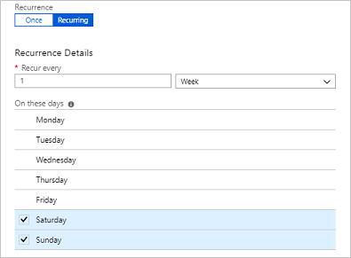
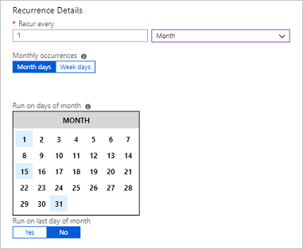

# Scheduling a runbook in Azure Automation

To schedule a runbook in Azure Automation to start at a specified time, you link it to one or more schedules. A schedule can be configured to either run once or on a reoccurring hourly or daily schedule for runbooks in the Azure  portal. You can also schedule them for weekly, monthly, specific days of the week or days of the month, or a particular day of the month. A runbook can be linked to multiple schedules, and a schedule can have multiple runbooks linked to it.

> [!NOTE]
> Schedules do not currently support Azure Automation DSC configurations.

## PowerShell Cmdlets

The cmdlets in the following table are used to create and manage schedules with PowerShell in Azure Automation. They ship as part of the [Azure PowerShell module](/powershell/azure/overview).

| Cmdlets | Description |
|:--- |:--- |
| [Get-AzureRmAutomationSchedule](/powershell/module/azurerm.automation/get-azurermautomationschedule) |Retrieves a schedule. |
| [New-AzureRmAutomationSchedule](/powershell/module/azurerm.automation/new-azurermautomationschedule) |Creates a new schedule. |
| [Remove-AzureRmAutomationSchedule](/powershell/module/azurerm.automation/remove-azurermautomationschedule) |Removes a schedule. |
| [Set-AzureRmAutomationSchedule](/powershell/module/azurerm.automation/set-azurermautomationschedule) |Sets the properties for an existing schedule. |
| [Get-AzureRmAutomationScheduledRunbook](/powershell/module/azurerm.automation/get-azurermautomationscheduledrunbook) |Retrieves scheduled runbooks. |
| [Register-AzureRmAutomationScheduledRunbook](/powershell/module/azurerm.automation/register-azurermautomationscheduledrunbook) |Associates a runbook with a schedule. |
| [Unregister-AzureRmAutomationScheduledRunbook](/powershell/module/azurerm.automation/unregister-azurermautomationscheduledrunbook) |Dissociates a runbook from a schedule. |

## Creating a schedule

You can create a new schedule for runbooks in the Azure portal or with PowerShell.

> [!NOTE]
> Azure Automation uses the latest modules in your Automation account when a new scheduled job is run.  To avoid impacting your runbooks and the processes they automate, you should first test any runbooks that have linked schedules with an Automation account dedicated for testing.  This validates your scheduled runbooks continue to work correctly and if not, you can further troubleshoot and apply any changes required before migrating the updated runbook version to production.
> Your Automation account does not automatically get any new versions of modules unless you have updated them manually by selecting the [Update Azure Modules](../automation-update-azure-modules.md) option from the **Modules**.

### To create a new schedule in the Azure portal

1. In the Azure portal, from your automation account, select **Schedules** under the section **Shared Resources** on the left.
2. Click **Add a schedule** at the top of the page.
3. On the **New schedule** pane, type a **Name** and optionally a **Description** for the new schedule.
4. Select whether the schedule runs one time, or on a reoccurring schedule by selecting **Once** or **Recurring**. If you select **Once** specify a **Start time**, and then click **Create**. If you select **Recurring**, specify a **Start time** and for **Recur every**, select the frequency for how often you want the runbook to repeat - by **hour**, **day**, **week**, or by **month**.
    1. If you select **week**, you're provided a list of the days of the week to choose from. Select as many days as you want. The first run of your schedule will happen on the first day selected after the start time. For example, to choose a weekend schedule, choose **Saturday** and **Sunday**.

       

    2. If you select **month**, you're given different options. For the **Monthly occurrences** option, select either **Month days** or **Week days**. If you choose **Month days**, a calendar is shown that allows you to choose as many days as you want. If you choose a date such as the 31st that doesn't occur in the current month, the schedule won't run. If you want the schedule to run on the last day, choose **Yes** under **Run on last day of month**. If you choose **Week days**, the **Recur every** option is presented. Choose **First**, **Second**, **Third**, **Fourth**, or **Last**. Finally choose a day to repeat on.

       

5. When done click **Create**.

### To create a new schedule with PowerShell

You use the [New-AzureRmAutomationSchedule](/powershell/module/azurerm.automation/new-azurermautomationschedule) cmdlet to create schedules. You specify the start time for the schedule and the frequency it should run. The following examples show how to create many different schedule scenarios.

#### Create a one time schedule

The following sample commands create a one time schedule.

```azurepowershell-interactive
$TimeZone = ([System.TimeZoneInfo]::Local).Id
New-AzureRmAutomationSchedule -AutomationAccountName "ContosoAutomation" -Name "Schedule01" -StartTime "23:00" -OneTime -ResourceGroupName "ResourceGroup01" -TimeZone $TimeZone
```

#### Create a recurring schedule

The following sample commands show how to create a recurring schedule that runs every day at 1:00PM for a year.

```azurepowershell-interactive
$StartTime = Get-Date "13:00:00"
$EndTime = $StartTime.AddYears(1)
New-AzureRmAutomationSchedule -AutomationAccountName "ContosoAutomation" -Name "Schedule02" -StartTime $StartTime -ExpiryTime $EndTime -DayInterval 1 -ResourceGroupName "ResourceGroup01"
```

#### Create a weekly recurring schedule

The following sample commands show how to create a weekly schedule that runs on weekdays only.

```azurepowershell-interactive
$StartTime = (Get-Date "13:00:00").AddDays(1)
[System.DayOfWeek[]]$WeekDays = @([System.DayOfWeek]::Monday..[System.DayOfWeek]::Friday)
New-AzureRmAutomationSchedule -AutomationAccountName "ContosoAutomation" -Name "Schedule03" -StartTime $StartTime -WeekInterval 1 -DaysOfWeek $WeekDays -ResourceGroupName "ResourceGroup01"
```

#### Create a weekly recurring schedule for weekends

The following sample commands show how to create a weekly schedule that runs on weekends only.

```azurepowershell-interactive
$StartTime = (Get-Date "18:00:00").AddDays(1)
[System.DayOfWeek[]]$WeekendDays = @([System.DayOfWeek]::Saturday,[System.DayOfWeek]::Sunday)
New-AzureRmAutomationSchedule -AutomationAccountName "ContosoAutomation" -Name "Weekends 6PM" -StartTime $StartTime -WeekInterval 1 -DaysOfWeek $WeekendDays -ResourceGroupName "ResourceGroup01"
```

#### Create a recurring schedule for first, 15th, and last days of the month

The following sample commands show how to create a recurring schedule that runs on the 1st, 15th, and last day of a month.

```azurepowershell-interactive
$StartTime = (Get-Date "18:00:00").AddDays(1)
New-AzureRmAutomationSchedule -AutomationAccountName "TestAzureAuto" -Name "1st, 15th and Last" -StartTime $StartTime -DaysOfMonth @("One", "Fifteenth", "Last") -ResourceGroupName "TestAzureAuto" -MonthInterval 1
```

## Linking a schedule to a runbook

A runbook can be linked to multiple schedules, and a schedule can have multiple runbooks linked to it. If a runbook has parameters, then you can provide values for them. You must provide values for any mandatory parameters and may provide values for any optional parameters. These values are used each time the runbook is started by this schedule. You can attach the same runbook to another schedule and specify different parameter values.

### To link a schedule to a runbook with the Azure portal

1. In the Azure portal, from your automation account, select **Runbooks** under the section **Process Automation** on the left.
2. Click on the name of the runbook to schedule.
3. If the runbook isn't currently linked to a schedule, then you're offered the option to create a new schedule or link to an existing schedule.
4. If the runbook has parameters, you can select the option **Modify run settings (Default:Azure)** and the **Parameters** pane is presented where you can enter the information.

### To link a schedule to a runbook with PowerShell

You can use the [Register-AzureRmAutomationScheduledRunbook](/powershell/module/azurerm.automation/register-azurermautomationscheduledrunbook) cmdlet to link a schedule. You can specify values for the runbook’s parameters with the Parameters parameter. For more information on specifying parameter values,
see [Starting a Runbook in Azure Automation](../automation-starting-a-runbook.md).
The following sample commands show how to link a schedule to a runbook using an Azure Resource Manager cmdlet with parameters.

```azurepowershell-interactive
$automationAccountName = "MyAutomationAccount"
$runbookName = "Test-Runbook"
$scheduleName = "Sample-DailySchedule"
$params = @{"FirstName"="Joe";"LastName"="Smith";"RepeatCount"=2;"Show"=$true}
Register-AzureRmAutomationScheduledRunbook –AutomationAccountName $automationAccountName `
–Name $runbookName –ScheduleName $scheduleName –Parameters $params `
-ResourceGroupName "ResourceGroup01"
```

## Scheduling runbooks more frequently

The most frequent interval a schedule in Azure Automation can be configured for is one hour. If you require schedules to execute more frequently than that, there are two options:

* Create a [webhook](../automation-webhooks.md) for the runbook and use [Azure Scheduler](../../scheduler/scheduler-get-started-portal.md) to call the webhook. Azure Scheduler provides more fine-grained granularity when defining a schedule.

* Create four schedules all starting within 15 minutes of each other running once every hour. This scenario allows the runbook to run every 15 minutes with the different schedules.

## Disabling a schedule

When you disable a schedule, any runbook linked to it no longer runs on that schedule. You can manually disable a schedule or set an expiration time for schedules with a frequency when you create them. Once the expiration time is reached, the schedule is disabled.

### To disable a schedule from the Azure portal

1. In the Azure portal, from your Automation account, select **Schedules** under the section **Shared Resources** on the left.
2. Click the name of a schedule to open the details pane.
3. Change **Enabled** to **No**.

> [!NOTE]
> If you want to disable a schedule that has a start time in the past, you must change the start date to a time in the future before saving it.

### To disable a schedule with PowerShell

You can use the [Set-AzureRmAutomationSchedule](/powershell/module/azurerm.automation/set-azurermautomationschedule) cmdlet to change the properties of an existing schedule. To disable the schedule, specify **false** for the **IsEnabled** parameter.

The following sample commands show how to disable a schedule for a runbook using an Azure Resource Manager cmdlet.

```azurepowershell-interactive
$automationAccountName = "MyAutomationAccount"
$scheduleName = "Sample-MonthlyDaysOfMonthSchedule"
Set-AzureRmAutomationSchedule –AutomationAccountName $automationAccountName `
–Name $scheduleName –IsEnabled $false -ResourceGroupName "ResourceGroup01"
```

## Next steps

* To get started with runbooks in Azure Automation, see [Starting a Runbook in Azure Automation](../automation-starting-a-runbook.md)

