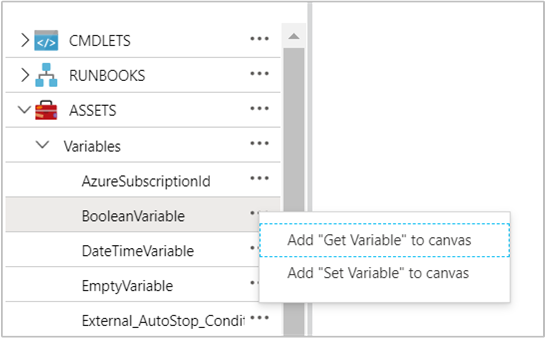
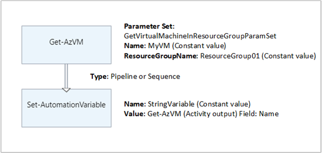

# Manage variables in Azure Automation

Variable assets are values that are available to all runbooks and DSC configurations in your Automation account. You can manage them from the Azure portal, from PowerShell, within a runbook, or in a DSC configuration.

Automation variables are useful for the following scenarios:

- Sharing a value among multiple runbooks or DSC configurations.

- Sharing a value among multiple jobs from the same runbook or DSC configuration.

- Managing a value used by runbooks or DSC configurations from the portal or from the PowerShell command line. An example is a set of common configuration items, such as a specific list of VM names, a specific resource group, an AD domain name, and more.  

Azure Automation persists variables and makes them available even if a runbook or DSC configuration fails. This behavior allows one runbook or DSC configuration to set a value that is then used by another runbook, or by the same runbook or DSC configuration the next time it runs.

Azure Automation stores each encrypted variable securely. When creating a variable, you can specify its encryption and storage by Azure Automation as a secure asset. 

>[!NOTE]
>Secure assets in Azure Automation include credentials, certificates, connections, and encrypted variables. These assets are encrypted and stored in Azure Automation using a unique key that is generated for each Automation account. Azure Automation stores the key in the system-managed Key Vault. Before storing a secure asset, Automation loads the key from Key Vault and then uses it to encrypt the asset. 

## Variable types

When you create a variable with the Azure portal, you must specify a data type from the dropdown list so that the portal can display the appropriate control for entering the variable value. The following are variable types available in Azure Automation:

* String
* Integer
* DateTime
* Boolean
* Null

The variable isn't restricted to the specified data type. You must set the variable using Windows PowerShell if you want to specify a value of a different type. If you indicate `Not defined`, the value of the variable is set to Null. You must set the value with the [Set-AzAutomationVariable](https://docs.microsoft.com/powershell/module/az.automation/set-azautomationvariable?view=azps-3.5.0) cmdlet or the internal `Set-AutomationVariable` cmdlet.

You can't use the Azure portal to create or change the value for a complex variable type. However, you can provide a value of any type using Windows PowerShell. Complex types are retrieved as a [PSCustomObject](/dotnet/api/system.management.automation.pscustomobject).

You can store multiple values to a single variable by creating an array or hashtable and saving it to the variable.

>[!NOTE]
>VM name variables can be a maximum of 80 characters. Resource group variables can be a maximum of 90 characters. See [Naming rules and restrictions for Azure resources](https://docs.microsoft.com/azure/azure-resource-manager/management/resource-name-rules).

## PowerShell cmdlets to access variables

The cmdlets in the following table create and manage Automation variables with PowerShell. They ship as part of the [Az modules](modules.md#az-modules).

| Cmdlet | Description |
|:---|:---|
|[Get-AzAutomationVariable](https://docs.microsoft.com/powershell/module/az.automation/get-azautomationvariable?view=azps-3.5.0) | Retrieves the value of an existing variable. If the value is a simple type, that same type is retrieved. If it's a complex type, a `PSCustomObject` type is retrieved. <br>**Note:**  You can't use this cmdlet to retrieve the value of an encrypted variable. The only way to do this is by using the internal `Get-AutomationVariable` cmdlet in a runbook or DSC configuration. See [Internal cmdlets to access variables](#internal-cmdlets-to-access-variables). |
|[New-AzAutomationVariable](https://docs.microsoft.com/powershell/module/az.automation/new-azautomationvariable?view=azps-3.5.0) | Creates a new variable and sets its value.|
|[Remove-AzAutomationVariable](https://docs.microsoft.com/powershell/module/az.automation/remove-azautomationvariable?view=azps-3.5.0)| Removes an existing variable.|
|[Set-AzAutomationVariable](https://docs.microsoft.com/powershell/module/az.automation/set-azautomationvariable?view=azps-3.5.0)| Sets the value for an existing variable. |

## Internal cmdlets to access variables

The internal cmdlets in the following table are used to access variables in your runbooks and DSC configurations. These cmdlets come with the global module `Orchestrator.AssetManagement.Cmdlets`. For more information, see [Internal cmdlets](modules.md#internal-cmdlets).

| Internal Cmdlet | Description |
|:---|:---|
|`Get-AutomationVariable`|Retrieves the value of an existing variable.|
|`Set-AutomationVariable`|Sets the value for an existing variable.|

> [!NOTE]
> Avoid using variables in the `Name` parameter of `Get-AutomationVariable` in a runbook or DSC configuration. Use of the variables can complicate the discovery of dependencies between runbooks and Automation variables at design time.

`Get-AutomationVariable` does not work in PowerShell, but only in a runbook or DSC configuration. For example, to see the value of an encrypted variable, you might create a runbook to get the variable and then write it to the output stream:
 
```powershell
$mytestencryptvar = Get-AutomationVariable -Name TestVariable
Write-output "The encrypted value of the variable is: $mytestencryptvar"
```

## Python 2 functions to access variables

The functions in the following table are used to access variables in a Python 2 runbook.

|Python 2 Functions|Description|
|:---|:---|
|`automationassets.get_automation_variable`|Retrieves the value of an existing variable. |
|`automationassets.set_automation_variable`|Sets the value for an existing variable. |

> [!NOTE]
> You must import the `automationassets` module at the top of your Python runbook to access the asset functions.

## Create and get a variable

>[!NOTE]
>If you want to remove the encryption for a variable, you must delete the variable and recreate it as unencrypted.

### Create and get a variable using the Azure portal

1. From your Automation account, click the **Assets** tile, then the **Assets** blade, and select **Variables**.
2. On the **Variables** tile, select **Add a variable**.
3. Complete the options on the **New Variable** blade and then click **Create** to save the new variable.

> [!NOTE]
> Once you have saved an encrypted variable, it can't be viewed in the portal. It can only be updated.

### Create and get a variable in Windows PowerShell

Your runbook or DSC configuration uses the `New-AzAutomationVariable` cmdlet to create a new variable and set its initial value. If the variable is encrypted, the call should use the `Encrypted` parameter. Your script can retrieve the value of the variable using `Get-AzAutomationVariable`. 

>[!NOTE]
>A PowerShell script can't retrieve an encrypted value. The only way to do this is to use the internal `Get-AutomationVariable` cmdlet.

The following example shows how to create a string variable and then return its value.

```powershell
New-AzAutomationVariable -ResourceGroupName "ResourceGroup01" 
–AutomationAccountName "MyAutomationAccount" –Name 'MyStringVariable' `
–Encrypted $false –Value 'My String'
$string = (Get-AzAutomationVariable -ResourceGroupName "ResourceGroup01" `
–AutomationAccountName "MyAutomationAccount" –Name 'MyStringVariable').Value
```

The following example shows how to create a variable with a complex type and then retrieve its properties. In this case, a virtual machine object from [Get-AzVM](https://docs.microsoft.com/powershell/module/Az.Compute/Get-AzVM?view=azps-3.5.0) is used.

```powershell
$vm = Get-AzVM -ResourceGroupName "ResourceGroup01" –Name "VM01"
New-AzAutomationVariable –AutomationAccountName "MyAutomationAccount" –Name "MyComplexVariable" –Encrypted $false –Value $vm

$vmValue = (Get-AzAutomationVariable -ResourceGroupName "ResourceGroup01" `
–AutomationAccountName "MyAutomationAccount" –Name "MyComplexVariable").Value
$vmName = $vmValue.Name
$vmIpAddress = $vmValue.IpAddress
```

## Textual runbook examples

### Retrieve and set a simple value from a variable

The following example shows how to set and retrieve a variable in a textual runbook. This example assumes the creation of integer variables named `NumberOfIterations` and `NumberOfRunnings` and a string variable named `SampleMessage`.

```powershell
$NumberOfIterations = Get-AzAutomationVariable -ResourceGroupName "ResourceGroup01" –AutomationAccountName "MyAutomationAccount" -Name 'NumberOfIterations'
$NumberOfRunnings = Get-AzAutomationVariable -ResourceGroupName "ResourceGroup01" –AutomationAccountName "MyAutomationAccount" -Name 'NumberOfRunnings'
$SampleMessage = Get-AutomationVariable -Name 'SampleMessage'

Write-Output "Runbook has been run $NumberOfRunnings times."

for ($i = 1; $i -le $NumberOfIterations; $i++) {
    Write-Output "$i`: $SampleMessage"
}
Set-AzAutomationVariable -ResourceGroupName "ResourceGroup01" –AutomationAccountName "MyAutomationAccount" –Name NumberOfRunnings –Value ($NumberOfRunnings += 1)
```

### Retrieve and set a variable in a Python 2 runbook

The following sample shows how to get a variable, set a variable, and handle an exception for a nonexistent variable in a Python 2 runbook.

```python
import automationassets
from automationassets import AutomationAssetNotFound

# get a variable
value = automationassets.get_automation_variable("test-variable")
print value

# set a variable (value can be int/bool/string)
automationassets.set_automation_variable("test-variable", True)
automationassets.set_automation_variable("test-variable", 4)
automationassets.set_automation_variable("test-variable", "test-string")

# handle a non-existent variable exception
try:
    value = automationassets.get_automation_variable("nonexisting variable")
except AutomationAssetNotFound:
    print "variable not found"
```

## Graphical runbook examples

In a graphical runbook, you can add activities for the internal cmdlets `Get-AutomationVariable` or `Set-AutomationVariable`. Just right-click each variable in the Library pane of the graphical editor and select the activity that you want.



The following image shows example activities to update a variable with a simple value in a graphical runbook. In this example, the activity for `Get-AzVM`  retrieves a single Azure virtual machine and saves the computer name to an existing Automation string variable. It doesn't matter whether the [link is a pipeline or sequence](../automation-graphical-authoring-intro.md#use-links-for-workflow) since the code only expects a single object in the output.



## Next steps

* To learn more about the cmdlets used to access variables, see [Manage modules in Azure Automation](modules.md).
* For general information about runbooks, see [Runbook execution in Azure Automation](../automation-runbook-execution.md).
* For details of DSC configurations, see [Azure Automation State Configuration overview](../automation-dsc-overview.md).
