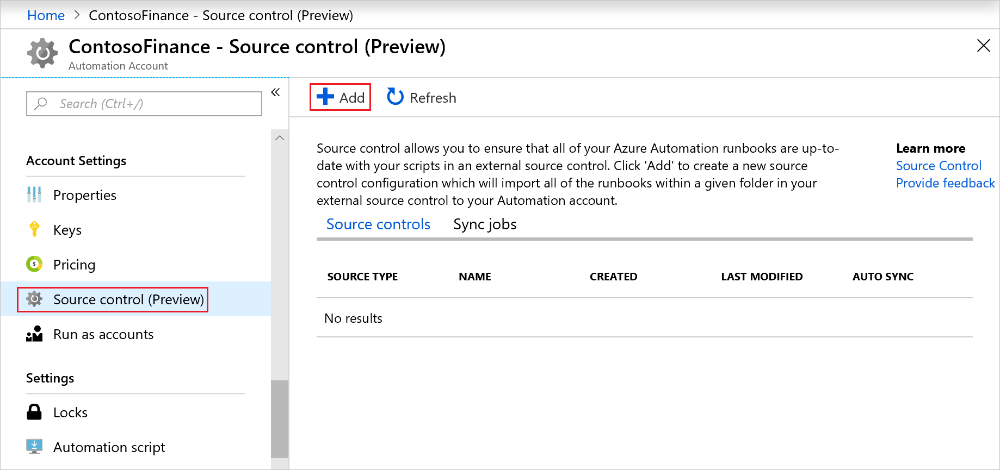
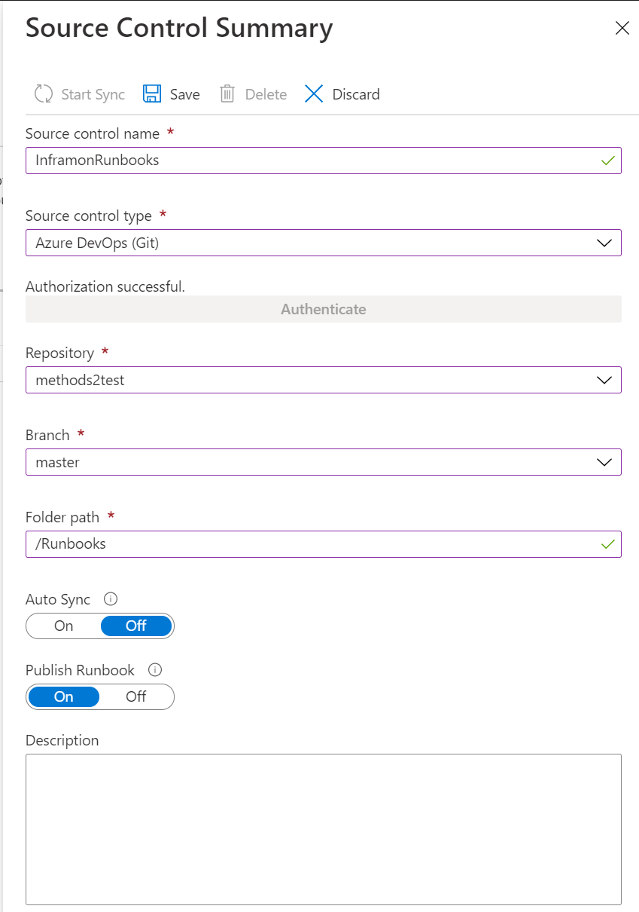
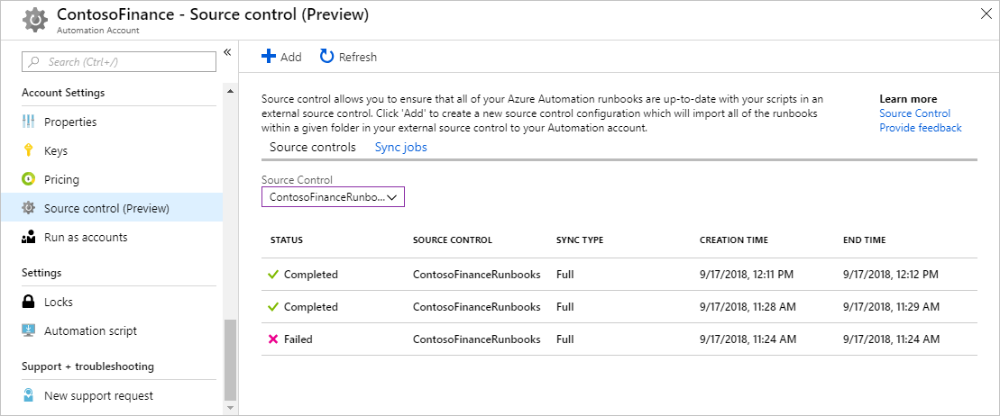

# Source control integration in Azure Automation

Source control allows you to keep your runbooks in your Automation account are up-to-date with your scripts in your GitHub or Azure Dev Ops source control repository. Source control allows you to easily collaborate with your team, track changes, and roll back to earlier versions of your runbooks. For example, source control allows you to sync different branches in source control to your development, test or production Automation accounts. This makes it easy to promote code that has been tested in your development environment to your production Automation account.

Azure Automation supports 3 types of source control:

* GitHub
* Visual Studio Team Services (Git)
* Visual Studio Team Services (TFVC)

## Pre-requisites

* A source control repository (GitHub or Visual Studio Team Services)
* The correct [permissions](#personal-access-token-permissions) to the source control repository
* A [Run-As Account and connection](manage-runas-account.md)

> [!NOTE]
> Source control sync jobs run under the users Automation Account and are billed at the same rate as other Automation jobs.

## Configure source control

Within your Automation Account, select **Source Control (preview)** and click **+ Add**



Choose **Source Control type**, click **Authenticate**.

Review the app request permissions page and click **Accept**.

On the **Source Control Summary** page, fill out the information and click **Save**. The following table shows a description of the available fields.

|Property  |Description  |
|---------|---------|
|Source control name     | A friendly name for the source control        |
|Source control type     | The type of source control source. Available options are:</br> Github</br>Visual Studio Team Services (Git)</br> Visual Studio Team Services (TFVC)        |
|Repository     | The name of the repository or project. This value is pulled from the source control repository. Example: $/ContosoFinanceTFVCExample         |
|Branch     | The branch to pull the source files from. Branch targeting is not available for the TFVC source control type.          |
|Folder path     | The folder that contains the runbooks to sync. Example: /Runbooks         |
|Auto Sync     | Turns on or off automatic sync when a commit is made in the source control repository         |
|Publish Runbook     | If set to **On**, after runbooks are synced from source control they will be automatically published.         |
|Description     | A text field to provide additional details        |



## Syncing

Configuring autosync when configuring source control integration, the initial sync starts automatically. If auto sync was not set, select the source from the table on the **Source control (Preview)** page. Click **Start Sync** to start the sync process.  

You can view the status of the current sync job or previous ones by clicking the **Sync jobs** tab. On the **Source Control** drop-down, select a source control.



Clicking on a job allows you to view the job output. The following example is the output from a source control sync job.

```output
========================================================================================================

Azure Automation Source Control Public Preview.
Supported runbooks to sync: PowerShell Workflow, PowerShell Scripts, DSC Configurations, Graphical, and Python 2.

Setting AzureRmEnvironment.

Getting AzureRunAsConnection.

Logging in to Azure...

Source control information for syncing:

[Url = https://ContosoExample.visualstudio.com/ContosoFinanceTFVCExample/_versionControl] [FolderPath = /Runbooks]

Verifying url: https://ContosoExample.visualstudio.com/ContosoFinanceTFVCExample/_versionControl

Connecting to VSTS...


Source Control Sync Summary:


2 files synced:
 - ExampleRunbook1.ps1
 - ExampleRunbook2.ps1


========================================================================================================
```

## Personal access token permissions

Source control requires some minimum permissions for personal access tokens. The following tables contain the minimum permissions required for GitHub and Azure DevOps.

### GitHub

|Scope  |Description  |
|---------|---------|
|**repo**     |         |
|repo:status     | Access commit status         |
|repo_deployment      | Access deployment status         |
|public_repo     | Access public repositories         |
|**admin:repo_hook**     |         |
|write:repo_hook     | Write repository hooks         |
|read:repo_hook|Read repository hooks|

### Azure DevOps

|Scope  |
|---------|
|Code (read)     |
|Project and team (read)|
|Identity (read)      |
|User profile (read)     |
|Work items (read)    |
|Service Connections (read, query, and manage)<sup>1</sup>    |

<sup>1</sup>the Service Connections permission is only required if you have enabled autosync.

## Disconnecting source control

To disconnect from a source control repository, open **Source control (Preview)** under **Account Settings** in your Automation Account.

Select the source control you want to remove. On the **Source Control Summary** page, click **Delete**.

## Next steps

To learn more about runbook types, their advantages and limitations, see [Azure Automation runbook types](automation-runbook-types.md)
