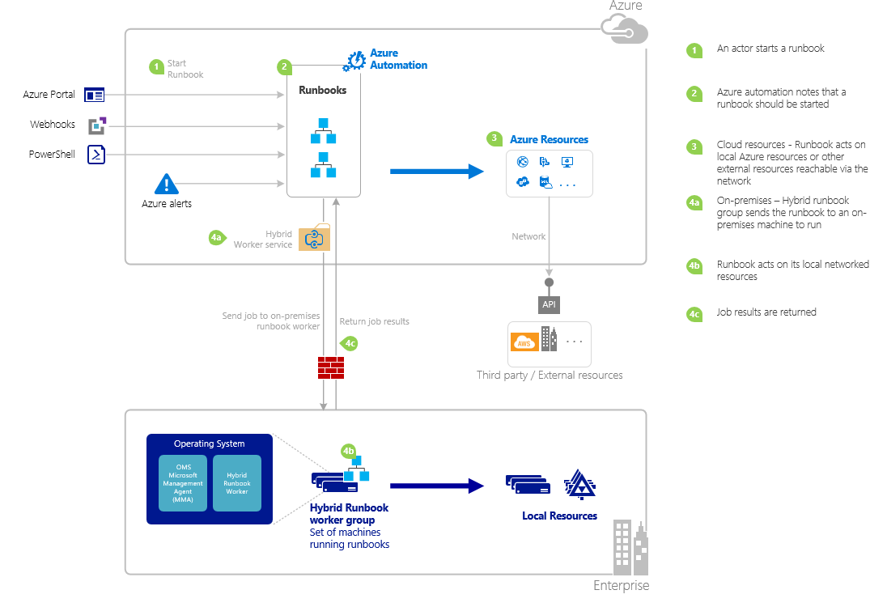

# Start a runbook in Azure Automation

The following table helps you determine the method to start a runbook in Azure Automation that is most suitable to your particular scenario. This article includes details on starting a runbook with the Azure portal and with Windows PowerShell. Details on the other methods are provided in other documentation that you can access from the links below.

| **Method** | **Characteristics** |
| --- | --- |
| [Azure portal](#start-a-runbook-with-the-azure-portal) |<li>Simplest method with interactive user interface.<br> <li>Form to provide simple parameter values.<br> <li>Easily track job state.<br> <li>Access authenticated with Azure sign in. |
| [Windows PowerShell](/powershell/module/azurerm.automation/start-azurermautomationrunbook) |<li>Call from command line with Windows PowerShell cmdlets.<br> <li>Can be included in automated feature with multiple steps.<br> <li>Request is authenticated with certificate or OAuth user principal / service principal.<br> <li>Provide simple and complex parameter values.<br> <li>Track job state.<br> <li>Client required to support PowerShell cmdlets. |
| [Azure Automation API](/rest/api/automation/) |<li>Most flexible method but also most complex.<br> <li>Call from any custom code that can make HTTP requests.<br> <li>Request authenticated with certificate, or Oauth user principal / service principal.<br> <li>Provide simple and complex parameter values. *If you're calling a Python runbook using the API, the JSON payload must be serialized.*<br> <li>Track job state. |
| [Webhooks](automation-webhooks.md) |<li>Start runbook from single HTTP request.<br> <li>Authenticated with security token in URL.<br> <li>Client can't override parameter values specified when webhook created. Runbook can define single parameter that is populated with the HTTP request details.<br> <li>No ability to track job state through webhook URL. |
| [Respond to Azure Alert](../log-analytics/log-analytics-alerts.md) |<li>Start a runbook in response to Azure alert.<br> <li>Configure webhook for runbook and link to alert.<br> <li>Authenticated with security token in URL. |
| [Schedule](automation-schedules.md) |<li>Automatically start runbook on hourly, daily, weekly, or monthly schedule.<br> <li>Manipulate schedule through Azure portal, PowerShell cmdlets, or Azure API.<br> <li>Provide parameter values to be used with schedule. |
| [From Another Runbook](automation-child-runbooks.md) |<li>Use a runbook as an activity in another runbook.<br> <li>Useful for functionality used by multiple runbooks.<br> <li>Provide parameter values to child runbook and use output in parent runbook. |

The following image illustrates detailed step-by-step process in the life cycle of a runbook. It includes different ways a runbook starts in Azure Automation, which components required for Hybrid Runbook Worker to execute Azure Automation runbooks and interactions between different components. To learn about executing Automation runbooks in your datacenter, refer to [hybrid runbook workers](automation-hybrid-runbook-worker.md)



## Work with runbook parameters

When you start a runbook from the Azure portal or Windows PowerShell, the instruction is sent through the Azure Automation web service. This service doesn't support parameters with complex data types. If you need to provide a value for a complex parameter, then you must call it inline from another runbook as described in [Child runbooks in Azure Automation](automation-child-runbooks.md).

The Azure Automation web service provides special functionality for parameters using certain data types as described in the following sections:

### Named values

If the parameter is data type [object], then you can use the following JSON format to send it a list of named values: *{Name1:'Value1', Name2:'Value2', Name3:'Value3'}*. These values must be simple types. The runbook receives the parameter as a [PSCustomObject](/dotnet/api/system.management.automation.pscustomobject) with properties that correspond to each named value.

Consider the following test runbook that accepts a parameter called user.

```powershell
Workflow Test-Parameters
{
   param (
      [Parameter(Mandatory=$true)][object]$user
   )
    $userObject = $user | ConvertFrom-JSON
    if ($userObject.Show) {
        foreach ($i in 1..$userObject.RepeatCount) {
            $userObject.FirstName
            $userObject.LastName
        }
    }
}
```

The following text could be used for the user parameter.

```json
{FirstName:'Joe',LastName:'Smith',RepeatCount:'2',Show:'True'}
```

This results in the following output:

```output
Joe
Smith
Joe
Smith
```

### Arrays

If the parameter is an array such as [array] or [string[]], then you can use the following JSON format to send it a list of values: *[Value1, Value2, Value3]*. These values must be simple types.

Consider the following test runbook that accepts a parameter called *user*.

```powershell
Workflow Test-Parameters
{
   param (
      [Parameter(Mandatory=$true)][array]$user
   )
    if ($user[3]) {
        foreach ($i in 1..$user[2]) {
            $ user[0]
            $ user[1]
        }
    }
}
```

The following text could be used for the user parameter.

```input
["Joe","Smith",2,true]
```

This results in the following output:

```output
Joe
Smith
Joe
Smith
```

### Credentials

If the parameter is data type `PSCredential`, you can provide the name of an Azure Automation [credential asset](automation-credentials.md). The runbook retrieves the credential with the name that you specify. The following test runbook accepts a parameter called `credential`.

```powershell
Workflow Test-Parameters
{
   param (
      [Parameter(Mandatory=$true)][PSCredential]$credential
   )
   $credential.UserName
}
```

The following text could be used for the user parameter assuming that there was a credential asset called `My Credential`.

```input
My Credential
```

Assuming that the user name in the credential is `jsmith`, the following output is displayed.

```output
jsmith
```

## Start a runbook with the Azure portal

1. In the Azure portal, select **Automation** and then click the name of an Automation account.
2. On the Hub menu, select **Runbooks**.
3. On the Runbooks page, select a runbook, and then click **Start**.
4. If the runbook has parameters, you're prompted to provide values with a text box for each parameter. For more information on parameters, see [Runbook Parameters](#work-with-runbook-parameters).
5. On the Job pane, you can view the status of the runbook job.

## Start a runbook with PowerShell

You can use the [Start-AzAutomationRunbook](https://docs.microsoft.com/powershell/module/az.automation/start-azautomationrunbook?view=azps-3.7.0) to start a runbook with Windows PowerShell. The following sample code starts a runbook called **Test-Runbook**.

```azurepowershell-interactive
Start-AzAutomationRunbook -AutomationAccountName "MyAutomationAccount" -Name "Test-Runbook" -ResourceGroupName "ResourceGroup01"
```

`Start-AzAutomationRunbook` returns a job object that you can use to track status once the runbook is started. You can then use this job object with [Get-AzAutomationJob](https://docs.microsoft.com/powershell/module/Az.Automation/Get-AzAutomationJob?view=azps-3.7.0) to determine the status of the job and [Get-AzAutomationJobOutput](https://docs.microsoft.com/powershell/module/az.automation/get-azautomationjoboutput?view=azps-3.7.0) to retrieve its output. The following example starts a runbook called **Test-Runbook**, waits until it has completed, and then displays its output.

```azurepowershell-interactive
$runbookName = "Test-Runbook"
$ResourceGroup = "ResourceGroup01"
$AutomationAcct = "MyAutomationAccount"

$job = Start-AzAutomationRunbook –AutomationAccountName $AutomationAcct -Name $runbookName -ResourceGroupName $ResourceGroup

$doLoop = $true
While ($doLoop) {
   $job = Get-AzAutomationJob –AutomationAccountName $AutomationAcct -Id $job.JobId -ResourceGroupName $ResourceGroup
   $status = $job.Status
   $doLoop = (($status -ne "Completed") -and ($status -ne "Failed") -and ($status -ne "Suspended") -and ($status -ne "Stopped"))
}

Get-AzAutomationJobOutput –AutomationAccountName $AutomationAcct -Id $job.JobId -ResourceGroupName $ResourceGroup –Stream Output
```

If the runbook requires parameters, then you must provide them as a [hashtable](https://technet.microsoft.com/library/hh847780.aspx). The key of the hashtable must match the parameter name and the value is the parameter value. The following example shows how to start a runbook with two string parameters named FirstName and LastName, an integer named RepeatCount, and a boolean parameter named Show. For more information on parameters, see [Runbook Parameters](#work-with-runbook-parameters).

```azurepowershell-interactive
$params = @{"FirstName"="Joe";"LastName"="Smith";"RepeatCount"=2;"Show"=$true}
Start-AzAutomationRunbook –AutomationAccountName "MyAutomationAccount" –Name "Test-Runbook" -ResourceGroupName "ResourceGroup01" –Parameters $params
```

## Next steps

* For details of runbook management, see [Manage runbooks in Azure Automation](manage-runbooks.md).
* For PowerShell details, see [PowerShell Docs](https://docs.microsoft.com/powershell/scripting/overview).
* To troubleshoot issues with runbook execution, see [Troubleshoot runbook issues](troubleshoot/runbooks.md).