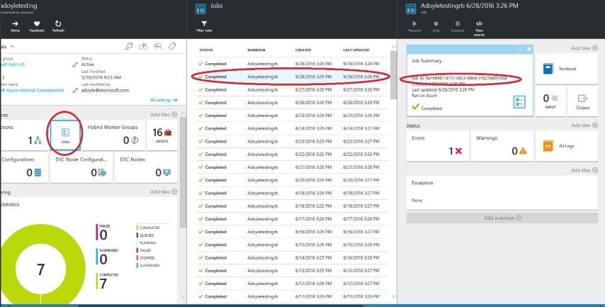

# Data to collect when opening a case for Microsoft Azure Automation

This article describes some of the information that you should gather before you open a case for Azure Automation with Microsoft Azure Support. This information is not required to open the case. However, it can help Microsoft resolve your problem more quickly. Also, you may be asked for this data by the support engineer after you open the case.

## Basic data

Collect the basic data described in the Knowledge Base article [4034605 - How to capture Azure Automation-scripted diagnostics](https://support.microsoft.com/help/4034605/how-to-capture-azure-automation-scripted-diagnostics).

## Data for Update Management issues on Linux

1. In addition to the items that are listed in KB [4034605](https://support.microsoft.com/help/4034605/how-to-capture-azure-automation-scripted-diagnostics), run the following log collection tool:

   [OMS Linux Agent Log Collector](https://github.com/Microsoft/OMS-Agent-for-Linux/blob/master/tools/LogCollector/OMS_Linux_Agent_Log_Collector.md)
 
2. Compress the contents of the **/var/opt/microsoft/omsagent/run/automationworker/** folder, then send the compressed file to Azure Support.
 
3. Verify that the ID for the workspace that the Log Analytics agent for Linux reports to is the same as the ID for the workspace being monitored for updates.

## Data for Update Management issues on Windows

1. Collect data for the items listed in [4034605](https://support.microsoft.com/help/4034605/how-to-capture-azure-automation-scripted-diagnostics).

2. Export the following event logs into the EVTX format:

   * System
   * Application
   * Security
   * Operations Manager
   * Microsoft-SMA/Operational

3. Verify that the ID of the workspace that the agent reports to is the same as the ID for the workspace being monitored by Windows Updates.

## Data for job issues

1. Collect data for the items listed in [4034605](https://support.microsoft.com/help/4034605/how-to-capture-azure-automation-scripted-diagnostics).

2. Collect the job ID for the job that has an issue:

   1. In the Azure portal, go to **Automation Accounts**.
   2. Select the Automation account that you are troubleshooting, and note the name.
   3. Select **Jobs**.
   4. Choose the job that you are troubleshooting.
   5. In the Job Summary pane, look for the GUID value in **Job ID**.

   

3. Collect a sample of the script that you are running.

4. Collect the log files:

   1. In the Azure portal, go to **Automation Accounts**.
   2. Select the Automation account that you are troubleshooting.
   3. Select **Jobs**.
   4. Choose the job that you are troubleshooting.
   5. Select **All Logs**.
   6. In the resulting pane, collect the data.

   

## Data for module issues

In addition to the [basic data items](#basic-data), gather the following information:

* The steps you have followed, so that the problem can be reproduced.
* Screenshots of any error messages.
* Screenshots of the current modules and their version numbers.

## Next steps

If you need more help:

* Get answers from Azure experts through [Azure Forums](https://azure.microsoft.com/support/forums/).
* Connect with [@AzureSupport](https://twitter.com/azuresupport), the official Microsoft Azure account for improving customer experience by connecting the Azure community to the right resources: answers, support, and experts.
* File an Azure support incident. Go to the [Azure support site](https://azure.microsoft.com/support/options/) and select **Get Support**.
