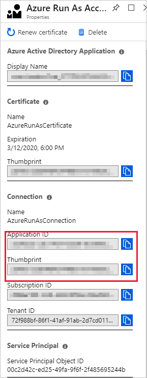
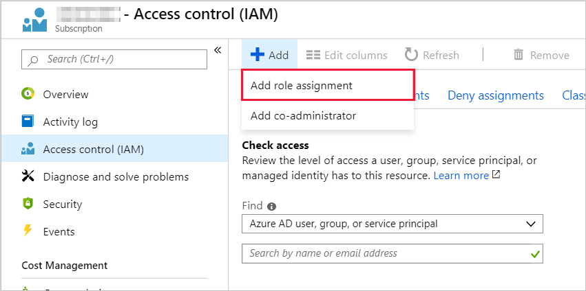
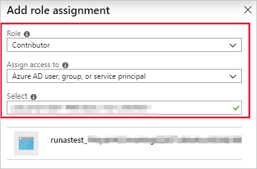

# Troubleshoot runbook issues

 This article describes runbook issues that might occur and how to resolve them. For general information, see [Runbook execution in Azure Automation](../automation-runbook-execution.md).


## Start-AzAutomationRunbook fails with "runbookName does not match expected pattern" error message

### Issue
When you run `Start-AzAutomationRunbook` to start specific runbooks:

```powershell
start-azautomationRunbook -Name "Test_2" -AutomationAccountName "AutomationParent" -ResourceGroupName "AutomationAccount" 
```
It fails with the following error:
 
`Start-AzAutomationRunbook: "runbookname" does not match expected pattern '^[a-zA-Z]*-*[a-zA-Z0-9]*$'`
 
### Cause

Code that was introduced in [1.9.0](https://www.powershellgallery.com/packages/Az.Automation/1.9.0) version of the Az.Automation module verifies the names of the runbooks to start and incorrectly flags runbooks with multiple "-" characters or with an "_" character in the name as invalid. 

### Workaround

We recommend that you revert to [1.8.0 version](https://www.powershellgallery.com/packages/Az.Automation/1.8.0) of the module.

### Resolution

Currently, we are working to deploy a fix to address this issue.

## Diagnose runbook issues

When you receive errors during runbook execution in Azure Automation, you can use the following steps to help diagnose the issues:

1. Ensure that your runbook script executes successfully on your local machine.

    For language reference and learning modules, see the [PowerShell Docs](/powershell/scripting/overview) or [Python Docs](https://docs.python.org/3/). Running your script locally can discover and resolve common errors, such as:

      * Missing modules
      * Syntax errors
      * Logic errors

1. Investigate runbook [error streams](../automation-runbook-output-and-messages.md#runbook-output).

    Look at these streams for specific messages, and compare them to the errors documented in this article.

1. Ensure that your nodes and Automation workspace have the required modules.

    If your runbook imports any modules, verify that they're available to your Automation account by using the steps in [Import modules](../shared-resources/modules.md#import-modules). Update your PowerShell modules to the latest version by following the instructions in [Update Azure PowerShell modules in Azure Automation](../automation-update-azure-modules.md). For more troubleshooting information, see [Troubleshoot modules](shared-resources.md#modules).

1. If your runbook is suspended or unexpectedly fails:

    * [Renew the webhook](../automation-webhooks.md#update-a-webhook) if you're trying to use an expired webhook to start the runbook.
    * [Check job statuses](../automation-runbook-execution.md#job-statuses) to determine current runbook statuses and some possible causes of the issue.
    * [Add additional output](../automation-runbook-output-and-messages.md#working-with-message-streams) to the runbook to identify what happens before the runbook is suspended.
    * [Handle any exceptions](../automation-runbook-execution.md#exceptions) that are thrown by your job.

1. Do this step if the runbook job or the environment on Hybrid Runbook Worker doesn't respond.

    If you're running your runbooks on a Hybrid Runbook Worker instead of in Azure Automation, you might need to [troubleshoot the hybrid worker itself](hybrid-runbook-worker.md).


## Scenario: Unable to create new Automation job in West Europe region

### Issue
When creating new Automation jobs, you might experience a delay or failure of job creation. Scheduled jobs will automatically be retired, and jobs executed through the portal can be retired if you see a failure. 

### Cause
This is because of the high load from customers' runbooks using the Automation service in the West Europe region.

### Resolution
Perform the following action if it is feasible as per your requirement and environment to reduce the chance of failure: 

- If you’re using the top of the hour for the job creation (at 12:00, 1:00, 2:00, and so on.), typically on the hour, or half hour, we recommend that you move the job start time to five minutes before or after the hour/half hour. This is because a most of the customers use the beginning of the hour for job execution which drastically increases the load on the service, while the load is relatively low at the other time slots.

## <a name="runbook-fails-no-permission"></a>Scenario: Runbook fails with "this.Client.SubscriptionId cannot be null." error message

### Issue

Your runbook using a managed identity Connect-AzAccount -Identity which attempts to manage Azure objects, fails to work successfully and logs the following error - `this.Client.SubscriptionId cannot be null.`

```error
get-azvm : 'this.Client.SubscriptionId' cannot be null. At line:5 char:1 + get-azvm + ~~~~~~~~ + CategoryInfo : CloseError: (:) [Get-AzVM], ValidationException + FullyQualifiedErrorId : Microsoft.Azure.Commands.Compute.GetAzureVMCommand
```

### Cause

This can happen when the Managed Identity (or other account used in the runbook) has not been granted any permissions to access the subscription.

### Resolution
Grant the Managed Identity (or other account used in the runbook) an appropriate role membership in the subscription. [Learn more](../enable-managed-identity-for-automation.md#assign-role-to-a-system-assigned-managed-identity)

:::image type="content" source="../media/troubleshoot-runbooks/managed-identity-role-assignments.png" alt-text=" Screenshot that shows the assigning of Azure Role assignments.":::

:::image type="content" source="../media/troubleshoot-runbooks/azure-add-role-assignment-inline.png" alt-text="Screenshot that shows how to add role assignment." lightbox="../media/troubleshoot-runbooks/azure-add-role-assignment-expanded.png":::

## Scenario: Access blocked to Azure Storage, or Azure Key Vault, or Azure SQL

This scenario uses [Azure Storage](../../storage/common/storage-network-security.md) as an example; however, the information is equally applicable to [Azure Key Vault](../../key-vault/general/network-security.md) and [Azure SQL](/azure/azure-sql/database/firewall-configure).

### Issue

Attempting to access Azure Storage from a Runbook results in an error similar to the following message: `The remote server returned an error: (403) Forbidden. HTTP Status Code: 403 - HTTP Error Message: This request is not authorized to perform this operation.`

### Cause

The Azure Firewall on Azure Storage is enabled.

### Resolution

Enabling the Azure Firewall on [Azure Storage](../../storage/common/storage-network-security.md), [Azure Key Vault](../../key-vault/general/network-security.md), or [Azure SQL](/azure/azure-sql/database/firewall-configure) blocks access from Azure Automation runbooks for those services. Access will be blocked even when the firewall exception to allow trusted Microsoft services is enabled, as Automation is not a part of the trusted services list. With an enabled firewall, access can only be made by using a Hybrid Runbook Worker and a [virtual network service endpoint](../../virtual-network/virtual-network-service-endpoints-overview.md).

## <a name="runbook-fails-no-permission"></a>Scenario: Runbook fails with a No permission or Forbidden 403 error

### Issue

Your runbook fails with a No permission or Forbidden 403 error, or equivalent.

### Cause

Run As accounts might not have the same permissions against Azure resources as your current Automation account. 

### Resolution

Ensure that your Run As account has [permissions to access any resources](../../role-based-access-control/role-assignments-portal.md) used in your script.

## <a name="sign-in-failed"></a>Scenario: Sign-in to Azure account failed

### Issue

You receive one of the following errors when you work with the `Connect-AzAccount` cmdlet:

```error
Unknown_user_type: Unknown User Type
```

```error
No certificate was found in the certificate store with thumbprint
```

### Cause

These errors occur if the credential asset name isn't valid. They might also occur if the user name and password that you used to set up the Automation credential asset aren't valid.

### Resolution

To determine what's wrong, follow these steps:

1. Make sure that you don't have any special characters. These characters include the `\@` character in the Automation credential asset name that you're using to connect to Azure.
1. Check to see if you can use the user name and password that are stored in the Azure Automation credential in your local PowerShell ISE editor. Run the following cmdlets in the PowerShell ISE.

   ```powershell
   $Cred = Get-Credential
   #Using Azure Service Management
   Add-AzureAccount -Credential $Cred
   #Using Azure Resource Manager
   Connect-AzAccount -Credential $Cred
   ```

1. If your authentication fails locally, you haven't set up your Microsoft Entra credentials properly. To get the Microsoft Entra account set up correctly, see the article [Authenticate to Azure using Microsoft Entra ID](../automation-use-azure-ad.md).

1. If the error appears to be transient, try adding retry logic to your authentication routine to make authenticating more robust.

   ```powershell
   $logonAttempt = 0
   $logonResult = $False

   while(!($connectionResult) -And ($logonAttempt -le 10))
   {
       $LogonAttempt++
       #Logging in to Azure...
       $connectionResult = Connect-AzAccount `
       Start-Sleep -Seconds 30
   }
   ```

## <a name="login-azurerm"></a>Scenario: Run Login-AzureRMAccount to log in

### Issue

You receive the following error when you run a runbook:

```error
Run Login-AzureRMAccount to login.
```

### Cause

This error can occur when you're not using a Run As account or the Run As account has expired.

This error has two primary causes:

* There are different versions of the AzureRM or Az module.
* You're trying to access resources in a separate subscription.

### Resolution

If you receive this error after you update one AzureRM or Az module, update all your modules to the same version.

If you're trying to access resources in another subscription, follow these steps to configure permissions:

1. Go to the Automation Run As account, and copy the **Application ID** and **Thumbprint**.

    

1. Go to the subscription's **Access control** where the Automation account is *not* hosted, and add a new role assignment.

    

1. Add the **Application ID** collected earlier. Select **Contributor** permissions.

    

1. Copy the name of the subscription.

1. You can now use the following runbook code to test the permissions from your Automation account to the other subscription. Replace `<CertificateThumbprint>` with the value copied in step 1. Replace `"<SubscriptionName>"` with the value copied in step 4.

    ```powershell
    $Conn = Get-AutomationConnection -Name AzureRunAsConnection
    Connect-AzAccount -ServicePrincipal -Tenant $Conn.TenantID -ApplicationId $Conn.ApplicationID -CertificateThumbprint "<CertificateThumbprint>"
    #Select the subscription you want to work with
    Select-AzSubscription -SubscriptionName '<YourSubscriptionNameGoesHere>'

    #Test and get outputs of the subscriptions you granted access.
    $subscriptions = Get-AzSubscription
    foreach($subscription in $subscriptions)
    {
        Set-AzContext $subscription
        Write-Output $subscription.Name
    }
    ```

## <a name="unable-to-find-subscription"></a>Scenario: Unable to find the Azure subscription

### Issue

You receive the following error when you work with the `Select-AzureSubscription`, `Select-AzureRMSubscription`, or `Select-AzSubscription` cmdlet:

```error
The subscription named <subscription name> cannot be found.
```

### Error

This error can occur if:

* The subscription name isn't valid.
* The Microsoft Entra user who's trying to get the subscription details isn't configured as an administrator of the subscription.
* The cmdlet isn't available.
* Context switching occurred.

### Resolution

For context switching, see [Context switching in Azure Automation](../context-switching.md).

## <a name="runbook-auth-failure"></a>Scenario: Runbooks fail when dealing with multiple subscriptions

### Issue

When executing runbooks, the runbook fails to manage Azure resources.

### Cause

The runbook isn't using the correct context when running. This may be because the runbook is accidentally trying to access the incorrect subscription.

You may see errors like this one:

```error
Get-AzVM : The client '<client-id>' with object id '<object-id> does not have authorization to perform action 'Microsoft.Compute/virtualMachines/read' over scope '/subscriptions/<subcriptionIdOfSubscriptionWichDoesntContainTheVM>/resourceGroups/REsourceGroupName/providers/Microsoft.Compute/virtualMachines/VMName '.
   ErrorCode: AuthorizationFailed
   StatusCode: 403
   ReasonPhrase: Forbidden Operation
   ID : <AGuidRepresentingTheOperation> At line:51 char:7 + $vm = Get-AzVM -ResourceGroupName $ResourceGroupName -Name $UNBV... +
```

or like this one:

```error
Get-AzureRmResource : Resource group "SomeResourceGroupName" could not be found.
... resources = Get-AzResource -ResourceGroupName $group.ResourceGro ...
                 ~~~~~~~~~~~~~~~~~~~~~~~~~~~~~~~~~~~~~~~~~~~~~~~~~~~~~~~~~
    + CategoryInfo          : CloseError: (:) [Get-AzResource], CloudException
    + FullyQualifiedErrorId : Microsoft.Azure.Commands.ResourceManager.Cmdlets.Implementation.GetAzureResourceCmdlet
```

### Resolution

To avoid accidentally trying to access the incorrect subscription, see [Context switching in Azure Automation](../context-switching.md).
  
## <a name="auth-failed-mfa"></a>Scenario: Authentication to Azure fails because multifactor authentication is enabled

### Issue

You receive the following error when authenticating to Azure with your Azure user name and password:

```error
Add-AzureAccount: AADSTS50079: Strong authentication enrollment (proof-up) is required
```

### Cause

If you have multifactor authentication on your Azure account, you can't use a Microsoft Entra user to authenticate to Azure. Instead, you need to use a certificate or a service principal to authenticate.

### Resolution

To use a service principal with Azure Resource Manager cmdlets, see [Creating service principal using Azure portal](../../active-directory/develop/howto-create-service-principal-portal.md) and [Authenticating a service principal with Azure Resource Manager](../../active-directory/develop/howto-authenticate-service-principal-powershell.md).

## <a name="task-was-cancelled"></a>Scenario: Runbook fails with "A task was canceled" error message

### Issue

Your runbook fails with an error similar to the following example:

```error
Exception: A task was cancelled.
```

### Cause

This error can be caused by using outdated Azure modules.

### Resolution

You can resolve this error by updating your Azure modules to the latest version:

1. In your Automation account, select **Modules**, and then select **Update Azure modules**.
1. The update takes roughly 15 minutes. After it's finished, rerun the runbook that failed.

To learn more about updating your modules, see [Update Azure modules in Azure Automation](../automation-update-azure-modules.md).

## <a name="not-recognized-as-cmdlet"></a>Scenario: Term not recognized as the name of a cmdlet, function, or script

### Issue

Your runbook fails with an error similar to the following example:

```error
The term 'Connect-AzAccount' is not recognized as the name of a cmdlet, function, script file, or operable program. Check the spelling of the name, or if the path was included verify that the path is correct and try again.
```

### Cause

This error can happen for the following reasons:

* The module that contains the cmdlet isn't imported into the Automation account.
* The module that contains the cmdlet is imported but is out of date.

### Resolution

Do one of the following tasks to resolve this error:

* For an Azure module, see [How to update Azure PowerShell modules in Azure Automation](../automation-update-azure-modules.md) to learn how to update your modules in your Automation account.
* For a non-Azure module, make sure that the module is imported into your Automation account.

## Scenario: Cmdlet fails in PnP PowerShell runbook on Azure Automation

### Issue

When a runbook writes a PnP PowerShell-generated object to the Azure Automation output directly, cmdlet output can't stream back to Automation.

### Cause

This issue most commonly occurs when Azure Automation processes runbooks that invoke PnP PowerShell cmdlets, for example, `add-pnplistitem`, without catching the return objects.

### Resolution

Edit your scripts to assign any return values to variables so that the cmdlets don't attempt to write whole objects to the standard output. A script can redirect the output stream to a cmdlet, as shown here.

```azurecli
  $null = add-pnplistitem
```

If your script parses cmdlet output, the script must store the output in a variable and manipulate the variable instead of simply streaming the output.

```azurecli
$SomeVariable = add-pnplistitem ....
if ($SomeVariable.someproperty -eq ....
```

## <a name="cmdlet-not-recognized"></a>Scenario: Cmdlet not recognized when executing a runbook

### Issue

Your runbook job fails with the error:

```error
<cmdlet name>: The term <cmdlet name> is not recognized as the name of a cmdlet, function, script file, or operable program.
```

### Cause

This error is caused when the PowerShell engine can't find the cmdlet you're using in your runbook. It's possible that the module containing the cmdlet is missing from the account, there's a name conflict with a runbook name, or the cmdlet also exists in another module and Automation can't resolve the name.

### Resolution

Use any of the following solutions to fix the problem:

* Make sure that you've entered the cmdlet name correctly.
* Ensure that the cmdlet exists in your Automation account and that there are no conflicts. To verify if the cmdlet is present, open a runbook in edit mode and search for the cmdlet you want to find in the library, or run `Get-Command <CommandName>`. After you've validated that the cmdlet is available to the account, and that there are no name conflicts with other cmdlets or runbooks, add the cmdlet to the canvas. Make sure that you're using a valid parameter set in your runbook.
* If you do have a name conflict and the cmdlet is available in two different modules, resolve the issue by using the fully qualified name for the cmdlet. For example, you can use `ModuleName\CmdletName`.
* If you're executing the runbook on-premises in a hybrid worker group, ensure that the module and cmdlet are installed on the machine that hosts the hybrid worker.

## <a name="object-reference-not-set"></a>Scenario: Incorrect object reference on call to Add-AzAccount

### Issue

You receive this error when you work with `Add-AzAccount`, which is an alias for the `Connect-AzAccount` cmdlet:

```error
Add-AzAccount : Object reference not set to an instance of an object
```

### Cause

This error can occur if the runbook doesn't do the proper steps before calling `Add-AzAccount` to add the Automation account. An example of one of the necessary steps is signing in with a Run As account. For the correct operations to use in your runbook, see [Runbook execution in Azure Automation](../automation-runbook-execution.md).

## <a name="child-runbook-object"></a>Scenario: Object reference not set to an instance of an object

### Issue

You receive the following error when you invoke a child runbook with the `Wait` parameter and the Output stream contains an object:

```error
Object reference not set to an instance of an object
```

### Cause

If the stream contains objects, `Start-AzAutomationRunbook` doesn't handle the Output stream correctly.

### Resolution

Implement a polling logic, and use the [Get-AzAutomationJobOutput](/powershell/module/Az.Automation/Get-AzAutomationJobOutput) cmdlet to retrieve the output. A sample of this logic is defined here:

```powershell
$AutomationAccountName = "ContosoAutomationAccount"
$RunbookName = "ChildRunbookExample"
$ResourceGroupName = "ContosoRG"

function IsJobTerminalState([string]$Status) {
  $TerminalStates = @("Completed", "Failed", "Stopped", "Suspended")
  return $Status -in $TerminalStates
}

$StartAzAutomationRunbookParameters = @{
  Name = $RunbookName
  AutomationAccountName = $AutomationAccountName
  ResourceGroupName = $ResourceGroupName
}
$Job = Start-AzAutomationRunbook @StartAzAutomationRunBookParameters
$PollingSeconds = 5
$MaxTimeout = New-TimeSpan -Hours 3 | Select-Object -ExpandProperty TotalSeconds
$WaitTime = 0
while(-NOT (IsJobTerminalState $Job.Status) -and $WaitTime -lt $MaxTimeout) {
   Start-Sleep -Seconds $PollingSeconds
   $WaitTime += $PollingSeconds
   $Job = $Job | Get-AzAutomationJob
}

$Job | Get-AzAutomationJobOutput | Get-AzAutomationJobOutputRecord | Select-Object -ExpandProperty Value
```

## <a name="fails-deserialized-object"></a>Scenario: Runbook fails because of deserialized object

### Issue

Your runbook fails with the error:

```error
Cannot bind parameter <ParameterName>.

Cannot convert the <ParameterType> value of type Deserialized <ParameterType> to type <ParameterType>.
```

### Cause

If your runbook is a PowerShell Workflow, it stores complex objects in a deserialized format to persist your runbook state if the workflow is suspended.

### Resolution

Use any of the following solutions to fix this problem:

* If you're piping complex objects from one cmdlet to another, wrap these cmdlets in an `InlineScript` activity.
* Pass the name or value that you need from the complex object instead of passing the entire object.
* Use a PowerShell runbook instead of a PowerShell Workflow runbook.

## <a name="expired webhook"></a>Scenario: 400 Bad Request status when calling a webhook

### Issue

When you try to invoke a webhook for an Azure Automation runbook, you receive the following error:

```error
400 Bad Request : This webhook has expired or is disabled
```

### Cause

The webhook that you're trying to call is either disabled or is expired. 

### Resolution

If the webhook is disabled, you can re-enable it through the Azure portal. If the webhook has expired, you must delete and then re-create it. You can only [renew a webhook](../automation-webhooks.md#update-a-webhook) if it hasn't already expired. 

## <a name="429"></a>Scenario: 429: The request rate is currently too large

### Issue

You receive the following error message when running the `Get-AzAutomationJobOutput` cmdlet:

```error
429: The request rate is currently too large. Please try again
```

### Cause

This error can occur when retrieving job output from a runbook that has many [verbose streams](../automation-runbook-output-and-messages.md#write-output-to-verbose-stream).

### Resolution

Do one of the following to resolve this error:

* Edit the runbook, and reduce the number of job streams that it emits​.
* Reduce the number of streams to be retrieved when running the cmdlet. To do this, you can set the value of the `Stream` parameter for the [Get-AzAutomationJobOutput](/powershell/module/Az.Automation/Get-AzAutomationJobOutput) cmdlet to retrieve only Output streams. ​

## <a name="quota-exceeded"></a>Scenario: Runbook job fails because allocated quota was exceeded

### Issue

Your runbook job fails with the error:

```error
The quota for the monthly total job run time has been reached for this subscription
```

### Cause

This error occurs when the job execution exceeds the 500-minute free quota for your account. This quota applies to all types of job execution tasks. Some of these tasks are testing a job, starting a job from the portal, executing a job by using webhooks, or scheduling a job to execute using either the Azure portal or your datacenter. To learn more about pricing for Automation, see [Automation pricing](https://azure.microsoft.com/pricing/details/automation/).

### Resolution

If you want to use more than 500 minutes of processing per month, change your subscription from the Free tier to the Basic tier:

1. Sign in to your Azure subscription.
1. Select the Automation account to upgrade.
1. Select **Settings**, and then select **Pricing**.
1. Select **Enable** on the page bottom to upgrade your account to the Basic tier.

## <a name="output-stream-greater-1mb"></a>Scenario: Runbook output stream greater than 1 MB

### Issue

Your runbook running in the Azure sandbox fails with the following error:

```error
The runbook job failed due to a job stream being larger than 1MB, this is the limit supported by an Azure Automation sandbox.
```

### Cause

This error occurs because your runbook attempted to write too much exception data to the output stream.

### Resolution

There's a 1 MB limit on the job output stream. Ensure that your runbook encloses calls to an executable or subprocess by using `try` and `catch` blocks. If the operations throw an exception, have the code write the message from the exception into an Automation variable. This technique prevents the message from being written into the job output stream. For Hybrid Runbook Worker jobs executed, the output stream truncated to 1 MB is displayed with no error message.

## <a name="job-attempted-3-times"></a>Scenario: Runbook job start attempted three times, but fails to start each time

### Issue

Your runbook fails with the following error:

```error
The job was tried three times but it failed
```

### Cause

This error occurs because of one of the following issues:

* **Memory limit.** A job might fail if it's using more than 400 MB of memory. The documented limits on memory allocated to a sandbox are found at [Automation service limits](../../azure-resource-manager/management/azure-subscription-service-limits.md#automation-limits). 

* **Network sockets.** Azure sandboxes are limited to 1,000 concurrent network sockets. For more information, see [Automation service limits](../../azure-resource-manager/management/azure-subscription-service-limits.md#automation-limits).

* **Module incompatible.** Module dependencies might not be correct. In this case, your runbook typically returns a `Command not found` or `Cannot bind parameter` message.

* **No authentication with Active Directory for sandbox.** Your runbook attempted to call an executable or subprocess that runs in an Azure sandbox. Configuring runbooks to authenticate with Microsoft Entra ID by using the Azure Active Directory Authentication Library (ADAL) isn't supported.

### Resolution

* **Memory limit, network sockets.** Suggested ways to work within the memory limits are to split the workload among multiple runbooks, process less data in memory, avoid writing unnecessary output from your runbooks, and consider how many checkpoints are written into your PowerShell workflow runbooks. Use the clear method, such as `$myVar.clear`, to clear out variables and use `[GC]::Collect` to run garbage collection immediately. These actions reduce the memory footprint of your runbook during runtime.

* **Module incompatible.** Update your Azure modules by following the steps in [How to update Azure PowerShell modules in Azure Automation](../automation-update-azure-modules.md).

* **No authentication with Active Directory for sandbox.** When you authenticate to Microsoft Entra ID with a runbook, ensure that the Azure AD module is available in your Automation account. Be sure to grant the Run As account the necessary permissions to perform the tasks that the runbook automates.

  If your runbook can't call an executable or subprocess running in an Azure sandbox, use the runbook on a [Hybrid Runbook Worker](../automation-hrw-run-runbooks.md). Hybrid workers aren't limited by the memory and network limits that Azure sandboxes have.

## <a name="cannot-invoke-method"></a>Scenario: PowerShell job fails with "Cannot invoke method" error message

### Issue

You receive the following error message when you start a PowerShell job in a runbook that runs in Azure:

```error
Exception was thrown - Cannot invoke method. Method invocation is supported only on core types in this language mode.
```

### Cause

This error might indicate that runbooks that run in an Azure sandbox can't run in the [Full Language mode](/powershell/module/microsoft.powershell.core/about/about_language_modes).

### Resolution

There are two ways to resolve this error:

* Instead of using [Start-Job](/powershell/module/microsoft.powershell.core/start-job), use [Start-AzAutomationRunbook](/powershell/module/az.automation/start-azautomationrunbook) to start the runbook.
* Try running the runbook on a Hybrid Runbook Worker.

To learn more about this behavior and other behaviors of Azure Automation runbooks, see [Runbook execution in Azure Automation](../automation-runbook-execution.md).

## <a name="long-running-runbook"></a>Scenario: A long-running runbook fails to complete

### Issue

Your runbook shows in a Stopped state after running for three hours. You might also receive this error:

```error
The job was evicted and subsequently reached a Stopped state. The job cannot continue running.
```

This behavior is by design in Azure sandboxes because of the [fair share](../automation-runbook-execution.md#fair-share) monitoring of processes within Azure Automation. If a process executes longer than three hours, fair share automatically stops a runbook. The status of a runbook that goes past the fair share time limit differs by runbook type. PowerShell and Python runbooks are set to a Stopped status. PowerShell Workflow runbooks are set to Failed.

### Cause

The runbook ran over the three-hour limit allowed by fair share in an Azure sandbox.

### Resolution

One recommended solution is to run the runbook on a [Hybrid Runbook Worker](../automation-hrw-run-runbooks.md). Hybrid workers aren't limited by the three-hour fair share runbook limit that Azure sandboxes have. Runbooks that run on Hybrid Runbook Workers should be developed to support restart behaviors if there are unexpected local infrastructure issues.

Another solution is to optimize the runbook by creating [child runbooks](../automation-child-runbooks.md). If your runbook loops through the same function on several resources, for example, in a database operation on several databases, you can move the function to a child runbook. Each child runbook executes in parallel in a separate process. This behavior decreases the total amount of time for the parent runbook to complete.

The PowerShell cmdlets that enable the child runbook scenario are:

* [Start-AzAutomationRunbook](/powershell/module/Az.Automation/Start-AzAutomationRunbook). This cmdlet allows you to start a runbook and pass parameters to the runbook.
* [Get-AzAutomationJob](/powershell/module/Az.Automation/Get-AzAutomationJob). If there are operations that need to be performed after the child runbook completes, this cmdlet allows you to check the job status for each child.

## <a name="get-serializationsettings"></a>Scenario: Error in job streams about the get_SerializationSettings method

### Issue

You see the following error in your job streams for a runbook:

```error
Connect-AzAccount : Method 'get_SerializationSettings' in type
'Microsoft.Azure.Management.Internal.Resources.ResourceManagementClient' from assembly
'Microsoft.Azure.Commands.ResourceManager.Common, Version=4.0.0.0, Culture=neutral, PublicKeyToken=31bf3856ad364e35'
does not have an implementation.
At line:16 char:1
+ Connect-AzAccount -ServicePrincipal -Tenant $Conn.TenantID -Appl ...
+ ~~~~~~~~~~~~~~~~~~~~~~~~~~~~~~~~~~~~~~~~~~~~~~~~~~~~~~~~~~~~~~~~~~~~~
    + CategoryInfo          : NotSpecified: (:) [Connect-AzAccount], TypeLoadException
    + FullyQualifiedErrorId : System.TypeLoadException,Microsoft.Azure.Commands.Profile.ConnectAzAccountCommand
```

### Cause

This error is probably caused by using an incomplete migration from AzureRM to Az modules in your runbook. This situation can cause Azure Automation to start a runbook job by using only AzureRM modules, and then start another job by using only Az modules, which leads to a sandbox crash.

### Resolution

We don't recommend the use of Az and AzureRM cmdlets in the same runbook. To learn more about the correct use of the modules, see [Migrate to Az modules](../shared-resources/modules.md#migrate-to-az-modules).

## <a name="access-denied-azure-sandbox"></a>Scenario: Access denied when using Azure sandbox for runbook or application

### Issue

When your runbook or application attempts to run in an Azure sandbox, the environment denies access.

### Cause

This issue can occur because Azure sandboxes prevent access to all out-of-process COM servers. For example, a sandboxed application or runbook can't call into Windows Management Instrumentation (WMI) or into the Windows Installer service (msiserver.exe).

### Resolution

For details about the use of Azure sandboxes, see [Runbook execution environment](../automation-runbook-execution.md#runbook-execution-environment).

## Scenario: Invalid Forbidden status code when using Key Vault inside a runbook

### Issue

When you try to access Azure Key Vault through an Azure Automation runbook, you get the following error:

```error
Operation returned an invalid status code 'Forbidden'
```

### Cause

Possible causes for this issue are:

* Not using a Run As account.
* Insufficient permissions.

### Resolution

#### Not using a Run As account

Follow [Step 5 - Add authentication to manage Azure resources](../learn/powershell-runbook-managed-identity.md#assign-permissions-to-managed-identities) to ensure that you are using a Run As account to access Key Vault.

#### Insufficient permissions

Add permissions to Key Vault to ensure that your Run As account has sufficient permissions to access Key Vault.

## Scenario: Runbook fails with "Parameter length exceeded" error

### Issue
Your runbook uses parameters and fails with the following error:

```error
Total Length of Runbook Parameter names and values exceeds the limit of 30,000 characters. To avoid this issue, use Automation Variables to pass values to runbook.
```

### Cause
There is a limit to the total length of characters of all Parameters that can be provided in Python 2.7, Python 3.8, and PowerShell 7.1 runbooks. The total length of all Parameter names, and Parameter values must not exceed 30,000 characters.

### Resolution
To overcome this issue, you can use Azure Automation [Variables](../shared-resources/variables.md) to pass values to runbook. You can alternatively reduce the number of characters in Parameter names and Parameter values to ensure that the total length does not exceed 30,000 characters. 


## Recommended documents

* [Runbook execution in Azure Automation](../automation-runbook-execution.md)
* [Starting a runbook in Azure Automation](../start-runbooks.md)

## Next steps

If you don't see your problem here or you're unable to resolve your issue, try one of the following channels for more support:

* Get answers from Azure experts through [Azure Forums](https://azure.microsoft.com/support/forums/).
* Connect with [@AzureSupport](https://twitter.com/azuresupport), the official Microsoft Azure account for improving customer experience. Azure Support connects you to the Azure community for answers, support, and experts.
* If you need more help, you can file an Azure support incident. Go to the [Azure support site](https://azure.microsoft.com/support/options/), and select **Get Support**.
