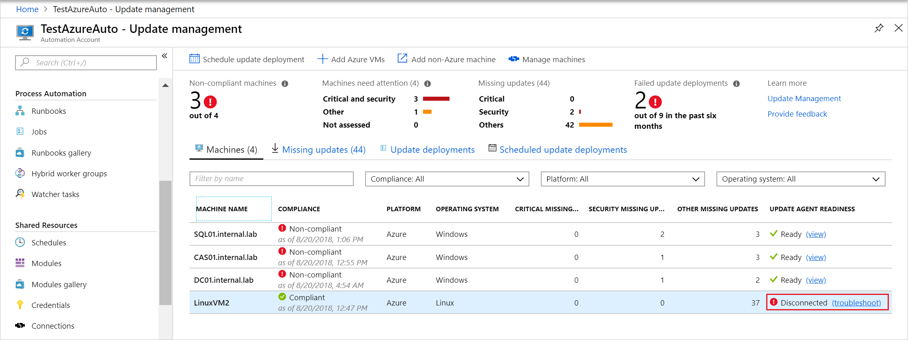
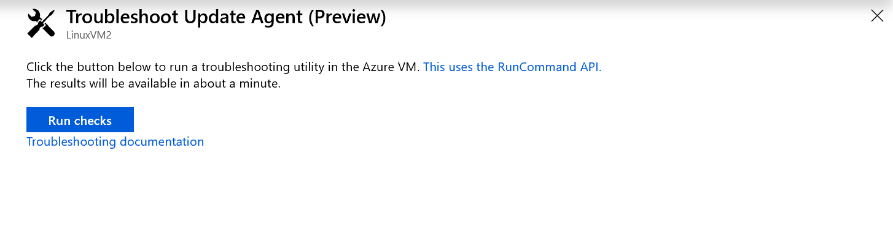
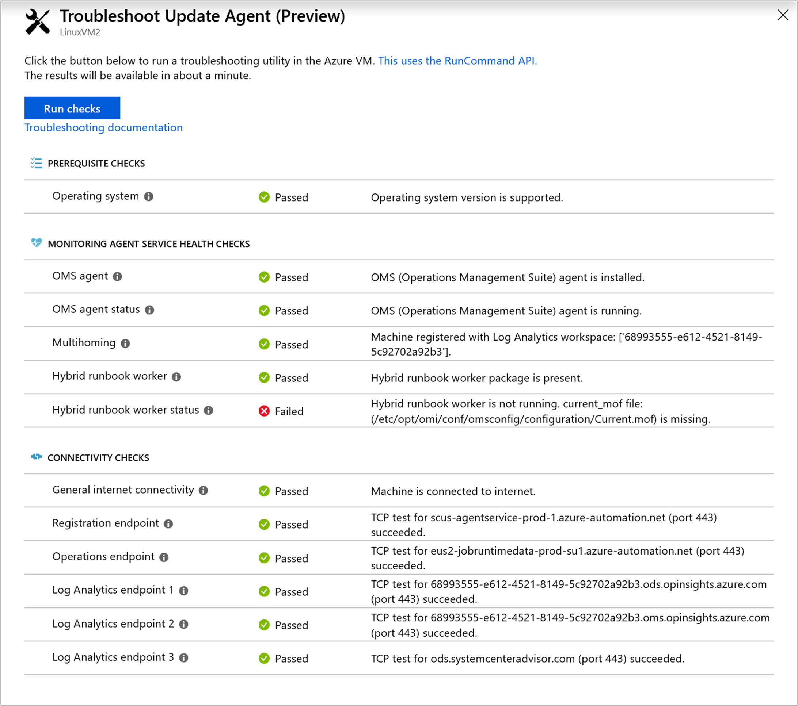

# Understand the Linux agent check results in Update Management

There may be many reasons your machine isn't showing **Ready** in Update Management. In Update Management, you can check the health of a Hybrid Worker agent to determine the underlying problem. This article discusses how to run the troubleshooter for Azure machines from the Azure portal and Non-Azure machines in the [offline scenario](#troubleshoot-offline).

The following list are the three readiness states a machine can be in:

* **Ready** - The update agent is deployed and was last seen less than 1 hour ago.
* **Disconnected** -  The update agent is deployed and was last seen over 1 hour ago.
* **Not configured** -  The update agent isn't found or hasn't finished onboarding.

> [!NOTE]
> There may be a slight delay between what the Azure portal shows and the current state of the machine.

## Start the troubleshooter

For Azure machines, clicking the **Troubleshoot** link under the **Update Agent Readiness** column in the portal launches the **Troubleshoot Update Agent** page. For Non-Azure machines, the link brings you to this article. See the offline instructions to troubleshoot a Non-Azure machine.



> [!NOTE]
> The checks require the VM to be running. If the VM is not running you are presented with a button to **Start the VM**.

On the **Troubleshoot Update Agent** page, click **Run Checks**, to start the troubleshooter. The troubleshooter uses [Run command](../../virtual-machines/linux/run-command.md) to run a script on the machine to verify the dependencies that the agent has. When the troubleshooter is complete, it returns the result of the checks.



When complete, the results are returned in the window. The check sections provide information on what each check is looking for.



## Prerequisite checks

### Operating system

The OS check, verifies if the Hybrid Runbook Worker is running one of the following Operating Systems:

|Operating system  |Notes  |
|---------|---------|
|CentOS 6 (x86/x64) and 7 (x64)      | Linux agents must have access to an update repository. Classification-based patching requires 'yum' to return security data which CentOS doesn't have out of the box.         |
|Red Hat Enterprise 6 (x86/x64) and 7 (x64)     | Linux agents must have access to an update repository.        |
|SUSE Linux Enterprise Server 11 (x86/x64) and 12 (x64)     | Linux agents must have access to an update repository.        |
|Ubuntu 14.04 LTS, 16.04 LTS, and 18.04 LTS (x86/x64)      |Linux agents must have access to an update repository.         |

## Monitoring agent service health checks

### OMS agent

This check ensures that the OMS Agent for Linux is installed. For instructions on how to install it, see [Install the agent for Linux](../../azure-monitor/learn/quick-collect-linux-computer.md#install-the-agent-for-linux
).

### OMS Agent status

This check ensures that the OMS Agent for Linux is running. If the agent isn't running, you can run the following command to attempt to restart it. For more information on troubleshooting the agent, see [Linux Hybrid Runbook worker troubleshooting](hybrid-runbook-worker.md#linux)

```bash
sudo /opt/microsoft/omsagent/bin/service_control restart
```

### Multihoming

This check determines if the agent is reporting to multiple workspaces. Multi-homing is not supported by Update Management.

### Hybrid Runbook Worker

This check verifies if the OMS Agent for Linux has the Hybrid Runbook Worker package. This package is required for Update Management to work.

### Hybrid Runbook Worker status

This check makes sure the Hybrid Runbook Worker is running on the machine. The following processes should be present if the Hybrid Runbook Worker is running correctly. To learn more, see [troubleshooting the Log Analytics Agent for Linux](hybrid-runbook-worker.md#oms-agent-not-running).

```bash
nxautom+   8567      1  0 14:45 ?        00:00:00 python /opt/microsoft/omsconfig/modules/nxOMSAutomationWorker/DSCResources/MSFT_nxOMSAutomationWorkerResource/automationworker/worker/main.py /var/opt/microsoft/omsagent/state/automationworker/oms.conf rworkspace:<workspaceId> <Linux hybrid worker version>
nxautom+   8593      1  0 14:45 ?        00:00:02 python /opt/microsoft/omsconfig/modules/nxOMSAutomationWorker/DSCResources/MSFT_nxOMSAutomationWorkerResource/automationworker/worker/hybridworker.py /var/opt/microsoft/omsagent/state/automationworker/worker.conf managed rworkspace:<workspaceId> rversion:<Linux hybrid worker version>
nxautom+   8595      1  0 14:45 ?        00:00:02 python /opt/microsoft/omsconfig/modules/nxOMSAutomationWorker/DSCResources/MSFT_nxOMSAutomationWorkerResource/automationworker/worker/hybridworker.py /var/opt/microsoft/omsagent/<workspaceId>/state/automationworker/diy/worker.conf managed rworkspace:<workspaceId> rversion:<Linux hybrid worker version>
```

## Connectivity checks

### General internet connectivity

This check makes sure that the machine has access to the internet.

### Registration endpoint

This check determines if the agent can properly communicate with the agent service.

Proxy and firewall configurations must allow the Hybrid Runbook Worker agent to communicate with the registration endpoint. For a list of addresses and ports to open, see [Network planning for Hybrid Workers](../automation-hybrid-runbook-worker.md#network-planning)

### Operations endpoint

This check determines if the agent can properly communicate with the Job Runtime Data Service.

Proxy and firewall configurations must allow the Hybrid Runbook Worker agent to communicate with the Job Runtime Data Service. For a list of addresses and ports to open, see [Network planning for Hybrid Workers](../automation-hybrid-runbook-worker.md#network-planning)

### Log Analytics endpoint 1

This check verifies that your machine has access to the endpoints needed by the Log Analytics agent.

### Log Analytics endpoint 2

This check verifies that your machine has access to the endpoints needed by the Log Analytics agent.

### Log Analytics endpoint 3

This check verifies that your machine has access to the endpoints needed by the Log Analytics agent.

## <a name="troubleshoot-offline"></a>Troubleshoot offline

You can use the troubleshooter offline on a Hybrid Runbook Worker by running the script locally. The python script, [update_mgmt_health_check.py](https://gallery.technet.microsoft.com/scriptcenter/Troubleshooting-utility-3bcbefe6) can be found in Script Center. An example of the output of this script is shown in the following example:

```output
Debug: Machine Information:   Static hostname: LinuxVM2
         Icon name: computer-vm
           Chassis: vm
        Machine ID: 00000000000000000000000000000000
           Boot ID: 00000000000000000000000000000000
    Virtualization: microsoft
  Operating System: Ubuntu 16.04.5 LTS
            Kernel: Linux 4.15.0-1025-azure
      Architecture: x86-64


Passed: Operating system version is supported

Passed: Microsoft Monitoring agent is installed

Debug: omsadmin.conf file contents:
        WORKSPACE_ID=00000000-0000-0000-0000-000000000000
        AGENT_GUID=00000000-0000-0000-0000-000000000000
        LOG_FACILITY=local0
        CERTIFICATE_UPDATE_ENDPOINT=https://00000000-0000-0000-0000-000000000000.oms.opinsights.azure.com/ConfigurationService.Svc/RenewCertificate
        URL_TLD=opinsights.azure.com
        DSC_ENDPOINT=https://scus-agentservice-prod-1.azure-automation.net/Accou            nts/00000000-0000-0000-0000-000000000000/Nodes\(AgentId='00000000-0000-0000-0000-000000000000'\)
        OMS_ENDPOINT=https://00000000-0000-0000-0000-000000000000.ods.opinsights            .azure.com/OperationalData.svc/PostJsonDataItems
        AZURE_RESOURCE_ID=/subscriptions/00000000-0000-0000-0000-000000000000/re            sourcegroups/myresourcegroup/providers/microsoft.compute/virtualmachines/linuxvm            2
        OMSCLOUD_ID=0000-0000-0000-0000-0000-0000-00
        UUID=00000000-0000-0000-0000-000000000000


Passed: Microsoft Monitoring agent is running

Passed: Machine registered with log analytics workspace:['00000000-0000-0000-0000-000000000000']

Passed: Hybrid worker package is present

Passed: Hybrid worker is running

Passed: Machine is connected to internet

Passed: TCP test for {scus-agentservice-prod-1.azure-automation.net} (port 443)             succeeded

Passed: TCP test for {eus2-jobruntimedata-prod-su1.azure-automation.net} (port 4            43) succeeded

Passed: TCP test for {00000000-0000-0000-0000-000000000000.ods.opinsights.azure.            com} (port 443) succeeded

Passed: TCP test for {00000000-0000-0000-0000-000000000000.oms.opinsights.azure.            com} (port 443) succeeded

Passed: TCP test for {ods.systemcenteradvisor.com} (port 443) succeeded

```

## Next steps

To troubleshoot additional issues with your Hybrid Runbook Workers, see [Troubleshoot - Hybrid Runbook Workers](hybrid-runbook-worker.md)

