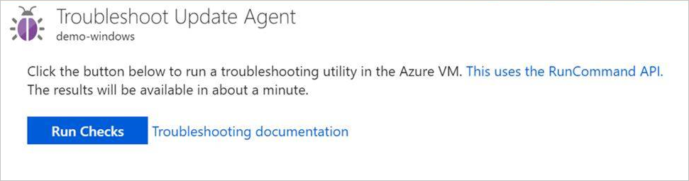
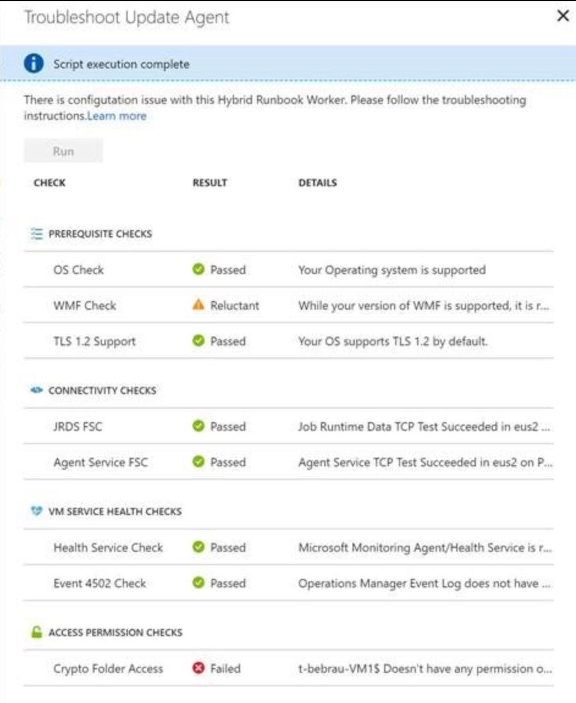

# Troubleshoot Windows update agent issues

There can be many reasons why your machine isn't showing up as ready (healthy) during an Update Management deployment. You can check the health of a Windows Hybrid Runbook Worker agent to determine the underlying problem. The following are the three readiness states for a machine:

* Ready: The Hybrid Runbook Worker is deployed and was last seen less than one hour ago.
* Disconnected: The Hybrid Runbook Worker is deployed and was last seen over one hour ago.
* Not configured: The Hybrid Runbook Worker isn't found or hasn't finished the deployment.

> [!NOTE]
> There can be a slight delay between what the Azure portal shows and the current state of a machine.

This article discusses how to run the troubleshooter for Azure machines from the Azure portal, and non-Azure machines in the [offline scenario](#troubleshoot-offline). 

> [!NOTE]
> The troubleshooter script now includes checks for Windows Server Update Services (WSUS) and for the autodownload and install keys. 

## Start the troubleshooter

For Azure machines, you can launch the Troubleshoot Update Agent page by selecting the **Troubleshoot** link under the **Update Agent Readiness** column in the portal. For non-Azure machines, the link brings you to this article. See [Troubleshoot offline](#troubleshoot-offline) to troubleshoot a non-Azure machine.


> [!NOTE]
> To check the health of the Hybrid Runbook Worker, the VM must be running. If the VM isn't running, a **Start the VM** button appears.

On the Troubleshoot Update Agent page, select **Run checks** to start the troubleshooter. The troubleshooter uses [Run Command](../../virtual-machines/windows/run-command.md) to run a script on the machine, to verify dependencies. When the troubleshooter is finished, it returns the result of the checks.



Results are shown on the page when they're ready. The checks sections show what's included in each check.



## Prerequisite checks

### Operating system

The operating system check verifies whether the Hybrid Runbook Worker is running one of the operating systems shown in the next table.

|Operating system  |Notes  |
|---------|---------|
|Windows Server 2012 and later |.NET Framework 4.6 or later is required. ([Download the .NET Framework](/dotnet/framework/install/guide-for-developers).)<br/> Windows PowerShell 5.1 is required.  ([Download Windows Management Framework 5.1](https://www.microsoft.com/download/details.aspx?id=54616).)        |

### .NET 4.6.2

The .NET Framework check verifies that the system has [.NET Framework 4.6.2](https://www.microsoft.com/en-us/download/details.aspx?id=53345) or later installed.

### WMF 5.1

The WMF check verifies that the system has the required version of the Windows Management Framework (WMF), which is [Windows Management Framework 5.1](https://www.microsoft.com/download/details.aspx?id=54616).

### TLS 1.2

This check determines whether you're using TLS 1.2 to encrypt your communications. TLS 1.0 is no longer supported by the platform. Use TLS 1.2 to communicate with Update Management.

## Connectivity checks

### Registration endpoint

This check determines whether the agent can properly communicate with the agent service.

Proxy and firewall configurations must allow the Hybrid Runbook Worker agent to communicate with the registration endpoint. For a list of addresses and ports to open, see [Network planning](../automation-hybrid-runbook-worker.md#network-planning).

### Operations endpoint

This check determines whether the agent can properly communicate with the Job Runtime Data Service.

Proxy and firewall configurations must allow the Hybrid Runbook Worker agent to communicate with the Job Runtime Data Service. For a list of addresses and ports to open, see [Network planning](../automation-hybrid-runbook-worker.md#network-planning).

## VM service health checks

### Monitoring agent service status

This check determines if the Log Analytics agent for Windows (`healthservice`) is running on the machine. To learn more about troubleshooting the service, see [The Log Analytics agent for Windows isn't running](hybrid-runbook-worker.md#mma-not-running).

To reinstall the Log Analytics agent for Windows, see [Install the agent for Windows](../../azure-monitor/learn/quick-collect-windows-computer.md#install-the-agent-for-windows).

### Monitoring agent service events

This check determines whether any 4502 events appear in the Azure Operations Manager log on the machine in the past 24 hours.

To learn more about this event, see the [Event 4502 in the Operations Manager log](hybrid-runbook-worker.md#event-4502) for this event.

## Access permissions checks

> [!NOTE]
> The troubleshooter currently doesn't route traffic through a proxy server if one is configured.

### Crypto folder access

The Crypto folder access check determines whether the local system account has access to C:\ProgramData\Microsoft\Crypto\RSA.

## <a name="troubleshoot-offline"></a>Troubleshoot offline

You can use the troubleshooter on a Hybrid Runbook Worker offline by running the script locally. Get the following script from the PowerShell Gallery: [Troubleshoot-WindowsUpdateAgentRegistration](https://www.powershellgallery.com/packages/Troubleshoot-WindowsUpdateAgentRegistration). To run the script, you must have WMF 4.0 or later installed. To download the latest version of PowerShell, see [Installing various versions of PowerShell](https://docs.microsoft.com/powershell/scripting/install/installing-powershell).

The output of this script looks like the following example:

```output
RuleId                      : OperatingSystemCheck
RuleGroupId                 : prerequisites
RuleName                    : Operating System
RuleGroupName               : Prerequisite Checks
RuleDescription             : The Windows Operating system must be version 6.2.9200 (Windows Server 2012) or higher
CheckResult                 : Passed
CheckResultMessage          : Operating System version is supported
CheckResultMessageId        : OperatingSystemCheck.Passed
CheckResultMessageArguments : {}

RuleId                      : DotNetFrameworkInstalledCheck
RuleGroupId                 : prerequisites
RuleName                    : .NET Framework 4.5+
RuleGroupName               : Prerequisite Checks
RuleDescription             : .NET Framework version 4.5 or higher is required
CheckResult                 : Passed
CheckResultMessage          : .NET Framework version 4.5+ is found
CheckResultMessageId        : DotNetFrameworkInstalledCheck.Passed
CheckResultMessageArguments : {}

RuleId                      : WindowsManagementFrameworkInstalledCheck
RuleGroupId                 : prerequisites
RuleName                    : WMF 5.1
RuleGroupName               : Prerequisite Checks
RuleDescription             : Windows Management Framework version 4.0 or higher is required (version 5.1 or higher is preferable)
CheckResult                 : Passed
CheckResultMessage          : Detected Windows Management Framework version: 5.1.17763.1
CheckResultMessageId        : WindowsManagementFrameworkInstalledCheck.Passed
CheckResultMessageArguments : {5.1.17763.1}

RuleId                      : AutomationAgentServiceConnectivityCheck1
RuleGroupId                 : connectivity
RuleName                    : Registration endpoint
RuleGroupName               : connectivity
RuleDescription             :
CheckResult                 : Failed
CheckResultMessage          : Unable to find Workspace registration information in registry
CheckResultMessageId        : AutomationAgentServiceConnectivityCheck1.Failed.NoRegistrationFound
CheckResultMessageArguments : {}

RuleId                      : AutomationJobRuntimeDataServiceConnectivityCheck
RuleGroupId                 : connectivity
RuleName                    : Operations endpoint
RuleGroupName               : connectivity
RuleDescription             : Proxy and firewall configuration must allow Automation Hybrid Worker agent to communicate with eus2-jobruntimedata-prod-su1.azure-automation.net
CheckResult                 : Passed
CheckResultMessage          : TCP Test for eus2-jobruntimedata-prod-su1.azure-automation.net (port 443) succeeded
CheckResultMessageId        : AutomationJobRuntimeDataServiceConnectivityCheck.Passed
CheckResultMessageArguments : {eus2-jobruntimedata-prod-su1.azure-automation.net}

RuleId                      : MonitoringAgentServiceRunningCheck
RuleGroupId                 : servicehealth
RuleName                    : Monitoring Agent service status
RuleGroupName               : VM Service Health Checks
RuleDescription             : HealthService must be running on the machine
CheckResult                 : Failed
CheckResultMessage          : Log Analytics for Windows service (HealthService) is not running
CheckResultMessageId        : MonitoringAgentServiceRunningCheck.Failed
CheckResultMessageArguments : {Log Analytics agent for Windows, HealthService}

RuleId                      : MonitoringAgentServiceEventsCheck
RuleGroupId                 : servicehealth
RuleName                    : Monitoring Agent service events
RuleGroupName               : VM Service Health Checks
RuleDescription             : Event Log must not have event 4502 logged in the past 24 hours
CheckResult                 : Failed
CheckResultMessage          : Log Analytics agent for Windows service Event Log (Operations Manager) does not exist on the machine
CheckResultMessageId        : MonitoringAgentServiceEventsCheck.Failed.NoLog
CheckResultMessageArguments : {Log Analytics agent for Windows, Operations Manager, 4502}

RuleId                      : CryptoRsaMachineKeysFolderAccessCheck
RuleGroupId                 : permissions
RuleName                    : Crypto RSA MachineKeys Folder Access
RuleGroupName               : Access Permission Checks
RuleDescription             : SYSTEM account must have WRITE and MODIFY access to 'C:\\ProgramData\\Microsoft\\Crypto\\RSA\\MachineKeys'
CheckResult                 : Passed
CheckResultMessage          : Have permissions to access C:\\ProgramData\\Microsoft\\Crypto\\RSA\\MachineKeys
CheckResultMessageId        : CryptoRsaMachineKeysFolderAccessCheck.Passed
CheckResultMessageArguments : {C:\\ProgramData\\Microsoft\\Crypto\\RSA\\MachineKeys}

RuleId                      : TlsVersionCheck
RuleGroupId                 : prerequisites
RuleName                    : TLS 1.2
RuleGroupName               : Prerequisite Checks
RuleDescription             : Client and Server connections must support TLS 1.2
CheckResult                 : Passed
CheckResultMessage          : TLS 1.2 is enabled by default on the Operating System.
CheckResultMessageId        : TlsVersionCheck.Passed.EnabledByDefault
CheckResultMessageArguments : {}
```

## Next steps

[Troubleshoot Hybrid Runbook Worker issues](hybrid-runbook-worker.md).
