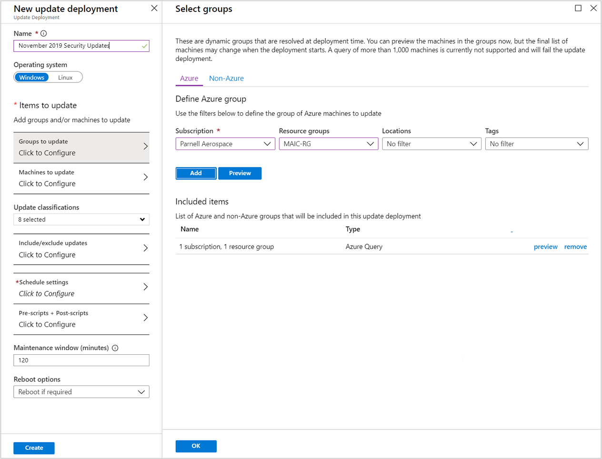
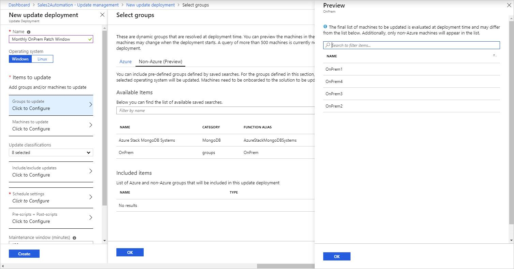

# Use dynamic groups with Update Management

Update Management allows you to target a dynamic group of Azure or non-Azure VMs for update deployments. Using a dynamic group keeps you from having to edit your deployment to update machines.

> [!NOTE]
> Dynamic groups do not work with classic VMs.

You can define dynamic groups for Azure or non-Azure machines from **Update management** in the Azure portal. See [Manage updates for VMs](manage-updates-for-vm.md).

A dynamic group is defined by a query that Azure Automation evaluates at deployment time. Even if a dynamic group query retrieves a large number of machines, Azure Automation can process only a maximum of 1000 machines at a time. See [Azure subscription and service limits, quotas, and constraints](../../azure-resource-manager/management/azure-subscription-service-limits.md#update-management).

> [!NOTE]
> If you expect to update more than 1000 machines, we recommend that you split up the updates among multiple update schedules. 

## Define dynamic groups for Azure machines

When defining a dynamic group query for Azure machines, you can use the following items to populate the dynamic group:

* Subscription
* Resource groups
* Locations
* Tags

To preview the results of your dynamic group query, click **Preview**. The preview shows the group membership at the current time. In the example, we're searching for machines having the tag `Role` for the group **BackendServer**. If more machines have this tag added, they are added to any future deployments against that group.

## Define dynamic groups for non-Azure machines

A dynamic group for non-Azure machines uses saved searches, also called computer groups. To learn how to create a saved search, see [Creating a computer group](../../azure-monitor/logs/computer-groups.md#creating-a-computer-group). Once your saved search is created, you can select it from the list of saved searches in **Update management** in the Azure portal. Click **Preview** to preview the computers in the saved search.

> [!NOTE]
> A saved search that [queries data stored across multiple Log Analytics workspaces](../../azure-monitor/logs/cross-workspace-query.md) is not supported.

## Next steps

You can [query Azure Monitor logs](query-logs.md) to analyze update assessments, deployments, and other related management tasks. It includes pre-defined queries to help you get started.
