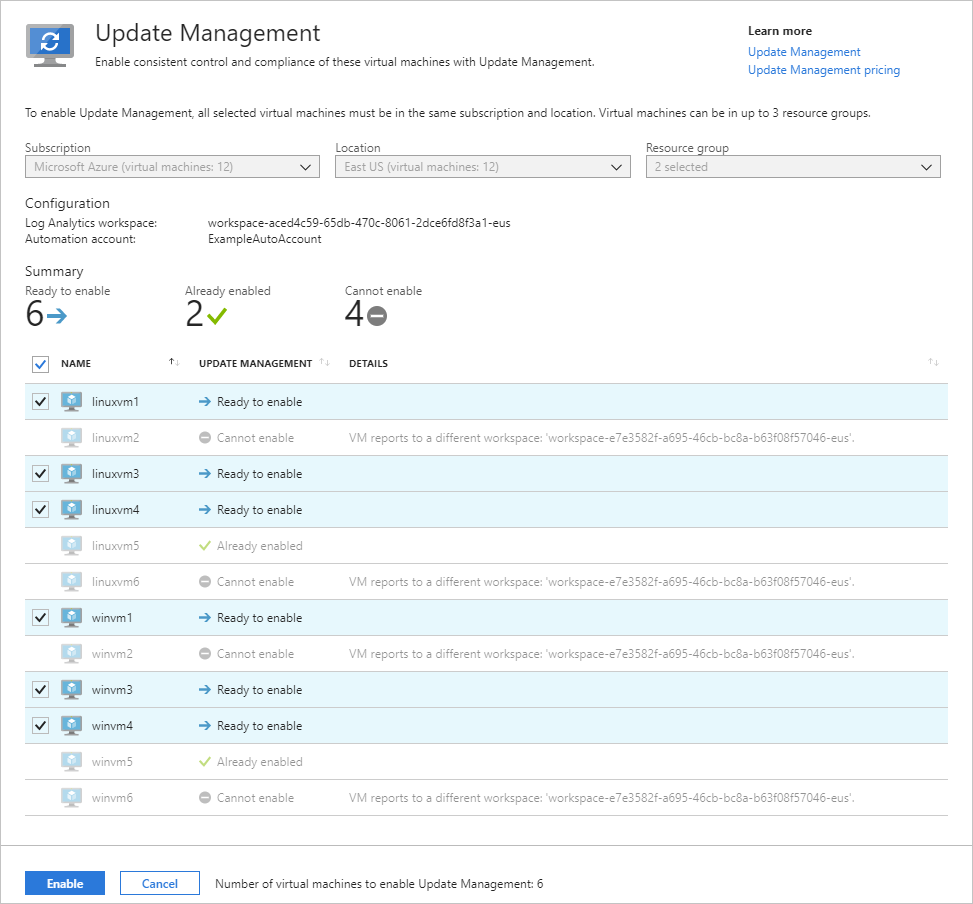

# Enable Update Management from an Automation account

This article describes how you can use your Automation account to enable the [Update Management](overview.md) feature for VMs in your environment, including machines or servers registered with [Azure Arc-enabled servers](../../azure-arc/servers/overview.md). To enable Azure VMs at scale, you must enable an existing Azure VM using Update Management.

> [!NOTE]
> When enabling Update Management, only certain regions are supported for linking a Log Analytics workspace and an Automation account. For a list of the supported mapping pairs, see [Region mapping for Automation account and Log Analytics workspace](../how-to/region-mappings.md).

## Prerequisites

* Azure subscription. If you don't have one yet, you can [activate your MSDN subscriber benefits](https://azure.microsoft.com/pricing/member-offers/msdn-benefits-details/) or sign up for a [free account](https://azure.microsoft.com/free/?WT.mc_id=A261C142F).
* [Automation account](../automation-security-overview.md) to manage machines.
* An [Azure virtual machine](../../virtual-machines/windows/quick-create-portal.md), or VM or server registered with Azure Arc-enabled servers. Non-Azure VMs or servers need to have the [Log Analytics agent](../../azure-monitor/agents/log-analytics-agent.md) for Windows or Linux installed and reporting to the workspace linked to the Automation account where Update Management is enabled. We recommend installing the Log Analytics agent for Windows or Linux by first connecting your machine to [Azure Arc-enabled servers](../../azure-arc/servers/overview.md), and then use Azure Policy to assign the [Deploy Log Analytics agent to *Linux* or *Windows* Azure Arc machines](../../governance/policy/samples/built-in-policies.md#monitoring) built-in policy. Alternatively, if you plan to monitor the machines with Azure Monitor for VMs, instead use the [Enable Azure Monitor for VMs](../../governance/policy/samples/built-in-initiatives.md#monitoring) initiative.

## Sign in to Azure

Sign in to the [Azure portal](https://portal.azure.com).

## Enable Update Management

1. In your Automation account, select **Update management** under **Update management**.

2. Choose the Log Analytics workspace and Automation account and select **Enable** to enable Update Management. The setup takes up to 15 minutes to complete.

    

## Enable Azure VMs

1. From your Automation account select **Update management** under **Update management**.

2. Select **+ Add Azure VMs** and select one or more VMs from the list. Virtual machines that can't be enabled are grayed out and unable to be selected. Azure VMs can exist in any region no matter the location of your Automation account.

3. Select **Enable** to add the selected VMs to the computer group saved search for the feature.

    

## Enable non-Azure VMs

For machines or servers hosted outside of Azure, including the ones registered with Azure Arc-enabled servers, perform the following steps to enable them with Update Management.  

1. From your Automation account, select **Update management** under **Update management**.

2. Select **Add non-Azure machine**. This action opens a new browser window with [instructions to install and configure the Log Analytics agent for Windows](../../azure-monitor/agents/log-analytics-agent.md) so that the machine can begin reporting to Update Management. If you're enabling a machine that's currently managed by Operations Manager, a new agent isn't required. The workspace information is added to the agents configuration.

## Enable machines in the workspace

Manually installed machines or machines already reporting to your workspace must to be added to Azure Automation for Update Management to be enabled.

1. From your Automation account, select **Update management** under **Update management**.

2. Select **Manage machines**. The **Manage machines** button might be grayed out if you previously chose the option **Enable on all available and future machines**

    

3. To enable Update Management for all available machines reporting to the workspace, select **Enable on all available machines** on the Manage Machines page. This action disables the control to add machines individually and adds all of the machines reporting to the workspace to the computer group saved search query `MicrosoftDefaultComputerGroup`. When selected, this action disables the **Manage Machines** option.

4. To enable the feature for all available machines and future machines, select **Enable on all available and future machines**. This option deletes the saved search and scope configuration from the workspace, and permits the feature to include all Azure and non-Azure machines that currently or in the future, report to the workspace. When selected, this action disables the **Manage Machines** option permanently, as there's no scope configuration available.

    > [!NOTE]
    > Because this option deletes the saved search and scope configuration within Log Analytics, it's important to remove any deletion locks on the Log Analytics Workspace before you select this option. If you don't, the option will fail to remove the configurations and you must remove them manually.

5. If necessary, you can add the scope configuration back by re-adding the initial saved search query. For more information, see [Limit Update Management deployment scope](scope-configuration.md).

6. To enable the feature for one or more machines, select **Enable on selected machines** and select **Add** next to each machine. This task adds the selected machine names to the computer group saved search query for the feature.

## Next steps

* To use Update Management for VMs, see [Manage updates and patches for your VMs](manage-updates-for-vm.md).

* When you no longer need to manage VMs or servers with Update Management, see [remove VMs from Update Management](remove-vms.md).

* To troubleshoot general Update Management errors, see [Troubleshoot Update Management issues](../troubleshoot/update-management.md).
