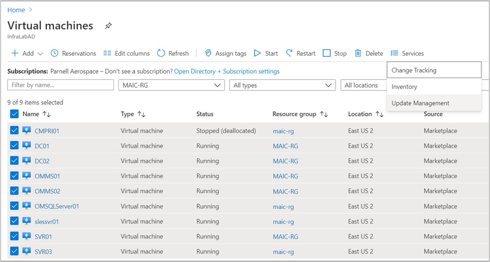
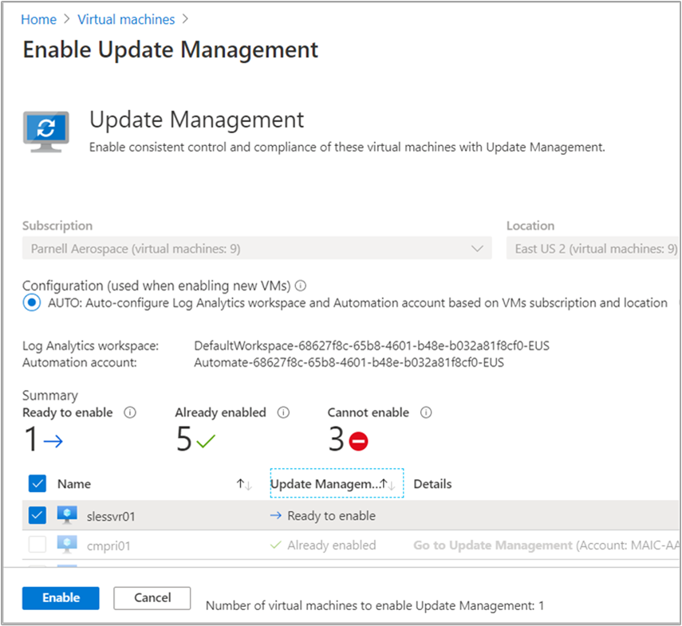
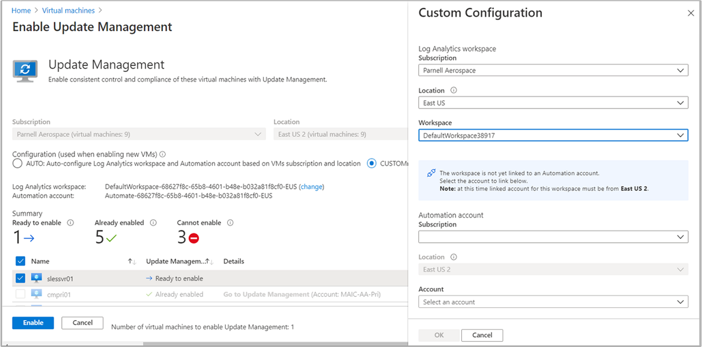

# Enable Update Management from the Azure portal

This article describes how you can enable the [Update Management](overview.md) feature for VMs by browsing the Azure portal. To enable Azure VMs at scale, you must enable an existing Azure VM using Update Management.

The number of resource groups that you can use for managing your VMs is limited by the [Resource Manager deployment limits](../../azure-resource-manager/templates/deploy-to-resource-group.md). Resource Manager deployments, not to be confused with Update deployments, are limited to five resource groups per deployment. Two of these resource groups are reserved to configure the Log Analytics workspace, Automation account, and related resources. This leaves you with three resource groups to select for management by Update Management. This limit only applies to simultaneous setup, not the number of resource groups that can be managed by an Automation feature.

> [!NOTE]
> When enabling Update Management, only certain regions are supported for linking a Log Analytics workspace and an Automation Account. For a list of the supported mapping pairs, see [Region mapping for Automation Account and Log Analytics workspace](../how-to/region-mappings.md).

## Prerequisites

* Azure subscription. If you don't have one yet, you can [activate your MSDN subscriber benefits](https://azure.microsoft.com/pricing/member-offers/msdn-benefits-details/) or sign up for a [free account](https://azure.microsoft.com/free/?WT.mc_id=A261C142F).
* [Automation account](../automation-security-overview.md) to manage machines.
* A [virtual machine](../../virtual-machines/windows/quick-create-portal.md).

## Sign in to Azure

Sign in to the [Azure portal](https://portal.azure.com).

## Enable Update Management

1. In the Azure portal, navigate to **Virtual machines**.

2. On the **Virtual machines** page, use the checkboxes to choose the VMs to add to Update Management. You can add machines for up to three different resource groups at a time. Azure VMs can exist in any region, no matter the location of your Automation account.

    

    > [!TIP]
    > Use the filter controls to select VMs from different subscriptions, locations, and resource groups. You can click the top checkbox to select all virtual machines in a list.

    

3. Select **Services** and select **Update Management** for the Update Management feature.

4. The list of virtual machines is filtered to show only the virtual machines that are in the same subscription and location. If your virtual machines are in more than three resource groups, the first three resource groups are selected.

5. An existing Log Analytics workspace and Automation account are selected by default. If you want to use a different Log Analytics workspace and Automation account, select **CUSTOM** to select them from the Custom Configuration page. When you choose a Log Analytics workspace, a check is made to determine if it is linked with an Automation account. If a linked Automation account is found, you see the following screen. When done, select **OK**.

    

6. If the workspace selected is not linked to an Automation account, you see the following screen. Select an Automation account and select **OK** when finished.

    

7. Deselect any virtual machine that you don't want to enable. VMs that can't be enabled are already deselected.

8. Select **Enable** to enable the feature. After you've enabled Update Management, it might take about 15 minutes before you can view the update assessment from them.

## Next steps

* To use Update Management for VMs, see [Manage updates and patches for your VMs](manage-updates-for-vm.md).
* To troubleshoot general Update Management errors, see [Troubleshoot Update Management issues](../troubleshoot/update-management.md).
* To troubleshoot problems with the Windows update agent, see [Troubleshoot Windows update agent issues](../troubleshoot/update-agent-issues.md).
* To troubleshoot problems with the Linux update agent, see [Troubleshoot Linux update agent issues](../troubleshoot/update-agent-issues-linux.md).
