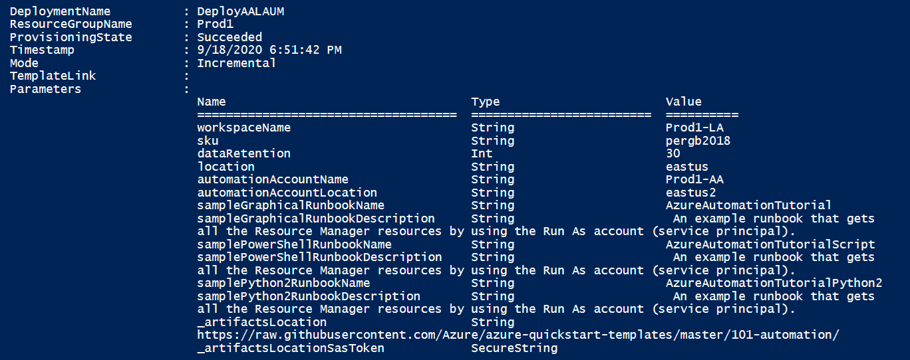
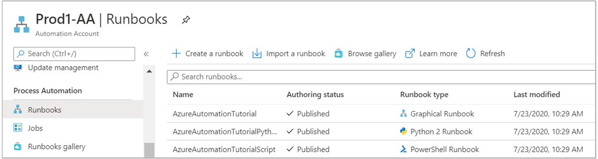
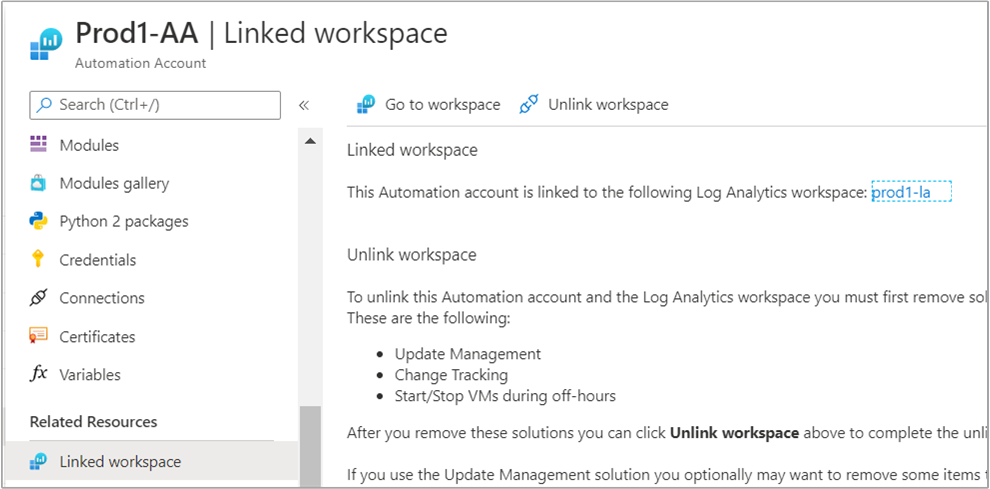
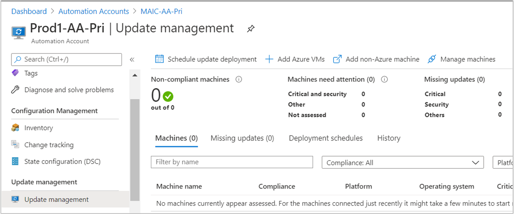

# Enable Update Management using Azure Resource Manager template

You can use an [Azure Resource Manager template](../../azure-resource-manager/templates/template-syntax.md) to enable the Azure Automation Update Management feature in your resource group. This article provides a sample template that automates the following:

* Automates the creation of an Azure Monitor Log Analytics workspace.
* Automates the creation of an Azure Automation account.
* Links the Automation account to the Log Analytics workspace.
* Adds sample Automation runbooks to the account.
* Enables the Update Management feature.

The template does not automate enabling Update Management on one or more Azure or non-Azure VMs.

If you already have a Log Analytics workspace and Automation account deployed in a supported region in your subscription, they are not linked. Using this template successfully creates the link and deploys Update Management.

>[!NOTE]
>Creation of the Automation Run As account is not supported when you're using an ARM template. To create a Run As account manually from the portal or with PowerShell, see [Create Run As account](../create-run-as-account.md).

After you complete these steps, you need to [configure diagnostic settings](../automation-manage-send-joblogs-log-analytics.md) for your Automation account to send runbook job status and job streams to the linked Log Analytics workspace.

## API versions

The following table lists the API version for the resources used in this example.

| Resource | Resource type | API version |
|:---|:---|:---|
| [Workspace](/azure/templates/microsoft.operationalinsights/workspaces) | workspaces | 2020-03-01-preview |
| [Automation account](/azure/templates/microsoft.automation/automationaccounts) | automation | 2020-01-13-preview |
| [Workspace Linked services](/azure/templates/microsoft.operationalinsights/workspaces/linkedservices) | workspaces | 2020-03-01-preview |
| [Solutions](/azure/templates/microsoft.operationsmanagement/solutions) | solutions | 2015-11-01-preview |

## Before using the template

The JSON template is configured to prompt you for:

* The name of the workspace.
* The region to create the workspace in.
* The name of the Automation account.
* The region to create the Automation account in.

The following parameters in the template are set with a default value for the Log Analytics workspace:

* *sku* defaults to the per GB pricing tier released in the April 2018 pricing model.
* *dataRetention* defaults to 30 days.

>[!WARNING]
>If you want to create or configure a Log Analytics workspace in a subscription that has opted into the April 2018 pricing model, the only valid Log Analytics pricing tier is *PerGB2018*.
>

The JSON template specifies a default value for the other parameters that would likely be used as a standard configuration in your environment. You can store the template in an Azure storage account for shared access in your organization. For more information about working with templates, see [Deploy resources with ARM templates and the Azure CLI](../../azure-resource-manager/templates/deploy-cli.md).

If you're new to Azure Automation and Azure Monitor, it's important that you understand the following configuration details. They can help you avoid errors when you try to create, configure, and use a Log Analytics workspace linked to your new Automation account.

* Review [additional details](../../azure-monitor/logs/resource-manager-workspace.md#create-a-log-analytics-workspace) to fully understand workspace configuration options, such as access control mode, pricing tier, retention, and capacity reservation level.

* Review [workspace mappings](../how-to/region-mappings.md) to specify the supported regions inline or in a parameter file. Only certain regions are supported for linking a Log Analytics workspace and an Automation account in your subscription.

* If you're new to Azure Monitor logs and have not deployed a workspace already, you should review the [workspace design guidance](../../azure-monitor/logs/design-logs-deployment.md). It will help you to learn about access control, and understand the design implementation strategies we recommend for your organization.

## Deploy template

1. Copy and paste the following JSON syntax into your file:

    ```json
    {
        "$schema": "https://schema.management.azure.com/schemas/2019-04-01/deploymentTemplate.json#",
        "contentVersion": "1.0.0.0",
        "parameters": {
            "workspaceName": {
                "type": "string",
                "metadata": {
                    "description": "Workspace name"
                }
            },
            "sku": {
                "type": "string",
                "allowedValues": [
                    "pergb2018",
                    "Free",
                    "Standalone",
                    "PerNode",
                    "Standard",
                    "Premium"
                ],
                "defaultValue": "pergb2018",
                "metadata": {
                    "description": "Pricing tier: perGB2018 or legacy tiers (Free, Standalone, PerNode, Standard or Premium), which are not available to all customers."
                }
            },
            "dataRetention": {
                "type": "int",
                "defaultValue": 30,
                "minValue": 7,
                "maxValue": 730,
                "metadata": {
                    "description": "Number of days to retain data."
                }
            },
            "location": {
                "type": "string",
                "defaultValue": "[resourceGroup().location]",
                "metadata": {
                    "description": "Specifies the location in which to create the workspace."
                }
            },
            "automationAccountName": {
                "type": "string",
                "metadata": {
                    "description": "Automation account name"
                }
            },
            "automationAccountLocation": {
                "type": "string",
                "metadata": {
                    "description": "Specifies the location in which to create the Automation account."
                }
            },
            "sampleGraphicalRunbookName": {
                "type": "String",
                "defaultValue": "AzureAutomationTutorial"
            },
            "sampleGraphicalRunbookDescription": {
                "type": "String",
                "defaultValue": " An example runbook that gets all the Resource Manager resources by using the Run As account (service principal)."
            },
            "samplePowerShellRunbookName": {
                "type": "String",
                "defaultValue": "AzureAutomationTutorialScript"
            },
            "samplePowerShellRunbookDescription": {
                "type": "String",
                "defaultValue": " An example runbook that gets all the Resource Manager resources by using the Run As account (service principal)."
            },
            "samplePython2RunbookName": {
                "type": "String",
                "defaultValue": "AzureAutomationTutorialPython2"
            },
            "samplePython2RunbookDescription": {
                "type": "String",
                "defaultValue": " An example runbook that gets all the Resource Manager resources by using the Run As account (service principal)."
            },
            "_artifactsLocation": {
                "type": "string",
                "defaultValue": "https://raw.githubusercontent.com/Azure/azure-quickstart-templates/master/101-automation/",
                "metadata": {
                    "description": "URI to artifacts location"
                }
            },
            "_artifactsLocationSasToken": {
                "type": "securestring",
                "defaultValue": "",
                "metadata": {
                    "description": "The sasToken required to access _artifactsLocation.  When the template is deployed using the accompanying scripts, a sasToken will be automatically generated"
                }
            }
        },
        "variables": {
        "Updates": {
            "name": "[concat('Updates', '(', parameters('workspaceName'), ')')]",
            "galleryName": "Updates"
          }
        },
        "resources": [
            {
                "type": "Microsoft.OperationalInsights/workspaces",
                "apiVersion": "2020-03-01-preview",
                "name": "[parameters('workspaceName')]",
                "location": "[parameters('location')]",
                "properties": {
                    "sku": {
                        "name": "[parameters('sku')]"
                    },
                    "retentionInDays": "[parameters('dataRetention')]",
                    "features": {
                        "searchVersion": 1,
                        "legacy": 0
                    }
                }
            },
            {
                "apiVersion": "2015-11-01-preview",
                "location": "[parameters('location')]",
                "name": "[variables('Updates').name]",
                "type": "Microsoft.OperationsManagement/solutions",
                "id": "[concat('/subscriptions/', subscription().subscriptionId, '/resourceGroups/', resourceGroup().name, '/providers/Microsoft.OperationsManagement/solutions/', variables('Updates').name)]",
                "dependsOn": [
                    "[concat('Microsoft.OperationalInsights/workspaces/', parameters('workspaceName'))]"
                ],
                "properties": {
                    "workspaceResourceId": "[resourceId('Microsoft.OperationalInsights/workspaces/', parameters('workspaceName'))]"
                },
                "plan": {
                    "name": "[variables('Updates').name]",
                    "publisher": "Microsoft",
                    "promotionCode": "",
                    "product": "[concat('OMSGallery/', variables('Updates').galleryName)]"
                }
            },
            {
                "type": "Microsoft.Automation/automationAccounts",
                "apiVersion": "2020-01-13-preview",
                "name": "[parameters('automationAccountName')]",
                "location": "[parameters('automationAccountLocation')]",
                "dependsOn": [
                    "[parameters('workspaceName')]"
                ],
                "properties": {
                    "sku": {
                        "name": "Basic"
                    }
                },
                "resources": [
                    {
                        "type": "runbooks",
                        "apiVersion": "2018-06-30",
                        "name": "[parameters('sampleGraphicalRunbookName')]",
                        "location": "[parameters('automationAccountLocation')]",
                        "dependsOn": [
                            "[parameters('automationAccountName')]"
                        ],
                        "properties": {
                            "runbookType": "GraphPowerShell",
                            "logProgress": "false",
                            "logVerbose": "false",
                            "description": "[parameters('sampleGraphicalRunbookDescription')]",
                            "publishContentLink": {
                                "uri": "[uri(parameters('_artifactsLocation'), concat('scripts/AzureAutomationTutorial.graphrunbook', parameters('_artifactsLocationSasToken')))]",
                                "version": "1.0.0.0"
                            }
                        }
                    },
                    {
                        "type": "runbooks",
                        "apiVersion": "2018-06-30",
                        "name": "[parameters('samplePowerShellRunbookName')]",
                        "location": "[parameters('automationAccountLocation')]",
                        "dependsOn": [
                            "[parameters('automationAccountName')]"
                        ],
                        "properties": {
                            "runbookType": "PowerShell",
                            "logProgress": "false",
                            "logVerbose": "false",
                            "description": "[parameters('samplePowerShellRunbookDescription')]",
                            "publishContentLink": {
                                "uri": "[uri(parameters('_artifactsLocation'), concat('scripts/AzureAutomationTutorial.ps1', parameters('_artifactsLocationSasToken')))]",
                                "version": "1.0.0.0"
                            }
                        }
                    },
                    {
                        "type": "runbooks",
                        "apiVersion": "2018-06-30",
                        "name": "[parameters('samplePython2RunbookName')]",
                        "location": "[parameters('automationAccountLocation')]",
                        "dependsOn": [
                            "[parameters('automationAccountName')]"
                        ],
                        "properties": {
                            "runbookType": "Python2",
                            "logProgress": "false",
                            "logVerbose": "false",
                            "description": "[parameters('samplePython2RunbookDescription')]",
                            "publishContentLink": {
                                "uri": "[uri(parameters('_artifactsLocation'), concat('scripts/AzureAutomationTutorialPython2.py', parameters('_artifactsLocationSasToken')))]",
                                "version": "1.0.0.0"
                            }
                        }
                    }
                ]
            },
            {
                "type": "Microsoft.OperationalInsights/workspaces/linkedServices",
                "apiVersion": "2020-03-01-preview",
                "name": "[concat(parameters('workspaceName'), '/' , 'Automation')]",
                "location": "[parameters('location')]",
                "dependsOn": [
                    "[parameters('workspaceName')]",
                    "[parameters('automationAccountName')]"
                ],
                "properties": {
                    "resourceId": "[resourceId('Microsoft.Automation/automationAccounts', parameters('automationAccountName'))]"
                }
            }
        ]
    }
    ```

2. Edit the template to meet your requirements. Consider creating a [Resource Manager parameters file](../../azure-resource-manager/templates/parameter-files.md) instead of passing parameters as inline values.

3. Save this file to a local folder as **deployUMSolutiontemplate.json**.

4. You are ready to deploy this template. You can use either PowerShell or the Azure CLI. When you're prompted for a workspace and Automation account name, provide a name that is globally unique across all Azure subscriptions.

    **PowerShell**

    ```powershell
    New-AzResourceGroupDeployment -Name <deployment-name> -ResourceGroupName <resource-group-name> -TemplateFile deployUMSolutiontemplate.json
    ```

    **Azure CLI**

    ```azurecli
    az deployment group create --resource-group <my-resource-group> --name <my-deployment-name> --template-file deployUMSolutiontemplate.json
    ```

    The deployment can take a few minutes to complete. When it finishes, you see a message similar to the following that includes the result:

    

## Review deployed resources

1. Sign in to the [Azure portal](https://portal.azure.com).

2. In the Azure portal, open the Automation account you created.

3. From the left-pane, select **Runbooks**. On the **Runbooks** page, listed are three tutorial runbooks created with the Automation account.

    

4. From the left-pane, select **Linked workspace**. On the **Linked workspace** page, it shows the Log Analytics workspace you specified earlier linked to your Automation account.

    

5. From the left-pane, select **Update management**. On the **Update management** page, it shows the assessment page without any information as a result of just being enabled, and machines aren't configured for management.

    

## Clean up resources

When you no longer need them, delete the **Updates** solution in the Log Analytics workspace, unlink the Automation account from the  workspace, and then delete the Automation account and workspace.

## Next steps

* To use Update Management for VMs, see [Manage updates and patches for your VMs](manage-updates-for-vm.md).

* If you no longer want to use Update Management and wish to remove it, see instructions in [Remove Update Management feature](remove-feature.md).

* To delete VMs from Update Management, see [Remove VMs from Update Management](remove-vms.md).
