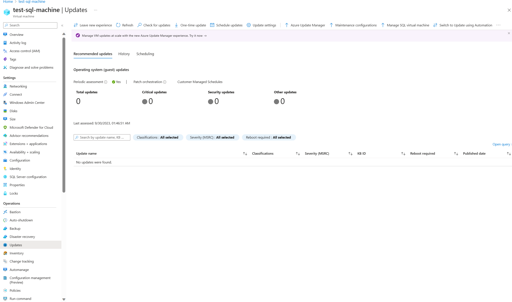

# Enable Update Management for an Azure VM

This article describes how you can enable the [Update Management](overview.md) feature on one or more Azure virtual machines (VM). To enable Azure VMs at scale, you must enable an existing Azure VM using Update Management.

> [!NOTE]
> When enabling Update Management, only certain regions are supported for linking a Log Analytics workspace and an Automation account. For a list of the supported mapping pairs, see [Region mapping for Automation account and Log Analytics workspace](../how-to/region-mappings.md).

## Prerequisites

* Azure subscription. If you don't have one yet, you can [activate your MSDN subscriber benefits](https://azure.microsoft.com/pricing/member-offers/msdn-benefits-details/) or sign up for a [free account](https://azure.microsoft.com/free/?WT.mc_id=A261C142F).
* [Automation account](../automation-security-overview.md) to manage machines.
* A [virtual machine](../../virtual-machines/windows/quick-create-portal.md).

## Sign in to Azure

Sign in to the [Azure portal](https://portal.azure.com).

## Enable the feature for deployment

1. In the [Azure portal](https://portal.azure.com), select **Virtual machines** or search for and select **Virtual machines** from the Home page.

2. Select the VM for which you want to enable Update Management. VMs can exist in any region, no matter the location of your Automation account.

3. On the VM page, under **Operations**, select **Guest + host updates**.

    

4. You must have the `Microsoft.OperationalInsights/workspaces/read` permission to determine if the VM is enabled for a workspace. To learn about additional permissions that are required, see [Permissions needed to enable machines](../automation-role-based-access-control.md#feature-setup-permissions). To learn how to enable multiple machines at once, see [Enable Update Management from an Automation account](./enable-from-automation-account.md).

5. On the enable Update Management page, choose the Log Analytics workspace and Automation account and click **Enable** to enable Update Management. After you've enabled Update Management, it might take about 15 minutes before you can view the update assessment from the VM.

    

## Next steps

* To use Update Management for VMs, see [Manage updates and patches for your Azure VMs](manage-updates-for-vm.md).

* To troubleshoot general Update Management errors, see [Troubleshoot Update Management issues](../troubleshoot/update-management.md).