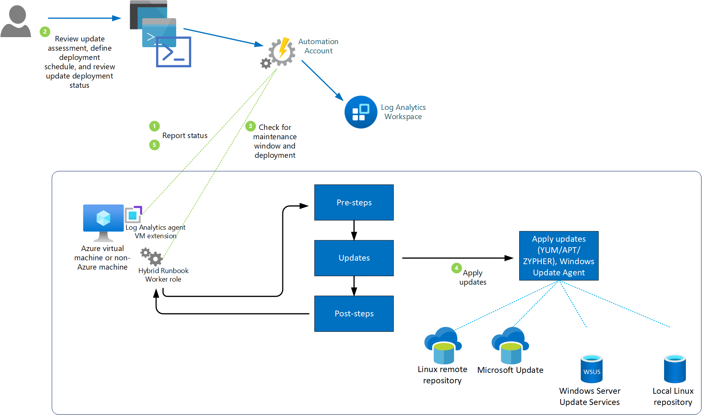

# Update Management overview

> [!CAUTION]
> This article references CentOS, a Linux distribution that is nearing End Of Life (EOL) status. Please consider your use and planning accordingly. For more information, see the [CentOS End Of Life guidance](~/articles/virtual-machines/workloads/centos/centos-end-of-life.md).

> [!Important]
> - Azure Automation Update Management will  retire on **31 August 2024**. Follow the guidelines for [migration to Azure Update Manager](../../update-manager/guidance-migration-automation-update-management-azure-update-manager.md).
> - Azure Log Analytics agent, also known as the Microsoft Monitoring Agent (MMA) will be [retired in August 2024](https://azure.microsoft.com/updates/were-retiring-the-log-analytics-agent-in-azure-monitor-on-31-august-2024/). Azure Automation Update Management solution relies on this agent and may encounter issues once the agent is retired as it does not work with Azure Monitoring Agent (AMA). Therefore, if you are using the Azure Automation Update Management solution, we recommend that you move to Azure Update Manager for your software update needs. All the capabilities of Azure Automation Update management solution will be available on Azure Update Manager before the retirement date. Follow the [guidance](../../update-center/guidance-migration-automation-update-management-azure-update-manager.md) to move your machines and schedules from Automation Update Management to Azure Update Manager.

You can use Update Management in Azure Automation to manage operating system updates for your Windows and Linux virtual machines in Azure, physical or VMs in on-premises environments, and in other cloud environments. You can quickly assess the status of available updates and manage the process of installing required updates for your machines reporting to Update Management. 

As a service provider, you may have onboarded multiple customer tenants to [Azure Lighthouse](../../lighthouse/overview.md). Update Management can be used to assess and schedule update deployments to machines in multiple subscriptions in the same Microsoft Entra tenant, or across tenants using Azure Lighthouse.

Microsoft offers other capabilities to help you manage updates for your Azure VMs or Azure virtual machine scale sets that you should consider as part of your overall update management strategy. 

- If you are interested in automatically assessing and updating your Azure virtual machines to maintain security compliance with *Critical* and *Security* updates released each month, review [Automatic VM guest patching](../../virtual-machines/automatic-vm-guest-patching.md). This is an alternative update management solution for your Azure VMs to auto-update them during off-peak hours, including VMs within an availability set, compared to managing update deployments to those VMs from Update Management in Azure Automation. 

- If you manage Azure virtual machine scale sets, review how to perform [automatic OS image upgrades](../../virtual-machine-scale-sets/virtual-machine-scale-sets-automatic-upgrade.md) to safely and automatically upgrade the OS disk for all instances in the scale set. 

Before deploying Update Management and enabling your machines for management, make sure that you understand the information in the following sections.

## About Update Management

The following diagram illustrates how Update Management assesses and applies security updates to all connected Windows Server and Linux servers.



Update Management integrates with Azure Monitor Logs to store update assessments and update deployment results as log data, from assigned Azure and non-Azure machines. To collect this data, the Automation Account and Log Analytics workspace are linked together, and the Log Analytics agent for Windows and Linux is required on the machine and configured to report to this workspace. 

Update Management supports collecting information about system updates from agents in a System Center Operations Manager management group connected to the workspace. Having a machine registered for Update Management in more than one Log Analytics workspace (also referred to as multihoming) isn't supported.

The following table summarizes the supported connected sources with Update Management.

| Connected source | Supported | Description |
| --- | --- | --- |
| Windows |Yes |Update Management collects information about system updates from Windows machines with the Log Analytics agent and installation of required updates.<br> Machines need to report to Microsoft Update or Windows Server Update Services (WSUS). |
| Linux |Yes |Update Management collects information about system updates from Linux machines with the Log Analytics agent and installation of required updates on supported distributions.<br> Machines need to report to a local or remote repository. |
| Operations Manager management group |Yes |Update Management collects information about software updates from agents in a connected management group.<br/><br/>A direct connection from the Operations Manager agent to Azure Monitor logs isn't required. Log data is forwarded from the management group to the Log Analytics workspace. |

The machines assigned to Update Management report how up to date they are based on what source they are configured to synchronize with. Windows machines need to be configured to report to either [Windows Server Update Services](/windows-server/administration/windows-server-update-services/get-started/windows-server-update-services-wsus) or [Microsoft Update](https://support.microsoft.com/windows/update-windows-3c5ae7fc-9fb6-9af1-1984-b5e0412c556a), and Linux machines need to be configured to report to a local or public repository. You can also use Update Management with Microsoft Configuration Manager, and to learn more see [Integrate Update Management with Windows Configuration Manager](mecmintegration.md). 

If the Windows Update Agent (WUA) on the Windows machine is configured to report to WSUS, depending on when WSUS last synchronized with Microsoft Update, the results might differ from what Microsoft Update shows. This behavior is the same for Linux machines that are configured to report to a local repo instead of a public repo. On a Windows machine, the compliance scan is run every 12 hours by default. For a Linux machine, the compliance scan is performed every hour by default. If the Log Analytics agent is restarted, a compliance scan is started within 15 minutes. When a machine completes a scan for update compliance, the agent forwards the information in bulk to Azure Monitor Logs. 

You can deploy and install software updates on machines that require the updates by creating a scheduled deployment. Updates classified as *Optional* aren't included in the deployment scope for Windows machines. Only required updates are included in the deployment scope.

The scheduled deployment defines which target machines receive the applicable updates. It does so either by explicitly specifying certain machines or by selecting a [computer group](../../azure-monitor/logs/computer-groups.md) that's based on log searches of a specific set of machines (or based on an [Azure query](query-logs.md) that dynamically selects Azure VMs based on specified criteria). These groups differ from [scope configuration](/previous-versions/azure/azure-monitor/insights/solution-targeting), which is used to control the targeting of machines that receive the configuration to enable Update Management. This prevents them from performing and reporting update compliance, and install approved required updates.

While defining a deployment, you also specify a schedule to approve and set a time period during which updates can be installed. This period is called the maintenance window. A 10-minute span of the maintenance window is reserved for reboots, assuming one is needed and you selected the appropriate reboot option. If patching takes longer than expected and there's less than 10 minutes in the maintenance window, a reboot won't occur.

After an update package is scheduled for deployment, it takes 2 to 3 hours for the update to show up for Linux machines for assessment. For Windows machines, it takes 12 to 15 hours for the update to show up for assessment after it's been released. Before and after update installation, a scan for update compliance is performed and the log data results is forwarded to the workspace.

Updates are installed by runbooks in Azure Automation. You can't view these runbooks, and they don't require any configuration. When an update deployment is created, it creates a schedule that starts a master update runbook at the specified time for the included machines. The master runbook starts a child runbook on each agent that initiates the installation of the required updates with the Windows Update agent on Windows, or the applicable command on supported Linux distro.

At the date and time specified in the update deployment, the target machines execute the deployment in parallel. Before installation, a scan is run to verify that the updates are still required. For WSUS client machines, if the updates aren't approved in WSUS, update deployment fails.

## Limits

For limits that apply to Update Management, see [Azure Automation service limits](../../azure-resource-manager/management/azure-subscription-service-limits.md#update-management).

## Permissions

To create and manage update deployments, you need specific permissions. To learn about these permissions, see [Role-based access - Update Management](../automation-role-based-access-control.md#update-management-permissions).

## Update Management components

Update Management uses the resources described in this section. These resources are automatically added to your Automation account when you enable Update Management.

### Hybrid Runbook Worker groups

After you enable Update Management, any Windows machine that's directly connected to your Log Analytics workspace is automatically configured as a system Hybrid Runbook Worker to support the runbooks that support Update Management.

Each Windows machine that's managed by Update Management is listed in the Hybrid worker groups pane as a System hybrid worker group for the Automation account. The groups use the `Hostname FQDN_GUID` naming convention. You can't target these groups with runbooks in your account. If you try, the attempt fails. These groups are intended to support only Update Management. To learn more about viewing the list of Windows machines configured as a Hybrid Runbook Worker, see [view Hybrid Runbook Workers](../automation-hybrid-runbook-worker.md#view-system-hybrid-runbook-workers).

You can add the Windows machine to a user Hybrid Runbook Worker group in your Automation account to support Automation runbooks if you use the same account for Update Management and the Hybrid Runbook Worker group membership. This functionality was added in version 7.2.12024.0 of the Hybrid Runbook Worker.

### External dependencies

Azure Automation Update Management depends on the following external dependencies to deliver software updates.

* Windows Server Update Services (WSUS) or Microsoft Update is needed for software updates packages and for the software updates applicability scan on Windows-based machines.
* The Windows Update Agent (WUA) client is required on Windows-based machines so that they can connect to the WSUS server or Microsoft Update.
* A local or remote repository to retrieve and installs OS updates on Linux-based machines.

### Management packs

The following management packs are installed on the machines managed by Update Management. If your Operations Manager management group is [connected to a Log Analytics workspace](../../azure-monitor/agents/om-agents.md), the management packs are installed in the Operations Manager management group. You don't need to configure or manage these management packs.

* Microsoft System Center Advisor Update Assessment Intelligence Pack (Microsoft.IntelligencePacks.UpdateAssessment)
* Microsoft.IntelligencePack.UpdateAssessment.Configuration (Microsoft.IntelligencePack.UpdateAssessment.Configuration)
* Update Deployment MP

> [!NOTE]
> If you have an Operations Manager 1807 or 2019 management group connected to a Log Analytics workspace with agents configured in the management group to collect log data, you need to override the parameter `IsAutoRegistrationEnabled` and set it to `True` in the **Microsoft.IntelligencePacks.AzureAutomation.HybridAgent.Init** rule.

For more information about updates to management packs, see [Connect Operations Manager to Azure Monitor logs](../../azure-monitor/agents/om-agents.md).

> [!NOTE]
> For Update Management to fully manage machines with the Log Analytics agent, you must update to the Log Analytics agent for Windows or the Log Analytics agent for Linux. To learn how to update the agent, see [How to upgrade an Operations Manager agent](/system-center/scom/deploy-upgrade-agents). In environments that use Operations Manager, you must be running System Center Operations Manager 2012 R2 UR 14 or later.

## Data collection frequency

Update Management scans managed machines for data using the following rules. It can take between 30 minutes and 6 hours for the dashboard to display updated data from managed machines.

* Each Windows machine - Update Management does a scan twice per day for each machine.

* Each Linux machine - Update Management does a scan every hour.

The average data usage by Azure Monitor logs for a machine using Update Management is approximately 25 MB per month. This value is only an approximation and is subject to change, depending on your environment. We recommend that you monitor your environment to keep track of your exact usage. For more information about analyzing Azure Monitor Logs data usage, see [Azure Monitor Logs pricing details](../../azure-monitor/logs/cost-logs.md).

## Update classifications

The following table defines the classifications that Update Management supports for Windows updates.

|Classification  |Description  |
|---------|---------|
|Critical updates     | An update for a specific problem that addresses a critical, non-security-related bug.        |
|Security updates     | An update for a product-specific, security-related issue.        |
|Update rollups     | A cumulative set of hotfixes that are packaged together for easy deployment.        |
|Feature packs     | New product features that are distributed outside a product release.        |
|Service packs     | A cumulative set of hotfixes that are applied to an application.        |
|Definition updates     | An update to virus or other definition files.        |
|Tools     | A utility or feature that helps complete one or more tasks.        |
|Updates     | An update to an application or file that currently is installed.        |

The next table defines the supported classifications for Linux updates.

|Classification  |Description  |
|---------|---------|
|Critical and security updates     | Updates for a specific problem or a product-specific, security-related issue.         |
|Other updates     | All other updates that aren't critical in nature or that aren't security updates.        |

> [!NOTE]
> Update classification for Linux machines is only available when used in supported Azure public cloud regions. There is no classification of Linux updates when using Update Management in the following national cloud regions:
>
>* Azure US Government
>* 21Vianet in China
>
> Instead of being classified, updates are reported under the **Other updates** category.
>
> Update Management uses data published by the supported distributions, specifically their released [OVAL](https://oval.mitre.org/) (Open Vulnerability and Assessment Language) files. Because internet access is restricted from these national clouds, Update Management cannot access the files.

### Logic for Linux updates classification

1. For assessment, Update Management classifies updates into three categories: **Security**, **Critical** or **Others**. This classification of updates is as per the data from two sources:

    - [Open Vulnerability and Assessment Language](https://oval.mitre.org/)(OVAL) files are provided by the Linux distro vendor which includes data about security issues or vulnerabilities which the update fixes.
    - Package manager on your machine such as YUM, APT or ZYPPER.

2. For patching, Update Management classifies updates into two categories: **Critical and Security** or **Others**. This classification of updates is based solely on data from package managers such as YUM, APT, or ZYPPER.

**CentOS** - Unlike other distributions, CentOS does not have classification data available from the package manager. If you have CentOS machines configured to return security data for the following command, Update Management can patch based on classifications.

```Bash
sudo yum -q --security check-update
```

> [!NOTE]
> Currently there's no supported method to enable native classification-data availability on CentOS. At this time, we provide limited support to customers who might have enabled this feature on their own.

**Redhat** - To classify updates on Red Hat Enterprise version 6, you must install the YUM security plugin. On Red Hat Enterprise Linux 7, the plugin is already a part of YUM itself and there's no need to install anything. For more information, see the following Red Hat [knowledge article](https://access.redhat.com/solutions/10021).


## Integrate Update Management with Configuration Manager

Customers who have invested in Microsoft Configuration Manager for managing PCs, servers, and mobile devices also rely on the strength and maturity of Configuration Manager to help manage software updates. To learn how to integrate Update Management with Configuration Manager, see [Integrate Update Management with Windows Configuration Manager](mecmintegration.md).

## Third-party updates on Windows

Update Management relies on the locally configured update repository to update supported Windows systems, either WSUS or Windows Update. Tools such as [System Center Updates Publisher](/configmgr/sum/tools/updates-publisher) allow you to import and publish custom updates with WSUS. This scenario allows Update Management to update machines that use Configuration Manager as their update repository with third-party software. To learn how to configure Updates Publisher, see [Install Updates Publisher](/configmgr/sum/tools/install-updates-publisher).


## Update Windows Log Analytics agent to latest version 

Update Management requires [Log Analytics agent](../../azure-monitor/agents/log-analytics-agent.md)  for its functioning. We recommend you to update Windows Log Analytics agent (also known as Windows Microsoft Monitoring Agent (MMA)) to the latest version to reduce security vulnerabilities and benefit from bug fixes. Log Analytics agent versions prior to [10.20.18053 (bundle) and 1.0.18053.0 (extension)](../../virtual-machines/extensions/oms-windows.md#agent-and-vm-extension-version) use an older method of certificate handling and hence it is not recommended. Older Windows Log Analytics agents would not be able to connect to Azure and Update Management would stop working on them. 

You must update Log Analytics agent to the latest version, by following below steps:  

1. Check the current version of Log Analytics agent for your machine:  Go to the installation path - *C:\ProgramFiles\Microsoft Monitoring Agent\Agent* and right-click on *HealthService.exe* to check **Properties**. In the **Details** tab, the field **Product version** provides version number of the Log Analytics agent. 

1. If your Log Analytics agent version is prior to [10.20.18053 (bundle) and 1.0.18053.0 (extension)](../../virtual-machines/extensions/oms-windows.md#agent-and-vm-extension-version), upgrade to the latest version of the Windows Log Analytics agent, following these [guidelines](../../azure-monitor/agents/agent-manage.md).  

>[!NOTE]
> During the upgrade process, update management schedules might fail. Ensure to do this when there is no planned schedule. 

## Next steps

* Before enabling and using Update Management, review [Plan your Update Management deployment](plan-deployment.md).

* Review commonly asked questions about Update Management in the [Azure Automation frequently asked questions](../automation-faq.md).
