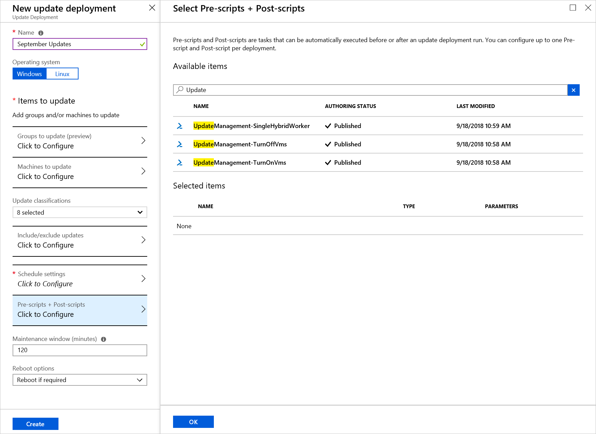
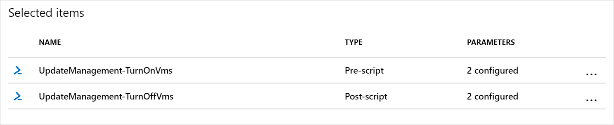
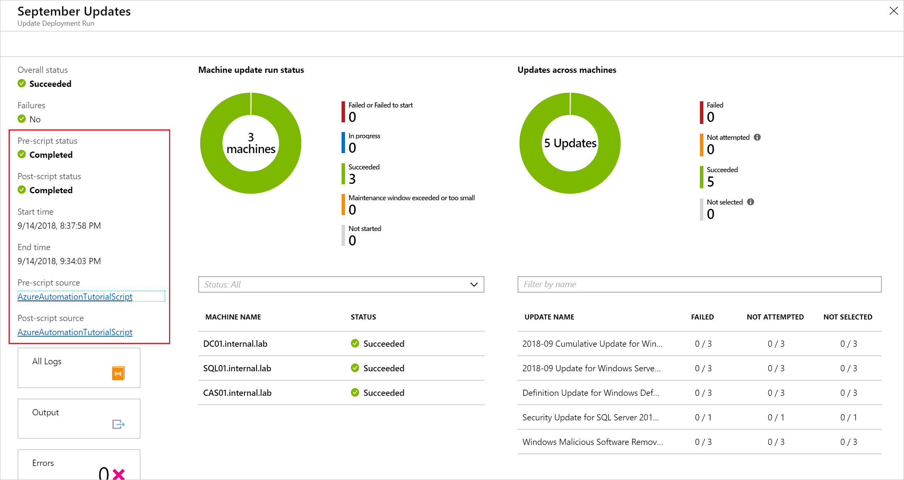
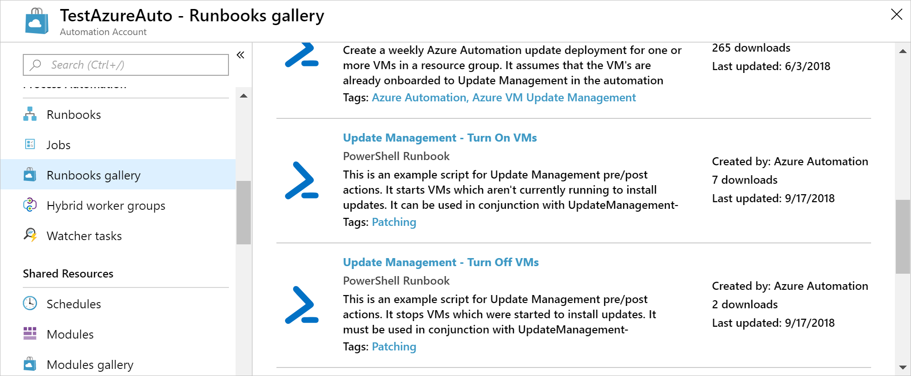

# Manage pre-scripts and post-scripts

Pre-scripts and post-scripts are runbooks to run in your Azure Automation account before (pre-task) and after (post-task) an update deployment. Pre-scripts and post-scripts run in the Azure context, not locally. Pre-scripts run at the beginning of the update deployment. On Windows, post-scripts run at the end of the deployment and after any reboots that are configured. For Linux, post-scripts run after the end of the deployment, not after the machine reboots. 

## Pre-script and post-script requirements

For a runbook to be used as a pre-script or post-script, you must import it into your Automation account and [publish the runbook](../manage-runbooks.md#publish-a-runbook).

Currently, only PowerShell 5.1 and Python 2 runbooks are supported as Pre/Post scripts. Other runbook types like Python 3, Graphical, PowerShell Workflow, Graphical PowerShell Workflow are currently not supported as Pre/Post scripts.

## Pre-script and post-script parameters

When you configure pre-scripts and post-scripts, you can pass in parameters just like scheduling a runbook. Parameters are defined at the time of update deployment creation. Pre-scripts and post-scripts support the following types:

* [char]
* [byte]
* [int]
* [long]
* [decimal]
* [single]
* [double]
* [DateTime]
* [string]

Pre-script and post-script runbook parameters don't support boolean, object, or array types. These values cause the runbooks to fail. 

If you need another object type, you can cast it to another type with your own logic in the runbook.

In addition to your standard runbook parameters, the `SoftwareUpdateConfigurationRunContext` parameter (type JSON string) is provided. If you define the parameter in your pre-script or post-script runbook, it's automatically passed in by the update deployment. The parameter contains information about the update deployment, which is a subset of information returned by the [SoftwareUpdateconfigurations API](/rest/api/automation/softwareupdateconfigurations/getbyname#updateconfiguration). Sections below define the associated properties.

### SoftwareUpdateConfigurationRunContext properties

|Property  |Type |Description  |
|---------|---------|---------|
|SoftwareUpdateConfigurationName     |String | The name of the software update configuration.        |
|SoftwareUpdateConfigurationRunId     |GUID | The unique ID for the run.        |
|SoftwareUpdateConfigurationSettings     || A collection of properties related to the software update configuration.         |
|SoftwareUpdateConfigurationSettings.OperatingSystem     |Int | The operating systems targeted for the update deployment. `1` = Windows and `2` = Linux        |
|SoftwareUpdateConfigurationSettings.Duration     |Timespan (HH:MM:SS) | The maximum duration of the update deployment run as `PT[n]H[n]M[n]S` as per ISO8601; also called the maintenance window.<br> Example: 02:00:00         |
|SoftwareUpdateConfigurationSettings.WindowsConfiguration     || A collection of properties related to Windows computers.         |
|SoftwareUpdateConfigurationSettings.WindowsConfiguration.excludedKbNumbers     |String | A space separated list of KBs that are excluded from the update deployment.        |
|SoftwareUpdateConfigurationSettings.WindowsConfiguration.includedKbNumbers     |String | A space separated list of KBs that are included with the update deployment.        |
|SoftwareUpdateConfigurationSettings.WindowsConfiguration.UpdateCategories     |Integer | 1 = "Critical";<br> 2 = "Security"<br> 4 = "UpdateRollUp"<br> 8 = "FeaturePack"<br> 16 = "ServicePack"<br> 32 = "Definition"<br> 64 = "Tools"<br> 128 = "Updates"        |
|SoftwareUpdateConfigurationSettings.WindowsConfiguration.rebootSetting     |String | Reboot settings for the update deployment. Values are `IfRequired`, `Never`, `Always`      |
|SoftwareUpdateConfigurationSettings.LinuxConfiguration     || A collection of properties related to Linux computers.         |
|SoftwareUpdateConfigurationSettings.LinuxConfiguration.IncludedPackageClassifications |Integer |0 = "Unclassified"<br> 1 = "Critical"<br> 2 = "Security"<br> 4 = "Other"|
|SoftwareUpdateConfigurationSettings.LinuxConfiguration.IncludedPackageNameMasks |String | A space separated list of package names that are included with the update deployment. |
|SoftwareUpdateConfigurationSettings.LinuxConfiguration.ExcludedPackageNameMasks |String |A space separated list of package names that are excluded from the update deployment. |
|SoftwareUpdateConfigurationSettings.LinuxConfiguration.RebootSetting |String |Reboot settings for the update deployment. Values are `IfRequired`, `Never`, `Always`      |
|SoftwareUpdateConfiguationSettings.AzureVirtualMachines     |String array | A list of resourceIds for the Azure VMs in the update deployment.        |
|SoftwareUpdateConfigurationSettings.NonAzureComputerNames|String array |A list of the non-Azure computers FQDNs in the update deployment.|

The following example is a JSON string passed to the **SoftwareUpdateConfigurationSettings** properties for a Linux computer:

```json
"SoftwareUpdateConfigurationSettings": {
     "OperatingSystem": 2,
     "WindowsConfiguration": null,
     "LinuxConfiguration": {
         "IncludedPackageClassifications": 7,
         "ExcludedPackageNameMasks": "fgh xyz",
         "IncludedPackageNameMasks": "abc bin*",
         "RebootSetting": "IfRequired"
     },
     "Targets": {
         "azureQueries": null,
         "nonAzureQueries": ""
     },
     "NonAzureComputerNames": [
        "box1.contoso.com",
        "box2.contoso.com"
     ],
     "AzureVirtualMachines": [
        "/subscriptions/00000000-0000-0000-0000-000000000000/resourceGroups/resourceGroupName/providers/Microsoft.Compute/virtualMachines/vm-01"
     ],
     "Duration": "02:00:00",
     "PSComputerName": "localhost",
     "PSShowComputerName": true,
     "PSSourceJobInstanceId": "2477a37b-5262-4f4f-b636-3a70152901e9"
 }
```

The following example is a JSON string passed to the **SoftwareUpdateConfigurationSettings** properties for a Windows computer:

```json
"SoftwareUpdateConfigurationRunContext": {
    "SoftwareUpdateConfigurationName": "sampleConfiguration",
    "SoftwareUpdateConfigurationRunId": "00000000-0000-0000-0000-000000000000",
    "SoftwareUpdateConfigurationSettings": {
      "operatingSystem": "Windows",
      "duration": "02:00:00",
      "windows": {
        "excludedKbNumbers": [
          "168934",
          "168973"
        ],
        "includedUpdateClassifications": "Critical",
        "rebootSetting": "IfRequired"
      },
      "azureVirtualMachines": [
        "/subscriptions/00000000-0000-0000-0000-000000000000/resourceGroups/myResourceGroup/providers/Microsoft.Compute/virtualMachines/vm-01",
        "/subscriptions/00000000-0000-0000-0000-000000000000/resourceGroups/myResourceGroup/providers/Microsoft.Compute/virtualMachines/vm-02",
        "/subscriptions/00000000-0000-0000-0000-000000000000/resourceGroups/myResourceGroup/providers/Microsoft.Compute/virtualMachines/vm-03"
      ],
      "nonAzureComputerNames": [
        "box1.contoso.com",
        "box2.contoso.com"
      ]
    }
  }
```

A full example with all properties can be found at: [Get software update configuration by name](/rest/api/automation/softwareupdateconfigurations/getbyname#examples).

> [!NOTE]
> The `SoftwareUpdateConfigurationRunContext` object can contain duplicate entries for machines. This can cause pre-scripts and post-scripts to run multiple times on the same machine. To work around this behavior, use `Sort-Object -Unique` to select only unique VM names.

## Use a pre-script or post-script in a deployment

To use a pre-script or post-script in an update deployment, start by creating an update deployment. Select **Pre-scripts + Post-Scripts**. This action opens the **Select Pre-scripts + Post-scripts** page.



Select the script you want to use. In this example, we use the **UpdateManagement-TurnOnVms** runbook. When you select the runbook, the **Configure Script** page opens. Select **Pre-Script**, and then select **OK**.

Repeat this process for the **UpdateManagement-TurnOffVms** script. But when you choose the **Script type**, select **Post-Script**.

The **Selected items** section now shows both your scripts selected. One is a pre-script and the other is a post-script:



Finish configuring your update deployment.

When your update deployment is complete, you can go to **Update deployments** to view the results. As you can see, the status is provided for the pre-script and post-script:


By selecting the update deployment run, you're shown additional details of pre-scripts and post-scripts. A link to the script source at the time of the run is provided.



## Stop a deployment

If you want to stop a deployment based on a pre-script, you must [throw](../automation-runbook-execution.md#throw) an exception. If you don't, the deployment and post-script will still run. The following code snippet shows how to throw an exception using PowerShell.

```powershell
#In this case, we want to terminate the patch job if any run fails.
#This logic might not hold for all cases - you might want to allow success as long as at least 1 run succeeds
foreach($summary in $finalStatus)
{
    if ($summary.Type -eq "Error")
    {
        #We must throw in order to fail the patch deployment.
        throw $summary.Summary
    }
}
```

In Python 2, exception handling is managed in a [try](https://www.python-course.eu/exception_handling.php) block.

## Interact with machines

Pre-scripts and post-scripts run as runbooks in your Automation account and not directly on the machines in your deployment. Pre-tasks and post-tasks also run in the Azure context and don't have access to non-Azure machines. The following sections show how you can interact with the machines directly, whether they're Azure VMs or non-Azure machines.

### Interact with Azure machines

Pre-tasks and post-tasks run as runbooks and don't natively run on your Azure VMs in your deployment. To interact with your Azure VMs, you must have the following items:

* A [managed identity](../automation-security-overview.md#managed-identities) or a Run As account
* A runbook you want to run

To interact with Azure machines, you should use the [Invoke-AzVMRunCommand](/powershell/module/az.compute/invoke-azvmruncommand) cmdlet to interact with your Azure VMs. For an example of how to do this, see the runbook example [Update Management - run script with Run command](https://github.com/azureautomation/update-management-run-script-with-run-command).

### Interact with non-Azure machines

Pre-tasks and post-tasks run in the Azure context and don't have access to non-Azure machines. To interact with the non-Azure machines, you must have the following items:

* A [managed identity](../automation-security-overview.md#managed-identities) or a Run As account
* Hybrid Runbook Worker installed on the machine
* A runbook you want to run locally
* A parent runbook

To interact with non-Azure machines, a parent runbook is run in the Azure context. This runbook calls a child runbook with the [Start-AzAutomationRunbook](/powershell/module/Az.Automation/Start-AzAutomationRunbook) cmdlet. You must specify the `RunOn` parameter and provide the name of the Hybrid Runbook Worker for the script to run on. See the runbook example [Update Management - run script locally](https://github.com/azureautomation/update-management-run-script-locally).

## Abort patch deployment

If your pre-script returns an error, you might want to abort your deployment. To do that, you must [throw](/powershell/module/microsoft.powershell.core/about/about_throw) an error in your script for any logic that would constitute a failure.

```powershell
if (<My custom error logic>)
{
    #Throw an error to fail the patch deployment.
    throw "There was an error, abort deployment"
}
```

In Python 2, if you want to throw an error when a certain condition occurs, use a [raise](https://docs.python.org/2.7/reference/simple_stmts.html#the-raise-statement) statement.

```python
If (<My custom error logic>)
   raise Exception('Something happened.')
```

## Samples

Samples for pre-scripts and post-scripts can be found in the [Azure Automation GitHub organization](https://github.com/azureautomation) and the [PowerShell Gallery](https://www.powershellgallery.com/packages?q=Tags%3A%22UpdateManagement%22+Tags%3A%22Automation%22), or you can import them through the Azure portal. To do that, in your Automation account, under **Process Automation**, select **Runbooks Gallery**. Use **Update Management** for the filter.



Or you can search for them by their script name, as shown in the following list:

* Update Management - Turn On VMs
* Update Management - Turn Off VMs
* Update Management - Run Script Locally
* Update Management - Template for Pre/Post Scripts
* Update Management - Run Script with Run Command

> [!IMPORTANT]
> After you import the runbooks, you must publish them before they can be used. To do that, find the runbook in your Automation account, select **Edit**, and then select **Publish**.

The samples are all based on the basic template that's defined in the following example. This template can be used to create your own runbook to use with pre-scripts and post-scripts. The necessary logic for authenticating with Azure and handling the `SoftwareUpdateConfigurationRunContext` parameter is included.

```powershell
<#
.SYNOPSIS
 Barebones script for Update Management Pre/Post

.DESCRIPTION
  This script is intended to be run as a part of Update Management pre/post-scripts.
  It requires the Automation account's system-assigned managed identity.

.PARAMETER SoftwareUpdateConfigurationRunContext
  This is a system variable which is automatically passed in by Update Management during a deployment.
#>

param(
    [string]$SoftwareUpdateConfigurationRunContext
)

#region BoilerplateAuthentication
# Ensures you do not inherit an AzContext in your runbook
Disable-AzContextAutosave -Scope Process

# Connect to Azure with system-assigned managed identity
$AzureContext = (Connect-AzAccount -Identity).context

# set and store context
$AzureContext = Set-AzContext -SubscriptionName $AzureContext.Subscription -DefaultProfile $AzureContext
#endregion BoilerplateAuthentication

#If you wish to use the run context, it must be converted from JSON
$context = ConvertFrom-Json $SoftwareUpdateConfigurationRunContext
#Access the properties of the SoftwareUpdateConfigurationRunContext
$vmIds = $context.SoftwareUpdateConfigurationSettings.AzureVirtualMachines | Sort-Object -Unique
$runId = $context.SoftwareUpdateConfigurationRunId

Write-Output $context

#Example: How to create and write to a variable using the pre-script:
<#
#Create variable named after this run so it can be retrieved
New-AzAutomationVariable -ResourceGroupName $ResourceGroup -AutomationAccountName $AutomationAccount -Name $runId -Value "" -Encrypted $false
#Set value of variable
Set-AutomationVariable -Name $runId -Value $vmIds
#>

#Example: How to retrieve information from a variable set during the pre-script
<#
$variable = Get-AutomationVariable -Name $runId
#>
```

If you want the runbook to execute with the system-assigned managed identity, leave the code as-is. If you prefer to use a user-assigned managed identity, then:
1. From line 22, remove `$AzureContext = (Connect-AzAccount -Identity).context`,
1. Replace it with `$AzureContext = (Connect-AzAccount -Identity -AccountId <ClientId>).context`, and
1. Enter the Client ID.

> [!NOTE]
> For non-graphical PowerShell runbooks, `Add-AzAccount` and `Add-AzureRMAccount` are aliases for [Connect-AzAccount](/powershell/module/az.accounts/connect-azaccount). You can use these cmdlets or you can [update your modules](../automation-update-azure-modules.md) in your Automation account to the latest versions. You might need to update your modules even if you have just created a new Automation account.

## Next steps

For details of update management, see [Manage updates and patches for your VMs](manage-updates-for-vm.md).
