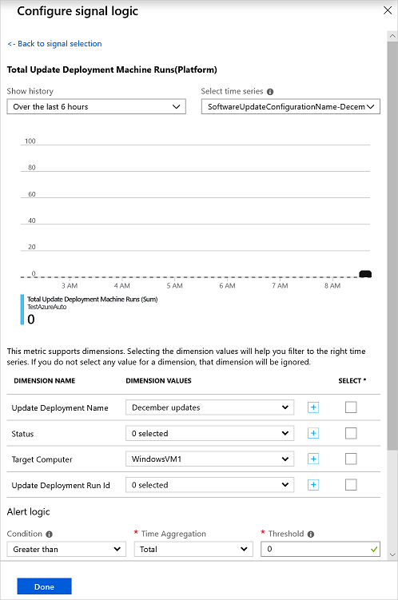
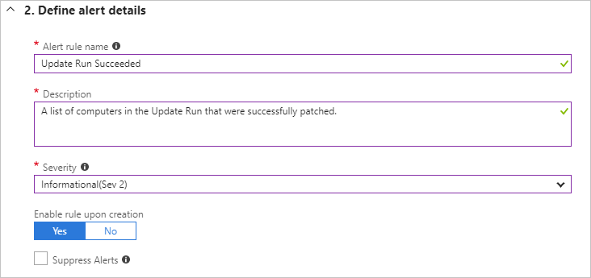

# How to create alerts for Update Management

Alerts in Azure proactively notify you of results from runbook jobs, service health issues, or other scenarios related to your Automation account. Azure Automation does not include pre-configured alert rules, but you can create your own based on data that it generates. This article provides guidance on creating alert rules using the metrics included with Update Management.

## Available metrics

Azure Automation creates two distinct platform metrics related to Update Management that are collected and forwarded to Azure Monitor. These metric are available for analysis using [Metrics Explorer](../../azure-monitor/platform/metrics-charts.md) and for alerting using a [metrics alert rule](../../azure-monitor/platform/alerts-metric.md).

The two metrics emitted are:

* Total Update Deployment Machine Runs
* Total Update Deployment Runs

When used for alerts, both metrics support dimensions that carry additional information to help scope the alert to a specific update deployment detail. The following table shows the details about the metric and dimensions available when configuring an alert.

|Signal Name|Dimensions|Description
|---|---|---|
|`Total Update Deployment Runs`|- Update Deployment Name - Status | Alerts on the overall status of an update deployment.|
|`Total Update Deployment Machine Runs`|- Update Deployment Name - Status - Target Computer - Update Deployment Run ID    |Alerts on the status of an update deployment targeted at specific machines.|

## Create alert

Follow the steps below to set up alerts to let you know the status of an update deployment. If you are new to Azure alerts, see [Azure Alerts overview](../../azure-monitor/platform/alerts-overview.md).

1. In your Automation account, select **Alerts** under **Monitoring**, and then select **New alert rule**.

2. On the **Create alert rule** page, your Automation account is already selected as the resource. If you want to change it, select **Edit resource**.

3. On the Select a resource page, choose **Automation Accounts** from the **Filter by resource type** dropdown list.

4. Select the Automation account that you want to use, and then select **Done**.

5. Select **Add condition** to chose the signal that's appropriate for your requirement.

6. For a dimension, select a valid value from the list. If the value you want isn't in the list, select **\+** next to the dimension and type in the custom name. Then select the value to look for. If you want to select all values for a dimension, select the **Select \*** button. If you don't choose a value for a dimension, Update Management ignores that dimension.

    

7. Under **Alert logic**, enter values in the **Time aggregation** and **Threshold** fields, and then select **Done**.

8. On the next page, enter a name and a description for the alert.

9. Set the **Severity** field to **Informational(Sev 2)** for a successful run or **Informational(Sev 1)** for a failed run.

    

10. Select **Yes** to enable the alert rule.

## Configure action groups for your alerts

Once you have your alerts configured, you can set up an action group, which is a group of actions to use across multiple alerts. The actions can include email notifications, runbooks, webhooks, and much more. To learn more about action groups, see [Create and manage action groups](../../azure-monitor/platform/action-groups.md).

1. Select an alert and then select **Create New** under **Action Groups**.

2. Enter a full name and a short name for the action group. Update Management uses the short name when sending notifications using the specified group.

3. Under **Actions**, enter a name that specifies the action, for example, **Email Notification**.

4. For **Action Type**, select the appropriate type, for example, **Email/SMS/Push/Voice**.

5. Select **Edit details**.

6. Fill in the pane for your action type. For example, if using **Email/SMS/Push/Voice**, enter an action name, select the **Email** checkbox, enter a valid email address, and then select **OK**.

    

7. In the Add action group pane, select **OK**.

8. For an alert email, you can customize the email subject. Select **Customize actions** under **Create rule**, then select **Email subject**.

9. When you're finished, select **Create alert rule**.

## Next steps

