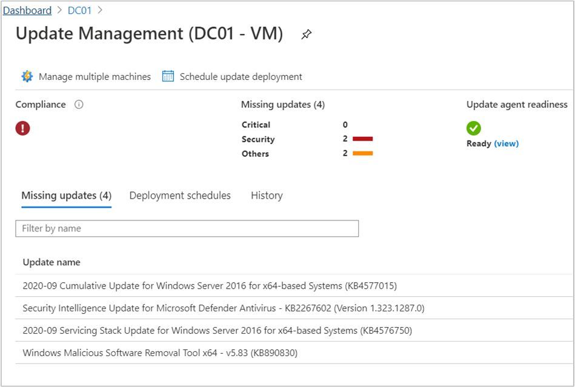
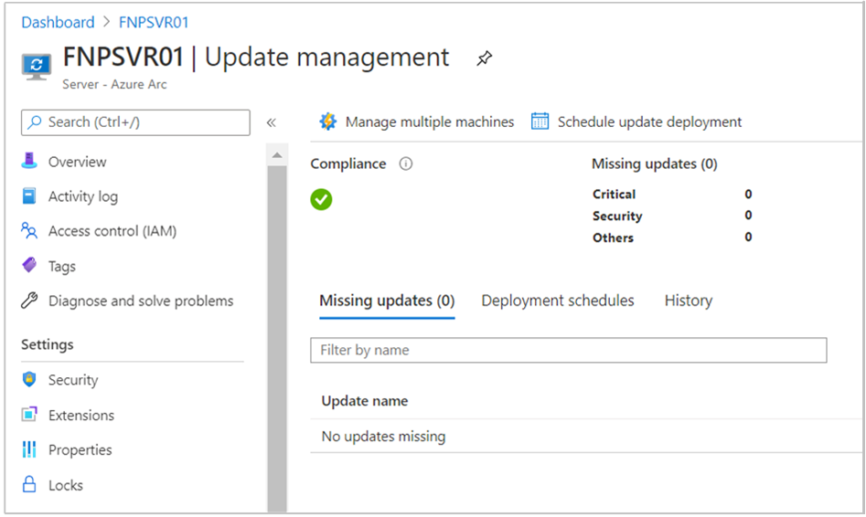
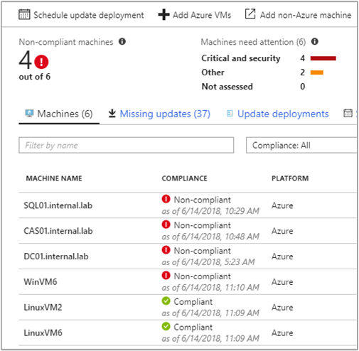
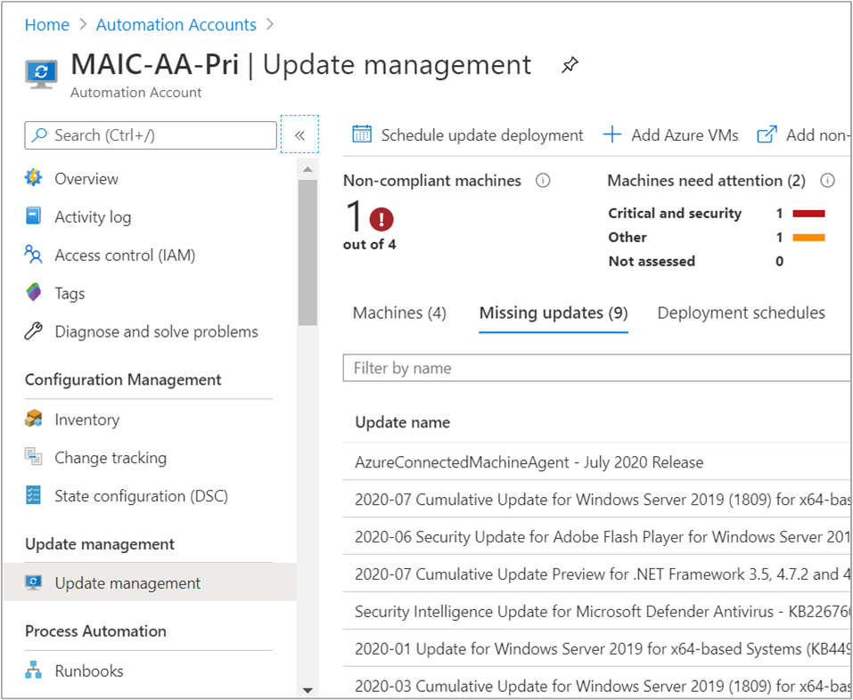
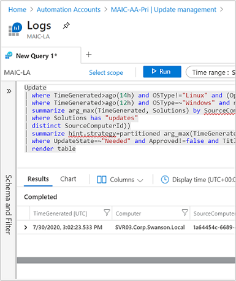
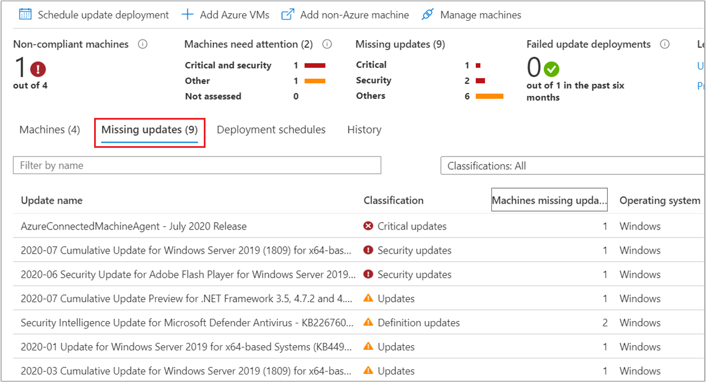

# View update assessments in Update Management

In Update Management, you can view information about your machines, missing updates, update deployments, and scheduled update deployments. You can view the assessment information scoped to the selected Azure virtual machine, from the selected Azure Arc-enabled server, or from the Automation account across all configured machines and servers.

## View update assessment

To view update assessment from an Azure VM:

1. Sign in to the [Azure portal](https://portal.azure.com).
1. Navigate to **Virtual Machines** and select your virtual machine from the list. From the left menu, under **Operations**, select **Updates**, and select **Go to Update Management**. 

In Update Management, you can view information about your machine, missing updates, update deployments, manage multiple machines, scheduled update deployments and so on.

[ ](./media/view-update-assessments/update-assessment-azure-vm-expanded.png#lightbox)

To view update assessment from an Azure Arc-enabled server:

1. Sign in to the [Azure portal](https://portal.azure.com).
1. Navigate to **Servers - Azure Arc** and select your server from the list. From the left menu, under **Operation**, select **Guest + host updates** and select **Go to Updates using Update management center**.

In Update Management, you can view information about your Azure Arc-enabled machine, total updates, assess updates, scheduled update deployments, and so on.

[ ](./media/view-update-assessments/update-assessment-arc-server-expanded.png#lightbox)

To view update assessment across all machines, including Azure Arc-enabled servers from your Automation account:

1. Sign in to the [Azure portal](https://portal.azure.com).
1. Navigate to **Automation accounts** and select your Automation account with Update Management enabled from the list. In your Automation account, select **Update management** from the left menu.

The updates for your environment are listed on the **Update management** page. If any updates are identified as missing, a list of them appears in the **Missing updates** tab.

[ ](./media/overview/update-management-view-expanded.png#lightbox)

- Under the **Compliance** column, you can see the last time the machine was assessed. 
- Under the **Update agent readiness** column, you can see the health of the update agent. If there's an issue, select the link to go to troubleshooting documentation that can help you correct the problem.
- Under **Information link**, select the link for an update to open the support article that gives you important information about the update.

[ ](./media/view-update-assessments/missing-updates-expanded.png#lightbox)

The values displayed for each column are:

**Field Name**     |**Description**   |
--- | --- |
Machine Name | Name of the machine attached to Update Management. 
Compliance | State of the system's compliance with security and critical updates.
Update agent readiness | View the health of the update agent. If there's an issue, select the link to go to troubleshooting documentation that can help you correct the problem.|
Platform | Lists the platform as either Azure or non-Azure. 
Operating system | Lists the operating system as either Windows or Linux.
Critical missing updates| Count of missing critical updates.        
Security missing updates | Count of missing security updates.
Other missing updates |  Count of non-security and non-critical updates.
Update approval source | The source of updates. Either Windows update, WSUS, and Microsoft update *applicable to Windows*.
Windows auto update | Default OS update setting on the machine *applicable to Windows* .

> [!NOTE]
> Information that is displayed about the Windows Defender definition update status is based on the last data that was summarized from the Log Analytics workspace and might not be current. Review [Windows Defender update always shows as missing](../troubleshoot/update-management.md#windows-defender-update-missing-status) to learn more about this behavior.
 
Click anywhere else on the update to open the Log Search pane. The query for the log search is predefined for that specific update. You can modify this query or create your own query to view detailed information.

[ ](./media/view-update-assessments/logsearch-results-expanded.png#lightbox)

## View missing updates

Select **Missing updates** to view the list of updates that are missing from your machines. Each update is listed and can be selected. Information about the number of machines that require the update, operating system details, and a link for more information are all shown. The Log Search pane also shows more details about the updates.



## Work with update classifications

The following tables list the supported update classifications in Update Management, with a definition for each classification.

### Windows

|Classification  |Description  |
|---------|---------|
|Critical updates     | Updates for specific problems that address critical, non-security-related bugs.        |
|Security updates     | Updates for product-specific, security-related issues.        |
|Update rollups     | Sets of hotfixes that are packaged together for easy deployment.        |
|Feature packs     | New product features that are distributed outside a product release.        |
|Service packs     | Sets of hotfixes that are applied to an application.        |
|Definition updates     | Updates to virus or other definition files.        |
|Tools     | Utilities or features that help complete one or more tasks.        |
|Updates     | Updates to applications or files that are installed currently.        |

### Linux

|Classification  |Description  |
|---------|---------|
|Critical and security updates     | Updates for a specific problem or a product-specific, security-related issue.         |
|Other updates     | All other updates that aren't critical in nature or that aren't security updates.        |

For Linux, Update Management can distinguish between critical updates and security updates in the cloud while displaying assessment data. (This granularity is possible because of data enrichment in the cloud.) For patching, Update Management relies on classification data available on the machine. Unlike other distributions, CentOS doesn't have this information available in the RTM versions of the product. If you have CentOS machines configured to return security data for the following command, Update Management can patch based on classifications:

```bash
sudo yum -q --security check-update
```

There's currently no supported method to enable native classification-data availability on CentOS. At this time, only best-effort support is provided to customers who have enabled this functionality on their own.

To classify updates on Red Hat Enterprise version 6, you need to install the yum-security plugin. On Red Hat Enterprise Linux 7, the plugin is already a part of yum itself, there is no need to install anything. For further information, see the following Red Hat [knowledge article](https://access.redhat.com/solutions/10021).

## Next steps

The next phase in the process is to [deploy updates](deploy-updates.md) to non-compliant machines and review deployment results.
