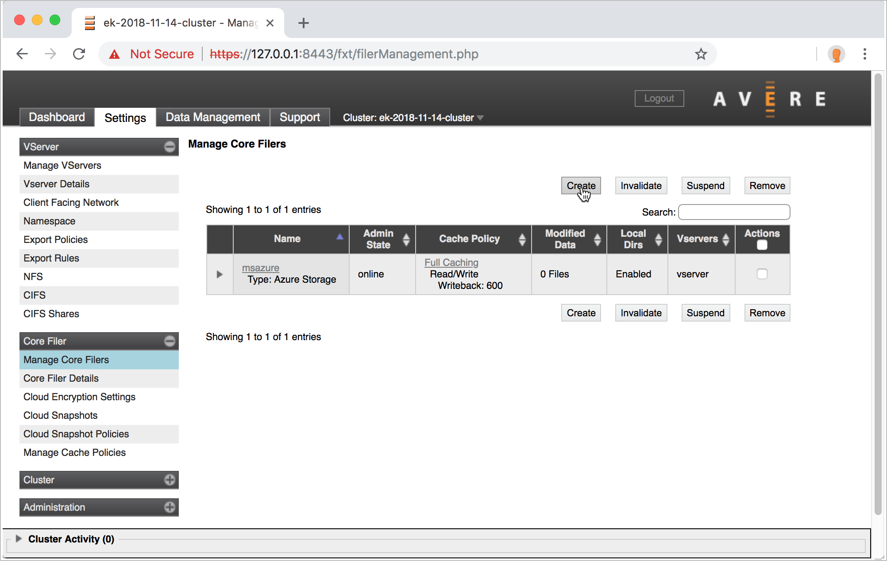
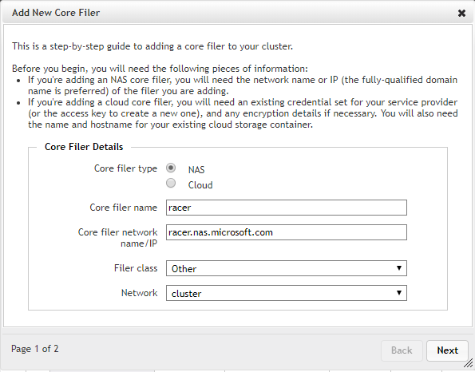
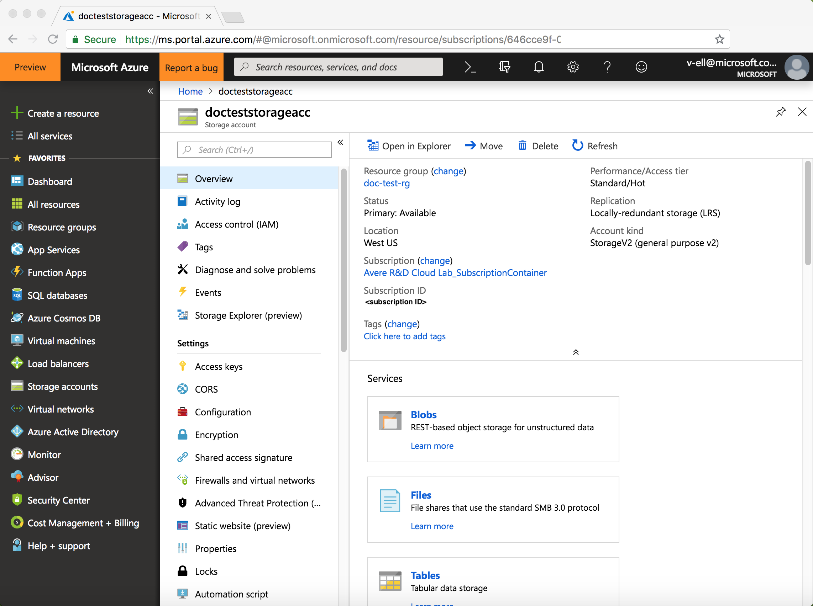
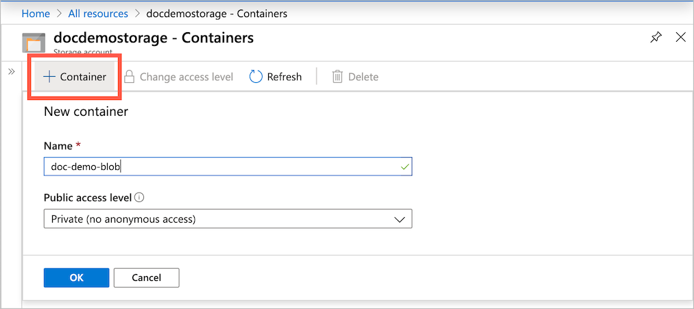
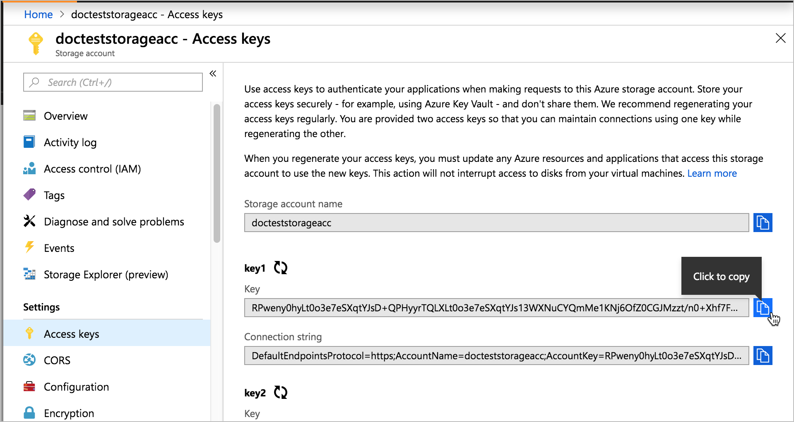
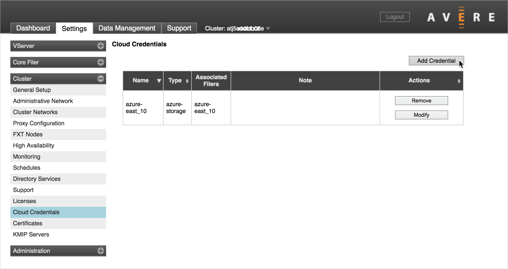
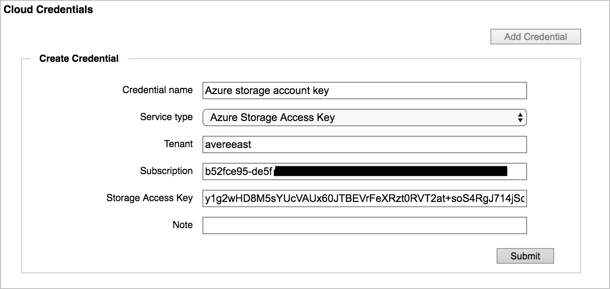
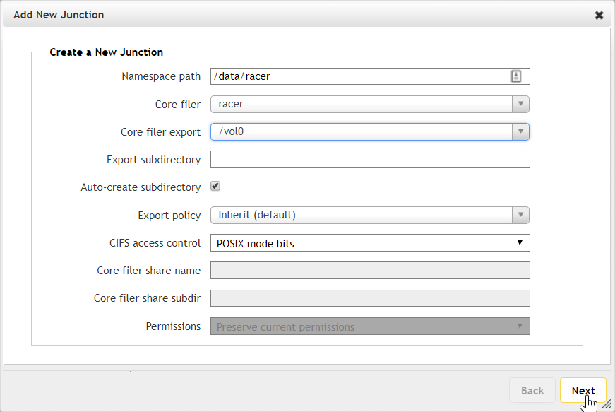

# Configure storage

This step sets up a back-end storage system for your vFXT cluster.

> [!TIP]
> If you created a new Azure Blob container along with the Avere vFXT cluster, that container is already configured and ready to use.

Follow these instructions if you did not create a new Blob container with your cluster, or if you want to add an additional hardware or cloud-based storage system.

There are two main tasks:

1. [Create a core filer](#create-a-core-filer), which connects your vFXT cluster to an existing storage system or an Azure Storage account container.

1. [Create a namespace junction](#create-a-junction), which defines the path that clients will mount.

These steps use the Avere Control Panel. Read [Access the vFXT cluster](avere-vfxt-cluster-gui.md) to learn how to use it.

## Create a core filer

"Core filer" is a vFXT term for a back-end storage system. The storage can be a hardware NAS appliance like NetApp or Isilon, or it can be a cloud object store. More information about core filers can be found in the [Avere cluster settings guide](https://azure.github.io/Avere/legacy/ops_guide/4_7/html/settings_overview.html#managing-core-filers).

To add a core filer, choose one of the two main types of core filers:

* [NAS core filer](#nas-core-filer) - describes how to add a NAS core filer
* [Azure Storage cloud core filer](#azure-blob-storage-cloud-core-filer) - describes how to add an Azure Blob storage container as a cloud core filer

### NAS core filer

A NAS core filer can be an on-premises NetApp or Isilon appliance, or a NAS endpoint in the cloud. The storage system must have a reliable high-speed connection to the Avere vFXT cluster - for example, a 1GBps ExpressRoute connection (not a VPN) - and it must give the cluster root access to the NAS exports being used.

Follow these steps to add a NAS core filer:

1. From the Avere Control Panel, click the **Settings** tab at the top.

1. Click **Core Filer** > **Manage Core Filers** on the left.

1. Click **Create**.

   

1. Fill in the required information in the wizard:

   * Name your core filer.
   * Provide a fully qualified domain name (FQDN) if available. Otherwise, provide an IP address or hostname that resolves to your core filer.
   * Choose your filer class from the list. If unsure, choose **Other**.

     
  
   * Click **Next** and choose a cache policy.
   * Click **Add Filer**.
   * For more detailed information, refer to [Adding a new NAS core filer](https://azure.github.io/Avere/legacy/ops_guide/4_7/html/new_core_filer_nas.html) in the Avere cluster settings guide.

Next, proceed to [Create a junction](#create-a-junction).  

### Azure Blob Storage cloud core filer

To use Azure Blob storage as your vFXT cluster's back-end storage, you need an empty container to add as a core filer.

Adding Blob storage to your cluster requires these tasks:

* Create a storage account (step 1, below)
* Create an empty Blob container (steps 2-3)
* Add the storage access key as a cloud credential for the vFXT cluster (steps 4-6)
* Add the Blob container as a core filer for the vFXT cluster (steps 7-9)
* Create a namespace junction that clients use to mount the core filer ([Create a junction](#create-a-junction), same for both hardware and cloud storage)

> [!TIP]
> If you create a new Blob container when you create an Avere vFXT for Azure cluster, the deployment template automatically configures the container as a core filer. (This is also true if you use the creation script, which is available on request.) You do not need to configure the core filer afterward.
>
> The cluster creation tool does these configuration tasks for you:
>
> * Creates a new Blob container in the provided storage account
> * Defines the container as a core filer
> * Creates a namespace junction to the container
> * Creates a storage service endpoint inside the cluster's virtual network

To add Blob storage after creating the cluster, follow these steps.

1. Create a general-purpose V2 storage account with these settings:

   * **Subscription** - same as the vFXT cluster
   * **Resource group** - same as the vFXT cluster group (optional)
   * **Location** - same as the vFXT cluster
   * **Performance** - Standard (Premium storage is unsupported)
   * **Account kind** - General-purpose V2 (StorageV2)
   * **Replication** - Locally redundant storage (LRS)
   * **Access tier** - Hot
   * **Secure transfer required** - disable this option (non-default value)
   * **Virtual networks** - not required

   You can use the Azure portal or click the  "Deploy to Azure" button below.

   

1. After the account is created, browse to the storage account page.

   

1. Create a new Blob container: Click **Containers** on the overview page and then click **+Container**. Use any container name, and make sure access is set to **Private**.

   

1. Get the Azure Storage account key by clicking **Access keys** under **Settings**. Copy one of the keys provided.

   

1. Open the Avere Control Panel for your cluster. Click **Settings**, then open **Cluster** > **Cloud Credentials** on the left navigation pane. On the Cloud Credentials page, click **Add Credential**.

   

1. Fill in the following information to create a credential for the cloud core filer:

   | Field | Value |
   | --- | --- |
   | Credential name | any descriptive name |
   | Service type | (select Azure Storage access key) |
   | Tenant | storage account name |
   | Subscription | subscription ID |
   | Storage Access Key | Azure storage account key (copied in the previous step) |

   Click **Submit**.

   

1. Next, create the core filer. In the left side of the Avere Control Panel, click **Core Filer** >  **Manage Core Filers**.

1. Click the **Create** button on the **Manage Core Filers** settings page.

1. Fill out the wizard:

   * Select filer type **Cloud**.
   * Name the new core filer and click **Next**.
   * Accept the default cache policy and continue to the third page.
   * In **Service type**, choose **Azure storage**.
   * Choose the credential created earlier.
   * Set **Bucket contents** to **Empty**
   * Change **Certificate verification** to **Disabled**
   * Change **Compression mode** to **None**
   * Click **Next**.
   * On the fourth page, enter the name of the container in **Bucket name** as *storage_account_name*/*container_name*.
   * Optionally, set **Encryption type** to **None**.  Azure Storage is encrypted by default.
   * Click **Add Filer**.

   For more detailed information, read [Adding a new cloud core filer](<https://azure.github.io/Avere/legacy/ops_guide/4_7/html/new_core_filer_cloud.html>) in the Avere cluster configuration guide.

The page will refresh, or you can refresh the page to display your new core filer.

Next, you need to [Create a junction](#create-a-junction).

## Create a junction

A junction is a path that you create for clients. Clients mount the path and arrive at the destination you choose.

For example, you could create `/vfxt/files` to map to your NetApp core filer `/vol0/data` export and the `/project/resources` subdirectory.

More information about junctions can be found in the [namespace section of the Avere cluster configuration guide](https://azure.github.io/Avere/legacy/ops_guide/4_7/html/gui_namespace.html).

Follow these steps in the Avere Control Panel interface:

* Click **VServer** > **Namespace** in the upper left.
* Provide a namespace path beginning with / (forward slash), like ``/vfxt/data``.
* Choose your core filer.
* Choose the core filer export.
* Click **Next**.

  

The junction will appear after a few seconds. Create additional junctions as needed.

After the junction has been created, clients use the namespace path to access the files from the storage system.

## Next steps

* [Mount the Avere vFXT cluster](avere-vfxt-mount-clients.md)
* Learn efficient ways to [move data to a new Blob container](avere-vfxt-data-ingest.md)
