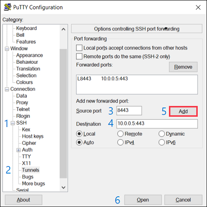

# Access the vFXT cluster

To change settings and monitor the Avere vFXT cluster, use the Avere Control Panel. Avere Control Panel is a browser-based graphical interface to the cluster.

Because the vFXT cluster sits within a private virtual network, you must create an SSH tunnel or use another method to reach the cluster's management IP address. There are two basic steps: 

1. Create a connection between your workstation and the private vnet 
1. Load the cluster's control panel in a web browser 

> [!NOTE] 
> This article assumes that you have set a public IP address on the cluster controller or on another VM inside your cluster's virtual network. This article describes how to use that VM as a host to access the cluster. If you are using a VPN or ExpressRoute for vnet access, skip to [Connect to the Avere Control Panel](#connect-to-the-avere-control-panel-in-a-browser).

Before connecting, make sure that the SSH public/private key pair that you used when creating the cluster controller is installed on your local machine. Read the SSH keys documentation for [Windows](https://docs.microsoft.com/azure/virtual-machines/linux/ssh-from-windows) or for [Linux](https://docs.microsoft.com/azure/virtual-machines/linux/mac-create-ssh-keys) if you need help.  

## SSH tunnel with a Linux host

If using a Linux-based client, use an SSH tunneling command with this form: 

ssh -L *local_port*:*cluster_mgmt_ip*:443 *controller_username*@*controller_public_IP*

This command connects to the cluster's management IP address through the cluster controller's IP address.

Example:

```sh
ssh -L 8443:10.0.0.5:443 azureuser@203.0.113.51
```

Authentication is automatic if you used your SSH public key to create the cluster and the matching key is installed on the client system.

## SSH tunnel with a Windows host

This example uses the common Windows-based terminal utility, PuTTY.

Fill in the PuTTY **hostname** field with the cluster controller username and its IP address: *your_username*@*controller_public_IP*.

Example: ``azureuser@203.0.113.51``

In the **Configuration** panel:

1. Expand **Connection** > **SSH** on the left. 
1. Click **Tunnels**. 
1. Enter a source port, like 8443. 
1. For the destination, enter the vFXT cluster's management IP address and port 443. 
   Example: ``203.0.113.51:443``
1. Click **Add**.
1. Click **Open**.



Authentication is automatic if you used your SSH public key to create the cluster and the matching key is installed on the client system.

## Connect to the Avere Control Panel in a browser

This step uses a web browser to connect to the configuration utility running on the vFXT cluster.

* For an SSH tunnel connection, open your web browser and navigate to https://127.0.0.1:8443. 

  You connected to the cluster IP address when you created the tunnel, so you just need to use the localhost IP address in the browser. If you used a local port other than 8443, use your port number instead.

* If you are using a VPN or ExpressRoute to reach the cluster, navigate to the cluster management IP address in your browser. Example: ``https://203.0.113.51``

Depending on your browser, you might need to click **Advanced** and verify that it is safe to proceed to the page.

Enter the username `admin` and the password you provided when creating the cluster.


Click **Login** or press enter on your keyboard.

## Next steps

Now that you can access the cluster, enable [support](avere-vfxt-enable-support.md).
