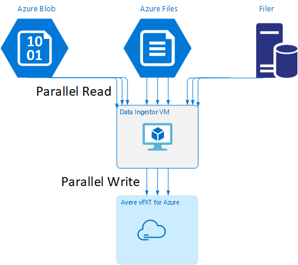

# Moving data to the vFXT cluster - Parallel data ingest 

After you've created a new vFXT cluster, your first task might be to move data onto its new storage volume. However, if your usual method of moving data is issuing a simple copy command from one client, you will likely see a slow copy performance. Single-threaded copying is not a good option for copying data to the Avere vFXT cluster's backend storage.

Because the Avere vFXT cluster is a scalable multi-client cache, the fastest and most efficient way to copy data to it is with multiple clients. This technique parallelizes ingestion of the files and objects.

 

The ``cp`` or ``copy`` commands that are commonly used to using to transfer data from one storage system to another are single-threaded processes that copy only one file at a time. This means that the file server is ingesting only one file at a time - which is a waste of the cluster’s resources.

This article explains strategies for creating a multi-client, multi-threaded file copying system to move data to the Avere vFXT cluster. It explains file transfer concepts and decision points that can be used for efficient data copying using multiple clients and simple copy commands.

It also explains some utilities that can help. The ``msrsync`` utility can be used to partially automate the process of dividing a dataset into buckets and using rsync commands. The ``parallelcp`` script is another utility that reads the source directory and issues copy commands automatically.  

Click the link to jump to a section:

* [Manual copy example](#manual-copy-example) - A thorough explanation using copy commands
* [Partially automated (msrsync) example](#use-the-msrsync-utility-to-populate-cloud-volumes) 
* [Parallel copy example](#use-the-parallel-copy-script)

## Data ingestor VM template

A Resource Manager template is available on GitHub to automatically create a VM with the parallel data ingestion tools mentioned in this article. 



The data ingestor VM is part of a tutorial where the newly created VM mounts the Avere vFXT cluster and downloads its bootstrap script from the cluster. Read [Bootstrap a data ingestor VM](https://github.com/Azure/Avere/blob/master/docs/data_ingestor.md) for details.

## Strategic planning

When building a strategy to copy data in parallel, you should understand the tradeoffs in file size, file count, and directory depth.

* When files are small, the metric of interest is files per second.
* When files are large (10MiBi or greater), the metric of interest is bytes per second.

Each copy process has a throughput rate and a files-transferred rate, which can be measured by timing the length of the copy command and factoring the file size and file count. Explaining how to measure the rates is outside the scope of this document, but it is imperative to understand whether you’ll be dealing with small or large files.

## Manual copy example 

You can manually create a multi-threaded copy on a client by running more than one copy command at once in the background against predefined sets of files or paths.

The Linux/UNIX ``cp`` command includes the argument ``-p`` to preserve ownership and mtime metadata. Adding this argument to the commands below is optional. (Adding the argument increases the number of filesystem calls sent from the client to the destination filesystem for metadata modification.)

This simple example copies two files in parallel:

```bash
cp /mnt/source/file1 /mnt/destination1/ & cp /mnt/source/file2 /mnt/destination1/ &
```

After issuing this command, the `jobs` command will show that two threads are running.

### Predictable filename structure 

If your filenames are predictable, you can use expressions to create parallel copy threads. 

For example, if your directory contains 1000 files that are numbered sequentially from `0001` to `1000`, you can use the following expressions to create ten parallel threads that each copy 100 files:

```bash
cp /mnt/source/file0* /mnt/destination1/ & \
cp /mnt/source/file1* /mnt/destination1/ & \
cp /mnt/source/file2* /mnt/destination1/ & \
cp /mnt/source/file3* /mnt/destination1/ & \
cp /mnt/source/file4* /mnt/destination1/ & \
cp /mnt/source/file5* /mnt/destination1/ & \
cp /mnt/source/file6* /mnt/destination1/ & \
cp /mnt/source/file7* /mnt/destination1/ & \
cp /mnt/source/file8* /mnt/destination1/ & \
cp /mnt/source/file9* /mnt/destination1/
```

### Unknown filename structure

If your file-naming structure is not predictable, you can group files by directory names. 

This example collects entire directories to send to ``cp`` commands run as background tasks:

```bash
/root
|-/dir1
| |-/dir1a
| |-/dir1b
| |-/dir1c
   |-/dir1c1
|-/dir1d
```

After the files are collected, you can run parallel copy commands to recursively copy the subdirectories and all of their contents:

```bash
cp /mnt/source/* /mnt/destination/
mkdir -p /mnt/destination/dir1 && cp /mnt/source/dir1/* mnt/destination/dir1/ & 
cp -R /mnt/source/dir1/dir1a /mnt/destination/dir1/ & 
cp -R /mnt/source/dir1/dir1b /mnt/destination/dir1/ & 
cp -R /mnt/source/dir1/dir1c /mnt/destination/dir1/ & # this command copies dir1c1 via recursion
cp -R /mnt/source/dir1/dir1d /mnt/destination/dir1/ &
```

### When to add mount points

After you have enough parallel threads going against a single destination filesystem mount point, there will be a point where adding more threads does not give more throughput. (Throughput will be measured in files/second or bytes/second, depending on your type of data.) Or worse, over-threading can sometimes cause a throughput degradation.  

When this happens, you can add client-side mount points to other vFXT cluster IP addresses, using the same remote filesystem mount path:

```bash
10.1.0.100:/nfs on /mnt/sourcetype nfs (rw,vers=3,proto=tcp,addr=10.1.0.100)
10.1.1.101:/nfs on /mnt/destination1type nfs (rw,vers=3,proto=tcp,addr=10.1.1.101)
10.1.1.102:/nfs on /mnt/destination2type nfs (rw,vers=3,proto=tcp,addr=10.1.1.102)
10.1.1.103:/nfs on /mnt/destination3type nfs (rw,vers=3,proto=tcp,addr=10.1.1.103)
```

Adding client-side mount points lets you fork off additional copy commands to the additional `/mnt/destination[1-3]` mount points, achieving further parallelism.  

For example, if your files are very large, you might define the copy commands to use distinct destination paths, sending out more commands in parallel from the client performing the copy.

```bash
cp /mnt/source/file0* /mnt/destination1/ & \
cp /mnt/source/file1* /mnt/destination2/ & \
cp /mnt/source/file2* /mnt/destination3/ & \
cp /mnt/source/file3* /mnt/destination1/ & \
cp /mnt/source/file4* /mnt/destination2/ & \
cp /mnt/source/file5* /mnt/destination3/ & \
cp /mnt/source/file6* /mnt/destination1/ & \
cp /mnt/source/file7* /mnt/destination2/ & \
cp /mnt/source/file8* /mnt/destination3/ & \
```

In the example above, all three destination mount points are being targeted by the client file copy processes.

### When to add clients

Lastly, when you have reached the client's capabilities, adding more copy threads or additional mount points will not yield any additional files/sec or bytes/sec increases. In that situation, you can deploy another client with the same set of mount points that will be running its own sets of file copy processes. 

Example:

```bash
Client1: cp -R /mnt/source/dir1/dir1a /mnt/destination/dir1/ &
Client1: cp -R /mnt/source/dir2/dir2a /mnt/destination/dir2/ &
Client1: cp -R /mnt/source/dir3/dir3a /mnt/destination/dir3/ &

Client2: cp -R /mnt/source/dir1/dir1b /mnt/destination/dir1/ &
Client2: cp -R /mnt/source/dir2/dir2b /mnt/destination/dir2/ &
Client2: cp -R /mnt/source/dir3/dir3b /mnt/destination/dir3/ &

Client3: cp -R /mnt/source/dir1/dir1c /mnt/destination/dir1/ &
Client3: cp -R /mnt/source/dir2/dir2c /mnt/destination/dir2/ &
Client3: cp -R /mnt/source/dir3/dir3c /mnt/destination/dir3/ &

Client4: cp -R /mnt/source/dir1/dir1d /mnt/destination/dir1/ &
Client4: cp -R /mnt/source/dir2/dir2d /mnt/destination/dir2/ &
Client4: cp -R /mnt/source/dir3/dir3d /mnt/destination/dir3/ &
```

### Create file manifests

After understanding the approaches above (multiple copy-threads per destination, multiple destinations per client, multiple clients per network-accessible source filesystem), consider this recommendation: Build file manifests and then use them with copy commands across multiple clients.

This scenario uses the UNIX ``find`` command to create manifests of files or directories:

```bash
user@build:/mnt/source > find . -mindepth 4 -maxdepth 4 -type d
./atj5b55c53be6-01/support/gsi/2018-07-22T21:12:06EDT
./atj5b55c53be6-01/support/pcap/2018-07-23T01:34:57UTC
./atj5b55c53be6-01/support/trace/rolling
./atj5b55c53be6-03/support/gsi/2018-07-22T21:12:06EDT
./atj5b55c53be6-03/support/pcap/2018-07-23T01:34:57UTC
./atj5b55c53be6-03/support/trace/rolling
./atj5b55c53be6-02/support/gsi/2018-07-22T21:12:06EDT
./atj5b55c53be6-02/support/pcap/2018-07-23T01:34:57UTC
./atj5b55c53be6-02/support/trace/rolling
```

Redirect this result to a file: `find . -mindepth 4 -maxdepth 4 -type d > /tmp/foo`

Then you can iterate through the manifest, using BASH commands to count files and determine the sizes of the subdirectories:

```bash
ben@xlcycl1:/sps/internal/atj5b5ab44b7f > for i in $(cat /tmp/foo); do echo " `find ${i} |wc -l`	`du -sh ${i}`"; done
244    3.5M    ./atj5b5ab44b7f-02/support/gsi/2018-07-18T00:07:03EDT
9      172K    ./atj5b5ab44b7f-02/support/gsi/stats_2018-07-18T05:01:00UTC
124    5.8M    ./atj5b5ab44b7f-02/support/gsi/stats_2018-07-19T01:01:01UTC
152    15M     ./atj5b5ab44b7f-02/support/gsi/stats_2018-07-20T01:01:00UTC
131    13M     ./atj5b5ab44b7f-02/support/gsi/stats_2018-07-20T21:59:41UTC_partial
789    6.2M    ./atj5b5ab44b7f-02/support/gsi/2018-07-20T21:59:41UTC
134    12M     ./atj5b5ab44b7f-02/support/gsi/stats_2018-07-20T22:22:55UTC_vfxt_catchup
7      16K     ./atj5b5ab44b7f-02/support/pcap/2018-07-18T17:12:19UTC
8      83K     ./atj5b5ab44b7f-02/support/pcap/2018-07-18T17:17:17UTC
575    7.7M    ./atj5b5ab44b7f-02/support/cores/armada_main.2000.1531980253.gsi
33     4.4G    ./atj5b5ab44b7f-02/support/trace/rolling
281    6.6M    ./atj5b5ab44b7f-01/support/gsi/2018-07-18T00:07:03EDT
15     182K    ./atj5b5ab44b7f-01/support/gsi/stats_2018-07-18T05:01:00UTC
244    17M     ./atj5b5ab44b7f-01/support/gsi/stats_2018-07-19T01:01:01UTC
299    31M     ./atj5b5ab44b7f-01/support/gsi/stats_2018-07-20T01:01:00UTC
256    29M     ./atj5b5ab44b7f-01/support/gsi/stats_2018-07-20T21:59:41UTC_partial
889    7.7M    ./atj5b5ab44b7f-01/support/gsi/2018-07-20T21:59:41UTC
262    29M     ./atj5b5ab44b7f-01/support/gsi/stats_2018-07-20T22:22:55UTC_vfxt_catchup
11     248K    ./atj5b5ab44b7f-01/support/pcap/2018-07-18T17:12:19UTC
11     88K     ./atj5b5ab44b7f-01/support/pcap/2018-07-18T17:17:17UTC
645    11M     ./atj5b5ab44b7f-01/support/cores/armada_main.2019.1531980253.gsi
33     4.0G    ./atj5b5ab44b7f-01/support/trace/rolling
244    2.1M    ./atj5b5ab44b7f-03/support/gsi/2018-07-18T00:07:03EDT
9      158K    ./atj5b5ab44b7f-03/support/gsi/stats_2018-07-18T05:01:00UTC
124    5.3M    ./atj5b5ab44b7f-03/support/gsi/stats_2018-07-19T01:01:01UTC
152    15M     ./atj5b5ab44b7f-03/support/gsi/stats_2018-07-20T01:01:00UTC
131    12M     ./atj5b5ab44b7f-03/support/gsi/stats_2018-07-20T21:59:41UTC_partial
789    8.4M    ./atj5b5ab44b7f-03/support/gsi/2018-07-20T21:59:41UTC
134    14M     ./atj5b5ab44b7f-03/support/gsi/stats_2018-07-20T22:25:58UTC_vfxt_catchup
7      159K    ./atj5b5ab44b7f-03/support/pcap/2018-07-18T17:12:19UTC
7      157K    ./atj5b5ab44b7f-03/support/pcap/2018-07-18T17:17:17UTC
576    12M     ./atj5b5ab44b7f-03/support/cores/armada_main.2013.1531980253.gsi
33     2.8G    ./atj5b5ab44b7f-03/support/trace/rolling
```

Lastly, you must craft the actual file copy commands to the clients.  

If you have four clients, use this command:

```bash
for i in 1 2 3 4 ; do sed -n ${i}~4p /tmp/foo > /tmp/client${i}; done
```

If you have five clients, use something like this:

```bash
for i in 1 2 3 4 5; do sed -n ${i}~5p /tmp/foo > /tmp/client${i}; done
```

And for six.... Extrapolate as needed.

```bash
for i in 1 2 3 4 5 6; do sed -n ${i}~6p /tmp/foo > /tmp/client${i}; done
```

You will get *N* resulting files, one for each of your *N* clients that has the path names to the level-four directories obtained as part of the output from the `find` command. 

Use each file to build the copy command:

```bash
for i in 1 2 3 4 5 6; do for j in $(cat /tmp/client${i}); do echo "cp -p -R /mnt/source/${j} /mnt/destination/${j}" >> /tmp/client${i}_copy_commands ; done; done
```

The above will give you *N* files, each with a copy command per line, that can be run as a BASH script on the client. 

The goal is to run multiple threads of these scripts concurrently per client in parallel on multiple clients.

## Use the msrsync utility to populate cloud volumes

The ``msrsync`` tool also can be used to move data to a backend core filer for the Avere cluster. This tool is designed to optimize bandwidth usage by running multiple parallel ``rsync`` processes. It is available from GitHub at https://github.com/jbd/msrsync.

``msrsync`` breaks up the source directory into separate “buckets” and then runs individual ``rsync`` processes on each bucket.

Preliminary testing using a four-core VM showed best efficiency when using 64 processes. Use the ``msrsync`` option ``-p`` to set the number of processes to 64.

Note that ``msrsync`` can only write to and from local volumes. The source and destination must be accessible as local mounts in the cluster’s virtual network.

To use msrsync to populate an Azure cloud volume with an Avere cluster, follow these instructions:

1. Install msrsync and its prerequisites (rsync and Python 2.6 or later)
1. Determine the total number of files and directories to be copied.

   For example, use the Avere utility ``prime.py`` with arguments ```prime.py --directory /path/to/some/directory``` (available by downloading url https://github.com/Azure/Avere/blob/master/src/clientapps/dataingestor/prime.py).

   If not using ``prime.py``, you can calculate the number of items with the Gnu ``find`` tool as follows:

   ```bash
   find <path> -type f |wc -l         # (counts files)
   find <path> -type d |wc -l         # (counts directories)
   find <path> |wc -l                 # (counts both)
   ```

1. Divide the number of items by 64 to determine the number of items per process. Use this number with the ``-f`` option to set the size of the buckets when you run the command.

1. Issue the msrsync command to copy files:

   ```bash
   msrsync -P --stats -p64 -f<ITEMS_DIV_64> --rsync "-ahv --inplace" <SOURCE_PATH> <DESTINATION_PATH>
   ```

   For example, this command is designed to move 11,000 files in 64 processes from /test/source-repository to /mnt/vfxt/repository:

   ``mrsync -P --stats -p64 -f170 --rsync "-ahv --inplace" /test/source-repository/ /mnt/vfxt/repository``

## Use the parallel copy script

The ``parallelcp`` script also can be useful for moving data to your vFXT cluster's backend storage. 

The script below will add the executable `parallelcp`. (This script is designed for Ubuntu; if using another distribution, you must install ``parallel`` separately.)

```bash
sudo touch /usr/bin/parallelcp && sudo chmod 755 /usr/bin/parallelcp && sudo sh -c "/bin/cat >/usr/bin/parallelcp" <<EOM 
#!/bin/bash

display_usage() { 
    echo -e "\nUsage: \$0 SOURCE_DIR DEST_DIR\n" 
} 

if [  \$# -le 1 ] ; then 
    display_usage
    exit 1
fi 
 
if [[ ( \$# == "--help") ||  \$# == "-h" ]] ; then 
    display_usage
    exit 0
fi 

SOURCE_DIR="\$1"
DEST_DIR="\$2"

if [ ! -d "\$SOURCE_DIR" ] ; then
    echo "Source directory \$SOURCE_DIR does not exist, or is not a directory"
    display_usage
    exit 2
fi

if [ ! -d "\$DEST_DIR" ] && ! mkdir -p \$DEST_DIR ; then
    echo "Destination directory \$DEST_DIR does not exist, or is not a directory"
    display_usage
    exit 2
fi

if [ ! -w "\$DEST_DIR" ] ; then
    echo "Destination directory \$DEST_DIR is not writeable, or is not a directory"
    display_usage
    exit 3
fi

if ! which parallel > /dev/null ; then
    sudo apt-get update && sudo apt install -y parallel
fi

DIRJOBS=225
JOBS=225
find \$SOURCE_DIR -mindepth 1 -type d -print0 | sed -z "s/\$SOURCE_DIR\///" | parallel --will-cite -j\$DIRJOBS -0 "mkdir -p \$DEST_DIR/{}"
find \$SOURCE_DIR -mindepth 1 ! -type d -print0 | sed -z "s/\$SOURCE_DIR\///" | parallel --will-cite -j\$JOBS -0 "cp -P \$SOURCE_DIR/{} \$DEST_DIR/{}"
EOM
```

### Parallel copy example

This example uses the parallel copy script to compile ``glibc`` using source files from the Avere cluster. 
<!-- xxx what is stored where? what is 'the avere cluster mount point'? xxx -->

The source files are stored on the Avere cluster mount point, and the object files are stored on the local hard drive.

This script uses parallel copy script above. The option ``-j`` is used with ``parallelcp`` and ``make`` to gain parallelization.

```bash
sudo apt-get update
sudo apt install -y gcc bison gcc binutils make parallel
cd
wget https://mirrors.kernel.org/gnu/libc/glibc-2.27.tar.bz2
tar jxf glibc-2.27.tar.bz2
ln -s /nfs/node1 avere
time parallelcp glibc-2.27 avere/glibc-2.27
cd
mkdir obj
mkdir usr
cd obj
/home/azureuser/avere/glibc-2.27/configure --prefix=/home/azureuser/usr
time make -j
```

