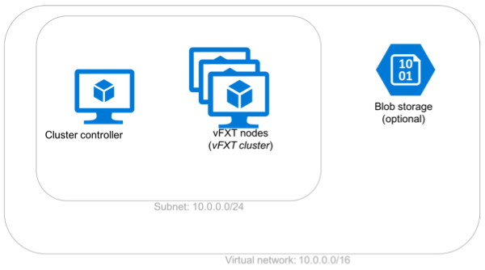
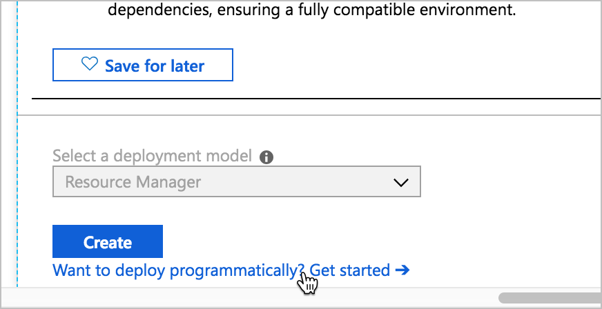
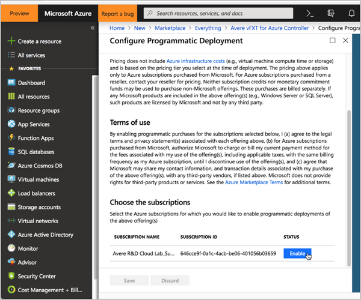
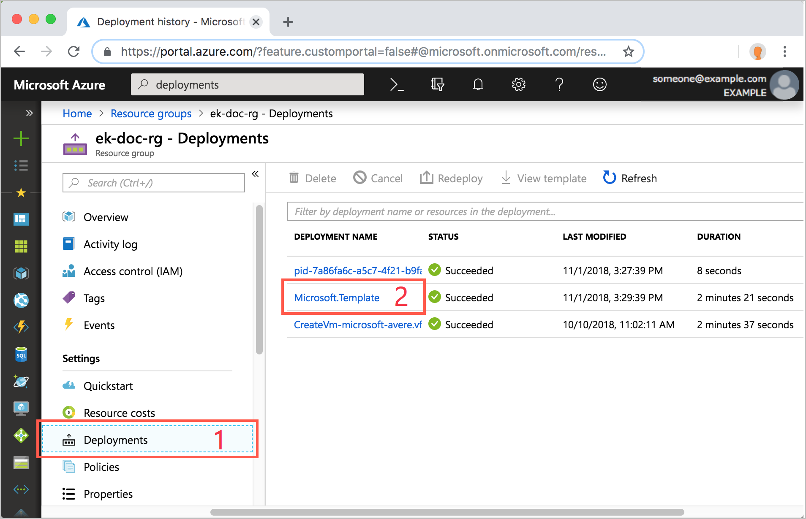
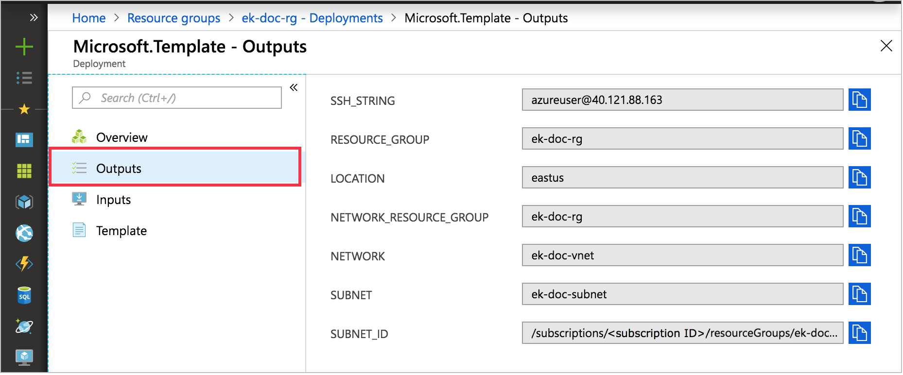
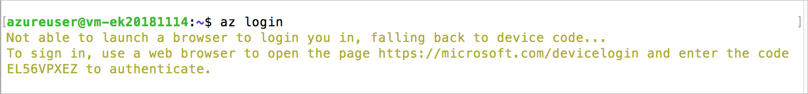
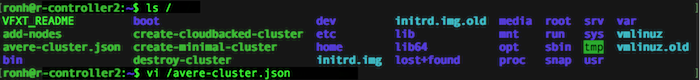
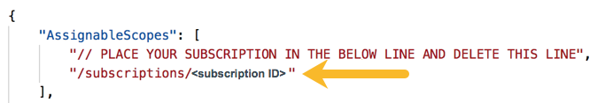
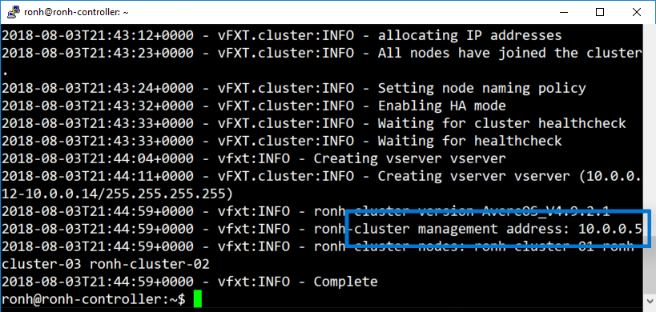
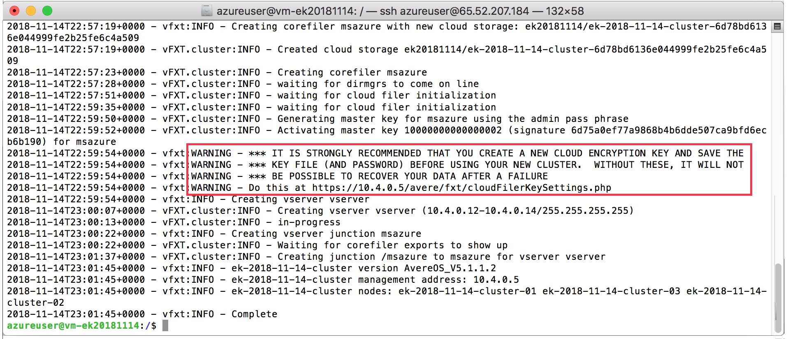

# Deploy the vFXT cluster

The easiest way to create a vFXT cluster in Azure is to use a cluster controller. The cluster controller is a VM that includes the required scripts, templates, and software infrastructure for creating and managing the vFXT cluster.

Deploying a new vFXT cluster includes these steps:

1. [Create the cluster controller](#create-the-cluster-controller-vm).
1. If using Azure Blob storage, [create a storage endpoint](#create-a-storage-endpoint-if-using-azure-blob) in your virtual network.
1. [Connect to the cluster controller](#access-the-controller). The rest of these steps are done from the cluster controller VM. 
1. [Create the access role](#create-the-cluster-node-access-role) for the cluster nodes. A prototype is provided.
1. [Customize the cluster creation script](#edit-the-deployment-script) for the type of vFXT cluster you want to create.
1. [Execute the cluster creation script](#run-the-script).

For more information about cluster deployment steps and planning, read [Plan your Avere vFXT system](avere-vfxt-deploy-plan.md) and [Deployment overview](avere-vfxt-deploy-overview.md). 

After following the instructions in this document, you will have a virtual network, a subnet, a controller, and a vFXT cluster as shown in the following diagram:



Before starting, make sure you have addressed these prerequisites:  

1. [New subscription](avere-vfxt-prereqs.md#create-a-new-subscription)
1. [Subscription owner permissions](avere-vfxt-prereqs.md#configure-subscription-owner-permissions)
1. [Quota for the vFXT cluster](avere-vfxt-prereqs.md#quota-for-the-vfxt-cluster)

Optionally, you can create the cluster node role [before](avere-vfxt-pre-role.md) creating the cluster controller, but it is simpler to do it afterward.

## Create the cluster controller VM

The first step is to create the virtual machine that will create and configure the vFXT cluster nodes. 

The cluster controller is a Linux VM with the Avere vFXT cluster creation software and scripts preinstalled. It does not need significant processing power or storage space, so you can choose inexpensive options. This VM will be used occasionally throughout the lifetime of the vFXT cluster.

There are two methods to create the cluster controller VM. An [Azure Resource Manager template](#create-controller---arm-template) is provided [below](#create-controller---arm-template) to simplify the process, but you can also create the controller from the [Azure Marketplace image](#create-controller---azure-marketplace-image). 

You can create a new resource group as part of creating the controller.

> [!TIP]
>
> Decide whether or not to use a public IP address on the cluster controller. A public IP address provides easier access to the vFXT cluster, but creates a small security risk.
>
>  * A public IP address on the cluster controller allows you to use it as a jump host to connect to the Avere vFXT cluster from outside the private subnet.
>  * If you do not set up a public IP address on the controller, you must use another jump host, a VPN connection, or ExpressRoute to access the cluster. For example, create the controller within a virtual network that has a VPN connection configured.
>  * If you create a controller with a public IP address, you should protect the controller VM with a network security group. Allow access only through port 22 to provide internet access.

### Create controller - Resource Manager template

To create the cluster controller node from the portal, click the "Deploy to Azure" button below. This deploy template creates the VM that will create and manage the Avere vFXT cluster.

[](https://ms.portal.azure.com/#create/Microsoft.Template/uri/https%3A%2F%2Fraw.githubusercontent.com%2FAzure%2FAvere%2Fmaster%2Fsrc%2Fvfxt%2Fazuredeploy.json)

Provide the following information.

In the **BASIC** section:  

* **Subscription** for the cluster
* **Resource group** for the cluster 
* **Location** 

In the **SETTINGS** section:

* Whether or not to create a new virtual network

  * If you create a new vnet, the cluster controller will be assigned a public IP address so that you can reach it. A network security group also is created for this vnet that restricts inbound traffic to only port 22.
  * If you want to use ExpressRoute or a VPN to connect to the cluster controller, set this value to `false` and specify an existing vnet in the remaining fields. The cluster controller will use that vnet for network communication. 

* Virtual network resource group, name, and subnet name - Type the names of existing resources (if using an existing vnet) or type new names if creating a new vnet
* **Controller name** - Set a name for the controller VM
* Controller administrator username - The default is `azureuser`
* SSH key - Paste the public key to associate with the administrator username. Read [How to create and use SSH keys](https://docs.microsoft.com/azure/virtual-machines/linux/ssh-from-windows) if you need help.

Under **TERMS AND CONDITIONS**: 

* Read the terms of service and click the checkbox to accept them. 

  > [!NOTE] 
  > If you are not a subscription owner, have an owner accept the terms for you by following the prerequisite steps in [Accept software terms in advance](avere-vfxt-prereqs.md#accept-software-terms-in-advance). 


Click **Purchase** when finished. After five or six minutes, your controller node will be up and running.

Visit the outputs page to gather the controller information that you need to create the cluster. Read [Information needed to create the cluster](#information-needed-to-create-the-cluster) to learn more.

### Create controller - Azure Marketplace image

Find the controller template by searching the Azure Marketplace for the name ``Avere``. Select the **Avere vFXT for Azure Controller** template.

If you have not already done so, accept the terms and enable programmatic access for the Marketplace image by clicking the "Want to deploy programmatically?" link underneath the **Create** button.



Click the **Enable** button and save the setting.



Return to the main page of the **Avere vFXT for Azure Controller** template and click **Create**. 

In the first panel, fill in or confirm these basic options:

* **Subscription**
* **Resource group** (Enter a new name if you want to create a new group.)
* **Virtual machine name** - the controller's name
* **Region**
* **Availability options** - redundancy is not required
* **Image** - the Avere vFXT controller node image
* **Size** - leave the default or choose another inexpensive type
* **Administrator account** - set how to sign in to the cluster controller: 
  * Select either Username/Password or SSH public key (recommended).
  
    > [!TIP] 
    > An SSH key is more secure. Read [How to create and use SSH keys](https://docs.microsoft.com/azure/virtual-machines/linux/ssh-from-windows) if you need help. 
  * Specify the username 
  * Paste the SSH key, or enter and confirm the password
* **Inbound port rules** - If using a public IP address, open port 22 (SSH)

Click **Next** to set disk options:

* **OS disk type** - the default value of HDD is sufficient
* **Use unmanaged disks** - not necessary
* **Data disks** - do not use

Click **Next** for networking options:

* **Virtual network** - Select the vnet for the controller, or enter a name to create a new vnet. If you do not want to use a public IP address on the controller, consider locating it within a vnet that has ExpressRoute or another access method already set up.
* **Subnet** - Select a subnet within the vnet (optional). If you create a new vnet, you can create a new subnet at the same time.
* **Public IP** - If you want to use a public IP address, you can specify it here. 
* **Network security group** - Leave the default setting (**Basic**) 
* **Public inbound ports** - If using a public IP address, use this control to allow access from SSH traffic. 
* **Accelerated networking** is unavailable for this VM.

Click **Next** to set management options:

* **Boot diagnostics** - change to **Off**
* **OS guest diagnostics** - leave disabled
* **Diagnostics storage account** - Optionally, select or specify a new account to hold diagnostic information.
* **Managed service identity** - Change this option to **On**, which creates an Azure AD service principle for the cluster controller.
* **Auto-shutdown** - leave off 

At this point, you can click **Review + create** if you do not want to use instance tags. Otherwise, click **Next** twice to skip the **Guest config** page and get to the tags page. When finished there, click **Review + create**. 

After your selections are validated, click the **Create** button.  

Creation takes five or six minutes.

## Create a storage endpoint (if using Azure Blob)

If you are using Azure Blob storage for your back-end data storage, you should create a storage service endpoint in your virtual network. This [service endpoint](https://docs.microsoft.com/azure/virtual-network/virtual-network-service-endpoints-overview) keeps Azure Blob traffic local instead of routing it through the internet.

1. From the portal, click **Virtual networks** on the left.
1. Select the vnet for your controller. 
1. Click **Service endpoints** on the left.
1. Click **Add** at the top.
1. Leave the service as ``Microsoft.Storage`` and choose the controller’s subnet.
1. At the bottom, click **Add**.

  

## Information needed to create the cluster

After you create the cluster controller, make sure you have the information you need for the next steps. 

Information needed to connect to the controller: 

* Controller username and SSH key (or password)
* Controller IP address or other method to connect to the controller VM

Information needed for the cluster: 

* Resource group name
* Azure location 
* Virtual network name
* Subnet name
* Cluster node role name - this name is set when you create the role, described [below](#create-the-cluster-node-access-role)
* Storage account name if creating a Blob container

If you created the controller node by using the Resource Manager template, you can get the information from the [template output](#find-template-output). 

If you used the Azure Marketplace image to create the controller, you supplied most of these items directly. 

Find any missing items by browsing to the controller VM information page. For example, click **All resources** and search for the controller name, then click the controller name to see its details.

### Find template output

To find this information from the Resource Manager template output, follow this procedure:

1. Go to the resource group for your cluster controller.

1. On left side, click **Deployments**, and then **Microsoft.Template**.

   

1. On left side, click **Outputs**. Copy the values in each of the fields. 

   

## Access the controller

To do the rest of the deployment steps, you need to connect to the cluster controller.

1. The method to connect to your cluster controller depends on your setup.

   * If the controller has a public IP address, SSH to the controller's IP as the administrator username you set (for example, ``ssh azureuser@40.117.136.91``).
   * If the controller does not have a public IP, use a VPN or [ExpressRoute](https://docs.microsoft.com/azure/expressroute/) connection to your vnet.

1. After logging in to your controller, authenticate by running `az login`. Copy the authentication code supplied in the shell, then use a web browser to load [https://microsoft.com/devicelogin](https://microsoft.com/devicelogin) and authenticate with the Microsoft system. Return to the shell for confirmation.

   

1. Add your subscription by running this command using your subscription ID:  ```az account set --subscription YOUR_SUBSCRIPTION_ID```

## Create the cluster node access role

> [!NOTE] 
> * If you are not a subscription owner, and the role has not already been created, have a subscription owner follow these steps or use the procedure in [Create the Avere vFXT cluster runtime access role without a controller](avere-vfxt-pre-role.md).
> 
> * Microsoft internal users should use the existing role named "Avere Cluster Runtime Operator" instead of attempting to create one. 

[Role-based access control](https://docs.microsoft.com/azure/role-based-access-control/) (RBAC)  gives the vFXT cluster nodes authorization to perform necessary tasks.  

As part of normal vFXT cluster operation, individual vFXT nodes need to do things like read Azure resource properties, manage storage, and control other nodes' network interface settings. 

1. On the controller, open the ``/avere-cluster.json`` file in an editor.

   

1. Edit the file to include your subscription ID and delete the line above it. Save the file as ``avere-cluster.json``.

   

1. Use this command to create the role:  

   ```bash
   az role definition create --role-definition /avere-cluster.json
   ```

You will pass the name of the role to the cluster creation script in the next step. 

## Create nodes and configure the cluster

To create the Avere vFXT cluster, edit one of the sample scripts included on the controller and run it there. Sample scripts are located in the root directory (`/`) on the cluster controller.

* If you want to create a Blob container to use as the Avere vFXT's back-end storage system, use the ``create-cloudbacked-cluster`` script.

* If you will add storage later, use the ``create-minimal-cluster`` script.

> [!TIP]
> Prototype scripts for adding nodes and destroying the vFXT cluster also are included in the `/` directory of the cluster controller VM.

### Edit the deployment script

Open the sample script in an editor. You might want to save the customized script with a different name to avoid overwriting the original sample.

Enter values for these script variables.

* Resource group name

  * If you use network or storage components that are in different resource groups, uncomment the variables and supply those names also. 

```python
# Resource groups
# At a minimum specify the resource group.  If the network resources live in a
# different group, specify the network resource group.  Likewise for the storage
# account resource group.
RESOURCE_GROUP=
#NETWORK_RESOURCE_GROUP=
#STORAGE_RESOURCE_GROUP=
```

* Location name
* Virtual network name
* Subnet name
* Azure AD runtime role name - if you followed the example in [Create the cluster node access role](#create-the-cluster-node-access-role), use ``avere-cluster``. 
* Storage account name (if creating a new Blob container)
* Cluster name - You cannot have two vFXT clusters with the same name in the same resource group. Give each cluster a unique name for the best practice.
* Administrative password - Choose a secure password for monitoring and administering the cluster. This password is assigned to the user ``admin``. 
* Node instance type - see [vFXT node sizes](avere-vfxt-deploy-plan.md#vfxt-node-sizes) for information
* Node cache size - see [vFXT node sizes](avere-vfxt-deploy-plan.md#vfxt-node-sizes) for information

Save the file and exit.

### Run the script

Run the script by typing the filename you created. (Example: `./create-cloudbacked-cluster-west1`)  

> [!TIP]
> Consider running this command inside a [terminal multiplexer](http://linuxcommand.org/lc3_adv_termmux.php) like `screen` or `tmux` in case you lose your connection.  

The output also is logged to `~/vfxt.log`.

When the script completes, copy the management IP address, which is needed for cluster administration.



> [!IMPORTANT] 
> If you created a new Blob container, it might be encrypted with a default key that is not saved outside of the cluster. Before you store data on the container, you must create your own encryption key and save it in a persistent location. If you do not replace the default key, it is possible to lose access to the encrypted data in the Blob core filer if the vFXT cluster fails.
>
> If your script shows `WARNING` messages like those circled in the screenshot below, follow instructions in [Configure storage](avere-vfxt-add-storage.md) to create a new encryption key for your Blob container. Use the cluster configuration tool, Avere Control Panel, to replace the default key.



## Next step

Now that the cluster is running and you know its management IP address, you can [connect to the cluster configuration tool](avere-vfxt-cluster-gui.md) to enable support, add storage if needed, or create a new encryption key for your Blob storage.
