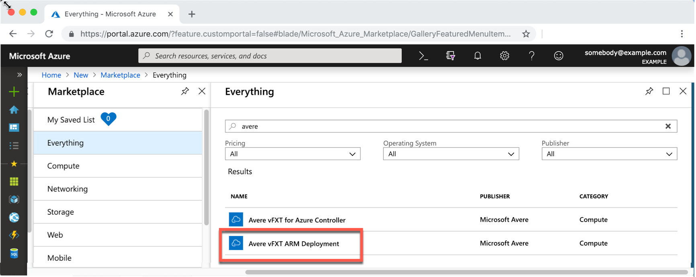
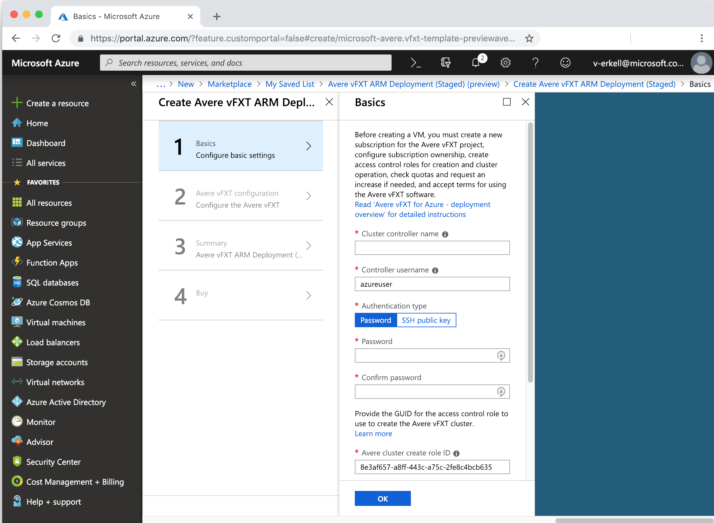
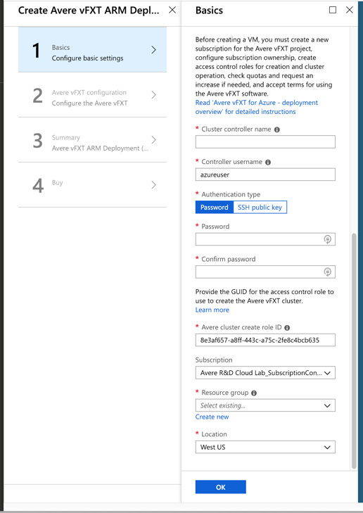
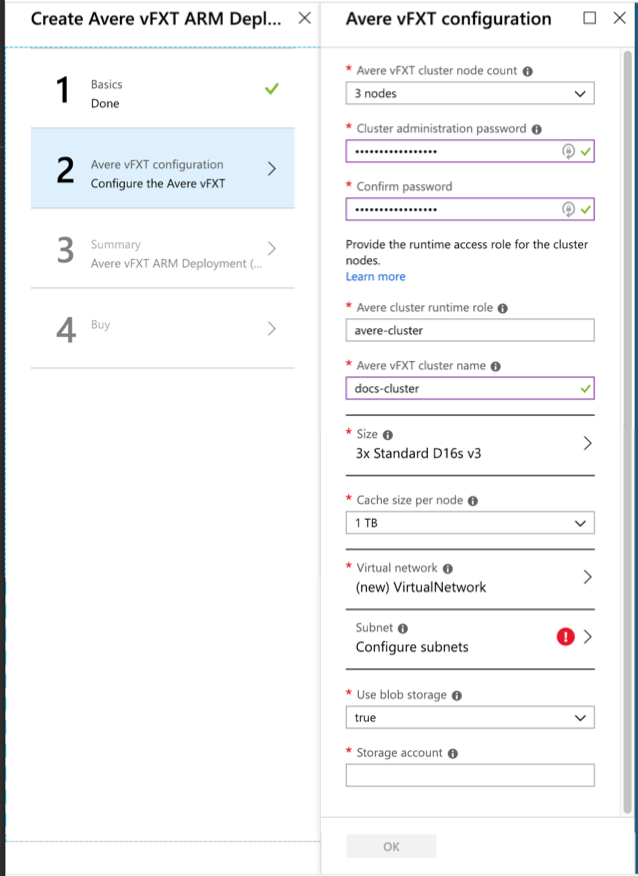
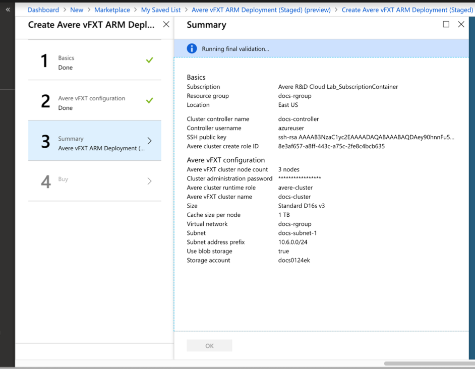
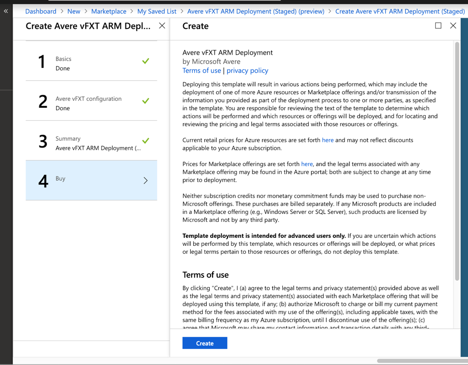
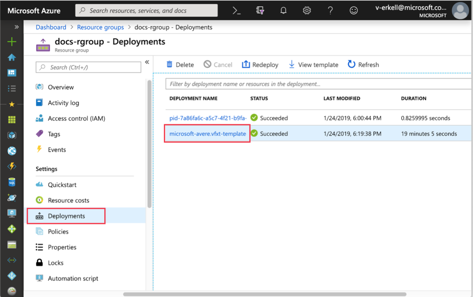
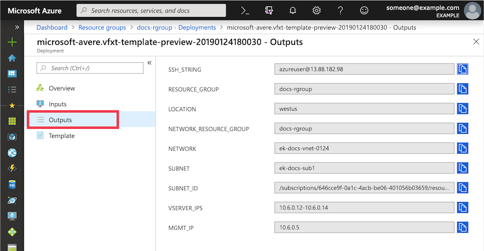

# Deploy the vFXT cluster

This procedure walks you through using the deployment wizard available from the Azure Marketplace. The wizard automatically deploys the cluster by using an Azure Resource Manager template. After you enter the parameters in the form and click **Create**, Azure automatically completes these steps:

* Creates the cluster controller, which is a basic VM that contains the software needed to deploy and manage the cluster.
* Sets up resource group and virtual network infrastructure, including creating new elements.
* Creates the cluster node VMs and configures them as the Avere cluster.
* If requested, creates a new Azure Blob container and configures it as a cluster core filer.

After following the instructions in this document, you will have a virtual network, a subnet, a controller, and a vFXT cluster as shown in the following diagram. This diagram shows the optional Azure Blob core filer, which includes a new Blob storage container (in a new storage account, not shown) and a service endpoint for Microsoft storage inside the subnet. 

![diagram showing three concentric rectangles with Avere cluster components. The outer rectangle is labeled 'Resource group' and contains a hexagon labeled 'Blob storage (optional)'. The next rectangle in is labeled 'Virtual network: 10.0.0.0/16' and does not contain any unique components. The innermost rectangle is labeled 'Subnet:10.0.0.0/24' and contains a VM labeled 'Cluster controller', a stack of three VMs labeled 'vFXT nodes (vFXT cluster)', and a hexagon labeled 'Service endpoint'. There is an arrow connecting the service endpoint (which is inside the subnet) and the blob storage (which is outside the subnet and vnet, in the resource group). The arrow passes through the subnet and virtual network boundaries.](media/avere-vfxt-deployment.png)  

Before using the creation template, make sure you have addressed these prerequisites:  

1. [New subscription](avere-vfxt-prereqs.md#create-a-new-subscription)
1. [Subscription owner permissions](avere-vfxt-prereqs.md#configure-subscription-owner-permissions)
1. [Quota for the vFXT cluster](avere-vfxt-prereqs.md#quota-for-the-vfxt-cluster)
1. [Storage service endpoint (if needed)](avere-vfxt-prereqs.md#create-a-storage-service-endpoint-in-your-virtual-network-if-needed) - Required for deploys using an existing virtual network and creating blob storage

For more information about cluster deployment steps and planning, read [Plan your Avere vFXT system](avere-vfxt-deploy-plan.md) and [Deployment overview](avere-vfxt-deploy-overview.md).

## Create the Avere vFXT for Azure

Access the creation template in the Azure portal by searching for Avere and selecting "Avere vFXT for Azure ARM Template". 



After reading the details on the Avere vFXT for Azure ARM Template page, click **Create** to begin. 



The template is divided into four steps - two information gathering pages, plus validation and confirmation steps. 

* Page one focuses on settings for the cluster controller VM. 
* Page two collects parameters for creating the cluster and associated resources like subnets and storage. 
* Page three summarizes the settings and validates the configuration. 
* Page four explains software terms and conditions and allows you to start the cluster creation process. 

## Page one parameters - cluster controller information

The first page of the deployment template gathers information about the cluster controller. 



Fill in the following information:

* **Cluster controller name** - Set the name for the cluster controller VM.

* **Controller username** - Fill in the root username for the cluster controller VM. 

* **Authentication type** - Choose either password or SSH public key authentication for connecting to the controller. The SSH public key method is recommended; read [How to create and use SSH keys](https://docs.microsoft.com/azure/virtual-machines/linux/ssh-from-windows) if you need help.

* **Password** or **SSH public key** - Depending on the authentication type you selected, you must provide an RSA public key or a password in the next fields. This credential is used with the username provided earlier.

* **Subscription** - Select the subscription for the Avere vFXT. 

* **Resource group** - Select an existing empty resource group for the Avere vFXT cluster, or click "Create new" and enter a new resource group name. 

* **Location** - Select the Azure location for your cluster and resources.

Click **OK** when finished. 

> [!NOTE]
> If you want the cluster controller to have a public-facing IP address, create a new virtual network for the cluster instead of selecting an existing network. This setting is on page two.

## Page two parameters - vFXT cluster information

The second page of the deployment template allows you to set the cluster size, node type, cache size, and storage parameters, among other settings. 



* **Avere vFXT cluster node count** - Choose the number of nodes to use in the cluster. The minimum is three nodes and the maximum is twelve. 

* **Cluster administration password** - Create the password for cluster administration. This password will be used with the username ```admin``` to sign in to the cluster control panel to monitor the cluster and to configure settings.

* **Avere vFXT cluster name** - Give the cluster a unique name. 

* **Size** - This section shows the VM type that will be used for the cluster nodes. Although there is only one recommended option, the **Change size** link opens a table with details about this instance type and a link to a pricing calculator.  

* **Cache size per node** - The cluster cache is spread across the cluster nodes, so the total cache size on your Avere vFXT cluster will be the cache size per node multiplied by the number of nodes. 

  The recommended configuration is to use 4 TB per node for Standard_E32s_v3 nodes.

* **Virtual network** - Define a new vnet to house the cluster, or select an existing vnet that meets the prerequisites described in [Plan your Avere vFXT system](avere-vfxt-deploy-plan.md#resource-group-and-network-infrastructure). 

  > [!NOTE]
  > If you create a new vnet, the cluster controller will have a public IP address so that you can access the new private network. If you choose an existing vnet, the cluster controller is configured without a public IP address. 
  > 
  > A publicly visible IP address on the cluster controller provides easier access to the vFXT cluster, but creates a small security risk. 
  >  * A public IP address on the cluster controller allows you to use it as a jump host to connect to the Avere vFXT cluster from outside the private subnet.
  >  * If you do not set up a public IP address on the controller, you must use another jump host, a VPN connection, or ExpressRoute to access the cluster. For example, create the controller within a virtual network that already has a VPN connection configured.
  >  * If you create a controller with a public IP address, you should protect the controller VM with a network security group. By default, the Avere vFXT for Azure deployment creates a network security group and restricts inbound access to only port 22 for controllers with public IP addresses. You can further protect the system by locking down access to your range of IP source addresses - that is, only allow connections from machines you intend to use for cluster access.

  The deploy template also configures the new vnet with a storage service endpoint for Azure Blob storage and with network access control locked to only IPs from the cluster subnet. 

* **Subnet** - Choose a subnet from your existing virtual network, or create a new one. 

* **Create and use blob storage** - Choose **true** to create a new Azure Blob container and configure it as back-end storage for the new Avere vFXT cluster. This option also creates a new storage account within the same resource group as the cluster and a Microsoft storage service endpoint inside the cluster subnet. 
  
  If you supply an existing virtual network, it must have a storage service endpoint before you create the cluster. (For more information, read [Plan your Avere vFXT system](avere-vfxt-deploy-plan.md).)

  Set this field to **false** if you do not want to create a new container. In this case, you must attach and configure storage after creating the cluster. Read [Configure storage](avere-vfxt-add-storage.md) for instructions. 

* **(New) Storage account** - If creating a new Azure Blob container, enter a name for the new storage account. 

## Validation and purchase

Page three summarizes the configuration and validates the parameters. After validation succeeds, click the **OK** button to proceed. 



On page four, enter any required contact information and click the **Create** button to accept the terms and create the Avere vFXT for Azure cluster. 



Cluster deployment takes 15-20 minutes.

## Gather template output

When the Avere vFXT template finishes creating the cluster, it outputs some important information about the new cluster. 

> [!TIP]
> Make sure to copy the management IP address from the template output. You need this address to administer the cluster.

To find this information, follow this procedure:

1. Go to the resource group for your cluster controller.

1. On left side, click **Deployments**, and then **microsoft-avere.vfxt-template**.

   

1. On left side, click **Outputs**. Copy the values in each of the fields. 

   

## Next step

Now that the cluster is running and you know its management IP address, you can [connect to the cluster configuration tool](avere-vfxt-cluster-gui.md) to enable support, add storage if needed, and customize other cluster settings.
