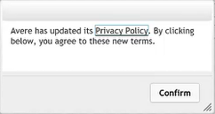

# Enable support uploads

The Avere vFXT for Azure can automatically upload support data about your cluster. These uploads let support staff provide the best possible customer service.

## Steps to enable uploads

Follow these steps from the Avere Control Panel to activate support. (Read [Access the vFXT cluster](avere-vfxt-cluster-gui.md) to learn how to open Avere Control Panel.)

1. Navigate to the **Settings** tab at the top.
1. Click the **Support** link on the left and accept the privacy policy.

   

1. Click the triangle to the left of **Customer Info** to expand the section.
1. Click the **Revalidate upload information** button.
1. Set the cluster's support name in **Unique Cluster Name** - make sure it uniquely identifies your cluster to support staff.
1. Check the boxes for **Statistics Monitoring**, **General Information Upload**, and **Crash Information Upload**.
1. Click **Submit**.

   

1. Click the triangle to the left of **Secure Proactive Support (SPS)** to expand the section.
1. Check the box for **Enable SPS Link**.
1. Click **Submit**.

   

## Next steps

If you need to add an on-premises or existing cloud storage system to the cluster, follow the instructions in [Configure storage](avere-vfxt-add-storage.md). 

If you are ready to start attaching clients to the cluster, read [Mount the Avere vFXT cluster](avere-vfxt-mount-clients.md).