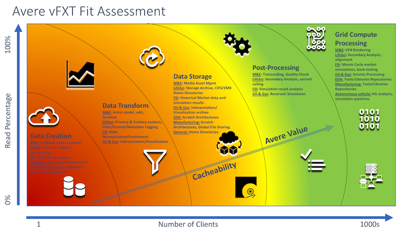

# Avere vFXT for Azure FAQ

This article answers questions that can help you decide if Avere vFXT for Azure is right for your needs. It gives basic information about Avere vFXT and explains how it works with other Azure components and with products from outside vendors.

## General

### What is Avere vFXT for Azure?

Avere vFXT for Azure is a high-performance file system that caches active data in Azure compute for efficient processing of critical workloads.

### Is Avere vFXT a storage solution?

No. Avere vFXT for Azure is a file-system *cache* that attaches to storage environments, such as your EMC or NetApp NAS, or an Azure blob container. Avere vFXT streamlines data requests from clients, and it caches the data that it serves to improve performance at scale and over time. Avere vFXT itself does not store data. It has no information about the amount of data stored behind it.

### Is Avere vFXT a tiering solution?

Avere vFXT for Azure does not automatically tier data between hot and cool tiers.  

### How do I know if an environment is right for Avere vFXT?

The best way to think about this question is to ask, "Is the workload cacheable?" That is, does the workload have a high read-to-write ratio? An example is 80/20 or 70/30 reads/writes.

Consider Avere vFXT for Azure if you have a file-based analytic pipeline that runs across a large number of Azure virtual machines, and it meets one or more of the following conditions:

* Overall performance is slow or inconsistent because of long file access times (tens of milliseconds or seconds, depending on requirements). This latency is unacceptable to the customer.

* Data required for processing is located at the far end of a WAN environment, and moving that data permanently is impractical. The data might be in a different Azure region or in a customer datacenter.

* A significant number of clients are requesting the data - for example, in a high-performance computing (HPC) cluster. The large number of concurrent requests can increase latency.

* The customer wants to run their current pipeline "as is" in Azure virtual machines, and needs a POSIX-based shared storage (or caching) solution for scalability. By using Avere vFXT for Azure, you don't have to rearchitect the work pipeline to make native calls to Azure Blob storage.

* Your HPC application is based on NFSv3 clients. (In some circumstances, it can use SMB 2.1 clients, but performance is limited.)

The following diagram can help you answer to this question. The closer your workflow is to the upper right, the more likely it is that the Avere vFXT for Azure caching solution is right for your environment.

### At what scale of clients does the Avere vFXT solution make the most sense?

The Avere vFXT cache solution is built to handle hundreds, thousands, or tens of thousands of compute cores. If you have a few machines running light work, Avere vFXT is not the right solution.

Typical Avere vFXT customers run demanding workloads starting at about 1,000 CPU cores. These environments can be as large as 50,000 cores or more. Because Avere vFXT is scalable, you can add nodes to support these workloads as they grow to require more throughput or more IOPS.

### How much data can an Avere vFXT environment store?

Avere vFXT for Azure is a cache. It doesn't specifically store data. It uses a combination of RAM and SSDs to store the cached data. The data is permanently stored on a back-end storage system (for example, a NetApp NAS system or a blob container). The Avere vFXT system does not have information about the amount of data stored behind it. Avere vFXT only caches the subset of that data that clients request.  

### What regions are supported?

Avere vFXT for Azure is supported in all regions except for sovereign regions (China, Germany). Make sure that the region you want to use can support the large quantity of compute cores and the VM instances needed to create the Avere vFXT cluster.

### How do I get help with Avere vFXT?

A specialized group of support staff offers help with Avere vFXT for Azure. Follow the instructions in [Get help with your system](avere-vfxt-open-ticket.md#open-a-support-ticket-for-your-avere-vfxt) to open a support ticket from the Azure portal.

### Is Avere vFXT highly available?

Yes, Avere vFXT runs exclusively as an HA solution.

### Does Avere vFXT for Azure also support other cloud services?

Yes, customers can use more than one cloud provider with the Avere vFXT cluster. It supports AWS S3 standard buckets, Google Cloud Services standard buckets, and Azure blob containers.

> [!NOTE]
> A software fee applies to use Avere vFXT with AWS or Google Cloud storage. There is no additional software fee for using Azure blob storage.

## Technical: Compute

### Can you describe what an Avere vFXT environment "looks like"?

Avere vFXT is a clustered appliance made of multiple Azure virtual machines. A Python library handles cluster creation, deletion, and modification. Read [What is Avere vFXT for Azure?](avere-vfxt-overview.md) to learn more.

### What kind of Azure virtual machines does Avere vFXT run on?  

An Avere vFXT for Azure cluster uses Microsoft Azure E32s_v3 virtual machines.

<!-- ### Can I mix and match virtual machine types for my cluster?

No, you must choose one virtual machine type or the other.
	
### Can I move between virtual machine types?

Yes, there is a migration path to move from one VM type to the other. [Open a support ticket](avere-vfxt-open-ticket.md#open-a-support-ticket-for-your-avere-vfxt) to learn how.
-->

### Does the Avere vFXT environment scale?

The Avere vFXT cluster can be as small as three virtual machine nodes or as large as 24 nodes. Contact Azure technical support for help with planning if you believe you need a cluster of more than nine nodes. The larger number of nodes requires a larger deployment architecture.

### Does the Avere vFXT environment "autoscale"?

No. You can scale the cluster size up and down, but adding or removing cluster nodes is a manual step.

### Can I run the Avere vFXT cluster as a virtual machine scale set?

Avere vFXT does not support deployment of a virtual machine scale set. Several built-in availability support mechanisms are designed only for atomic VMs participating in a cluster.  

### Can I run the Avere vFXT cluster on low-priority VMs?

No, the system requires an underlying stable set of virtual machines.

### Can I run the Avere vFXT cluster in containers?

No, Avere vFXT must be deployed as an independent application.

### Do the Avere vFXT VMs count against my compute quota?

Yes. Make sure you have a sufficient quota in the region to support the cluster.  

### Can I run the Avere vFXT cluster machines in different availability zones?

No. The high availability model in Avere vFXT currently does not support individual Avere vFXT cluster members located in different availability zones.

### Can I clone Avere vFXT virtual machines?

No, you must use the supported Python script to add or remove nodes in the Avere vFXT cluster. For more information, read [Manage the Avere vFXT cluster](avere-vfxt-manage-cluster.md).

### Is there a "VM" version of the software I can run in my own local environment?

No, the system is offered as a clustered appliance and tested on specific virtual machine types. This restriction helps customers avoid creating a system that can't support the high-performance requirements of a typical Avere vFXT workflow.

## Technical: Disks

### What types of disks are supported for the Azure VMs?

Avere vFXT for Azure can use 1-TB or 4-TB premium SSD configurations. The premium SSD configuration can be deployed as multiple managed disks.

### Does the cluster support unmanaged disks?

No, the cluster requires managed disks.

### Does the system support local (attached) SSDs?

Avere vFXT for Azure does not currently support local SSDs. Disks used for Avere vFXT must be able to shut down and restart, but local attached SSDs in this configuration can only be terminated.

### Does the system support ultra SSDs?

No, the system supports premium SSD configurations only.

### Can I detach my premium SSDs and reattach them later to preserve cache contents between use?

Detaching and reattaching SSDs is unsupported. Metadata or file contents on the source might have changed between uses, which might cause data integrity issues.

### Does the system encrypt the cache?

Data is striped across the disks but is not encrypted. However, the disks themselves can be encrypted. For more information, see [Secure and use policies on virtual machines in Azure](https://docs.microsoft.com/azure/virtual-machines/linux/security-policy#encryption).

## Technical: Networking

### What network is recommended?

If you're using on-premises storage with Avere vFXT, you should have a 1-Gbps or better network connection between your storage and the cluster. If you have a small amount of data and are willing to copy data to the cloud before running jobs, VPN connectivity might be sufficient.

> [!TIP]
> The slower the network link is, the slower the initial "cold" reads will be. Slow reads increase the latency of the work pipeline.

### Can I run Avere vFXT in a different virtual network than my compute cluster?

Yes, you can create your Avere vFXT system in a different virtual network. Read [Plan your Avere vFXT system](avere-vfxt-deploy-plan.md) for details.

### Does Avere vFXT require its own subnet?

Yes. Avere vFXT runs strictly as a high availability (HA) cluster and requires multiple IP addresses to operate. If the cluster is in its own subnet, you avoid the risk of IP address conflicts, which can cause problems for installation and normal operation. The cluster's subnet can be within a virtual network used by other resources, as long as no IP addresses overlap.

### Can I run Avere vFXT on InfiniBand?

No, Avere vFXT uses Ethernet/IP only.

### How do I access my on-premises NAS environment from Avere vFXT?

The Avere vFXT environment is like any other Azure VM in that it requires routed access through a network gateway or VPN to the customer datacenter (and back). Consider using Azure ExpressRoute connectivity if it's available in your environment.

### What are the bandwidth requirements for Avere vFXT?

The overall bandwidth requirement depends on two factors:

* The amount of data being requested from the source
* The client system's tolerance for latency during initial data loading  

For latency-sensitive environments, you should use a fiber solution with a minimum link speed of 1 Gbps. Use ExpressRoute if it's available.  

### Can I run Avere vFXT with public IP addresses?

No, Avere vFXT is meant to be operated in a network environment secured through best practices.

### Can I restrict internet access from my cluster's virtual network?

In general, you can configure additional security on your virtual network as needed, but some restrictions can interfere with the operation of the cluster.

For example, restricting outbound internet access from your virtual network causes problems for the cluster unless you also add a rule that explicitly allows access to AzureCloud. This situation is described in [supplemental documentation on GitHub](https://github.com/Azure/Avere/tree/master/src/vfxt/internet_access.md).

For help with customized security, contact support as described in [Get help with your system](avere-vfxt-open-ticket.md#open-a-support-ticket-for-your-avere-vfxt).

## Technical: Back-end storage (core filers)

### How many core filers does a single Avere vFXT environment support?

An Avere vFXT cluster supports up to 20 core filers.

### How does the Avere vFXT environment store data?

Avere vFXT is not storage. It's a cache that reads and writes data from multiple storage targets called core filers. Data stored on premium SSD disks in Avere vFXT is transient and is eventually flushed to the back-end core filer storage.

### Which core filers does Avere vFXT support?

In general terms, Avere vFXT for Azure supports the following systems as core filers:

* Dell EMC Isilon (OneFS 7.1, 7.2, 8.0, and 8.1) 
* NetApp ONTAP (Clustered Mode 9.4, 9.3, 9.2, 9.1P1, 8.0-8.3) and (7-Mode 7.*, 8.0-8.3)

* Azure blob containers (locally redundant storage only)
* AWS S3 buckets
* Google Cloud buckets

### Why doesn't Avere vFXT support all NFS filers?

Although all NFS platforms meet the same IETF standards, in practice each implementation has its own quirks. These details affect how Avere vFXT interacts with the storage system. The supported systems are the most widely used platforms in the marketplace.

### Does Avere vFXT support private object storage (such as SwiftStack)?

Avere vFXT does not support private object storage.

### How can I get a specific storage product under support?

Support is based on the amount of demand in the field. If there are enough revenue-based requests to support a NAS solution, we'll consider it. Make requests through Azure support.

### Can I use Azure Blob storage as a core filer?

Yes, Avere vFXT for Azure can use a block blob container as a cloud core filer.

### What are the storage account requirements for a blob core filer?

Your storage account must be a general-purpose v2 (GPv2) account and configured for locally redundant storage only. Geo-redundant storage and zone-redundant storage are not supported.

Read [Azure Blob Storage cloud core filer](avere-vfxt-add-storage.md#azure-blob-storage-cloud-core-filer) for more details about the storage account requirements.

### Can I use archive blob storage?

No. The service-level agreement (SLA) for archive storage is not compatible with the real-time directory and file access needs of the Avere vFXT system.

### Can I use cool blob storage?

Cool tier blob storage is not usually recommended for an Avere vFXT for Azure core filer. Cool tier offers lower storage costs but higher operations costs. (See [Block blob pricing](<https://azure.microsoft.com/pricing/details/storage/blobs/>) for more details.) If data will be accessed and modified or deleted frequently, please consider using the Hot tier.

[Access tiers](https://docs.microsoft.com/azure/storage/blobs/storage-blob-storage-tiers#cool-access-tier) gives more information about when it might make sense to use Cool tier storage as a vFXT core filer.

### How do I encrypt the blob container?

You can configure blob encryption either in Azure (preferred) or at the Avere vFXT core filer level.  

### Can I use my own encryption key for a blob core filer?

By default, data is encrypted through Microsoft-managed keys for Azure Blob, Table, and Queue storage, plus Azure Files. You can bring your own key for encryption for Blob storage and Azure Files. If you choose to use Avere vFXT encryption, you must use the Avere-generated key and store it locally.

## Purchasing

### How do I get Avere vFXT for Azure licensing?

Getting an Avere vFXT for Azure license is easy through the Azure Marketplace. Sign up for an Azure account, and then follow the instructions in [Deploy the Avere vFXT cluster](avere-vfxt-deploy.md) to create an Avere vFXT cluster.

### How much does Avere vFXT cost?

In Azure, there is no additional licensing fee for using Avere vFXT clusters. Customers are responsible for storage and other Azure consumption fees.

### Can Avere vFXT VMs be run as low priority?

No, Avere vFXT clusters require "always on" service. The clusters can be turned off when not needed.

## Next steps

To get started with Avere vFXT for Azure, read these articles to learn how to plan and deploy your own system:

* [Plan your Avere vFXT system](avere-vfxt-deploy-plan.md)
* [Deployment overview](avere-vfxt-deploy-overview.md)
* [Prepare to create an Avere vFXT cluster](avere-vfxt-prereqs.md)
* [Deploy the Avere vFXT cluster](avere-vfxt-deploy.md)

To learn more about capabilities and use cases for Avere vFXT, visit [Avere vFXT for Azure](https://azure.microsoft.com/services/storage/avere-vfxt/).
