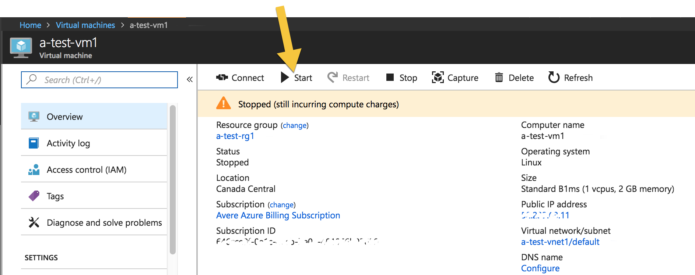
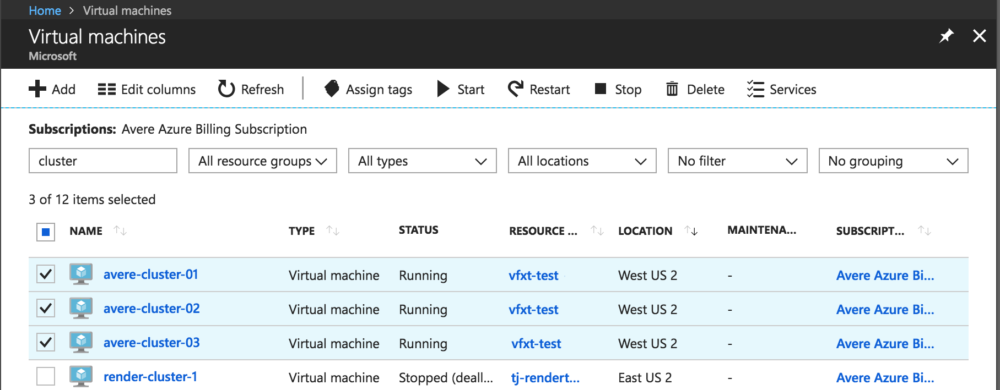
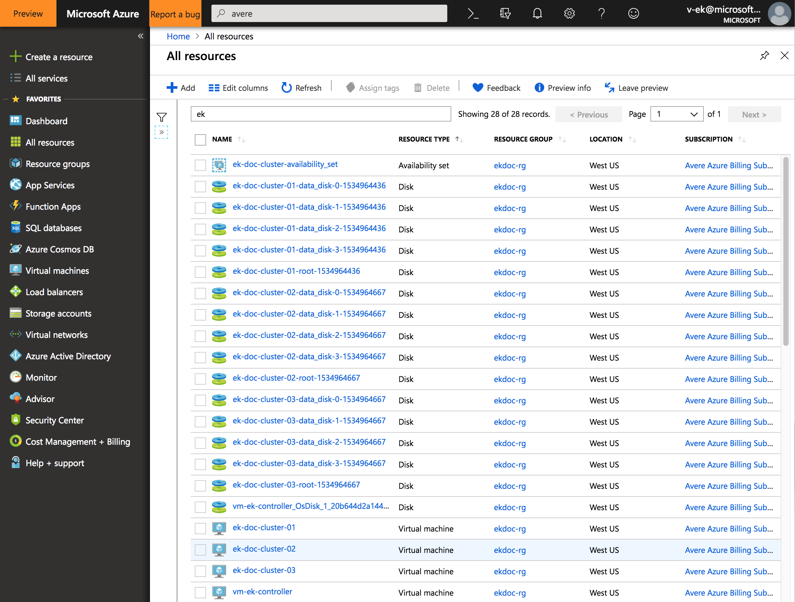
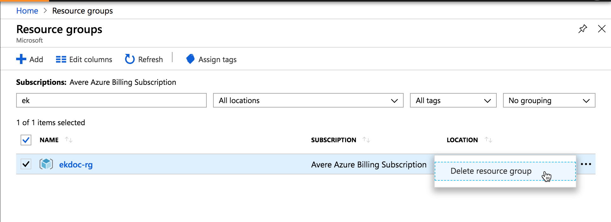

# Manage the Avere vFXT cluster

At some point in the life cycle of your Avere vFXT for Azure cluster, you might need to add cluster nodes, or to start or reboot the cluster. When your project is finished you'll need to know how to stop the cluster and remove it permanently.

This article explains how to add or remove cluster nodes and other basic cluster operations. If you need to change cluster settings or monitor its work, use the [Avere Control Panel](avere-vfxt-cluster-gui.md).

Depending on the management task, you might need to use one of three different tools: Avere Control Panel, the vfxt.py command line cluster management script, and the Azure portal.

This table gives an overview of which tools can be used for each task.

| Action | Avere Control Panel | vfxt.py  | Azure portal |
| --- | --- | --- | --- |
| Add cluster nodes | no | yes | no |
| Remove cluster nodes | yes | no | no |
| Stop a cluster node | yes (can also restart services or reboot) | no | powering down a node VM from the portal is interpreted as a node failure |
| Start a stopped node | no | no | yes |
| Destroy a single cluster node | no | no | yes |
| Reboot the cluster |  |  |  |
| Shut down or stop the cluster safely | yes | yes | no |
| Destroy the cluster  | no | yes | yes, but data integrity is not guaranteed |

Detailed instructions for each tool are included below.

## About stopped instances in Azure

When you shut down or stop any Azure VM, it stops incurring compute charges, but you still must pay for its storage. If you shut down a vFXT node or the entire vFXT cluster and you don't intend to restart it, you should use the Azure portal to delete the related VMs.

In the Azure portal, a *stopped* node (which can be restarted) shows the status **stopped** in the Azure portal. A *deleted* node shows the status **stopped (deallocated)** and it no longer incurs compute or storage charges.

Before deleting the VM, make sure that all changed data has been written from the cache to back-end storage by using the Avere Control Panel or vfxt.py options to stop or shut down the cluster.

## Manage the cluster with Avere Control Panel

The Avere Control Panel can be used for these tasks:

* Stop or reboot individual nodes
* Remove a node from the cluster
* Stop or reboot the entire cluster

Avere Control Panel prioritizes data integrity, so it attempts to write any changed data to back-end storage before a possibly destructive operation. This makes it a safer option than the Azure portal.

Access Avere Control Panel from a web browser. Follow the instructions in [Access the vFXT cluster](avere-vfxt-cluster-gui.md) if you need help.

### Manage nodes with Avere Control Panel

The **FXT Nodes** settings page has controls for managing individual nodes.

To shut down, reboot, or remove a node, find the node in the list on the **FXT Nodes** page and click the appropriate button in its **Actions** column.

> [!NOTE]
> IP addresses might move among cluster nodes when the number of active nodes changes.

Read [Cluster > FXT Nodes](https://azure.github.io/Avere/legacy/ops_guide/4_7/html/gui_fxt_nodes.html#gui-fxt-nodes) in the Avere cluster settings guide for more information.

### Stop or reboot the cluster with Avere Control Panel

The **System Maintenance** settings page has commands for restarting cluster services, rebooting the cluster, or safely powering the cluster down. Read [Administration > System Maintenance](https://azure.github.io/Avere/legacy/ops_guide/4_7/html/gui_system_maintenance.html#gui-system-maintenance) (in the Avere cluster settings guide) for details.

When a cluster begins to shut down, it posts state messages to the **Dashboard** tab. After a few moments, the messages stop and eventually the Avere Control Panel session stops responding, which means that the cluster has shut down.

## Manage the cluster with vfxt.py

vfxt.py is a command-line tool for cluster creation and management.

vfxt.py is preinstalled on the cluster controller VM. If you want to install it on another system, refer to the documentation at <https://github.com/Azure/AvereSDK>.

The vfxt.py script can be used for these cluster management tasks:

* Add new nodes to a cluster
* Stop or start a cluster  
* Destroy a cluster

Like Avere Control Panel, vfxt.py operations try to make sure changed data is stored permanently on back-end storage before shutting down or destroying the cluster or node. This makes it a safer option than the Azure portal.

A complete vfxt.py usage guide is available on GitHub: [Cloud cluster management with vfxt.py](https://github.com/azure/averesdk/blob/master/docs/README.md)

### Add cluster nodes with vfxt.py

A sample command script for adding cluster nodes is included on the cluster controller. Locate ``./add-nodes`` on the controller and open it in an editor to customize it with your cluster information.

The cluster must be running to use this command.

Supply the following values:

* Resource group name for the cluster, and also for network and storage resources if they are not in the same resource group as the cluster
* Cluster location
* Cluster network and subnet
* Cluster node access role (use the built-in role [Avere Operator](../role-based-access-control/built-in-roles.md#avere-operator))
* Cluster management IP address and administrative password
* Number of nodes to add (1, 2, or 3)
* Node instance type and cache size values

If you are not using the prototype, you must construct a command like the following, including all of the information described above.

```bash
   vfxt.py --cloud-type azure --from-environment \
   --resource-group GROUP_NAME \
   [--network-resource-group GROUP_NAME --storage-resource-group GROUP_NAME]  \
   --location LOCATION --azure-network NETWORK_NAME --azure-subnet SUBNET_NAME \
   --add-nodes --nodes NODE_COUNT \
   --management-address CLUSTER_IP --admin-password ADMIN_PASSWORD \
   --instance-type TYPE --node-cache-size SIZE \
   --azure-role "Avere Operator" \
   --log ~/vfxt.log
```

For more information, read [Add nodes to a cluster](https://github.com/Azure/AvereSDK/blob/master/docs/using_vfxt_py.md#add-nodes-to-a-cluster) in the vfxt.py usage guide.

### Stop a cluster with vfxt.py

```bash
vfxt.py --cloud-type azure --from-environment --stop --resource-group GROUPNAME --admin-password PASSWORD --management-address ADMIN_IP --location LOCATION --azure-network NETWORK --azure-subnet SUBNET
```

### Start a stopped cluster with vfxt.py

```bash
vfxt.py --cloud-type azure --from-environment --start --resource-group GROUPNAME --admin-password PASSWORD --management-address ADMIN_IP --location LOCATION --azure-network NETWORK --azure-subnet SUBNET --instances INSTANCE1_ID INSTANCE2_ID INSTANCE3_ID ...
```

Because the cluster is stopped, you must pass instance identifiers to specify the cluster nodes. Read [Specifying which cluster to modify](https://github.com/Azure/AvereSDK/blob/master/docs/using_vfxt_py.md#specifying-which-cluster-to-modify) in the vfxt.py usage guide to learn more.

### Destroy a cluster with vfxt.py

```bash
vfxt.py --cloud-type azure --from-environment --destroy --resource-group GROUPNAME --admin-password PASSWORD --management-address ADMIN_IP --location LOCATION --azure-network NETWORK --azure-subnet SUBNET --management-address ADMIN_IP
```

The option ``--quick-destroy`` can be used if you do not want to save changed data from the cluster cache.

Read the [vfxt.py usage guide](https://github.com/Azure/AvereSDK/blob/master/docs/README.md) for additional information.

## Manage cluster VMs from the Azure portal

The Azure portal can be used to destroy cluster VMs individually, but data integrity is not guaranteed if the cluster is not shut down cleanly first.

The Azure portal can be used for these cluster management tasks:

* Start a stopped vFXT node
* Stop an individual vFXT node (the cluster interprets this as a node failure)
* Destroy a vFXT cluster *if* you do not need to ensure that changed data in the cluster cache is written to the core filer
* Permanently remove vFXT nodes and other cluster resources after they have been shut down safely

### Restart vFXT instances from the Azure portal

If you need to restart a stopped node, you must use the Azure portal. Select **Virtual machines** in the left menu and then click on the VM name in the list to open its overview page.

Click the **Start** button at the top of the overview page to reactivate the VM.



### Delete cluster nodes

If you want to delete one node from the vFXT cluster but keep the remainder of the cluster, you should first [remove the node from the cluster](#manage-nodes-with-avere-control-panel) with the Avere Control Panel.

> [!CAUTION]
> If you delete a node without first removing it from the vFXT cluster, data might be lost.

To permanently destroy one or more instances used as vFXT node, use the Azure portal.
Select **Virtual machines** in the left menu and then click on the VM name in the list to open its overview page.

Click the **Delete** button at the top of the overview page to permanently destroy the VM.

You can use this method to permanently remove cluster nodes after they have been shut down safely.

### Destroy the cluster from the Azure portal

> [!NOTE]
> If you want any remaining client changes in the cache to be written to back-end storage, either use the vfxt.py `--destroy` option or use the Avere Control Panel to shut down the cluster cleanly before removing the node instances in the Azure portal.

You can destroy node instances permanently by deleting them in the Azure portal. You can delete them one at a time as described above, or you can use the **Virtual Machines** page to find all of the cluster VMs, select them with the checkboxes, and click the **Delete** button to remove them all in one action.



### Delete additional cluster resources from the Azure portal

If you created additional resources specifically for the vFXT cluster, you might want to remove them as part of tearing down the cluster. Do not destroy elements that contain data you need, or any items that are shared with other projects.

In addition to deleting the cluster nodes, consider removing these components:

* The cluster controller VM
* Data disks associated with cluster nodes
* Network interfaces and public IPs associated with cluster components
* Virtual networks
* Storage containers and storage accounts (**only** if they contain no important data)
* Availability set



### Delete a cluster's resource group from the Azure portal

If you created a resource group specifically to house the cluster, you can destroy all related resources for the cluster by destroying the resource group.

> [!Caution]
> Only destroy the resource group if you are certain that nothing of value resides in the group. For example, make sure you have moved any needed data from any storage containers within the resource group.  

To delete a resource group, click **Resource groups** in the left menu of the portal, and filter the list of resource groups to find the one you created for the vFXT cluster. Select the resource group and click the three dots at the right of the panel. Choose **Delete resource group**. The portal will ask you to confirm the deletion, which is irreversible.


