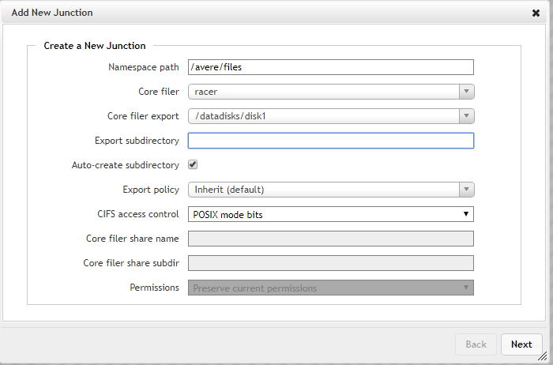
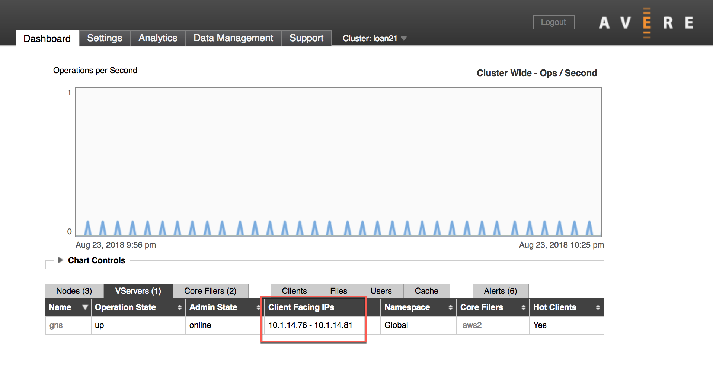

# Mount the Avere vFXT cluster

Follow these steps to connect client machines to your vFXT cluster.

1. Decide how to load-balance client traffic among your cluster nodes. Read [Balance client load](#balance-client-load), below, for details.
1. Identify the IP address and junction path to mount.
1. Issue the [mount command](#mount-command-arguments), with appropriate arguments.

## Balance client load

To help balance client requests among all the nodes in the cluster, you should mount clients to the full range of client-facing IP addresses. There are several simple ways to automate this task.

> [!TIP]
> Other load balancing methods might be appropriate for large or complicated systems; [open a support ticket](avere-vfxt-open-ticket.md#open-a-support-ticket-for-your-avere-vfxt) for help.)
>
> If you prefer to use a DNS server for automatic server-side load balancing, you must set up and manage your own DNS server within Azure. In that case, you can configure round-robin DNS for the vFXT cluster according to this document: [Avere cluster DNS configuration](avere-vfxt-configure-dns.md).

### Sample balanced client mounting script

This code example uses client IP addresses as a randomizing element to distribute clients to all of the vFXT cluster's available IP addresses.

```bash
function mount_round_robin() {
    # to ensure the nodes are spread out somewhat evenly the default
    # mount point is based on this node's IP octet4 % vFXT node count.
    declare -a AVEREVFXT_NODES="($(echo ${NFS_IP_CSV} | sed "s/,/ /g"))"
    OCTET4=$((`hostname -i | sed -e 's/^.*\.\([0-9]*\)/\1/'`))
    DEFAULT_MOUNT_INDEX=$((${OCTET4} % ${#AVEREVFXT_NODES[@]}))
    ROUND_ROBIN_IP=${AVEREVFXT_NODES[${DEFAULT_MOUNT_INDEX}]}

    DEFAULT_MOUNT_POINT="${BASE_DIR}/default"

    # no need to write again if it is already there
    if ! grep --quiet "${DEFAULT_MOUNT_POINT}" /etc/fstab; then
        echo "${ROUND_ROBIN_IP}:${NFS_PATH}    ${DEFAULT_MOUNT_POINT}    nfs hard,proto=tcp,mountproto=tcp,retry=30 0 0" >> /etc/fstab
        mkdir -p "${DEFAULT_MOUNT_POINT}"
        chown nfsnobody:nfsnobody "${DEFAULT_MOUNT_POINT}"
    fi
    if ! grep -qs "${DEFAULT_MOUNT_POINT} " /proc/mounts; then
        retrycmd_if_failure 12 20 mount "${DEFAULT_MOUNT_POINT}" || exit 1
    fi
}
```

The function above is part of the Batch example available in the [Avere vFXT examples](https://github.com/Azure/Avere#tutorials) site.

## Create the mount command

> [!NOTE]
> If you did not create a new Blob container when creating your Avere vFXT cluster, add storage systems as described in [Configure storage](avere-vfxt-add-storage.md) before attempting to mount clients.

From your client, the ``mount`` command maps the virtual server (vserver) on the vFXT cluster to a path on the local filesystem. The format is ``mount <vFXT path> <local path> {options}``

The mount command has three elements:

* vFXT path - a combination of an IP address and namespace junction path on the cluster 9described below)
* local path - the path on the client
* mount command options - listed in [Mount command arguments](#mount-command-arguments)

### Junction and IP

The vserver path is a combination of its *IP address* plus the path to a *namespace junction*. The namespace junction is a virtual path that was defined when the storage system was added.

If your cluster was created with Blob storage, the namespace path to that container is `/msazure`

Example: ``mount 10.0.0.12:/msazure /mnt/vfxt``

If you added storage after creating the cluster, the namespace junction path is the value you set in **Namespace path** when creating the junction. For example, if you used ``/avere/files`` as your namespace path, your clients would mount *IP_address*:/avere/files to their local mount point.

 <!-- to do - change example and screenshot to vfxt/files instead of avere -->

The IP address is one of the client-facing IP addresses defined for the vserver. You can find the range of client-facing IPs in two places in the Avere Control Panel:

* **VServers** table (Dashboard tab) -

  

* **Client Facing Network** settings page -

  

In addition to the paths, include the [Mount command arguments](#mount-command-arguments) described below when mounting each client.

### Mount command arguments

To ensure a seamless client mount, pass these settings and arguments in your mount command:

`mount -o hard,proto=tcp,mountproto=tcp,retry=30 ${VSERVER_IP_ADDRESS}:/${NAMESPACE_PATH} ${LOCAL_FILESYSTEM_MOUNT_POINT}`

| Required settings | Description |
--- | ---
``hard`` | Soft mounts to the vFXT cluster are associated with application failures and possible data loss.
``proto=netid`` | This option supports appropriate handling of NFS network errors.
``mountproto=netid`` | This option supports appropriate handling of network errors for mount operations.
``retry=n`` | Set ``retry=30`` to avoid transient mount failures. (A different value is recommended in foreground mounts.)

## Next steps

After you have clients mounted, you can use them to copy data to a new Blob storage container on your cluster. If you don't need to populate new storage, read the other links to learn about additional setup tasks:

* [Move data to a cluster core filer](avere-vfxt-data-ingest.md) - How to use multiple clients and threads to efficiently upload your data to a new core filer
* [Customize cluster tuning](avere-vfxt-tuning.md) - Tailor the cluster settings to suit your workload
* [Manage the cluster](avere-vfxt-manage-cluster.md) - How to start or stop the cluster and manage nodes
